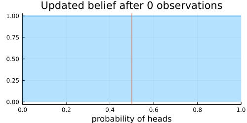
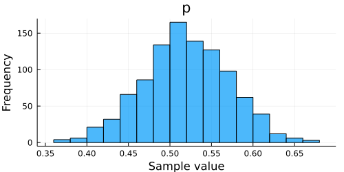
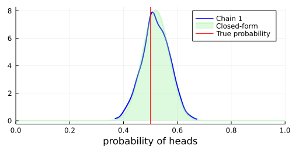

## Introduction

This is the first of a series of tutorials on the universal probabilistic programming language **Turing**.

Turing is a probabilistic programming system written entirely in Julia.
It has an intuitive modelling syntax and supports a wide range of sampling-based inference algorithms.

Familiarity with Julia is assumed throughout this tutorial.
If you are new to Julia, [Learning Julia](https://julialang.org/learning/) is a good starting point.

For users new to Bayesian machine learning, please consider more thorough introductions to the field such as [Pattern Recognition and Machine Learning](https://www.springer.com/us/book/9780387310732).
This tutorial tries to provide an intuition for Bayesian inference and gives a simple example on how to use Turing.
Note that this is not a comprehensive introduction to Bayesian machine learning.

### Coin Flipping Without Turing

The following example illustrates the effect of updating our beliefs with every piece of new evidence we observe.

Assume that we are unsure about the probability of heads in a coin flip.
To get an intuitive understanding of what "updating our beliefs" is, we will visualize the probability of heads in a coin flip after each observed evidence.

First, let us load some packages that we need to simulate a coin flip

```julia
using Distributions

using Random
Random.seed!(12); # Set seed for reproducibility
```


and to visualize our results.

```julia
using StatsPlots
```


Note that Turing is not loaded here — we do not use it in this example.
If you are already familiar with posterior updates, you can proceed to the next step.

Next, we configure the data generating model.
Let us set the true probability that a coin flip turns up heads

```julia
p_true = 0.5;
```


and set the number of coin flips we will show our model.

```julia
N = 100;
```


We simulate `N` coin flips by drawing `N` random samples from the Bernoulli distribution with success probability `p_true`.
The draws are collected in a variable called `data`:

```julia
data = rand(Bernoulli(p_true), N);
```


Here is what the first five coin flips look like:

```julia
data[1:5]
```

```
5-element Vector{Bool}:
 1
 0
 1
 1
 0
```


Next, we specify a prior belief about the distribution of heads and tails in a coin toss.
Here we choose a [Beta](https://en.wikipedia.org/wiki/Beta_distribution) distribution as prior distribution for the probability of heads.
Before any coin flip is observed, we assume a uniform distribution $\operatorname{U}(0, 1) = \operatorname{Beta}(1, 1)$ of the probability of heads.
I.e., every probability is equally likely initially.

```julia
prior_belief = Beta(1, 1);
```


With our priors set and our data at hand, we can perform Bayesian inference.

This is a fairly simple process.
We expose one additional coin flip to our model every iteration, such that the first run only sees the first coin flip, while the last iteration sees all the coin flips.
In each iteration we update our belief to an updated version of the original Beta distribution that accounts for the new proportion of heads and tails.
The update is particularly simple since our prior distribution is a [conjugate prior](https://en.wikipedia.org/wiki/Conjugate_prior).
Note that a closed-form expression for the posterior (implemented in the `updated_belief` expression below) is not accessible in general and usually does not exist for more interesting models.

```julia
function updated_belief(prior_belief::Beta, data::AbstractArray{Bool})
    # Count the number of heads and tails.
    heads = sum(data)
    tails = length(data) - heads

    # Update our prior belief in closed form (this is possible because we use a conjugate prior).
    return Beta(prior_belief.α + heads, prior_belief.β + tails)
end

# Show updated belief for increasing number of observations
@gif for n in 0:N
    plot(
        updated_belief(prior_belief, data[1:n]);
        size=(500, 250),
        title="Updated belief after $n observations",
        xlabel="probability of heads",
        ylabel="",
        legend=nothing,
        xlim=(0, 1),
        fill=0,
        α=0.3,
        w=3,
    )
    vline!([p_true])
end
```




The animation above shows that with increasing evidence our belief about the probability of heads in a coin flip slowly adjusts towards the true value.
The orange line in the animation represents the true probability of seeing heads on a single coin flip, while the mode of the distribution shows what the model believes the probability of a heads is given the evidence it has seen.

For the mathematically inclined, the $\operatorname{Beta}$ distribution is updated by adding each coin flip to the parameters $\alpha$ and $\beta$ of the distribution.
Initially, the parameters are defined as $\alpha = 1$ and $\beta = 1$.
Over time, with more and more coin flips, $\alpha$ and $\beta$ will be approximately equal to each other as we are equally likely to flip a heads or a tails.

The mean of the $\operatorname{Beta}(\alpha, \beta)$ distribution is

$$\operatorname{E}[X] = \dfrac{\alpha}{\alpha+\beta}.$$

This implies that the plot of the distribution will become centered around 0.5 for a large enough number of coin flips, as we expect $\alpha \approx \beta$.

The variance of the $\operatorname{Beta}(\alpha, \beta)$ distribution is

$$\operatorname{var}[X] = \dfrac{\alpha\beta}{(\alpha + \beta)^2 (\alpha + \beta + 1)}.$$

Thus the variance of the distribution will approach 0 with more and more samples, as the denominator will grow faster than will the numerator.
More samples means less variance.
This implies that the distribution will reflect less uncertainty about the probability of receiving a heads and the plot will become more tightly centered around 0.5 for a large enough number of coin flips.

### Coin Flipping With Turing

We now move away from the closed-form expression above.
We use **Turing** to specify the same model and to approximate the posterior distribution with samples.
To do so, we first need to load `Turing`.

```julia
using Turing
```


Additionally, we load `MCMCChains`, a library for analyzing and visualizing the samples with which we approximate the posterior distribution.

```julia
using MCMCChains
```


First, we define the coin-flip model using Turing.

```julia
# Unconditioned coinflip model with `N` observations.
@model function coinflip(; N::Int)
    # Our prior belief about the probability of heads in a coin toss.
    p ~ Beta(1, 1)

    # Heads or tails of a coin are drawn from `N` independent and identically
    # distributed Bernoulli distributions with success rate `p`.
    y ~ filldist(Bernoulli(p), N)

    return y
end;
```


In the Turing model the prior distribution of the variable `p`, the probability of heads in a coin toss, and the distribution of the observations `y` are specified on the right-hand side of the `~` expressions.
The `@model` macro modifies the body of the Julia function `coinflip` and, e.g., replaces the `~` statements with internal function calls that are used for sampling.

Here we defined a model that is not conditioned on any specific observations as this allows us to easily obtain samples of both `p` and `y` with

```julia
rand(coinflip(; N))
```

```
(p = 0.029506810837457417, y = Bool[0, 0, 0, 0, 0, 0, 0, 1, 0, 0  …  0, 0, 
0, 0, 0, 0, 0, 0, 0, 0])
```


The model can be conditioned on some observations with `|`.
See the [documentation of the `condition` syntax](https://turinglang.github.io/DynamicPPL.jl/stable/api/#Condition-and-decondition) in DynamicPPL.jl for more details.
In the conditioned `model` the observations `y` are fixed to `data`.

```julia
coinflip(y::AbstractVector{<:Real}) = coinflip(; N=length(y)) | (; y)

model = coinflip(data);
```


After defining the model, we can approximate the posterior distribution by drawing samples from the distribution.
In this example, we use a [Hamiltonian Monte Carlo](https://en.wikipedia.org/wiki/Hamiltonian_Monte_Carlo) sampler to draw these samples.
Other tutorials give more information on the samplers available in Turing and discuss their use for different models.

```julia
sampler = NUTS();
```


We approximate the posterior distribution with 1000 samples:

```julia
chain = sample(model, sampler, 1_000; progress=false);
```


The `sample` function and common keyword arguments are explained more extensively in the documentation of [AbstractMCMC.jl](https://turinglang.github.io/AbstractMCMC.jl/dev/api/).

After finishing the sampling process, we can visually compare the closed-form posterior distribution with the approximation obtained with Turing.

```julia
histogram(chain)
```




Now we can build our plot:


```julia
# Visualize a blue density plot of the approximate posterior distribution using HMC (see Chain 1 in the legend).
density(chain; xlim=(0, 1), legend=:best, w=2, c=:blue)

# Visualize a green density plot of the posterior distribution in closed-form.
plot!(
    0:0.01:1,
    pdf.(updated_belief(prior_belief, data), 0:0.01:1);
    xlabel="probability of heads",
    ylabel="",
    title="",
    xlim=(0, 1),
    label="Closed-form",
    fill=0,
    α=0.3,
    w=3,
    c=:lightgreen,
)

# Visualize the true probability of heads in red.
vline!([p_true]; label="True probability", c=:red)
```




As we can see, the samples obtained with Turing closely approximate the true posterior distribution.
Hopefully this tutorial has provided an easy-to-follow, yet informative introduction to Turing's simpler applications.
More advanced usage is demonstrated in other tutorials.


## Appendix

These tutorials are a part of the TuringTutorials repository, found at: [https://github.com/TuringLang/TuringTutorials](https://github.com/TuringLang/TuringTutorials).

To locally run this tutorial, do the following commands:

```
using TuringTutorials
TuringTutorials.weave("00-introduction", "00_introduction.jmd")
```

Computer Information:

```
Julia Version 1.6.7
Commit 3b76b25b64 (2022-07-19 15:11 UTC)
Platform Info:
  OS: Linux (x86_64-pc-linux-gnu)
  CPU: AMD EPYC 7502 32-Core Processor
  WORD_SIZE: 64
  LIBM: libopenlibm
  LLVM: libLLVM-11.0.1 (ORCJIT, znver2)
Environment:
  JULIA_CPU_THREADS = 16
  BUILDKITE_PLUGIN_JULIA_CACHE_DIR = /cache/julia-buildkite-plugin
  JULIA_DEPOT_PATH = /cache/julia-buildkite-plugin/depots/7aa0085e-79a4-45f3-a5bd-9743c91cf3da

```

Package Information:

```
      Status `/cache/build/default-amdci4-4/julialang/turingtutorials/tutorials/00-introduction/Project.toml`
  [31c24e10] Distributions v0.25.80
  [c7f686f2] MCMCChains v5.7.1
  [f3b207a7] StatsPlots v0.15.4
  [fce5fe82] Turing v0.22.0
  [9a3f8284] Random
```

And the full manifest:

```
      Status `/cache/build/default-amdci4-4/julialang/turingtutorials/tutorials/00-introduction/Manifest.toml`
  [621f4979] AbstractFFTs v1.2.1
  [80f14c24] AbstractMCMC v4.2.0
  [7a57a42e] AbstractPPL v0.5.3
  [1520ce14] AbstractTrees v0.4.4
  [79e6a3ab] Adapt v3.5.0
  [0bf59076] AdvancedHMC v0.3.6
  [5b7e9947] AdvancedMH v0.6.8
  [576499cb] AdvancedPS v0.3.8
  [b5ca4192] AdvancedVI v0.1.6
  [dce04be8] ArgCheck v2.3.0
  [7d9fca2a] Arpack v0.5.4
  [30b0a656] ArrayInterfaceCore v0.1.29
  [dd5226c6] ArrayInterfaceStaticArraysCore v0.1.3
  [13072b0f] AxisAlgorithms v1.0.1
  [39de3d68] AxisArrays v0.4.6
  [198e06fe] BangBang v0.3.37
  [9718e550] Baselet v0.1.1
  [76274a88] Bijectors v0.10.6
  [d1d4a3ce] BitFlags v0.1.7
  [49dc2e85] Calculus v0.5.1
  [082447d4] ChainRules v1.46.1
  [d360d2e6] ChainRulesCore v1.15.7
  [9e997f8a] ChangesOfVariables v0.1.5
  [aaaa29a8] Clustering v0.14.3
  [944b1d66] CodecZlib v0.7.1
  [35d6a980] ColorSchemes v3.20.0
  [3da002f7] ColorTypes v0.11.4
  [c3611d14] ColorVectorSpace v0.9.10
  [5ae59095] Colors v0.12.10
  [861a8166] Combinatorics v1.0.2
  [38540f10] CommonSolve v0.2.3
  [bbf7d656] CommonSubexpressions v0.3.0
  [34da2185] Compat v4.6.0
  [a33af91c] CompositionsBase v0.1.1
  [88cd18e8] ConsoleProgressMonitor v0.1.2
  [187b0558] ConstructionBase v1.4.1
  [d38c429a] Contour v0.6.2
  [a8cc5b0e] Crayons v4.1.1
  [9a962f9c] DataAPI v1.14.0
  [864edb3b] DataStructures v0.18.13
  [e2d170a0] DataValueInterfaces v1.0.0
  [e7dc6d0d] DataValues v0.4.13
  [244e2a9f] DefineSingletons v0.1.2
  [b429d917] DensityInterface v0.4.0
  [163ba53b] DiffResults v1.1.0
  [b552c78f] DiffRules v1.12.2
  [b4f34e82] Distances v0.10.7
  [31c24e10] Distributions v0.25.80
  [ced4e74d] DistributionsAD v0.6.43
  [ffbed154] DocStringExtensions v0.9.3
  [fa6b7ba4] DualNumbers v0.6.8
  [366bfd00] DynamicPPL v0.21.4
  [cad2338a] EllipticalSliceSampling v1.0.0
  [4e289a0a] EnumX v1.0.4
  [e2ba6199] ExprTools v0.1.8
  [c87230d0] FFMPEG v0.4.1
  [7a1cc6ca] FFTW v1.5.0
  [1a297f60] FillArrays v0.13.7
  [53c48c17] FixedPointNumbers v0.8.4
  [59287772] Formatting v0.4.2
  [f6369f11] ForwardDiff v0.10.34
  [069b7b12] FunctionWrappers v1.1.3
  [77dc65aa] FunctionWrappersWrappers v0.1.1
  [d9f16b24] Functors v0.3.0
  [46192b85] GPUArraysCore v0.1.3
  [28b8d3ca] GR v0.71.5
  [42e2da0e] Grisu v1.0.2
  [cd3eb016] HTTP v1.7.4
  [34004b35] HypergeometricFunctions v0.3.11
  [7869d1d1] IRTools v0.4.7
  [83e8ac13] IniFile v0.5.1
  [22cec73e] InitialValues v0.3.1
  [505f98c9] InplaceOps v0.3.0
  [a98d9a8b] Interpolations v0.14.7
  [8197267c] IntervalSets v0.7.4
  [3587e190] InverseFunctions v0.1.8
  [41ab1584] InvertedIndices v1.2.0
  [92d709cd] IrrationalConstants v0.1.1
  [c8e1da08] IterTools v1.4.0
  [82899510] IteratorInterfaceExtensions v1.0.0
  [1019f520] JLFzf v0.1.5
  [692b3bcd] JLLWrappers v1.4.1
  [682c06a0] JSON v0.21.3
  [5ab0869b] KernelDensity v0.6.5
  [8ac3fa9e] LRUCache v1.4.0
  [b964fa9f] LaTeXStrings v1.3.0
  [23fbe1c1] Latexify v0.15.18
  [1d6d02ad] LeftChildRightSiblingTrees v0.2.0
  [6f1fad26] Libtask v0.7.0
  [6fdf6af0] LogDensityProblems v1.0.3
  [2ab3a3ac] LogExpFunctions v0.3.20
  [e6f89c97] LoggingExtras v0.4.9
  [c7f686f2] MCMCChains v5.7.1
  [be115224] MCMCDiagnosticTools v0.2.6
  [e80e1ace] MLJModelInterface v1.8.0
  [1914dd2f] MacroTools v0.5.10
  [dbb5928d] MappedArrays v0.4.1
  [739be429] MbedTLS v1.1.7
  [442fdcdd] Measures v0.3.2
  [128add7d] MicroCollections v0.1.3
  [e1d29d7a] Missings v1.1.0
  [6f286f6a] MultivariateStats v0.10.0
  [872c559c] NNlib v0.8.16
  [77ba4419] NaNMath v1.0.1
  [86f7a689] NamedArrays v0.9.6
  [c020b1a1] NaturalSort v1.0.0
  [b8a86587] NearestNeighbors v0.4.13
  [510215fc] Observables v0.5.4
  [6fe1bfb0] OffsetArrays v1.12.9
  [4d8831e6] OpenSSL v1.3.3
  [3bd65402] Optimisers v0.2.14
  [bac558e1] OrderedCollections v1.4.1
  [90014a1f] PDMats v0.11.16
  [69de0a69] Parsers v2.5.4
  [b98c9c47] Pipe v1.3.0
  [ccf2f8ad] PlotThemes v3.1.0
  [995b91a9] PlotUtils v1.3.4
  [91a5bcdd] Plots v1.38.4
  [21216c6a] Preferences v1.3.0
  [08abe8d2] PrettyTables v2.2.2
  [33c8b6b6] ProgressLogging v0.1.4
  [92933f4c] ProgressMeter v1.7.2
  [1fd47b50] QuadGK v2.7.0
  [b3c3ace0] RangeArrays v0.3.2
  [c84ed2f1] Ratios v0.4.3
  [c1ae055f] RealDot v0.1.0
  [3cdcf5f2] RecipesBase v1.3.3
  [01d81517] RecipesPipeline v0.6.11
  [731186ca] RecursiveArrayTools v2.36.0
  [189a3867] Reexport v1.2.2
  [05181044] RelocatableFolders v1.0.0
  [ae029012] Requires v1.3.0
  [79098fc4] Rmath v0.7.1
  [f2b01f46] Roots v2.0.8
  [7e49a35a] RuntimeGeneratedFunctions v0.5.5
  [0bca4576] SciMLBase v1.81.1
  [30f210dd] ScientificTypesBase v3.0.0
  [6c6a2e73] Scratch v1.1.1
  [91c51154] SentinelArrays v1.3.17
  [efcf1570] Setfield v1.1.1
  [992d4aef] Showoff v1.0.3
  [777ac1f9] SimpleBufferStream v1.1.0
  [66db9d55] SnoopPrecompile v1.0.3
  [a2af1166] SortingAlgorithms v1.1.0
  [276daf66] SpecialFunctions v2.1.7
  [171d559e] SplittablesBase v0.1.15
  [90137ffa] StaticArrays v1.5.12
  [1e83bf80] StaticArraysCore v1.4.0
  [64bff920] StatisticalTraits v3.2.0
  [82ae8749] StatsAPI v1.5.0
  [2913bbd2] StatsBase v0.33.21
  [4c63d2b9] StatsFuns v1.1.1
  [f3b207a7] StatsPlots v0.15.4
  [892a3eda] StringManipulation v0.3.0
  [09ab397b] StructArrays v0.6.14
  [2efcf032] SymbolicIndexingInterface v0.2.1
  [ab02a1b2] TableOperations v1.2.0
  [3783bdb8] TableTraits v1.0.1
  [bd369af6] Tables v1.10.0
  [62fd8b95] TensorCore v0.1.1
  [5d786b92] TerminalLoggers v0.1.6
  [9f7883ad] Tracker v0.2.23
  [3bb67fe8] TranscodingStreams v0.9.11
  [28d57a85] Transducers v0.4.75
  [fce5fe82] Turing v0.22.0
  [5c2747f8] URIs v1.4.1
  [3a884ed6] UnPack v1.0.2
  [1cfade01] UnicodeFun v0.4.1
  [41fe7b60] Unzip v0.1.2
  [cc8bc4a8] Widgets v0.6.6
  [efce3f68] WoodburyMatrices v0.5.5
  [700de1a5] ZygoteRules v0.2.2
  [68821587] Arpack_jll v3.5.0+3
  [6e34b625] Bzip2_jll v1.0.8+0
  [83423d85] Cairo_jll v1.16.1+1
  [2e619515] Expat_jll v2.4.8+0
  [b22a6f82] FFMPEG_jll v4.4.2+2
  [f5851436] FFTW_jll v3.3.10+0
  [a3f928ae] Fontconfig_jll v2.13.93+0
  [d7e528f0] FreeType2_jll v2.10.4+0
  [559328eb] FriBidi_jll v1.0.10+0
  [0656b61e] GLFW_jll v3.3.8+0
  [d2c73de3] GR_jll v0.71.5+0
  [78b55507] Gettext_jll v0.21.0+0
  [7746bdde] Glib_jll v2.74.0+2
  [3b182d85] Graphite2_jll v1.3.14+0
  [2e76f6c2] HarfBuzz_jll v2.8.1+1
  [1d5cc7b8] IntelOpenMP_jll v2018.0.3+2
  [aacddb02] JpegTurbo_jll v2.1.2+0
  [c1c5ebd0] LAME_jll v3.100.1+0
  [88015f11] LERC_jll v3.0.0+1
  [dd4b983a] LZO_jll v2.10.1+0
  [e9f186c6] Libffi_jll v3.2.2+1
  [d4300ac3] Libgcrypt_jll v1.8.7+0
  [7e76a0d4] Libglvnd_jll v1.6.0+0
  [7add5ba3] Libgpg_error_jll v1.42.0+0
  [94ce4f54] Libiconv_jll v1.16.1+2
  [4b2f31a3] Libmount_jll v2.35.0+0
  [89763e89] Libtiff_jll v4.4.0+0
  [38a345b3] Libuuid_jll v2.36.0+0
  [856f044c] MKL_jll v2022.2.0+0
  [e7412a2a] Ogg_jll v1.3.5+1
  [458c3c95] OpenSSL_jll v1.1.19+0
  [efe28fd5] OpenSpecFun_jll v0.5.5+0
  [91d4177d] Opus_jll v1.3.2+0
  [30392449] Pixman_jll v0.40.1+0
  [ea2cea3b] Qt5Base_jll v5.15.3+2
  [f50d1b31] Rmath_jll v0.4.0+0
  [a2964d1f] Wayland_jll v1.21.0+0
  [2381bf8a] Wayland_protocols_jll v1.25.0+0
  [02c8fc9c] XML2_jll v2.10.3+0
  [aed1982a] XSLT_jll v1.1.34+0
  [4f6342f7] Xorg_libX11_jll v1.6.9+4
  [0c0b7dd1] Xorg_libXau_jll v1.0.9+4
  [935fb764] Xorg_libXcursor_jll v1.2.0+4
  [a3789734] Xorg_libXdmcp_jll v1.1.3+4
  [1082639a] Xorg_libXext_jll v1.3.4+4
  [d091e8ba] Xorg_libXfixes_jll v5.0.3+4
  [a51aa0fd] Xorg_libXi_jll v1.7.10+4
  [d1454406] Xorg_libXinerama_jll v1.1.4+4
  [ec84b674] Xorg_libXrandr_jll v1.5.2+4
  [ea2f1a96] Xorg_libXrender_jll v0.9.10+4
  [14d82f49] Xorg_libpthread_stubs_jll v0.1.0+3
  [c7cfdc94] Xorg_libxcb_jll v1.13.0+3
  [cc61e674] Xorg_libxkbfile_jll v1.1.0+4
  [12413925] Xorg_xcb_util_image_jll v0.4.0+1
  [2def613f] Xorg_xcb_util_jll v0.4.0+1
  [975044d2] Xorg_xcb_util_keysyms_jll v0.4.0+1
  [0d47668e] Xorg_xcb_util_renderutil_jll v0.3.9+1
  [c22f9ab0] Xorg_xcb_util_wm_jll v0.4.1+1
  [35661453] Xorg_xkbcomp_jll v1.4.2+4
  [33bec58e] Xorg_xkeyboard_config_jll v2.27.0+4
  [c5fb5394] Xorg_xtrans_jll v1.4.0+3
  [3161d3a3] Zstd_jll v1.5.2+0
  [214eeab7] fzf_jll v0.29.0+0
  [a4ae2306] libaom_jll v3.4.0+0
  [0ac62f75] libass_jll v0.15.1+0
  [f638f0a6] libfdk_aac_jll v2.0.2+0
  [b53b4c65] libpng_jll v1.6.38+0
  [f27f6e37] libvorbis_jll v1.3.7+1
  [1270edf5] x264_jll v2021.5.5+0
  [dfaa095f] x265_jll v3.5.0+0
  [d8fb68d0] xkbcommon_jll v1.4.1+0
  [0dad84c5] ArgTools
  [56f22d72] Artifacts
  [2a0f44e3] Base64
  [ade2ca70] Dates
  [8bb1440f] DelimitedFiles
  [8ba89e20] Distributed
  [f43a241f] Downloads
  [9fa8497b] Future
  [b77e0a4c] InteractiveUtils
  [4af54fe1] LazyArtifacts
  [b27032c2] LibCURL
  [76f85450] LibGit2
  [8f399da3] Libdl
  [37e2e46d] LinearAlgebra
  [56ddb016] Logging
  [d6f4376e] Markdown
  [a63ad114] Mmap
  [ca575930] NetworkOptions
  [44cfe95a] Pkg
  [de0858da] Printf
  [3fa0cd96] REPL
  [9a3f8284] Random
  [ea8e919c] SHA
  [9e88b42a] Serialization
  [1a1011a3] SharedArrays
  [6462fe0b] Sockets
  [2f01184e] SparseArrays
  [10745b16] Statistics
  [4607b0f0] SuiteSparse
  [fa267f1f] TOML
  [a4e569a6] Tar
  [8dfed614] Test
  [cf7118a7] UUIDs
  [4ec0a83e] Unicode
  [e66e0078] CompilerSupportLibraries_jll
  [deac9b47] LibCURL_jll
  [29816b5a] LibSSH2_jll
  [c8ffd9c3] MbedTLS_jll
  [14a3606d] MozillaCACerts_jll
  [4536629a] OpenBLAS_jll
  [05823500] OpenLibm_jll
  [efcefdf7] PCRE2_jll
  [83775a58] Zlib_jll
  [8e850ede] nghttp2_jll
  [3f19e933] p7zip_jll
```

