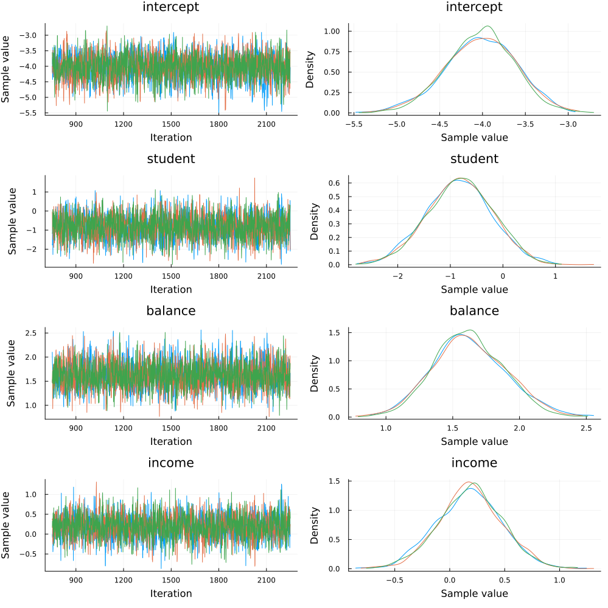
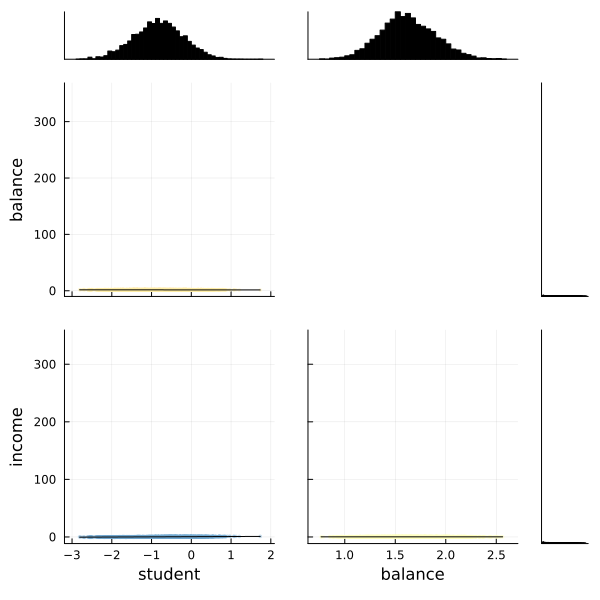

[Bayesian logistic regression](https://en.wikipedia.org/wiki/Logistic_regression#Bayesian) is the Bayesian counterpart to a common tool in machine learning, logistic regression.
The goal of logistic regression is to predict a one or a zero for a given training item.
An example might be predicting whether someone is sick or ill given their symptoms and personal information.

In our example, we'll be working to predict whether someone is likely to default with a synthetic dataset found in the `RDatasets` package. This dataset, `Defaults`, comes from R's [ISLR](https://cran.r-project.org/web/packages/ISLR/index.html) package and contains information on borrowers.

To start, let's import all the libraries we'll need.

```julia
# Import Turing and Distributions.
using Turing, Distributions

# Import RDatasets.
using RDatasets

# Import MCMCChains, Plots, and StatsPlots for visualizations and diagnostics.
using MCMCChains, Plots, StatsPlots

# We need a logistic function, which is provided by StatsFuns.
using StatsFuns: logistic

# Functionality for splitting and normalizing the data
using MLDataUtils: shuffleobs, stratifiedobs, rescale!

# Set a seed for reproducibility.
using Random
Random.seed!(0);
```


## Data Cleaning & Set Up

Now we're going to import our dataset. The first six rows of the dataset are shown below so you can get a good feel for what kind of data we have.

```julia
# Import the "Default" dataset.
data = RDatasets.dataset("ISLR", "Default");

# Show the first six rows of the dataset.
first(data, 6)
```

```
6×4 DataFrame
 Row │ Default  Student  Balance   Income
     │ Cat…     Cat…     Float64   Float64
─────┼──────────────────────────────────────
   1 │ No       No        729.526  44361.6
   2 │ No       Yes       817.18   12106.1
   3 │ No       No       1073.55   31767.1
   4 │ No       No        529.251  35704.5
   5 │ No       No        785.656  38463.5
   6 │ No       Yes       919.589   7491.56
```


Most machine learning processes require some effort to tidy up the data, and this is no different. We need to convert the `Default` and `Student` columns, which say "Yes" or "No" into 1s and 0s. Afterwards, we'll get rid of the old words-based columns.

```julia
# Convert "Default" and "Student" to numeric values.
data[!, :DefaultNum] = [r.Default == "Yes" ? 1.0 : 0.0 for r in eachrow(data)]
data[!, :StudentNum] = [r.Student == "Yes" ? 1.0 : 0.0 for r in eachrow(data)]

# Delete the old columns which say "Yes" and "No".
select!(data, Not([:Default, :Student]))

# Show the first six rows of our edited dataset.
first(data, 6)
```

```
6×4 DataFrame
 Row │ Balance   Income    DefaultNum  StudentNum
     │ Float64   Float64   Float64     Float64
─────┼────────────────────────────────────────────
   1 │  729.526  44361.6          0.0         0.0
   2 │  817.18   12106.1          0.0         1.0
   3 │ 1073.55   31767.1          0.0         0.0
   4 │  529.251  35704.5          0.0         0.0
   5 │  785.656  38463.5          0.0         0.0
   6 │  919.589   7491.56         0.0         1.0
```


After we've done that tidying, it's time to split our dataset into training and testing sets, and separate the labels from the data. We separate our data into two halves, `train` and `test`. You can use a higher percentage of splitting (or a lower one) by modifying the `at = 0.05` argument. We have highlighted the use of only a 5% sample to show the power of Bayesian inference with small sample sizes.

We must rescale our variables so that they are centered around zero by subtracting each column by the mean and dividing it by the standard deviation. Without this step, Turing's sampler will have a hard time finding a place to start searching for parameter estimates. To do this we will leverage `MLDataUtils`, which also lets us effortlessly shuffle our observations and perform a stratified split to get a representative test set.

```julia
function split_data(df, target; at=0.70)
    shuffled = shuffleobs(df)
    return trainset, testset = stratifiedobs(row -> row[target], shuffled; p=at)
end

features = [:StudentNum, :Balance, :Income]
numerics = [:Balance, :Income]
target = :DefaultNum

trainset, testset = split_data(data, target; at=0.05)
for feature in numerics
    μ, σ = rescale!(trainset[!, feature]; obsdim=1)
    rescale!(testset[!, feature], μ, σ; obsdim=1)
end

# Turing requires data in matrix form, not dataframe
train = Matrix(trainset[:, features])
test = Matrix(testset[:, features])
train_label = trainset[:, target]
test_label = testset[:, target];
```


## Model Declaration

Finally, we can define our model.

`logistic_regression` takes four arguments:

  - `x` is our set of independent variables;
  - `y` is the element we want to predict;
  - `n` is the number of observations we have; and
  - `σ` is the standard deviation we want to assume for our priors.

Within the model, we create four coefficients (`intercept`, `student`, `balance`, and `income`) and assign a prior of normally distributed with means of zero and standard deviations of `σ`. We want to find values of these four coefficients to predict any given `y`.

The `for` block creates a variable `v` which is the logistic function. We then observe the likelihood of calculating `v` given the actual label, `y[i]`.

```julia
# Bayesian logistic regression (LR)
@model function logistic_regression(x, y, n, σ)
    intercept ~ Normal(0, σ)

    student ~ Normal(0, σ)
    balance ~ Normal(0, σ)
    income ~ Normal(0, σ)

    for i in 1:n
        v = logistic(intercept + student * x[i, 1] + balance * x[i, 2] + income * x[i, 3])
        y[i] ~ Bernoulli(v)
    end
end;
```


## Sampling

Now we can run our sampler. This time we'll use [`NUTS`](https://turinglang.org/stable/docs/library/#Turing.Inference.NUTS) to sample from our posterior.

```julia
# Retrieve the number of observations.
n, _ = size(train)

# Sample using NUTS.
m = logistic_regression(train, train_label, n, 1)
chain = sample(m, NUTS(), MCMCThreads(), 1_500, 3)
```

```
Chains MCMC chain (1500×16×3 Array{Float64, 3}):

Iterations        = 751:1:2250
Number of chains  = 3
Samples per chain = 1500
Wall duration     = 3.84 seconds
Compute duration  = 3.62 seconds
parameters        = intercept, student, balance, income
internals         = lp, n_steps, is_accept, acceptance_rate, log_density, h
amiltonian_energy, hamiltonian_energy_error, max_hamiltonian_energy_error, 
tree_depth, numerical_error, step_size, nom_step_size

Summary Statistics
  parameters      mean       std      mcse    ess_bulk    ess_tail      rha
t   ⋯
      Symbol   Float64   Float64   Float64     Float64     Float64   Float6
4   ⋯

   intercept   -4.0165    0.4027    0.0082   2416.5508   2615.3833    1.001
5   ⋯
     student   -0.8111    0.6188    0.0116   2857.9371   2934.4296    1.000
9   ⋯
     balance    1.6161    0.2738    0.0055   2504.9068   2519.0437    1.000
9   ⋯
      income    0.1922    0.2936    0.0054   2995.9947   2833.4121    0.999
9   ⋯
                                                                1 column om
itted

Quantiles
  parameters      2.5%     25.0%     50.0%     75.0%     97.5%
      Symbol   Float64   Float64   Float64   Float64   Float64

   intercept   -4.8581   -4.2856   -3.9951   -3.7363   -3.2824
     student   -2.0321   -1.2223   -0.8154   -0.3912    0.4463
     balance    1.0978    1.4229    1.6126    1.7993    2.1649
      income   -0.3913   -0.0063    0.1991    0.3869    0.7702
```


Since we ran multiple chains, we may as well do a spot check to make sure each chain converges around similar points.

```julia
plot(chain)
```




Looks good!

We can also use the `corner` function from MCMCChains to show the distributions of the various parameters of our logistic regression.

```julia
# The labels to use.
l = [:student, :balance, :income]

# Use the corner function. Requires StatsPlots and MCMCChains.
corner(chain, l)
```




Fortunately the corner plot appears to demonstrate unimodal distributions for each of our parameters, so it should be straightforward to take the means of each parameter's sampled values to estimate our model to make predictions.

## Making Predictions

How do we test how well the model actually predicts whether someone is likely to default? We need to build a prediction function that takes the `test` object we made earlier and runs it through the average parameter calculated during sampling.

The `prediction` function below takes a `Matrix` and a `Chain` object. It takes the mean of each parameter's sampled values and re-runs the logistic function using those mean values for every element in the test set.

```julia
function prediction(x::Matrix, chain, threshold)
    # Pull the means from each parameter's sampled values in the chain.
    intercept = mean(chain[:intercept])
    student = mean(chain[:student])
    balance = mean(chain[:balance])
    income = mean(chain[:income])

    # Retrieve the number of rows.
    n, _ = size(x)

    # Generate a vector to store our predictions.
    v = Vector{Float64}(undef, n)

    # Calculate the logistic function for each element in the test set.
    for i in 1:n
        num = logistic(
            intercept .+ student * x[i, 1] + balance * x[i, 2] + income * x[i, 3]
        )
        if num >= threshold
            v[i] = 1
        else
            v[i] = 0
        end
    end
    return v
end;
```


Let's see how we did! We run the test matrix through the prediction function, and compute the [mean squared error](https://en.wikipedia.org/wiki/Mean_squared_error) (MSE) for our prediction. The `threshold` variable sets the sensitivity of the predictions. For example, a threshold of 0.07 will predict a defualt value of 1 for any predicted value greater than 0.07 and no default if it is less than 0.07.

```julia
# Set the prediction threshold.
threshold = 0.07

# Make the predictions.
predictions = prediction(test, chain, threshold)

# Calculate MSE for our test set.
loss = sum((predictions - test_label) .^ 2) / length(test_label)
```

```
0.13263157894736843
```


Perhaps more important is to see what percentage of defaults we correctly predicted. The code below simply counts defaults and predictions and presents the results.

```julia
defaults = sum(test_label)
not_defaults = length(test_label) - defaults

predicted_defaults = sum(test_label .== predictions .== 1)
predicted_not_defaults = sum(test_label .== predictions .== 0)

println("Defaults: $defaults
    Predictions: $predicted_defaults
    Percentage defaults correct $(predicted_defaults/defaults)")

println("Not defaults: $not_defaults
    Predictions: $predicted_not_defaults
    Percentage non-defaults correct $(predicted_not_defaults/not_defaults)")
```

```
Defaults: 316.0
    Predictions: 269
    Percentage defaults correct 0.8512658227848101
Not defaults: 9184.0
    Predictions: 7971
    Percentage non-defaults correct 0.8679224738675958
```


The above shows that with a threshold of 0.07, we correctly predict a respectable portion of the defaults, and correctly identify most non-defaults. This is fairly sensitive to a choice of threshold, and you may wish to experiment with it.

This tutorial has demonstrated how to use Turing to perform Bayesian logistic regression.


## Appendix

These tutorials are a part of the TuringTutorials repository, found at: [https://github.com/TuringLang/TuringTutorials](https://github.com/TuringLang/TuringTutorials).

To locally run this tutorial, do the following commands:

```
using TuringTutorials
TuringTutorials.weave("02-logistic-regression", "02_logistic-regression.jmd")
```

Computer Information:

```
Julia Version 1.9.2
Commit e4ee485e909 (2023-07-05 09:39 UTC)
Platform Info:
  OS: Linux (x86_64-linux-gnu)
  CPU: 128 × AMD EPYC 7502 32-Core Processor
  WORD_SIZE: 64
  LIBM: libopenlibm
  LLVM: libLLVM-14.0.6 (ORCJIT, znver2)
  Threads: 1 on 16 virtual cores
Environment:
  JULIA_CPU_THREADS = 16
  JULIA_DEPOT_PATH = /cache/julia-buildkite-plugin/depots/7aa0085e-79a4-45f3-a5bd-9743c91cf3da
  JULIA_IMAGE_THREADS = 1

```

Package Information:

```
Status `/cache/build/default-amdci4-3/julialang/turingtutorials/tutorials/02-logistic-regression/Project.toml`
  [a93c6f00] DataFrames v1.6.0
  [b4f34e82] Distances v0.10.8
  [31c24e10] Distributions v0.25.98
  [5789e2e9] FileIO v1.16.1
  [38e38edf] GLM v1.8.3
  [c7f686f2] MCMCChains v6.0.3
  [cc2ba9b6] MLDataUtils v0.5.4
  [872c559c] NNlib v0.9.4
  [91a5bcdd] Plots v1.38.16
  [ce6b1742] RDatasets v0.7.7
  [4c63d2b9] StatsFuns v1.3.0
  [f3b207a7] StatsPlots v0.15.6
  [fce5fe82] Turing v0.26.6
  [9a3f8284] Random
```

And the full manifest:

```
Status `/cache/build/default-amdci4-3/julialang/turingtutorials/tutorials/02-logistic-regression/Manifest.toml`
  [47edcb42] ADTypes v0.1.5
  [621f4979] AbstractFFTs v1.4.0
  [80f14c24] AbstractMCMC v4.4.2
⌅ [7a57a42e] AbstractPPL v0.5.4
  [1520ce14] AbstractTrees v0.4.4
  [79e6a3ab] Adapt v3.6.2
  [0bf59076] AdvancedHMC v0.4.6
  [5b7e9947] AdvancedMH v0.7.5
  [576499cb] AdvancedPS v0.4.3
  [b5ca4192] AdvancedVI v0.2.4
  [dce04be8] ArgCheck v2.3.0
  [7d9fca2a] Arpack v0.5.4
  [4fba245c] ArrayInterface v7.4.11
  [a9b6321e] Atomix v0.1.0
  [13072b0f] AxisAlgorithms v1.0.1
  [39de3d68] AxisArrays v0.4.7
  [198e06fe] BangBang v0.3.39
  [9718e550] Baselet v0.1.1
⌅ [76274a88] Bijectors v0.12.8
  [d1d4a3ce] BitFlags v0.1.7
  [fa961155] CEnum v0.4.2
  [336ed68f] CSV v0.10.11
  [49dc2e85] Calculus v0.5.1
  [324d7699] CategoricalArrays v0.10.8
  [082447d4] ChainRules v1.53.0
  [d360d2e6] ChainRulesCore v1.16.0
  [9e997f8a] ChangesOfVariables v0.1.8
  [aaaa29a8] Clustering v0.15.3
  [944b1d66] CodecZlib v0.7.2
  [35d6a980] ColorSchemes v3.22.0
  [3da002f7] ColorTypes v0.11.4
  [c3611d14] ColorVectorSpace v0.10.0
  [5ae59095] Colors v0.12.10
  [861a8166] Combinatorics v1.0.2
  [38540f10] CommonSolve v0.2.4
  [bbf7d656] CommonSubexpressions v0.3.0
  [34da2185] Compat v4.7.0
  [a33af91c] CompositionsBase v0.1.2
  [f0e56b4a] ConcurrentUtilities v2.2.1
  [88cd18e8] ConsoleProgressMonitor v0.1.2
  [187b0558] ConstructionBase v1.5.3
  [d38c429a] Contour v0.6.2
  [a8cc5b0e] Crayons v4.1.1
  [9a962f9c] DataAPI v1.15.0
  [a93c6f00] DataFrames v1.6.0
  [864edb3b] DataStructures v0.18.14
  [e2d170a0] DataValueInterfaces v1.0.0
  [244e2a9f] DefineSingletons v0.1.2
  [8bb1440f] DelimitedFiles v1.9.1
  [b429d917] DensityInterface v0.4.0
  [163ba53b] DiffResults v1.1.0
  [b552c78f] DiffRules v1.15.1
  [b4f34e82] Distances v0.10.8
  [31c24e10] Distributions v0.25.98
  [ced4e74d] DistributionsAD v0.6.51
  [ffbed154] DocStringExtensions v0.9.3
  [fa6b7ba4] DualNumbers v0.6.8
⌃ [366bfd00] DynamicPPL v0.23.0
  [cad2338a] EllipticalSliceSampling v1.1.0
  [4e289a0a] EnumX v1.0.4
  [460bff9d] ExceptionUnwrapping v0.1.9
  [e2ba6199] ExprTools v0.1.9
  [c87230d0] FFMPEG v0.4.1
  [7a1cc6ca] FFTW v1.7.1
  [5789e2e9] FileIO v1.16.1
  [48062228] FilePathsBase v0.9.20
  [1a297f60] FillArrays v1.4.2
  [53c48c17] FixedPointNumbers v0.8.4
  [59287772] Formatting v0.4.2
  [f6369f11] ForwardDiff v0.10.35
  [069b7b12] FunctionWrappers v1.1.3
  [77dc65aa] FunctionWrappersWrappers v0.1.3
  [d9f16b24] Functors v0.4.5
  [38e38edf] GLM v1.8.3
  [46192b85] GPUArraysCore v0.1.5
  [28b8d3ca] GR v0.72.9
  [42e2da0e] Grisu v1.0.2
  [cd3eb016] HTTP v1.9.14
  [34004b35] HypergeometricFunctions v0.3.21
  [22cec73e] InitialValues v0.3.1
  [842dd82b] InlineStrings v1.4.0
  [505f98c9] InplaceOps v0.3.0
  [a98d9a8b] Interpolations v0.14.7
  [8197267c] IntervalSets v0.7.4
  [3587e190] InverseFunctions v0.1.11
  [41ab1584] InvertedIndices v1.3.0
  [92d709cd] IrrationalConstants v0.2.2
  [c8e1da08] IterTools v1.8.0
  [82899510] IteratorInterfaceExtensions v1.0.0
  [1019f520] JLFzf v0.1.5
  [692b3bcd] JLLWrappers v1.4.1
  [682c06a0] JSON v0.21.4
  [63c18a36] KernelAbstractions v0.9.7
  [5ab0869b] KernelDensity v0.6.7
  [929cbde3] LLVM v6.1.0
  [8ac3fa9e] LRUCache v1.4.1
  [b964fa9f] LaTeXStrings v1.3.0
  [23fbe1c1] Latexify v0.16.1
  [50d2b5c4] Lazy v0.15.1
⌅ [7f8f8fb0] LearnBase v0.3.0
  [1d6d02ad] LeftChildRightSiblingTrees v0.2.0
  [6f1fad26] Libtask v0.8.6
  [6fdf6af0] LogDensityProblems v2.1.1
  [996a588d] LogDensityProblemsAD v1.6.0
  [2ab3a3ac] LogExpFunctions v0.3.24
  [e6f89c97] LoggingExtras v1.0.0
  [c7f686f2] MCMCChains v6.0.3
  [be115224] MCMCDiagnosticTools v0.3.4
⌃ [9920b226] MLDataPattern v0.5.4
  [cc2ba9b6] MLDataUtils v0.5.4
  [e80e1ace] MLJModelInterface v1.8.0
  [66a33bbf] MLLabelUtils v0.5.7
  [1914dd2f] MacroTools v0.5.10
  [dbb5928d] MappedArrays v0.4.2
  [739be429] MbedTLS v1.1.7
  [442fdcdd] Measures v0.3.2
  [128add7d] MicroCollections v0.1.4
  [e1d29d7a] Missings v1.1.0
  [78c3b35d] Mocking v0.7.7
  [6f286f6a] MultivariateStats v0.10.2
  [872c559c] NNlib v0.9.4
  [77ba4419] NaNMath v1.0.2
  [86f7a689] NamedArrays v0.9.8
  [c020b1a1] NaturalSort v1.0.0
  [b8a86587] NearestNeighbors v0.4.13
  [510215fc] Observables v0.5.4
  [6fe1bfb0] OffsetArrays v1.12.10
  [4d8831e6] OpenSSL v1.4.1
  [3bd65402] Optimisers v0.2.18
  [bac558e1] OrderedCollections v1.6.1
  [90014a1f] PDMats v0.11.17
  [69de0a69] Parsers v2.7.1
  [b98c9c47] Pipe v1.3.0
  [ccf2f8ad] PlotThemes v3.1.0
  [995b91a9] PlotUtils v1.3.5
  [91a5bcdd] Plots v1.38.16
  [2dfb63ee] PooledArrays v1.4.2
  [aea7be01] PrecompileTools v1.1.2
  [21216c6a] Preferences v1.4.0
  [08abe8d2] PrettyTables v2.2.6
  [33c8b6b6] ProgressLogging v0.1.4
  [92933f4c] ProgressMeter v1.7.2
  [1fd47b50] QuadGK v2.8.2
⌅ [df47a6cb] RData v0.8.3
  [ce6b1742] RDatasets v0.7.7
  [74087812] Random123 v1.6.1
  [e6cf234a] RandomNumbers v1.5.3
  [b3c3ace0] RangeArrays v0.3.2
  [c84ed2f1] Ratios v0.4.5
  [c1ae055f] RealDot v0.1.0
  [3cdcf5f2] RecipesBase v1.3.4
  [01d81517] RecipesPipeline v0.6.12
  [731186ca] RecursiveArrayTools v2.38.7
  [189a3867] Reexport v1.2.2
  [05181044] RelocatableFolders v1.0.0
  [ae029012] Requires v1.3.0
  [79098fc4] Rmath v0.7.1
  [f2b01f46] Roots v2.0.17
  [7e49a35a] RuntimeGeneratedFunctions v0.5.11
  [0bca4576] SciMLBase v1.93.4
  [c0aeaf25] SciMLOperators v0.3.5
  [30f210dd] ScientificTypesBase v3.0.0
  [6c6a2e73] Scratch v1.2.0
  [91c51154] SentinelArrays v1.4.0
  [efcf1570] Setfield v1.1.1
  [1277b4bf] ShiftedArrays v2.0.0
  [992d4aef] Showoff v1.0.3
  [777ac1f9] SimpleBufferStream v1.1.0
  [ce78b400] SimpleUnPack v1.1.0
  [a2af1166] SortingAlgorithms v1.1.1
  [276daf66] SpecialFunctions v2.3.0
  [171d559e] SplittablesBase v0.1.15
  [90137ffa] StaticArrays v1.6.2
  [1e83bf80] StaticArraysCore v1.4.2
  [64bff920] StatisticalTraits v3.2.0
  [82ae8749] StatsAPI v1.6.0
⌅ [2913bbd2] StatsBase v0.33.21
  [4c63d2b9] StatsFuns v1.3.0
  [3eaba693] StatsModels v0.7.2
  [f3b207a7] StatsPlots v0.15.6
  [892a3eda] StringManipulation v0.3.0
  [09ab397b] StructArrays v0.6.15
  [2efcf032] SymbolicIndexingInterface v0.2.2
  [ab02a1b2] TableOperations v1.2.0
  [3783bdb8] TableTraits v1.0.1
  [bd369af6] Tables v1.10.1
  [62fd8b95] TensorCore v0.1.1
  [5d786b92] TerminalLoggers v0.1.7
  [f269a46b] TimeZones v1.10.0
  [9f7883ad] Tracker v0.2.26
  [3bb67fe8] TranscodingStreams v0.9.13
  [28d57a85] Transducers v0.4.78
  [410a4b4d] Tricks v0.1.7
  [781d530d] TruncatedStacktraces v1.4.0
  [fce5fe82] Turing v0.26.6
  [5c2747f8] URIs v1.4.2
  [1cfade01] UnicodeFun v0.4.1
  [1986cc42] Unitful v1.15.0
  [45397f5d] UnitfulLatexify v1.6.3
  [013be700] UnsafeAtomics v0.2.1
  [d80eeb9a] UnsafeAtomicsLLVM v0.1.3
  [41fe7b60] Unzip v0.2.0
  [ea10d353] WeakRefStrings v1.4.2
  [cc8bc4a8] Widgets v0.6.6
  [efce3f68] WoodburyMatrices v0.5.5
  [76eceee3] WorkerUtilities v1.6.1
  [700de1a5] ZygoteRules v0.2.3
⌅ [68821587] Arpack_jll v3.5.1+1
  [6e34b625] Bzip2_jll v1.0.8+0
  [83423d85] Cairo_jll v1.16.1+1
  [2e619515] Expat_jll v2.5.0+0
  [b22a6f82] FFMPEG_jll v4.4.2+2
  [f5851436] FFTW_jll v3.3.10+0
  [a3f928ae] Fontconfig_jll v2.13.93+0
  [d7e528f0] FreeType2_jll v2.13.1+0
  [559328eb] FriBidi_jll v1.0.10+0
  [0656b61e] GLFW_jll v3.3.8+0
  [d2c73de3] GR_jll v0.72.9+0
  [78b55507] Gettext_jll v0.21.0+0
  [7746bdde] Glib_jll v2.74.0+2
  [3b182d85] Graphite2_jll v1.3.14+0
  [2e76f6c2] HarfBuzz_jll v2.8.1+1
  [1d5cc7b8] IntelOpenMP_jll v2023.1.0+0
  [aacddb02] JpegTurbo_jll v2.1.91+0
  [c1c5ebd0] LAME_jll v3.100.1+0
  [88015f11] LERC_jll v3.0.0+1
  [dad2f222] LLVMExtra_jll v0.0.23+0
  [1d63c593] LLVMOpenMP_jll v15.0.4+0
  [dd4b983a] LZO_jll v2.10.1+0
⌅ [e9f186c6] Libffi_jll v3.2.2+1
  [d4300ac3] Libgcrypt_jll v1.8.7+0
  [7e76a0d4] Libglvnd_jll v1.6.0+0
  [7add5ba3] Libgpg_error_jll v1.42.0+0
  [94ce4f54] Libiconv_jll v1.16.1+2
  [4b2f31a3] Libmount_jll v2.35.0+0
  [89763e89] Libtiff_jll v4.5.1+1
  [38a345b3] Libuuid_jll v2.36.0+0
  [856f044c] MKL_jll v2023.1.0+0
  [e7412a2a] Ogg_jll v1.3.5+1
⌅ [458c3c95] OpenSSL_jll v1.1.21+0
  [efe28fd5] OpenSpecFun_jll v0.5.5+0
  [91d4177d] Opus_jll v1.3.2+0
  [30392449] Pixman_jll v0.42.2+0
  [c0090381] Qt6Base_jll v6.4.2+3
  [f50d1b31] Rmath_jll v0.4.0+0
  [a2964d1f] Wayland_jll v1.21.0+0
  [2381bf8a] Wayland_protocols_jll v1.25.0+0
  [02c8fc9c] XML2_jll v2.10.3+0
  [aed1982a] XSLT_jll v1.1.34+0
  [ffd25f8a] XZ_jll v5.4.3+1
  [4f6342f7] Xorg_libX11_jll v1.8.6+0
  [0c0b7dd1] Xorg_libXau_jll v1.0.11+0
  [935fb764] Xorg_libXcursor_jll v1.2.0+4
  [a3789734] Xorg_libXdmcp_jll v1.1.4+0
  [1082639a] Xorg_libXext_jll v1.3.4+4
  [d091e8ba] Xorg_libXfixes_jll v5.0.3+4
  [a51aa0fd] Xorg_libXi_jll v1.7.10+4
  [d1454406] Xorg_libXinerama_jll v1.1.4+4
  [ec84b674] Xorg_libXrandr_jll v1.5.2+4
  [ea2f1a96] Xorg_libXrender_jll v0.9.10+4
  [14d82f49] Xorg_libpthread_stubs_jll v0.1.1+0
  [c7cfdc94] Xorg_libxcb_jll v1.15.0+0
  [cc61e674] Xorg_libxkbfile_jll v1.1.2+0
  [12413925] Xorg_xcb_util_image_jll v0.4.0+1
  [2def613f] Xorg_xcb_util_jll v0.4.0+1
  [975044d2] Xorg_xcb_util_keysyms_jll v0.4.0+1
  [0d47668e] Xorg_xcb_util_renderutil_jll v0.3.9+1
  [c22f9ab0] Xorg_xcb_util_wm_jll v0.4.1+1
  [35661453] Xorg_xkbcomp_jll v1.4.6+0
  [33bec58e] Xorg_xkeyboard_config_jll v2.39.0+0
  [c5fb5394] Xorg_xtrans_jll v1.5.0+0
  [3161d3a3] Zstd_jll v1.5.5+0
⌅ [214eeab7] fzf_jll v0.29.0+0
  [a4ae2306] libaom_jll v3.4.0+0
  [0ac62f75] libass_jll v0.15.1+0
  [f638f0a6] libfdk_aac_jll v2.0.2+0
  [b53b4c65] libpng_jll v1.6.38+0
  [f27f6e37] libvorbis_jll v1.3.7+1
  [1270edf5] x264_jll v2021.5.5+0
  [dfaa095f] x265_jll v3.5.0+0
  [d8fb68d0] xkbcommon_jll v1.4.1+0
  [0dad84c5] ArgTools v1.1.1
  [56f22d72] Artifacts
  [2a0f44e3] Base64
  [ade2ca70] Dates
  [8ba89e20] Distributed
  [f43a241f] Downloads v1.6.0
  [7b1f6079] FileWatching
  [9fa8497b] Future
  [b77e0a4c] InteractiveUtils
  [4af54fe1] LazyArtifacts
  [b27032c2] LibCURL v0.6.3
  [76f85450] LibGit2
  [8f399da3] Libdl
  [37e2e46d] LinearAlgebra
  [56ddb016] Logging
  [d6f4376e] Markdown
  [a63ad114] Mmap
  [ca575930] NetworkOptions v1.2.0
  [44cfe95a] Pkg v1.9.2
  [de0858da] Printf
  [3fa0cd96] REPL
  [9a3f8284] Random
  [ea8e919c] SHA v0.7.0
  [9e88b42a] Serialization
  [1a1011a3] SharedArrays
  [6462fe0b] Sockets
  [2f01184e] SparseArrays
  [10745b16] Statistics v1.9.0
  [4607b0f0] SuiteSparse
  [fa267f1f] TOML v1.0.3
  [a4e569a6] Tar v1.10.0
  [8dfed614] Test
  [cf7118a7] UUIDs
  [4ec0a83e] Unicode
  [e66e0078] CompilerSupportLibraries_jll v1.0.5+0
  [deac9b47] LibCURL_jll v7.84.0+0
  [29816b5a] LibSSH2_jll v1.10.2+0
  [c8ffd9c3] MbedTLS_jll v2.28.2+0
  [14a3606d] MozillaCACerts_jll v2022.10.11
  [4536629a] OpenBLAS_jll v0.3.21+4
  [05823500] OpenLibm_jll v0.8.1+0
  [efcefdf7] PCRE2_jll v10.42.0+0
  [bea87d4a] SuiteSparse_jll v5.10.1+6
  [83775a58] Zlib_jll v1.2.13+0
  [8e850b90] libblastrampoline_jll v5.8.0+0
  [8e850ede] nghttp2_jll v1.48.0+0
  [3f19e933] p7zip_jll v17.4.0+0
Info Packages marked with ⌃ and ⌅ have new versions available, but those with ⌅ are restricted by compatibility constraints from upgrading. To see why use `status --outdated -m`
```

