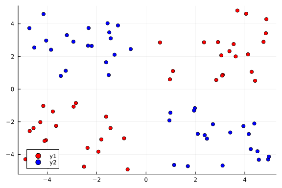
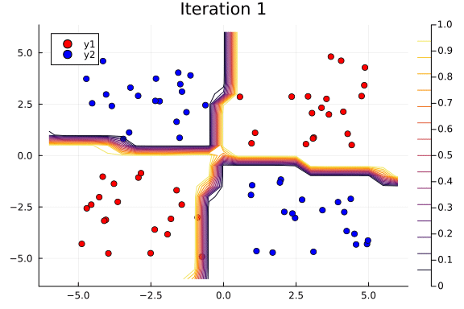

In this tutorial, we demonstrate how one can implement a Bayesian Neural Network using a combination of Turing and [Flux](https://github.com/FluxML/Flux.jl), a suite of machine learning tools. We will use Flux to specify the neural network's layers and Turing to implement the probabilistic inference, with the goal of implementing a classification algorithm.

We will begin with importing the relevant libraries.

```julia
# Import libraries.
using Turing, Flux, Plots, Random, ReverseDiff

# Hide sampling progress.
Turing.setprogress!(false);

# Use reverse_diff due to the number of parameters in neural networks.
Turing.setadbackend(:reversediff)
```

```
:reversediff
```


Our goal here is to use a Bayesian neural network to classify points in an artificial dataset. The code below generates data points arranged in a box-like pattern and displays a graph of the dataset we'll be working with.

```julia
# Number of points to generate.
N = 80
M = round(Int, N / 4)
Random.seed!(1234)

# Generate artificial data.
x1s = rand(M) * 4.5;
x2s = rand(M) * 4.5;
xt1s = Array([[x1s[i] + 0.5; x2s[i] + 0.5] for i in 1:M])
x1s = rand(M) * 4.5;
x2s = rand(M) * 4.5;
append!(xt1s, Array([[x1s[i] - 5; x2s[i] - 5] for i in 1:M]))

x1s = rand(M) * 4.5;
x2s = rand(M) * 4.5;
xt0s = Array([[x1s[i] + 0.5; x2s[i] - 5] for i in 1:M])
x1s = rand(M) * 4.5;
x2s = rand(M) * 4.5;
append!(xt0s, Array([[x1s[i] - 5; x2s[i] + 0.5] for i in 1:M]))

# Store all the data for later.
xs = [xt1s; xt0s]
ts = [ones(2 * M); zeros(2 * M)]

# Plot data points.
function plot_data()
    x1 = map(e -> e[1], xt1s)
    y1 = map(e -> e[2], xt1s)
    x2 = map(e -> e[1], xt0s)
    y2 = map(e -> e[2], xt0s)

    Plots.scatter(x1, y1; color="red", clim=(0, 1))
    return Plots.scatter!(x2, y2; color="blue", clim=(0, 1))
end

plot_data()
```




## Building a Neural Network

The next step is to define a [feedforward neural network](https://en.wikipedia.org/wiki/Feedforward_neural_network) where we express our parameters as distributions, and not single points as with traditional neural networks.
For this we will use `Dense` to define liner layers and compose them via `Chain`, both are neural network primitives from Flux.
The network `nn_initial` we created has two hidden layers with `tanh` activations and one output layer with sigmoid (`σ`) activation, as shown below.


The `nn_initial` is an instance that acts as a function and can take data as inputs and output predictions.
We will define distributions on the neural network parameters and use `destructure` from Flux to extract the parameters as `parameters_initial`.
The function `destructure` also returns another function `reconstruct` that can take (new) parameters in and return us a neural network instance whose architecture is the same as `nn_initial` but with updated parameters.

```julia
# Construct a neural network using Flux
nn_initial = Chain(Dense(2, 3, tanh), Dense(3, 2, tanh), Dense(2, 1, σ))

# Extract weights and a helper function to reconstruct NN from weights
parameters_initial, reconstruct = Flux.destructure(nn_initial)

length(parameters_initial) # number of paraemters in NN
```

```
20
```


The probabilistic model specification below creates a `parameters` variable, which has IID normal variables. The `parameters` vector represents all parameters of our neural net (weights and biases).

```julia
# Create a regularization term and a Gaussian prior variance term.
alpha = 0.09
sig = sqrt(1.0 / alpha)

# Specify the probabilistic model.
@model function bayes_nn(xs, ts, nparameters, reconstruct)
    # Create the weight and bias vector.
    parameters ~ MvNormal(zeros(nparameters), sig .* ones(nparameters))

    # Construct NN from parameters
    nn = reconstruct(parameters)
    # Forward NN to make predictions
    preds = nn(xs)

    # Observe each prediction.
    for i in 1:length(ts)
        ts[i] ~ Bernoulli(preds[i])
    end
end;
```


Inference can now be performed by calling `sample`. We use the `HMC` sampler here.

```julia
# Perform inference.
N = 5000
ch = sample(
    bayes_nn(hcat(xs...), ts, length(parameters_initial), reconstruct), HMC(0.05, 4), N
);
```


Now we extract the parameter samples from the sampled chain as `theta` (this is of size `5000 x 20` where `5000` is the number of iterations and `20` is the number of parameters).
We'll use these primarily to determine how good our model's classifier is.

```julia
# Extract all weight and bias parameters.
theta = MCMCChains.group(ch, :parameters).value;
```


## Prediction Visualization

We can use [MAP estimation](https://en.wikipedia.org/wiki/Maximum_a_posteriori_estimation) to classify our population by using the set of weights that provided the highest log posterior.

```julia
# A helper to create NN from weights `theta` and run it through data `x`
nn_forward(x, theta) = reconstruct(theta)(x)

# Plot the data we have.
plot_data()

# Find the index that provided the highest log posterior in the chain.
_, i = findmax(ch[:lp])

# Extract the max row value from i.
i = i.I[1]

# Plot the posterior distribution with a contour plot
x1_range = collect(range(-6; stop=6, length=25))
x2_range = collect(range(-6; stop=6, length=25))
Z = [nn_forward([x1, x2], theta[i, :])[1] for x1 in x1_range, x2 in x2_range]
contour!(x1_range, x2_range, Z)
```


The contour plot above shows that the MAP method is not too bad at classifying our data.

Now we can visualize our predictions.

$$
p(\tilde{x} | X, \alpha) = \int_{\theta} p(\tilde{x} | \theta) p(\theta | X, \alpha) \approx \sum_{\theta \sim p(\theta | X, \alpha)}f_{\theta}(\tilde{x})
$$

The `nn_predict` function takes the average predicted value from a network parameterized by weights drawn from the MCMC chain.

```julia
# Return the average predicted value across
# multiple weights.
function nn_predict(x, theta, num)
    return mean([nn_forward(x, theta[i, :])[1] for i in 1:10:num])
end;
```


Next, we use the `nn_predict` function to predict the value at a sample of points where the `x1` and `x2` coordinates range between -6 and 6. As we can see below, we still have a satisfactory fit to our data, and more importantly, we can also see where the neural network is uncertain about its predictions much easier---those regions between cluster boundaries.

```julia
# Plot the average prediction.
plot_data()

n_end = 1500
x1_range = collect(range(-6; stop=6, length=25))
x2_range = collect(range(-6; stop=6, length=25))
Z = [nn_predict([x1, x2], theta, n_end)[1] for x1 in x1_range, x2 in x2_range]
contour!(x1_range, x2_range, Z)
```


Suppose we are interested in how the predictive power of our Bayesian neural network evolved between samples. In that case, the following graph displays an animation of the contour plot generated from the network weights in samples 1 to 1,000.

```julia
# Number of iterations to plot.
n_end = 500

anim = @gif for i in 1:n_end
    plot_data()
    Z = [nn_forward([x1, x2], theta[i, :])[1] for x1 in x1_range, x2 in x2_range]
    contour!(x1_range, x2_range, Z; title="Iteration $i", clim=(0, 1))
end every 5
```




This has been an introduction to the applications of Turing and Flux in defining Bayesian neural networks.


## Appendix

These tutorials are a part of the TuringTutorials repository, found at: [https://github.com/TuringLang/TuringTutorials](https://github.com/TuringLang/TuringTutorials).

To locally run this tutorial, do the following commands:

```
using TuringTutorials
TuringTutorials.weave("03-bayesian-neural-network", "03_bayesian-neural-network.jmd")
```

Computer Information:

```
Julia Version 1.6.5
Commit 9058264a69 (2021-12-19 12:30 UTC)
Platform Info:
  OS: Linux (x86_64-pc-linux-gnu)
  CPU: AMD EPYC 7502 32-Core Processor
  WORD_SIZE: 64
  LIBM: libopenlibm
  LLVM: libLLVM-11.0.1 (ORCJIT, znver2)
Environment:
  BUILDKITE_PLUGIN_JULIA_CACHE_DIR = /cache/julia-buildkite-plugin
  JULIA_DEPOT_PATH = /cache/julia-buildkite-plugin/depots/7aa0085e-79a4-45f3-a5bd-9743c91cf3da

```

Package Information:

```
      Status `/cache/build/exclusive-amdci3-0/julialang/turingtutorials/tutorials/03-bayesian-neural-network/Project.toml`
  [b5ca4192] AdvancedVI v0.1.3
  [76274a88] Bijectors v0.9.7
  [587475ba] Flux v0.12.8
  [91a5bcdd] Plots v1.25.11
  [37e2e3b7] ReverseDiff v1.9.0
  [fce5fe82] Turing v0.16.6
  [9a3f8284] Random
```

And the full manifest:

```
      Status `/cache/build/exclusive-amdci3-0/julialang/turingtutorials/tutorials/03-bayesian-neural-network/Manifest.toml`
  [621f4979] AbstractFFTs v1.0.1
  [80f14c24] AbstractMCMC v3.2.1
  [7a57a42e] AbstractPPL v0.1.4
  [1520ce14] AbstractTrees v0.3.4
  [79e6a3ab] Adapt v3.3.3
  [0bf59076] AdvancedHMC v0.3.3
  [5b7e9947] AdvancedMH v0.6.6
  [576499cb] AdvancedPS v0.2.4
  [b5ca4192] AdvancedVI v0.1.3
  [dce04be8] ArgCheck v2.3.0
  [4fba245c] ArrayInterface v3.2.2
  [13072b0f] AxisAlgorithms v1.0.1
  [39de3d68] AxisArrays v0.4.4
  [ab4f0b2a] BFloat16s v0.2.0
  [198e06fe] BangBang v0.3.35
  [9718e550] Baselet v0.1.1
  [76274a88] Bijectors v0.9.7
  [62783981] BitTwiddlingConvenienceFunctions v0.1.2
  [fa961155] CEnum v0.4.1
  [2a0fbf3d] CPUSummary v0.1.8
  [052768ef] CUDA v3.8.2
  [082447d4] ChainRules v0.8.25
  [d360d2e6] ChainRulesCore v0.10.13
  [fb6a15b2] CloseOpenIntervals v0.1.5
  [944b1d66] CodecZlib v0.7.0
  [35d6a980] ColorSchemes v3.17.1
  [3da002f7] ColorTypes v0.11.0
  [5ae59095] Colors v0.12.8
  [861a8166] Combinatorics v1.0.2
  [38540f10] CommonSolve v0.2.0
  [bbf7d656] CommonSubexpressions v0.3.0
  [34da2185] Compat v3.41.0
  [a33af91c] CompositionsBase v0.1.1
  [88cd18e8] ConsoleProgressMonitor v0.1.2
  [187b0558] ConstructionBase v1.3.0
  [d38c429a] Contour v0.5.7
  [a8cc5b0e] Crayons v4.1.1
  [9a962f9c] DataAPI v1.9.0
  [864edb3b] DataStructures v0.18.11
  [e2d170a0] DataValueInterfaces v1.0.0
  [244e2a9f] DefineSingletons v0.1.2
  [163ba53b] DiffResults v1.0.3
  [b552c78f] DiffRules v1.5.0
  [31c24e10] Distributions v0.25.14
  [ced4e74d] DistributionsAD v0.6.29
  [ffbed154] DocStringExtensions v0.8.6
  [366bfd00] DynamicPPL v0.12.4
  [da5c29d0] EllipsisNotation v1.3.0
  [cad2338a] EllipticalSliceSampling v0.4.6
  [e2ba6199] ExprTools v0.1.8
  [c87230d0] FFMPEG v0.4.1
  [7a1cc6ca] FFTW v1.4.5
  [1a297f60] FillArrays v0.11.9
  [6a86dc24] FiniteDiff v2.10.1
  [53c48c17] FixedPointNumbers v0.8.4
  [587475ba] Flux v0.12.8
  [59287772] Formatting v0.4.2
  [f6369f11] ForwardDiff v0.10.25
  [069b7b12] FunctionWrappers v1.1.2
  [d9f16b24] Functors v0.2.8
  [0c68f7d7] GPUArrays v8.2.1
  [61eb1bfa] GPUCompiler v0.13.13
  [28b8d3ca] GR v0.64.0
  [5c1252a2] GeometryBasics v0.4.1
  [42e2da0e] Grisu v1.0.2
  [cd3eb016] HTTP v0.9.17
  [3e5b6fbb] HostCPUFeatures v0.1.6
  [0e44f5e4] Hwloc v2.0.0
  [7869d1d1] IRTools v0.4.5
  [615f187c] IfElse v0.1.1
  [83e8ac13] IniFile v0.5.0
  [22cec73e] InitialValues v0.3.1
  [505f98c9] InplaceOps v0.3.0
  [a98d9a8b] Interpolations v0.13.5
  [8197267c] IntervalSets v0.5.3
  [41ab1584] InvertedIndices v1.1.0
  [92d709cd] IrrationalConstants v0.1.1
  [c8e1da08] IterTools v1.4.0
  [42fd0dbc] IterativeSolvers v0.9.2
  [82899510] IteratorInterfaceExtensions v1.0.0
  [692b3bcd] JLLWrappers v1.4.1
  [682c06a0] JSON v0.21.3
  [e5e0dc1b] Juno v0.8.4
  [5ab0869b] KernelDensity v0.6.3
  [929cbde3] LLVM v4.7.1
  [b964fa9f] LaTeXStrings v1.3.0
  [23fbe1c1] Latexify v0.15.11
  [10f19ff3] LayoutPointers v0.1.5
  [1d6d02ad] LeftChildRightSiblingTrees v0.1.3
  [6f1fad26] Libtask v0.5.3
  [2ab3a3ac] LogExpFunctions v0.3.0
  [e6f89c97] LoggingExtras v0.4.7
  [bdcacae8] LoopVectorization v0.12.99
  [c7f686f2] MCMCChains v4.14.1
  [e80e1ace] MLJModelInterface v1.3.6
  [1914dd2f] MacroTools v0.5.9
  [d125e4d3] ManualMemory v0.1.8
  [dbb5928d] MappedArrays v0.4.1
  [739be429] MbedTLS v1.0.3
  [442fdcdd] Measures v0.3.1
  [e89f7d12] Media v0.5.0
  [128add7d] MicroCollections v0.1.2
  [e1d29d7a] Missings v1.0.2
  [872c559c] NNlib v0.7.34
  [a00861dc] NNlibCUDA v0.1.11
  [77ba4419] NaNMath v0.3.7
  [86f7a689] NamedArrays v0.9.6
  [c020b1a1] NaturalSort v1.0.0
  [8913a72c] NonlinearSolve v0.3.14
  [6fe1bfb0] OffsetArrays v1.10.8
  [bac558e1] OrderedCollections v1.4.1
  [90014a1f] PDMats v0.11.5
  [69de0a69] Parsers v2.2.2
  [ccf2f8ad] PlotThemes v2.0.1
  [995b91a9] PlotUtils v1.1.3
  [91a5bcdd] Plots v1.25.11
  [f517fe37] Polyester v0.6.4
  [1d0040c9] PolyesterWeave v0.1.4
  [21216c6a] Preferences v1.2.3
  [08abe8d2] PrettyTables v1.3.1
  [33c8b6b6] ProgressLogging v0.1.4
  [92933f4c] ProgressMeter v1.7.1
  [1fd47b50] QuadGK v2.4.2
  [74087812] Random123 v1.4.2
  [e6cf234a] RandomNumbers v1.5.3
  [b3c3ace0] RangeArrays v0.3.2
  [c84ed2f1] Ratios v0.4.2
  [3cdcf5f2] RecipesBase v1.2.1
  [01d81517] RecipesPipeline v0.5.0
  [731186ca] RecursiveArrayTools v2.24.2
  [f2c3362d] RecursiveFactorization v0.2.9
  [189a3867] Reexport v1.2.2
  [05181044] RelocatableFolders v0.1.3
  [ae029012] Requires v1.3.0
  [37e2e3b7] ReverseDiff v1.9.0
  [79098fc4] Rmath v0.7.0
  [3cdde19b] SIMDDualNumbers v0.1.0
  [94e857df] SIMDTypes v0.1.0
  [476501e8] SLEEFPirates v0.6.29
  [0bca4576] SciMLBase v1.26.1
  [30f210dd] ScientificTypesBase v3.0.0
  [6c6a2e73] Scratch v1.1.0
  [efcf1570] Setfield v0.8.2
  [992d4aef] Showoff v1.0.3
  [a2af1166] SortingAlgorithms v1.0.1
  [276daf66] SpecialFunctions v1.8.3
  [171d559e] SplittablesBase v0.1.14
  [aedffcd0] Static v0.4.1
  [90137ffa] StaticArrays v1.3.5
  [64bff920] StatisticalTraits v3.0.0
  [82ae8749] StatsAPI v1.2.1
  [2913bbd2] StatsBase v0.33.16
  [4c63d2b9] StatsFuns v0.9.9
  [7792a7ef] StrideArraysCore v0.2.11
  [09ab397b] StructArrays v0.6.5
  [3783bdb8] TableTraits v1.0.1
  [bd369af6] Tables v1.6.1
  [5d786b92] TerminalLoggers v0.1.5
  [8290d209] ThreadingUtilities v0.4.7
  [a759f4b9] TimerOutputs v0.5.15
  [9f7883ad] Tracker v0.2.19
  [3bb67fe8] TranscodingStreams v0.9.6
  [28d57a85] Transducers v0.4.72
  [a2a6695c] TreeViews v0.3.0
  [d5829a12] TriangularSolve v0.1.9
  [fce5fe82] Turing v0.16.6
  [5c2747f8] URIs v1.3.0
  [3a884ed6] UnPack v1.0.2
  [1cfade01] UnicodeFun v0.4.1
  [41fe7b60] Unzip v0.1.2
  [3d5dd08c] VectorizationBase v0.21.24
  [efce3f68] WoodburyMatrices v0.5.5
  [a5390f91] ZipFile v0.9.4
  [e88e6eb3] Zygote v0.6.17
  [700de1a5] ZygoteRules v0.2.2
  [6e34b625] Bzip2_jll v1.0.8+0
  [83423d85] Cairo_jll v1.16.1+1
  [5ae413db] EarCut_jll v2.2.3+0
  [2e619515] Expat_jll v2.4.4+0
  [b22a6f82] FFMPEG_jll v4.4.0+0
  [f5851436] FFTW_jll v3.3.10+0
  [a3f928ae] Fontconfig_jll v2.13.93+0
  [d7e528f0] FreeType2_jll v2.10.4+0
  [559328eb] FriBidi_jll v1.0.10+0
  [0656b61e] GLFW_jll v3.3.6+0
  [d2c73de3] GR_jll v0.64.0+0
  [78b55507] Gettext_jll v0.21.0+0
  [7746bdde] Glib_jll v2.68.3+2
  [3b182d85] Graphite2_jll v1.3.14+0
  [2e76f6c2] HarfBuzz_jll v2.8.1+1
  [e33a78d0] Hwloc_jll v2.7.0+0
  [1d5cc7b8] IntelOpenMP_jll v2018.0.3+2
  [aacddb02] JpegTurbo_jll v2.1.2+0
  [c1c5ebd0] LAME_jll v3.100.1+0
  [dad2f222] LLVMExtra_jll v0.0.13+2
  [dd4b983a] LZO_jll v2.10.1+0
  [e9f186c6] Libffi_jll v3.2.2+1
  [d4300ac3] Libgcrypt_jll v1.8.7+0
  [7e76a0d4] Libglvnd_jll v1.3.0+3
  [7add5ba3] Libgpg_error_jll v1.42.0+0
  [94ce4f54] Libiconv_jll v1.16.1+1
  [4b2f31a3] Libmount_jll v2.35.0+0
  [3ae2931a] Libtask_jll v0.4.3+0
  [89763e89] Libtiff_jll v4.3.0+0
  [38a345b3] Libuuid_jll v2.36.0+0
  [856f044c] MKL_jll v2021.1.1+2
  [e7412a2a] Ogg_jll v1.3.5+1
  [458c3c95] OpenSSL_jll v1.1.13+0
  [efe28fd5] OpenSpecFun_jll v0.5.5+0
  [91d4177d] Opus_jll v1.3.2+0
  [2f80f16e] PCRE_jll v8.44.0+0
  [30392449] Pixman_jll v0.40.1+0
  [ea2cea3b] Qt5Base_jll v5.15.3+0
  [f50d1b31] Rmath_jll v0.3.0+0
  [a2964d1f] Wayland_jll v1.19.0+0
  [2381bf8a] Wayland_protocols_jll v1.23.0+0
  [02c8fc9c] XML2_jll v2.9.12+0
  [aed1982a] XSLT_jll v1.1.34+0
  [4f6342f7] Xorg_libX11_jll v1.6.9+4
  [0c0b7dd1] Xorg_libXau_jll v1.0.9+4
  [935fb764] Xorg_libXcursor_jll v1.2.0+4
  [a3789734] Xorg_libXdmcp_jll v1.1.3+4
  [1082639a] Xorg_libXext_jll v1.3.4+4
  [d091e8ba] Xorg_libXfixes_jll v5.0.3+4
  [a51aa0fd] Xorg_libXi_jll v1.7.10+4
  [d1454406] Xorg_libXinerama_jll v1.1.4+4
  [ec84b674] Xorg_libXrandr_jll v1.5.2+4
  [ea2f1a96] Xorg_libXrender_jll v0.9.10+4
  [14d82f49] Xorg_libpthread_stubs_jll v0.1.0+3
  [c7cfdc94] Xorg_libxcb_jll v1.13.0+3
  [cc61e674] Xorg_libxkbfile_jll v1.1.0+4
  [12413925] Xorg_xcb_util_image_jll v0.4.0+1
  [2def613f] Xorg_xcb_util_jll v0.4.0+1
  [975044d2] Xorg_xcb_util_keysyms_jll v0.4.0+1
  [0d47668e] Xorg_xcb_util_renderutil_jll v0.3.9+1
  [c22f9ab0] Xorg_xcb_util_wm_jll v0.4.1+1
  [35661453] Xorg_xkbcomp_jll v1.4.2+4
  [33bec58e] Xorg_xkeyboard_config_jll v2.27.0+4
  [c5fb5394] Xorg_xtrans_jll v1.4.0+3
  [3161d3a3] Zstd_jll v1.5.2+0
  [0ac62f75] libass_jll v0.15.1+0
  [f638f0a6] libfdk_aac_jll v2.0.2+0
  [b53b4c65] libpng_jll v1.6.38+0
  [f27f6e37] libvorbis_jll v1.3.7+1
  [1270edf5] x264_jll v2021.5.5+0
  [dfaa095f] x265_jll v3.5.0+0
  [d8fb68d0] xkbcommon_jll v0.9.1+5
  [0dad84c5] ArgTools
  [56f22d72] Artifacts
  [2a0f44e3] Base64
  [ade2ca70] Dates
  [8bb1440f] DelimitedFiles
  [8ba89e20] Distributed
  [f43a241f] Downloads
  [9fa8497b] Future
  [b77e0a4c] InteractiveUtils
  [4af54fe1] LazyArtifacts
  [b27032c2] LibCURL
  [76f85450] LibGit2
  [8f399da3] Libdl
  [37e2e46d] LinearAlgebra
  [56ddb016] Logging
  [d6f4376e] Markdown
  [a63ad114] Mmap
  [ca575930] NetworkOptions
  [44cfe95a] Pkg
  [de0858da] Printf
  [9abbd945] Profile
  [3fa0cd96] REPL
  [9a3f8284] Random
  [ea8e919c] SHA
  [9e88b42a] Serialization
  [1a1011a3] SharedArrays
  [6462fe0b] Sockets
  [2f01184e] SparseArrays
  [10745b16] Statistics
  [4607b0f0] SuiteSparse
  [fa267f1f] TOML
  [a4e569a6] Tar
  [8dfed614] Test
  [cf7118a7] UUIDs
  [4ec0a83e] Unicode
  [e66e0078] CompilerSupportLibraries_jll
  [deac9b47] LibCURL_jll
  [29816b5a] LibSSH2_jll
  [c8ffd9c3] MbedTLS_jll
  [14a3606d] MozillaCACerts_jll
  [05823500] OpenLibm_jll
  [83775a58] Zlib_jll
  [8e850ede] nghttp2_jll
  [3f19e933] p7zip_jll
```

