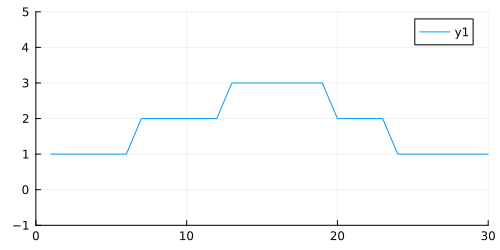
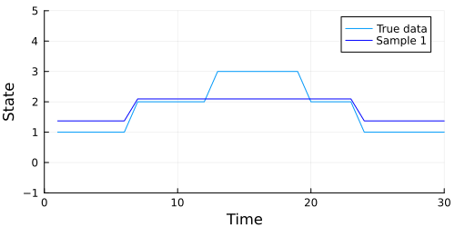
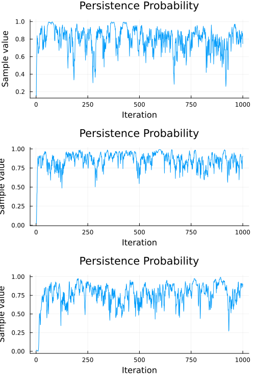

This tutorial illustrates training Bayesian [Hidden Markov Models](https://en.wikipedia.org/wiki/Hidden_Markov_model) (HMM) using Turing. The main goals are learning the transition matrix, emission parameter, and hidden states. For a more rigorous academic overview on Hidden Markov Models, see [An introduction to Hidden Markov Models and Bayesian Networks](http://mlg.eng.cam.ac.uk/zoubin/papers/ijprai.pdf) (Ghahramani, 2001).

In this tutorial, we assume there are $k$ discrete hidden states; the observations are continuous and normally distributed - centered around the hidden states. This assumption reduces the number of parameters to be estimated in the emission matrix.

Let's load the libraries we'll need. We also set a random seed (for reproducibility) and the automatic differentiation backend to forward mode (more [here](http://turing.ml/docs/autodiff/) on why this is useful).

```julia
# Load libraries.
using Turing, StatsPlots, Random

# Set a random seed and use the forward_diff AD mode.
Random.seed!(12345678);
```


## Simple State Detection

In this example, we'll use something where the states and emission parameters are straightforward.

```julia
# Define the emission parameter.
y = [
    1.0,
    1.0,
    1.0,
    1.0,
    1.0,
    1.0,
    2.0,
    2.0,
    2.0,
    2.0,
    2.0,
    2.0,
    3.0,
    3.0,
    3.0,
    3.0,
    3.0,
    3.0,
    3.0,
    2.0,
    2.0,
    2.0,
    2.0,
    1.0,
    1.0,
    1.0,
    1.0,
    1.0,
    1.0,
    1.0,
];
N = length(y);
K = 3;

# Plot the data we just made.
plot(y; xlim=(0, 30), ylim=(-1, 5), size=(500, 250))
```




We can see that we have three states, one for each height of the plot (1, 2, 3). This height is also our emission parameter, so state one produces a value of one, state two produces a value of two, and so on.

Ultimately, we would like to understand three major parameters:

 1. The transition matrix. This is a matrix that assigns a probability of switching from one state to any other state, including the state that we are already in.
 2. The emission matrix, which describes a typical value emitted by some state. In the plot above, the emission parameter for state one is simply one.
 3. The state sequence is our understanding of what state we were actually in when we observed some data. This is very important in more sophisticated HMM models, where the emission value does not equal our state.

With this in mind, let's set up our model. We are going to use some of our knowledge as modelers to provide additional information about our system. This takes the form of the prior on our emission parameter.

$$
m_i \sim \mathrm{Normal}(i, 0.5) \quad \text{where} \quad m = \{1,2,3\}
$$

Simply put, this says that we expect state one to emit values in a Normally distributed manner, where the mean of each state's emissions is that state's value. The variance of 0.5 helps the model converge more quickly — consider the case where we have a variance of 1 or 2. In this case, the likelihood of observing a 2 when we are in state 1 is actually quite high, as it is within a standard deviation of the true emission value. Applying the prior that we are likely to be tightly centered around the mean prevents our model from being too confused about the state that is generating our observations.

The priors on our transition matrix are noninformative, using `T[i] ~ Dirichlet(ones(K)/K)`. The Dirichlet prior used in this way assumes that the state is likely to change to any other state with equal probability. As we'll see, this transition matrix prior will be overwritten as we observe data.

```julia
# Turing model definition.
@model function BayesHmm(y, K)
    # Get observation length.
    N = length(y)

    # State sequence.
    s = tzeros(Int, N)

    # Emission matrix.
    m = Vector(undef, K)

    # Transition matrix.
    T = Vector{Vector}(undef, K)

    # Assign distributions to each element
    # of the transition matrix and the
    # emission matrix.
    for i in 1:K
        T[i] ~ Dirichlet(ones(K) / K)
        m[i] ~ Normal(i, 0.5)
    end

    # Observe each point of the input.
    s[1] ~ Categorical(K)
    y[1] ~ Normal(m[s[1]], 0.1)

    for i in 2:N
        s[i] ~ Categorical(vec(T[s[i - 1]]))
        y[i] ~ Normal(m[s[i]], 0.1)
    end
end;
```


We will use a combination of two samplers ([HMC](http://turing.ml/docs/library/#Turing.HMC) and [Particle Gibbs](http://turing.ml/docs/library/#Turing.PG)) by passing them to the [Gibbs](http://turing.ml/docs/library/#Turing.Gibbs) sampler. The Gibbs sampler allows for compositional inference, where we can utilize different samplers on different parameters.

In this case, we use HMC for `m` and `T`, representing the emission and transition matrices respectively. We use the Particle Gibbs sampler for `s`, the state sequence. You may wonder why it is that we are not assigning `s` to the HMC sampler, and why it is that we need compositional Gibbs sampling at all.

The parameter `s` is not a continuous variable. It is a vector of **integers**, and thus Hamiltonian methods like HMC and [NUTS](http://turing.ml/docs/library/#-turingnuts--type) won't work correctly. Gibbs allows us to apply the right tools to the best effect. If you are a particularly advanced user interested in higher performance, you may benefit from setting up your Gibbs sampler to use [different automatic differentiation](http://turing.ml/stable/docs/autodiff/#compositional-sampling-with-differing-ad-modes) backends for each parameter space.

Time to run our sampler.

```julia
g = Gibbs(HMC(0.01, 50, :m, :T), PG(120, :s))
chn = sample(BayesHmm(y, 3), g, 1000);
```


Let's see how well our chain performed.
Ordinarily, using `display(chn)` would be a good first step, but we have generated a lot of parameters here (`s[1]`, `s[2]`, `m[1]`, and so on).
It's a bit easier to show how our model performed graphically.

The code below generates an animation showing the graph of the data above, and the data our model generates in each sample.

```julia

# Extract our m and s parameters from the chain.
m_set = MCMCChains.group(chn, :m).value
s_set = MCMCChains.group(chn, :s).value

# Iterate through the MCMC samples.
Ns = 1:length(chn)

# Make an animation.
animation = @gif for i in Ns
    m = m_set[i, :]
    s = Int.(s_set[i, :])
    emissions = m[s]

    p = plot(
        y;
        chn=:red,
        size=(500, 250),
        xlabel="Time",
        ylabel="State",
        legend=:topright,
        label="True data",
        xlim=(0, 30),
        ylim=(-1, 5),
    )
    plot!(emissions; color=:blue, label="Sample $i")
end every 3
```




Looks like our model did a pretty good job, but we should also check to make sure our chain converges. A quick check is to examine whether the diagonal (representing the probability of remaining in the current state) of the transition matrix appears to be stationary. The code below extracts the diagonal and shows a traceplot of each persistence probability.

```julia
# Index the chain with the persistence probabilities.
subchain = chn[["T[1][1]", "T[2][2]", "T[3][3]"]]

plot(subchain; seriestype=:traceplot, title="Persistence Probability", legend=false)
```




A cursory examination of the traceplot above indicates that all three chains converged to something resembling
stationary. We can use the diagnostic functions provided by [MCMCChains](https://github.com/TuringLang/MCMCChains.jl) to engage in some more formal tests, like the Heidelberg and Welch diagnostic:

```julia

heideldiag(MCMCChains.group(chn, :T))[1]
```

```
Heidelberger and Welch diagnostic - Chain 1
  parameters     burnin   stationarity    pvalue      mean   halfwidth     
tes ⋯
      Symbol      Int64           Bool   Float64   Float64     Float64     
Boo ⋯

     T[1][1]     0.0000         1.0000    0.5379    0.7456      0.0295   1.
000 ⋯
     T[1][2]   300.0000         1.0000    0.1605    0.1341      0.0409   0.
000 ⋯
     T[1][3]     0.0000         1.0000    0.0509    0.1021      0.0352   0.
000 ⋯
     T[2][1]   100.0000         1.0000    0.7139    0.1653      0.0356   0.
000 ⋯
     T[2][2]   100.0000         1.0000    0.2882    0.7845      0.0315   1.
000 ⋯
     T[2][3]   400.0000         1.0000    0.6331    0.0342      0.0196   0.
000 ⋯
     T[3][1]   300.0000         1.0000    0.3597    0.1284      0.0181   0.
000 ⋯
     T[3][2]   200.0000         1.0000    0.4260    0.0106      0.0107   0.
000 ⋯
     T[3][3]   300.0000         1.0000    0.1166    0.8639      0.0202   1.
000 ⋯
                                                                1 column om
itted
```


The p-values on the test suggest that we cannot reject the hypothesis that the observed sequence comes from a stationary distribution, so we can be reasonably confident that our transition matrix has converged to something reasonable.


## Appendix

These tutorials are a part of the TuringTutorials repository, found at: [https://github.com/TuringLang/TuringTutorials](https://github.com/TuringLang/TuringTutorials).

To locally run this tutorial, do the following commands:

```
using TuringTutorials
TuringTutorials.weave("04-hidden-markov-model", "04_hidden-markov-model.jmd")
```

Computer Information:

```
Julia Version 1.6.7
Commit 3b76b25b64 (2022-07-19 15:11 UTC)
Platform Info:
  OS: Linux (x86_64-pc-linux-gnu)
  CPU: AMD EPYC 7502 32-Core Processor
  WORD_SIZE: 64
  LIBM: libopenlibm
  LLVM: libLLVM-11.0.1 (ORCJIT, znver2)
Environment:
  JULIA_CPU_THREADS = 16
  BUILDKITE_PLUGIN_JULIA_CACHE_DIR = /cache/julia-buildkite-plugin
  JULIA_DEPOT_PATH = /cache/julia-buildkite-plugin/depots/7aa0085e-79a4-45f3-a5bd-9743c91cf3da

```

Package Information:

```
      Status `/cache/build/default-amdci4-4/julialang/turingtutorials/tutorials/04-hidden-markov-model/Project.toml`
  [91a5bcdd] Plots v1.38.3
  [f3b207a7] StatsPlots v0.15.4
  [fce5fe82] Turing v0.22.0
  [9a3f8284] Random
```

And the full manifest:

```
      Status `/cache/build/default-amdci4-4/julialang/turingtutorials/tutorials/04-hidden-markov-model/Manifest.toml`
  [621f4979] AbstractFFTs v1.2.1
  [80f14c24] AbstractMCMC v4.2.0
  [7a57a42e] AbstractPPL v0.5.3
  [1520ce14] AbstractTrees v0.4.4
  [79e6a3ab] Adapt v3.5.0
  [0bf59076] AdvancedHMC v0.3.6
  [5b7e9947] AdvancedMH v0.6.8
  [576499cb] AdvancedPS v0.3.8
  [b5ca4192] AdvancedVI v0.1.6
  [dce04be8] ArgCheck v2.3.0
  [7d9fca2a] Arpack v0.5.4
  [30b0a656] ArrayInterfaceCore v0.1.29
  [dd5226c6] ArrayInterfaceStaticArraysCore v0.1.3
  [13072b0f] AxisAlgorithms v1.0.1
  [39de3d68] AxisArrays v0.4.6
  [198e06fe] BangBang v0.3.37
  [9718e550] Baselet v0.1.1
  [76274a88] Bijectors v0.10.6
  [d1d4a3ce] BitFlags v0.1.7
  [49dc2e85] Calculus v0.5.1
  [082447d4] ChainRules v1.46.1
  [d360d2e6] ChainRulesCore v1.15.7
  [9e997f8a] ChangesOfVariables v0.1.5
  [aaaa29a8] Clustering v0.14.3
  [944b1d66] CodecZlib v0.7.1
  [35d6a980] ColorSchemes v3.20.0
  [3da002f7] ColorTypes v0.11.4
  [c3611d14] ColorVectorSpace v0.9.10
  [5ae59095] Colors v0.12.10
  [861a8166] Combinatorics v1.0.2
  [38540f10] CommonSolve v0.2.3
  [bbf7d656] CommonSubexpressions v0.3.0
  [34da2185] Compat v4.5.0
  [a33af91c] CompositionsBase v0.1.1
  [88cd18e8] ConsoleProgressMonitor v0.1.2
  [187b0558] ConstructionBase v1.4.1
  [d38c429a] Contour v0.6.2
  [a8cc5b0e] Crayons v4.1.1
  [9a962f9c] DataAPI v1.14.0
  [864edb3b] DataStructures v0.18.13
  [e2d170a0] DataValueInterfaces v1.0.0
  [e7dc6d0d] DataValues v0.4.13
  [244e2a9f] DefineSingletons v0.1.2
  [b429d917] DensityInterface v0.4.0
  [163ba53b] DiffResults v1.1.0
  [b552c78f] DiffRules v1.12.2
  [b4f34e82] Distances v0.10.7
  [31c24e10] Distributions v0.25.80
  [ced4e74d] DistributionsAD v0.6.43
  [ffbed154] DocStringExtensions v0.9.3
  [fa6b7ba4] DualNumbers v0.6.8
  [366bfd00] DynamicPPL v0.21.4
  [cad2338a] EllipticalSliceSampling v1.0.0
  [4e289a0a] EnumX v1.0.4
  [e2ba6199] ExprTools v0.1.8
  [c87230d0] FFMPEG v0.4.1
  [7a1cc6ca] FFTW v1.5.0
  [1a297f60] FillArrays v0.13.7
  [53c48c17] FixedPointNumbers v0.8.4
  [59287772] Formatting v0.4.2
  [f6369f11] ForwardDiff v0.10.34
  [069b7b12] FunctionWrappers v1.1.3
  [77dc65aa] FunctionWrappersWrappers v0.1.1
  [d9f16b24] Functors v0.3.0
  [46192b85] GPUArraysCore v0.1.3
  [28b8d3ca] GR v0.71.5
  [42e2da0e] Grisu v1.0.2
  [cd3eb016] HTTP v1.7.4
  [34004b35] HypergeometricFunctions v0.3.11
  [7869d1d1] IRTools v0.4.7
  [83e8ac13] IniFile v0.5.1
  [22cec73e] InitialValues v0.3.1
  [505f98c9] InplaceOps v0.3.0
  [a98d9a8b] Interpolations v0.14.7
  [8197267c] IntervalSets v0.7.4
  [3587e190] InverseFunctions v0.1.8
  [41ab1584] InvertedIndices v1.2.0
  [92d709cd] IrrationalConstants v0.1.1
  [c8e1da08] IterTools v1.4.0
  [82899510] IteratorInterfaceExtensions v1.0.0
  [1019f520] JLFzf v0.1.5
  [692b3bcd] JLLWrappers v1.4.1
  [682c06a0] JSON v0.21.3
  [5ab0869b] KernelDensity v0.6.5
  [8ac3fa9e] LRUCache v1.4.0
  [b964fa9f] LaTeXStrings v1.3.0
  [23fbe1c1] Latexify v0.15.18
  [1d6d02ad] LeftChildRightSiblingTrees v0.2.0
  [6f1fad26] Libtask v0.7.0
  [6fdf6af0] LogDensityProblems v1.0.3
  [2ab3a3ac] LogExpFunctions v0.3.20
  [e6f89c97] LoggingExtras v0.4.9
  [c7f686f2] MCMCChains v5.6.1
  [be115224] MCMCDiagnosticTools v0.2.6
  [e80e1ace] MLJModelInterface v1.8.0
  [1914dd2f] MacroTools v0.5.10
  [dbb5928d] MappedArrays v0.4.1
  [739be429] MbedTLS v1.1.7
  [442fdcdd] Measures v0.3.2
  [128add7d] MicroCollections v0.1.3
  [e1d29d7a] Missings v1.1.0
  [6f286f6a] MultivariateStats v0.10.0
  [872c559c] NNlib v0.8.16
  [77ba4419] NaNMath v1.0.1
  [86f7a689] NamedArrays v0.9.6
  [c020b1a1] NaturalSort v1.0.0
  [b8a86587] NearestNeighbors v0.4.13
  [510215fc] Observables v0.5.4
  [6fe1bfb0] OffsetArrays v1.12.8
  [4d8831e6] OpenSSL v1.3.3
  [3bd65402] Optimisers v0.2.14
  [bac558e1] OrderedCollections v1.4.1
  [90014a1f] PDMats v0.11.16
  [69de0a69] Parsers v2.5.3
  [b98c9c47] Pipe v1.3.0
  [ccf2f8ad] PlotThemes v3.1.0
  [995b91a9] PlotUtils v1.3.4
  [91a5bcdd] Plots v1.38.3
  [21216c6a] Preferences v1.3.0
  [08abe8d2] PrettyTables v2.2.2
  [33c8b6b6] ProgressLogging v0.1.4
  [92933f4c] ProgressMeter v1.7.2
  [1fd47b50] QuadGK v2.7.0
  [b3c3ace0] RangeArrays v0.3.2
  [c84ed2f1] Ratios v0.4.3
  [c1ae055f] RealDot v0.1.0
  [3cdcf5f2] RecipesBase v1.3.3
  [01d81517] RecipesPipeline v0.6.11
  [731186ca] RecursiveArrayTools v2.36.0
  [189a3867] Reexport v1.2.2
  [05181044] RelocatableFolders v1.0.0
  [ae029012] Requires v1.3.0
  [79098fc4] Rmath v0.7.1
  [f2b01f46] Roots v2.0.8
  [7e49a35a] RuntimeGeneratedFunctions v0.5.5
  [0bca4576] SciMLBase v1.81.1
  [30f210dd] ScientificTypesBase v3.0.0
  [6c6a2e73] Scratch v1.1.1
  [91c51154] SentinelArrays v1.3.17
  [efcf1570] Setfield v1.1.1
  [992d4aef] Showoff v1.0.3
  [777ac1f9] SimpleBufferStream v1.1.0
  [66db9d55] SnoopPrecompile v1.0.3
  [a2af1166] SortingAlgorithms v1.1.0
  [276daf66] SpecialFunctions v2.1.7
  [171d559e] SplittablesBase v0.1.15
  [90137ffa] StaticArrays v1.5.12
  [1e83bf80] StaticArraysCore v1.4.0
  [64bff920] StatisticalTraits v3.2.0
  [82ae8749] StatsAPI v1.5.0
  [2913bbd2] StatsBase v0.33.21
  [4c63d2b9] StatsFuns v1.1.1
  [f3b207a7] StatsPlots v0.15.4
  [892a3eda] StringManipulation v0.3.0
  [09ab397b] StructArrays v0.6.14
  [2efcf032] SymbolicIndexingInterface v0.2.1
  [ab02a1b2] TableOperations v1.2.0
  [3783bdb8] TableTraits v1.0.1
  [bd369af6] Tables v1.10.0
  [62fd8b95] TensorCore v0.1.1
  [5d786b92] TerminalLoggers v0.1.6
  [9f7883ad] Tracker v0.2.23
  [3bb67fe8] TranscodingStreams v0.9.11
  [28d57a85] Transducers v0.4.75
  [fce5fe82] Turing v0.22.0
  [5c2747f8] URIs v1.4.1
  [3a884ed6] UnPack v1.0.2
  [1cfade01] UnicodeFun v0.4.1
  [41fe7b60] Unzip v0.1.2
  [cc8bc4a8] Widgets v0.6.6
  [efce3f68] WoodburyMatrices v0.5.5
  [700de1a5] ZygoteRules v0.2.2
  [68821587] Arpack_jll v3.5.0+3
  [6e34b625] Bzip2_jll v1.0.8+0
  [83423d85] Cairo_jll v1.16.1+1
  [2e619515] Expat_jll v2.4.8+0
  [b22a6f82] FFMPEG_jll v4.4.2+2
  [f5851436] FFTW_jll v3.3.10+0
  [a3f928ae] Fontconfig_jll v2.13.93+0
  [d7e528f0] FreeType2_jll v2.10.4+0
  [559328eb] FriBidi_jll v1.0.10+0
  [0656b61e] GLFW_jll v3.3.8+0
  [d2c73de3] GR_jll v0.71.5+0
  [78b55507] Gettext_jll v0.21.0+0
  [7746bdde] Glib_jll v2.74.0+2
  [3b182d85] Graphite2_jll v1.3.14+0
  [2e76f6c2] HarfBuzz_jll v2.8.1+1
  [1d5cc7b8] IntelOpenMP_jll v2018.0.3+2
  [aacddb02] JpegTurbo_jll v2.1.2+0
  [c1c5ebd0] LAME_jll v3.100.1+0
  [88015f11] LERC_jll v3.0.0+1
  [dd4b983a] LZO_jll v2.10.1+0
  [e9f186c6] Libffi_jll v3.2.2+1
  [d4300ac3] Libgcrypt_jll v1.8.7+0
  [7e76a0d4] Libglvnd_jll v1.6.0+0
  [7add5ba3] Libgpg_error_jll v1.42.0+0
  [94ce4f54] Libiconv_jll v1.16.1+2
  [4b2f31a3] Libmount_jll v2.35.0+0
  [89763e89] Libtiff_jll v4.4.0+0
  [38a345b3] Libuuid_jll v2.36.0+0
  [856f044c] MKL_jll v2022.2.0+0
  [e7412a2a] Ogg_jll v1.3.5+1
  [458c3c95] OpenSSL_jll v1.1.19+0
  [efe28fd5] OpenSpecFun_jll v0.5.5+0
  [91d4177d] Opus_jll v1.3.2+0
  [30392449] Pixman_jll v0.40.1+0
  [ea2cea3b] Qt5Base_jll v5.15.3+2
  [f50d1b31] Rmath_jll v0.4.0+0
  [a2964d1f] Wayland_jll v1.21.0+0
  [2381bf8a] Wayland_protocols_jll v1.25.0+0
  [02c8fc9c] XML2_jll v2.10.3+0
  [aed1982a] XSLT_jll v1.1.34+0
  [4f6342f7] Xorg_libX11_jll v1.6.9+4
  [0c0b7dd1] Xorg_libXau_jll v1.0.9+4
  [935fb764] Xorg_libXcursor_jll v1.2.0+4
  [a3789734] Xorg_libXdmcp_jll v1.1.3+4
  [1082639a] Xorg_libXext_jll v1.3.4+4
  [d091e8ba] Xorg_libXfixes_jll v5.0.3+4
  [a51aa0fd] Xorg_libXi_jll v1.7.10+4
  [d1454406] Xorg_libXinerama_jll v1.1.4+4
  [ec84b674] Xorg_libXrandr_jll v1.5.2+4
  [ea2f1a96] Xorg_libXrender_jll v0.9.10+4
  [14d82f49] Xorg_libpthread_stubs_jll v0.1.0+3
  [c7cfdc94] Xorg_libxcb_jll v1.13.0+3
  [cc61e674] Xorg_libxkbfile_jll v1.1.0+4
  [12413925] Xorg_xcb_util_image_jll v0.4.0+1
  [2def613f] Xorg_xcb_util_jll v0.4.0+1
  [975044d2] Xorg_xcb_util_keysyms_jll v0.4.0+1
  [0d47668e] Xorg_xcb_util_renderutil_jll v0.3.9+1
  [c22f9ab0] Xorg_xcb_util_wm_jll v0.4.1+1
  [35661453] Xorg_xkbcomp_jll v1.4.2+4
  [33bec58e] Xorg_xkeyboard_config_jll v2.27.0+4
  [c5fb5394] Xorg_xtrans_jll v1.4.0+3
  [3161d3a3] Zstd_jll v1.5.2+0
  [214eeab7] fzf_jll v0.29.0+0
  [a4ae2306] libaom_jll v3.4.0+0
  [0ac62f75] libass_jll v0.15.1+0
  [f638f0a6] libfdk_aac_jll v2.0.2+0
  [b53b4c65] libpng_jll v1.6.38+0
  [f27f6e37] libvorbis_jll v1.3.7+1
  [1270edf5] x264_jll v2021.5.5+0
  [dfaa095f] x265_jll v3.5.0+0
  [d8fb68d0] xkbcommon_jll v1.4.1+0
  [0dad84c5] ArgTools
  [56f22d72] Artifacts
  [2a0f44e3] Base64
  [ade2ca70] Dates
  [8bb1440f] DelimitedFiles
  [8ba89e20] Distributed
  [f43a241f] Downloads
  [9fa8497b] Future
  [b77e0a4c] InteractiveUtils
  [4af54fe1] LazyArtifacts
  [b27032c2] LibCURL
  [76f85450] LibGit2
  [8f399da3] Libdl
  [37e2e46d] LinearAlgebra
  [56ddb016] Logging
  [d6f4376e] Markdown
  [a63ad114] Mmap
  [ca575930] NetworkOptions
  [44cfe95a] Pkg
  [de0858da] Printf
  [3fa0cd96] REPL
  [9a3f8284] Random
  [ea8e919c] SHA
  [9e88b42a] Serialization
  [1a1011a3] SharedArrays
  [6462fe0b] Sockets
  [2f01184e] SparseArrays
  [10745b16] Statistics
  [4607b0f0] SuiteSparse
  [fa267f1f] TOML
  [a4e569a6] Tar
  [8dfed614] Test
  [cf7118a7] UUIDs
  [4ec0a83e] Unicode
  [e66e0078] CompilerSupportLibraries_jll
  [deac9b47] LibCURL_jll
  [29816b5a] LibSSH2_jll
  [c8ffd9c3] MbedTLS_jll
  [14a3606d] MozillaCACerts_jll
  [4536629a] OpenBLAS_jll
  [05823500] OpenLibm_jll
  [efcefdf7] PCRE2_jll
  [83775a58] Zlib_jll
  [8e850ede] nghttp2_jll
  [3f19e933] p7zip_jll
```

