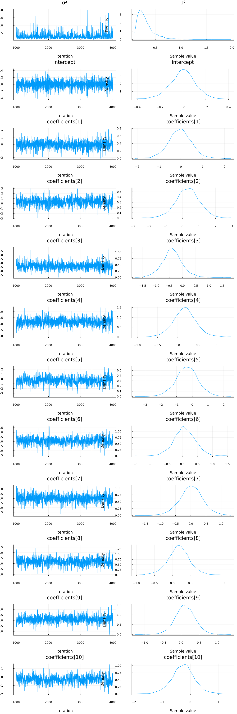

Turing is powerful when applied to complex hierarchical models, but it can also be put to task at common statistical procedures, like [linear regression](https://en.wikipedia.org/wiki/Linear_regression).
This tutorial covers how to implement a linear regression model in Turing.

## Set Up

We begin by importing all the necessary libraries.

```julia
# Import Turing.
using Turing

# Package for loading the data set.
using RDatasets

# Package for visualization.
using StatsPlots

# Functionality for splitting the data.
using MLUtils: splitobs

# Functionality for constructing arrays with identical elements efficiently.
using FillArrays

# Functionality for normalizing the data and evaluating the model predictions.
using StatsBase

# Functionality for working with scaled identity matrices.
using LinearAlgebra

# Set a seed for reproducibility.
using Random
Random.seed!(0);
```


We will use the `mtcars` dataset from the [RDatasets](https://github.com/JuliaStats/RDatasets.jl) package.
`mtcars` contains a variety of statistics on different car models, including their miles per gallon, number of cylinders, and horsepower, among others.

We want to know if we can construct a Bayesian linear regression model to predict the miles per gallon of a car, given the other statistics it has.
Let us take a look at the data we have.

```julia
# Load the dataset.
data = RDatasets.dataset("datasets", "mtcars")

# Show the first six rows of the dataset.
first(data, 6)
```

```
6×12 DataFrame
 Row │ Model              MPG      Cyl    Disp     HP     DRat     WT      
 QS ⋯
     │ String31           Float64  Int64  Float64  Int64  Float64  Float64 
 Fl ⋯
─────┼─────────────────────────────────────────────────────────────────────
─────
   1 │ Mazda RX4             21.0      6    160.0    110     3.9     2.62  
    ⋯
   2 │ Mazda RX4 Wag         21.0      6    160.0    110     3.9     2.875
   3 │ Datsun 710            22.8      4    108.0     93     3.85    2.32
   4 │ Hornet 4 Drive        21.4      6    258.0    110     3.08    3.215
   5 │ Hornet Sportabout     18.7      8    360.0    175     3.15    3.44  
    ⋯
   6 │ Valiant               18.1      6    225.0    105     2.76    3.46
                                                               5 columns om
itted
```


```julia
size(data)
```

```
(32, 12)
```


The next step is to get our data ready for testing. We'll split the `mtcars` dataset into two subsets, one for training our model and one for evaluating our model. Then, we separate the targets we want to learn (`MPG`, in this case) and standardize the datasets by subtracting each column's means and dividing by the standard deviation of that column. The resulting data is not very familiar looking, but this standardization process helps the sampler converge far easier.

```julia
# Remove the model column.
select!(data, Not(:Model))

# Split our dataset 70%/30% into training/test sets.
trainset, testset = map(DataFrame, splitobs(data; at=0.7, shuffle=true))

# Turing requires data in matrix form.
target = :MPG
train = Matrix(select(trainset, Not(target)))
test = Matrix(select(testset, Not(target)))
train_target = trainset[:, target]
test_target = testset[:, target]

# Standardize the features.
dt_features = fit(ZScoreTransform, train; dims=1)
StatsBase.transform!(dt_features, train)
StatsBase.transform!(dt_features, test)

# Standardize the targets.
dt_targets = fit(ZScoreTransform, train_target)
StatsBase.transform!(dt_targets, train_target)
StatsBase.transform!(dt_targets, test_target);
```


## Model Specification

In a traditional frequentist model using [OLS](https://en.wikipedia.org/wiki/Ordinary_least_squares), our model might look like:

$$
\mathrm{MPG}_i = \alpha + \boldsymbol{\beta}^\mathsf{T}\boldsymbol{X_i}
$$

where $\boldsymbol{\beta}$ is a vector of coefficients and $\boldsymbol{X}$ is a vector of inputs for observation $i$. The Bayesian model we are more concerned with is the following:

$$
\mathrm{MPG}_i \sim \mathcal{N}(\alpha + \boldsymbol{\beta}^\mathsf{T}\boldsymbol{X_i}, \sigma^2)
$$

where $\alpha$ is an intercept term common to all observations, $\boldsymbol{\beta}$ is a coefficient vector, $\boldsymbol{X_i}$ is the observed data for car $i$, and $\sigma^2$ is a common variance term.

For $\sigma^2$, we assign a prior of `truncated(Normal(0, 100); lower=0)`.
This is consistent with [Andrew Gelman's recommendations](http://www.stat.columbia.edu/%7Egelman/research/published/taumain.pdf) on noninformative priors for variance.
The intercept term ($\alpha$) is assumed to be normally distributed with a mean of zero and a variance of three.
This represents our assumptions that miles per gallon can be explained mostly by our assorted variables, but a high variance term indicates our uncertainty about that.
Each coefficient is assumed to be normally distributed with a mean of zero and a variance of 10.
We do not know that our coefficients are different from zero, and we don't know which ones are likely to be the most important, so the variance term is quite high.
Lastly, each observation $y_i$ is distributed according to the calculated `mu` term given by $\alpha + \boldsymbol{\beta}^\mathsf{T}\boldsymbol{X_i}$.

```julia
# Bayesian linear regression.
@model function linear_regression(x, y)
    # Set variance prior.
    σ² ~ truncated(Normal(0, 100); lower=0)

    # Set intercept prior.
    intercept ~ Normal(0, sqrt(3))

    # Set the priors on our coefficients.
    nfeatures = size(x, 2)
    coefficients ~ MvNormal(Zeros(nfeatures), 10.0 * I)

    # Calculate all the mu terms.
    mu = intercept .+ x * coefficients
    return y ~ MvNormal(mu, σ² * I)
end
```

```
linear_regression (generic function with 2 methods)
```


With our model specified, we can call the sampler. We will use the No U-Turn Sampler ([NUTS](http://turing.ml/docs/library/#-turingnuts--type)) here.

```julia
model = linear_regression(train, train_target)
chain = sample(model, NUTS(), 3_000)
```

```
Chains MCMC chain (3000×24×1 Array{Float64, 3}):

Iterations        = 1001:1:4000
Number of chains  = 1
Samples per chain = 3000
Wall duration     = 6.3 seconds
Compute duration  = 6.3 seconds
parameters        = σ², intercept, coefficients[1], coefficients[2], coeffi
cients[3], coefficients[4], coefficients[5], coefficients[6], coefficients[
7], coefficients[8], coefficients[9], coefficients[10]
internals         = lp, n_steps, is_accept, acceptance_rate, log_density, h
amiltonian_energy, hamiltonian_energy_error, max_hamiltonian_energy_error, 
tree_depth, numerical_error, step_size, nom_step_size

Summary Statistics
        parameters      mean       std   naive_se      mcse         ess    
  r ⋯
            Symbol   Float64   Float64    Float64   Float64     Float64   F
loa ⋯

                σ²    0.3084    0.1750     0.0032    0.0056    936.9845    
1.0 ⋯
         intercept    0.0011    0.1210     0.0022    0.0024   2862.7607    
1.0 ⋯
   coefficients[1]   -0.0237    0.5481     0.0100    0.0137   1913.8968    
0.9 ⋯
   coefficients[2]    0.2714    0.7075     0.0129    0.0209   1182.7612    
0.9 ⋯
   coefficients[3]   -0.3893    0.3975     0.0073    0.0084   2214.2387    
1.0 ⋯
   coefficients[4]    0.1784    0.2921     0.0053    0.0094   1453.8611    
0.9 ⋯
   coefficients[5]   -0.2860    0.7084     0.0129    0.0247    966.3908    
0.9 ⋯
   coefficients[6]    0.0646    0.3607     0.0066    0.0107   1335.2545    
0.9 ⋯
   coefficients[7]    0.0068    0.3856     0.0070    0.0091   1374.3643    
0.9 ⋯
   coefficients[8]    0.1726    0.3034     0.0055    0.0082   1487.6034    
1.0 ⋯
   coefficients[9]    0.1200    0.2795     0.0051    0.0070   1413.0061    
0.9 ⋯
  coefficients[10]   -0.2817    0.4036     0.0074    0.0141    880.8778    
0.9 ⋯
                                                               2 columns om
itted

Quantiles
        parameters      2.5%     25.0%     50.0%     75.0%     97.5%
            Symbol   Float64   Float64   Float64   Float64   Float64

                σ²    0.1095    0.1949    0.2625    0.3677    0.7854
         intercept   -0.2377   -0.0722    0.0021    0.0739    0.2433
   coefficients[1]   -1.1069   -0.3709   -0.0245    0.3130    1.0966
   coefficients[2]   -1.1437   -0.1643    0.2667    0.7141    1.6685
   coefficients[3]   -1.1653   -0.6434   -0.3810   -0.1447    0.4003
   coefficients[4]   -0.4171    0.0025    0.1815    0.3652    0.7569
   coefficients[5]   -1.6252   -0.7339   -0.2902    0.1601    1.1150
   coefficients[6]   -0.6262   -0.1639    0.0666    0.2854    0.7863
   coefficients[7]   -0.7833   -0.2342    0.0076    0.2481    0.7665
   coefficients[8]   -0.4022   -0.0276    0.1627    0.3602    0.8012
   coefficients[9]   -0.4292   -0.0568    0.1225    0.2935    0.6880
  coefficients[10]   -1.0792   -0.5369   -0.2774   -0.0299    0.5264
```


We can also check the densities and traces of the parameters visually using the `plot` functionality.

```julia
plot(chain)
```




It looks like all parameters have converged.

## Comparing to OLS

A satisfactory test of our model is to evaluate how well it predicts. Importantly, we want to compare our model to existing tools like OLS. The code below uses the [GLM.jl]() package to generate a traditional OLS multiple regression model on the same data as our probabilistic model.

```julia
# Import the GLM package.
using GLM

# Perform multiple regression OLS.
train_with_intercept = hcat(ones(size(train, 1)), train)
ols = lm(train_with_intercept, train_target)

# Compute predictions on the training data set and unstandardize them.
train_prediction_ols = GLM.predict(ols)
StatsBase.reconstruct!(dt_targets, train_prediction_ols)

# Compute predictions on the test data set and unstandardize them.
test_with_intercept = hcat(ones(size(test, 1)), test)
test_prediction_ols = GLM.predict(ols, test_with_intercept)
StatsBase.reconstruct!(dt_targets, test_prediction_ols);
```


The function below accepts a chain and an input matrix and calculates predictions. We use the samples of the model parameters in the chain starting with sample 200, which is where the warm-up period for the NUTS sampler ended.

```julia
# Make a prediction given an input vector.
function prediction(chain, x)
    p = get_params(chain[200:end, :, :])
    targets = p.intercept' .+ x * reduce(hcat, p.coefficients)'
    return vec(mean(targets; dims=2))
end
```

```
prediction (generic function with 1 method)
```


When we make predictions, we unstandardize them so they are more understandable.

```julia
# Calculate the predictions for the training and testing sets and unstandardize them.
train_prediction_bayes = prediction(chain, train)
StatsBase.reconstruct!(dt_targets, train_prediction_bayes)
test_prediction_bayes = prediction(chain, test)
StatsBase.reconstruct!(dt_targets, test_prediction_bayes)

# Show the predictions on the test data set.
DataFrame(; MPG=testset[!, target], Bayes=test_prediction_bayes, OLS=test_prediction_ols)
```

```
10×3 DataFrame
 Row │ MPG      Bayes    OLS
     │ Float64  Float64  Float64
─────┼────────────────────────────
   1 │    19.2  18.1121  18.1265
   2 │    15.0   6.4727   6.37891
   3 │    16.4  14.034   13.883
   4 │    14.3  11.7826  11.7337
   5 │    21.4  25.2335  25.1916
   6 │    18.1  20.7122  20.672
   7 │    19.7  15.9436  15.8408
   8 │    15.2  18.3863  18.3391
   9 │    26.0  28.5231  28.4865
  10 │    17.3  14.6567  14.534
```


Now let's evaluate the loss for each method, and each prediction set. We will use the mean squared error to evaluate loss, given by
$$
\mathrm{MSE} = \frac{1}{n} \sum_{i=1}^n {(y_i - \hat{y_i})^2}
$$
where $y_i$ is the actual value (true MPG) and $\hat{y_i}$ is the predicted value using either OLS or Bayesian linear regression. A lower SSE indicates a closer fit to the data.

```julia
println(
    "Training set:",
    "\n\tBayes loss: ",
    msd(train_prediction_bayes, trainset[!, target]),
    "\n\tOLS loss: ",
    msd(train_prediction_ols, trainset[!, target]),
)

println(
    "Test set:",
    "\n\tBayes loss: ",
    msd(test_prediction_bayes, testset[!, target]),
    "\n\tOLS loss: ",
    msd(test_prediction_ols, testset[!, target]),
)
```

```
Training set:
	Bayes loss: 4.65052654134636
	OLS loss: 4.648142085690516
Test set:
	Bayes loss: 14.496894318145872
	OLS loss: 14.796847779051504
```


As we can see above, OLS and our Bayesian model fit our training and test data set about the same.


## Appendix

These tutorials are a part of the TuringTutorials repository, found at: [https://github.com/TuringLang/TuringTutorials](https://github.com/TuringLang/TuringTutorials).

To locally run this tutorial, do the following commands:

```
using TuringTutorials
TuringTutorials.weave("05-linear-regression", "05_linear-regression.jmd")
```

Computer Information:

```
Julia Version 1.6.7
Commit 3b76b25b64 (2022-07-19 15:11 UTC)
Platform Info:
  OS: Linux (x86_64-pc-linux-gnu)
  CPU: AMD EPYC 7502 32-Core Processor
  WORD_SIZE: 64
  LIBM: libopenlibm
  LLVM: libLLVM-11.0.1 (ORCJIT, znver2)
Environment:
  JULIA_CPU_THREADS = 16
  BUILDKITE_PLUGIN_JULIA_CACHE_DIR = /cache/julia-buildkite-plugin
  JULIA_DEPOT_PATH = /cache/julia-buildkite-plugin/depots/7aa0085e-79a4-45f3-a5bd-9743c91cf3da

```

Package Information:

```
      Status `/cache/build/default-amdci4-2/julialang/turingtutorials/tutorials/05-linear-regression/Project.toml`
  [1a297f60] FillArrays v0.13.6
  [38e38edf] GLM v1.8.1
  [f1d291b0] MLUtils v0.4.0
  [ce6b1742] RDatasets v0.7.7
  [2913bbd2] StatsBase v0.33.21
  [f3b207a7] StatsPlots v0.15.4
  [fce5fe82] Turing v0.22.0
  [37e2e46d] LinearAlgebra
  [9a3f8284] Random
```

And the full manifest:

```
      Status `/cache/build/default-amdci4-2/julialang/turingtutorials/tutorials/05-linear-regression/Manifest.toml`
  [621f4979] AbstractFFTs v1.2.1
  [80f14c24] AbstractMCMC v4.2.0
  [7a57a42e] AbstractPPL v0.5.2
  [1520ce14] AbstractTrees v0.4.3
  [7d9f7c33] Accessors v0.1.23
  [79e6a3ab] Adapt v3.4.0
  [0bf59076] AdvancedHMC v0.3.6
  [5b7e9947] AdvancedMH v0.6.8
  [576499cb] AdvancedPS v0.3.8
  [b5ca4192] AdvancedVI v0.1.6
  [dce04be8] ArgCheck v2.3.0
  [7d9fca2a] Arpack v0.5.4
  [30b0a656] ArrayInterfaceCore v0.1.28
  [dd5226c6] ArrayInterfaceStaticArraysCore v0.1.3
  [13072b0f] AxisAlgorithms v1.0.1
  [39de3d68] AxisArrays v0.4.6
  [198e06fe] BangBang v0.3.37
  [9718e550] Baselet v0.1.1
  [76274a88] Bijectors v0.10.6
  [d1d4a3ce] BitFlags v0.1.7
  [336ed68f] CSV v0.10.7
  [49dc2e85] Calculus v0.5.1
  [324d7699] CategoricalArrays v0.10.7
  [082447d4] ChainRules v1.46.0
  [d360d2e6] ChainRulesCore v1.15.6
  [9e997f8a] ChangesOfVariables v0.1.4
  [aaaa29a8] Clustering v0.14.3
  [944b1d66] CodecZlib v0.7.0
  [35d6a980] ColorSchemes v3.20.0
  [3da002f7] ColorTypes v0.11.4
  [c3611d14] ColorVectorSpace v0.9.9
  [5ae59095] Colors v0.12.10
  [861a8166] Combinatorics v1.0.2
  [38540f10] CommonSolve v0.2.3
  [bbf7d656] CommonSubexpressions v0.3.0
  [34da2185] Compat v4.5.0
  [a33af91c] CompositionsBase v0.1.1
  [88cd18e8] ConsoleProgressMonitor v0.1.2
  [187b0558] ConstructionBase v1.4.1
  [6add18c4] ContextVariablesX v0.1.3
  [d38c429a] Contour v0.6.2
  [a8cc5b0e] Crayons v4.1.1
  [9a962f9c] DataAPI v1.14.0
  [a93c6f00] DataFrames v1.4.4
  [864edb3b] DataStructures v0.18.13
  [e2d170a0] DataValueInterfaces v1.0.0
  [e7dc6d0d] DataValues v0.4.13
  [244e2a9f] DefineSingletons v0.1.2
  [b429d917] DensityInterface v0.4.0
  [163ba53b] DiffResults v1.1.0
  [b552c78f] DiffRules v1.12.2
  [b4f34e82] Distances v0.10.7
  [31c24e10] Distributions v0.25.79
  [ced4e74d] DistributionsAD v0.6.43
  [ffbed154] DocStringExtensions v0.9.3
  [fa6b7ba4] DualNumbers v0.6.8
  [366bfd00] DynamicPPL v0.21.3
  [cad2338a] EllipticalSliceSampling v1.0.0
  [4e289a0a] EnumX v1.0.4
  [e2ba6199] ExprTools v0.1.8
  [c87230d0] FFMPEG v0.4.1
  [7a1cc6ca] FFTW v1.5.0
  [cc61a311] FLoops v0.2.1
  [b9860ae5] FLoopsBase v0.1.1
  [5789e2e9] FileIO v1.16.0
  [48062228] FilePathsBase v0.9.20
  [1a297f60] FillArrays v0.13.6
  [53c48c17] FixedPointNumbers v0.8.4
  [9c68100b] FoldsThreads v0.1.1
  [59287772] Formatting v0.4.2
  [f6369f11] ForwardDiff v0.10.34
  [069b7b12] FunctionWrappers v1.1.3
  [77dc65aa] FunctionWrappersWrappers v0.1.1
  [d9f16b24] Functors v0.3.0
  [38e38edf] GLM v1.8.1
  [46192b85] GPUArraysCore v0.1.2
  [28b8d3ca] GR v0.71.2
  [42e2da0e] Grisu v1.0.2
  [cd3eb016] HTTP v1.6.2
  [34004b35] HypergeometricFunctions v0.3.11
  [7869d1d1] IRTools v0.4.7
  [83e8ac13] IniFile v0.5.1
  [22cec73e] InitialValues v0.3.1
  [842dd82b] InlineStrings v1.3.2
  [505f98c9] InplaceOps v0.3.0
  [a98d9a8b] Interpolations v0.14.7
  [8197267c] IntervalSets v0.7.4
  [3587e190] InverseFunctions v0.1.8
  [41ab1584] InvertedIndices v1.2.0
  [92d709cd] IrrationalConstants v0.1.1
  [c8e1da08] IterTools v1.4.0
  [82899510] IteratorInterfaceExtensions v1.0.0
  [1019f520] JLFzf v0.1.5
  [692b3bcd] JLLWrappers v1.4.1
  [682c06a0] JSON v0.21.3
  [b14d175d] JuliaVariables v0.2.4
  [5ab0869b] KernelDensity v0.6.5
  [8ac3fa9e] LRUCache v1.4.0
  [b964fa9f] LaTeXStrings v1.3.0
  [23fbe1c1] Latexify v0.15.17
  [1d6d02ad] LeftChildRightSiblingTrees v0.2.0
  [6f1fad26] Libtask v0.7.0
  [6fdf6af0] LogDensityProblems v1.0.3
  [2ab3a3ac] LogExpFunctions v0.3.19
  [e6f89c97] LoggingExtras v0.4.9
  [c7f686f2] MCMCChains v5.6.1
  [be115224] MCMCDiagnosticTools v0.2.1
  [e80e1ace] MLJModelInterface v1.8.0
  [d8e11817] MLStyle v0.4.16
  [f1d291b0] MLUtils v0.4.0
  [1914dd2f] MacroTools v0.5.10
  [dbb5928d] MappedArrays v0.4.1
  [739be429] MbedTLS v1.1.7
  [442fdcdd] Measures v0.3.2
  [128add7d] MicroCollections v0.1.3
  [e1d29d7a] Missings v1.1.0
  [78c3b35d] Mocking v0.7.5
  [6f286f6a] MultivariateStats v0.10.0
  [872c559c] NNlib v0.8.12
  [77ba4419] NaNMath v1.0.1
  [71a1bf82] NameResolution v0.1.5
  [86f7a689] NamedArrays v0.9.6
  [c020b1a1] NaturalSort v1.0.0
  [b8a86587] NearestNeighbors v0.4.13
  [510215fc] Observables v0.5.4
  [6fe1bfb0] OffsetArrays v1.12.8
  [4d8831e6] OpenSSL v1.3.2
  [3bd65402] Optimisers v0.2.14
  [bac558e1] OrderedCollections v1.4.1
  [90014a1f] PDMats v0.11.16
  [69de0a69] Parsers v2.5.2
  [b98c9c47] Pipe v1.3.0
  [ccf2f8ad] PlotThemes v3.1.0
  [995b91a9] PlotUtils v1.3.2
  [91a5bcdd] Plots v1.38.0
  [2dfb63ee] PooledArrays v1.4.2
  [21216c6a] Preferences v1.3.0
  [8162dcfd] PrettyPrint v0.2.0
  [08abe8d2] PrettyTables v2.2.2
  [33c8b6b6] ProgressLogging v0.1.4
  [92933f4c] ProgressMeter v1.7.2
  [1fd47b50] QuadGK v2.6.0
  [df47a6cb] RData v0.8.3
  [ce6b1742] RDatasets v0.7.7
  [b3c3ace0] RangeArrays v0.3.2
  [c84ed2f1] Ratios v0.4.3
  [c1ae055f] RealDot v0.1.0
  [3cdcf5f2] RecipesBase v1.3.2
  [01d81517] RecipesPipeline v0.6.11
  [731186ca] RecursiveArrayTools v2.34.1
  [189a3867] Reexport v1.2.2
  [05181044] RelocatableFolders v1.0.0
  [ae029012] Requires v1.3.0
  [79098fc4] Rmath v0.7.0
  [f2b01f46] Roots v2.0.8
  [7e49a35a] RuntimeGeneratedFunctions v0.5.5
  [0bca4576] SciMLBase v1.81.0
  [30f210dd] ScientificTypesBase v3.0.0
  [6c6a2e73] Scratch v1.1.1
  [91c51154] SentinelArrays v1.3.16
  [efcf1570] Setfield v0.8.2
  [1277b4bf] ShiftedArrays v2.0.0
  [605ecd9f] ShowCases v0.1.0
  [992d4aef] Showoff v1.0.3
  [777ac1f9] SimpleBufferStream v1.1.0
  [699a6c99] SimpleTraits v0.9.4
  [66db9d55] SnoopPrecompile v1.0.1
  [a2af1166] SortingAlgorithms v1.1.0
  [276daf66] SpecialFunctions v2.1.7
  [171d559e] SplittablesBase v0.1.15
  [90137ffa] StaticArrays v1.5.12
  [1e83bf80] StaticArraysCore v1.4.0
  [64bff920] StatisticalTraits v3.2.0
  [82ae8749] StatsAPI v1.5.0
  [2913bbd2] StatsBase v0.33.21
  [4c63d2b9] StatsFuns v1.1.1
  [3eaba693] StatsModels v0.6.33
  [f3b207a7] StatsPlots v0.15.4
  [892a3eda] StringManipulation v0.3.0
  [09ab397b] StructArrays v0.6.14
  [2efcf032] SymbolicIndexingInterface v0.2.1
  [ab02a1b2] TableOperations v1.2.0
  [3783bdb8] TableTraits v1.0.1
  [bd369af6] Tables v1.10.0
  [62fd8b95] TensorCore v0.1.1
  [5d786b92] TerminalLoggers v0.1.6
  [f269a46b] TimeZones v1.9.1
  [9f7883ad] Tracker v0.2.22
  [3bb67fe8] TranscodingStreams v0.9.10
  [28d57a85] Transducers v0.4.75
  [fce5fe82] Turing v0.22.0
  [5c2747f8] URIs v1.4.1
  [3a884ed6] UnPack v1.0.2
  [1cfade01] UnicodeFun v0.4.1
  [41fe7b60] Unzip v0.1.2
  [ea10d353] WeakRefStrings v1.4.2
  [cc8bc4a8] Widgets v0.6.6
  [efce3f68] WoodburyMatrices v0.5.5
  [700de1a5] ZygoteRules v0.2.2
  [68821587] Arpack_jll v3.5.0+3
  [6e34b625] Bzip2_jll v1.0.8+0
  [83423d85] Cairo_jll v1.16.1+1
  [2e619515] Expat_jll v2.4.8+0
  [b22a6f82] FFMPEG_jll v4.4.2+2
  [f5851436] FFTW_jll v3.3.10+0
  [a3f928ae] Fontconfig_jll v2.13.93+0
  [d7e528f0] FreeType2_jll v2.10.4+0
  [559328eb] FriBidi_jll v1.0.10+0
  [0656b61e] GLFW_jll v3.3.8+0
  [d2c73de3] GR_jll v0.71.2+0
  [78b55507] Gettext_jll v0.21.0+0
  [7746bdde] Glib_jll v2.74.0+2
  [3b182d85] Graphite2_jll v1.3.14+0
  [2e76f6c2] HarfBuzz_jll v2.8.1+1
  [1d5cc7b8] IntelOpenMP_jll v2018.0.3+2
  [aacddb02] JpegTurbo_jll v2.1.2+0
  [c1c5ebd0] LAME_jll v3.100.1+0
  [88015f11] LERC_jll v3.0.0+1
  [dd4b983a] LZO_jll v2.10.1+0
  [e9f186c6] Libffi_jll v3.2.2+1
  [d4300ac3] Libgcrypt_jll v1.8.7+0
  [7e76a0d4] Libglvnd_jll v1.6.0+0
  [7add5ba3] Libgpg_error_jll v1.42.0+0
  [94ce4f54] Libiconv_jll v1.16.1+2
  [4b2f31a3] Libmount_jll v2.35.0+0
  [89763e89] Libtiff_jll v4.4.0+0
  [38a345b3] Libuuid_jll v2.36.0+0
  [856f044c] MKL_jll v2022.2.0+0
  [e7412a2a] Ogg_jll v1.3.5+1
  [458c3c95] OpenSSL_jll v1.1.19+0
  [efe28fd5] OpenSpecFun_jll v0.5.5+0
  [91d4177d] Opus_jll v1.3.2+0
  [30392449] Pixman_jll v0.40.1+0
  [ea2cea3b] Qt5Base_jll v5.15.3+2
  [f50d1b31] Rmath_jll v0.3.0+0
  [a2964d1f] Wayland_jll v1.21.0+0
  [2381bf8a] Wayland_protocols_jll v1.25.0+0
  [02c8fc9c] XML2_jll v2.10.3+0
  [aed1982a] XSLT_jll v1.1.34+0
  [4f6342f7] Xorg_libX11_jll v1.6.9+4
  [0c0b7dd1] Xorg_libXau_jll v1.0.9+4
  [935fb764] Xorg_libXcursor_jll v1.2.0+4
  [a3789734] Xorg_libXdmcp_jll v1.1.3+4
  [1082639a] Xorg_libXext_jll v1.3.4+4
  [d091e8ba] Xorg_libXfixes_jll v5.0.3+4
  [a51aa0fd] Xorg_libXi_jll v1.7.10+4
  [d1454406] Xorg_libXinerama_jll v1.1.4+4
  [ec84b674] Xorg_libXrandr_jll v1.5.2+4
  [ea2f1a96] Xorg_libXrender_jll v0.9.10+4
  [14d82f49] Xorg_libpthread_stubs_jll v0.1.0+3
  [c7cfdc94] Xorg_libxcb_jll v1.13.0+3
  [cc61e674] Xorg_libxkbfile_jll v1.1.0+4
  [12413925] Xorg_xcb_util_image_jll v0.4.0+1
  [2def613f] Xorg_xcb_util_jll v0.4.0+1
  [975044d2] Xorg_xcb_util_keysyms_jll v0.4.0+1
  [0d47668e] Xorg_xcb_util_renderutil_jll v0.3.9+1
  [c22f9ab0] Xorg_xcb_util_wm_jll v0.4.1+1
  [35661453] Xorg_xkbcomp_jll v1.4.2+4
  [33bec58e] Xorg_xkeyboard_config_jll v2.27.0+4
  [c5fb5394] Xorg_xtrans_jll v1.4.0+3
  [3161d3a3] Zstd_jll v1.5.2+0
  [214eeab7] fzf_jll v0.29.0+0
  [a4ae2306] libaom_jll v3.4.0+0
  [0ac62f75] libass_jll v0.15.1+0
  [f638f0a6] libfdk_aac_jll v2.0.2+0
  [b53b4c65] libpng_jll v1.6.38+0
  [f27f6e37] libvorbis_jll v1.3.7+1
  [1270edf5] x264_jll v2021.5.5+0
  [dfaa095f] x265_jll v3.5.0+0
  [d8fb68d0] xkbcommon_jll v1.4.1+0
  [0dad84c5] ArgTools
  [56f22d72] Artifacts
  [2a0f44e3] Base64
  [ade2ca70] Dates
  [8bb1440f] DelimitedFiles
  [8ba89e20] Distributed
  [f43a241f] Downloads
  [9fa8497b] Future
  [b77e0a4c] InteractiveUtils
  [4af54fe1] LazyArtifacts
  [b27032c2] LibCURL
  [76f85450] LibGit2
  [8f399da3] Libdl
  [37e2e46d] LinearAlgebra
  [56ddb016] Logging
  [d6f4376e] Markdown
  [a63ad114] Mmap
  [ca575930] NetworkOptions
  [44cfe95a] Pkg
  [de0858da] Printf
  [3fa0cd96] REPL
  [9a3f8284] Random
  [ea8e919c] SHA
  [9e88b42a] Serialization
  [1a1011a3] SharedArrays
  [6462fe0b] Sockets
  [2f01184e] SparseArrays
  [10745b16] Statistics
  [4607b0f0] SuiteSparse
  [fa267f1f] TOML
  [a4e569a6] Tar
  [8dfed614] Test
  [cf7118a7] UUIDs
  [4ec0a83e] Unicode
  [e66e0078] CompilerSupportLibraries_jll
  [deac9b47] LibCURL_jll
  [29816b5a] LibSSH2_jll
  [c8ffd9c3] MbedTLS_jll
  [14a3606d] MozillaCACerts_jll
  [4536629a] OpenBLAS_jll
  [05823500] OpenLibm_jll
  [efcefdf7] PCRE2_jll
  [83775a58] Zlib_jll
  [8e850ede] nghttp2_jll
  [3f19e933] p7zip_jll
```

