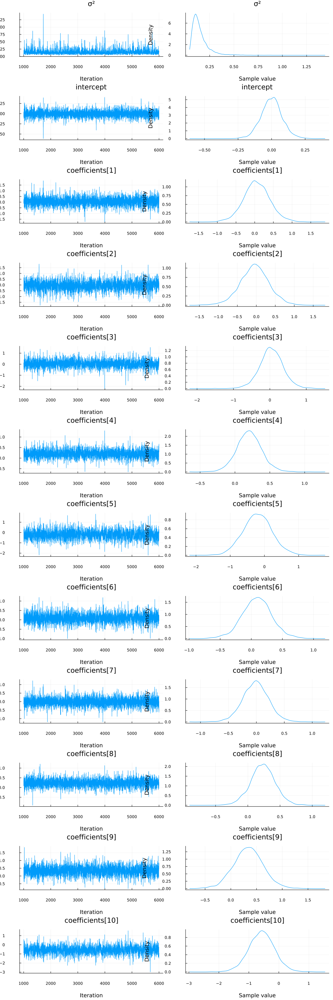

Turing is powerful when applied to complex hierarchical models, but it can also be put to task at common statistical procedures, like [linear regression](https://en.wikipedia.org/wiki/Linear_regression). This tutorial covers how to implement a linear regression model in Turing.

## Set Up

We begin by importing all the necessary libraries.

```julia
# Import Turing and Distributions.
using Turing, Distributions

# Import RDatasets.
using RDatasets

# Import MCMCChains, Plots, and StatPlots for visualizations and diagnostics.
using MCMCChains, Plots, StatsPlots

# Functionality for splitting and normalizing the data.
using MLDataUtils: shuffleobs, splitobs, rescale!

# Functionality for evaluating the model predictions.
using Distances

# Set a seed for reproducibility.
using Random
Random.seed!(0)

# Hide the progress prompt while sampling.
Turing.setprogress!(false);
```


We will use the `mtcars` dataset from the [RDatasets](https://github.com/johnmyleswhite/RDatasets.jl) package. `mtcars` contains a variety of statistics on different car models, including their miles per gallon, number of cylinders, and horsepower, among others.

We want to know if we can construct a Bayesian linear regression model to predict the miles per gallon of a car, given the other statistics it has. Lets take a look at the data we have.

```julia
# Import the "Default" dataset.
data = RDatasets.dataset("datasets", "mtcars");

# Show the first six rows of the dataset.
first(data, 6)
```

```
6×12 DataFrame
 Row │ Model              MPG      Cyl    Disp     HP     DRat     WT      
 QS ⋯
     │ String31           Float64  Int64  Float64  Int64  Float64  Float64 
 Fl ⋯
─────┼─────────────────────────────────────────────────────────────────────
─────
   1 │ Mazda RX4             21.0      6    160.0    110     3.9     2.62  
    ⋯
   2 │ Mazda RX4 Wag         21.0      6    160.0    110     3.9     2.875
   3 │ Datsun 710            22.8      4    108.0     93     3.85    2.32
   4 │ Hornet 4 Drive        21.4      6    258.0    110     3.08    3.215
   5 │ Hornet Sportabout     18.7      8    360.0    175     3.15    3.44  
    ⋯
   6 │ Valiant               18.1      6    225.0    105     2.76    3.46
                                                               5 columns om
itted
```


```julia
size(data)
```

```
(32, 12)
```


The next step is to get our data ready for testing. We'll split the `mtcars` dataset into two subsets, one for training our model and one for evaluating our model. Then, we separate the targets we want to learn (`MPG`, in this case) and standardize the datasets by subtracting each column's means and dividing by the standard deviation of that column. The resulting data is not very familiar looking, but this standardization process helps the sampler converge far easier.

```julia
# Remove the model column.
select!(data, Not(:Model))

# Split our dataset 70%/30% into training/test sets.
trainset, testset = splitobs(shuffleobs(data), 0.7)

# Turing requires data in matrix form.
target = :MPG
train = Matrix(select(trainset, Not(target)))
test = Matrix(select(testset, Not(target)))
train_target = trainset[:, target]
test_target = testset[:, target]

# Standardize the features.
μ, σ = rescale!(train; obsdim=1)
rescale!(test, μ, σ; obsdim=1)

# Standardize the targets.
μtarget, σtarget = rescale!(train_target; obsdim=1)
rescale!(test_target, μtarget, σtarget; obsdim=1);
```


## Model Specification

In a traditional frequentist model using [OLS](https://en.wikipedia.org/wiki/Ordinary_least_squares), our model might look like:

$$
\mathrm{MPG}_i = \alpha + \boldsymbol{\beta}^\mathsf{T}\boldsymbol{X_i}
$$

where $\boldsymbol{\beta}$ is a vector of coefficients and $\boldsymbol{X}$ is a vector of inputs for observation $i$. The Bayesian model we are more concerned with is the following:

$$
\mathrm{MPG}_i \sim \mathcal{N}(\alpha + \boldsymbol{\beta}^\mathsf{T}\boldsymbol{X_i}, \sigma^2)
$$

where $\alpha$ is an intercept term common to all observations, $\boldsymbol{\beta}$ is a coefficient vector, $\boldsymbol{X_i}$ is the observed data for car $i$, and $\sigma^2$ is a common variance term.

For $\sigma^2$, we assign a prior of `truncated(Normal(0, 100), 0, Inf)`. This is consistent with [Andrew Gelman's recommendations](http://www.stat.columbia.edu/%7Egelman/research/published/taumain.pdf) on noninformative priors for variance. The intercept term ($\alpha$) is assumed to be normally distributed with a mean of zero and a variance of three. This represents our assumptions that miles per gallon can be explained mostly by our assorted variables, but a high variance term indicates our uncertainty about that. Each coefficient is assumed to be normally distributed with a mean of zero and a variance of 10. We do not know that our coefficients are different from zero, and we don't know which ones are likely to be the most important, so the variance term is quite high. Lastly, each observation $y_i$ is distributed according to the calculated `mu` term given by $\alpha + \boldsymbol{\beta}^\mathsf{T}\boldsymbol{X_i}$.

```julia
# Bayesian linear regression.
@model function linear_regression(x, y)
    # Set variance prior.
    σ₂ ~ truncated(Normal(0, 100), 0, Inf)

    # Set intercept prior.
    intercept ~ Normal(0, sqrt(3))

    # Set the priors on our coefficients.
    nfeatures = size(x, 2)
    coefficients ~ MvNormal(nfeatures, sqrt(10))

    # Calculate all the mu terms.
    mu = intercept .+ x * coefficients
    return y ~ MvNormal(mu, sqrt(σ₂))
end
```

```
linear_regression (generic function with 2 methods)
```


With our model specified, we can call the sampler. We will use the No U-Turn Sampler ([NUTS](http://turing.ml/docs/library/#-turingnuts--type)) here.

```julia
model = linear_regression(train, train_target)
chain = sample(model, NUTS(0.65), 3_000);
```


As a visual check to confirm that our coefficients have converged, we show the densities and trace plots for our parameters using the `plot` functionality.

```julia
plot(chain)
```




It looks like each of our parameters has converged. We can check our numerical esimates using `describe(chain)`, as below.

```julia
describe(chain)
```

```
2-element Vector{MCMCChains.ChainDataFrame}:
 Summary Statistics (12 x 8)
 Quantiles (12 x 6)
```


## Comparing to OLS

A satisfactory test of our model is to evaluate how well it predicts. Importantly, we want to compare our model to existing tools like OLS. The code below uses the [GLM.jl]() package to generate a traditional OLS multiple regression model on the same data as our probabilistic model.

```julia
# Import the GLM package.
using GLM

# Perform multiple regression OLS.
train_with_intercept = hcat(ones(size(train, 1)), train)
ols = lm(train_with_intercept, train_target)

# Compute predictions on the training data set
# and unstandardize them.
p = GLM.predict(ols)
train_prediction_ols = μtarget .+ σtarget .* p

# Compute predictions on the test data set
# and unstandardize them.
test_with_intercept = hcat(ones(size(test, 1)), test)
p = GLM.predict(ols, test_with_intercept)
test_prediction_ols = μtarget .+ σtarget .* p;
```


The function below accepts a chain and an input matrix and calculates predictions. We use the samples of the model parameters in the chain starting with sample 200, which is where the warm-up period for the NUTS sampler ended.

```julia
# Make a prediction given an input vector.
function prediction(chain, x)
    p = get_params(chain[200:end, :, :])
    targets = p.intercept' .+ x * reduce(hcat, p.coefficients)'
    return vec(mean(targets; dims=2))
end
```

```
prediction (generic function with 1 method)
```


When we make predictions, we unstandardize them so they are more understandable.

```julia
# Calculate the predictions for the training and testing sets
# and unstandardize them.
p = prediction(chain, train)
train_prediction_bayes = μtarget .+ σtarget .* p
p = prediction(chain, test)
test_prediction_bayes = μtarget .+ σtarget .* p

# Show the predictions on the test data set.
DataFrame(; MPG=testset[!, target], Bayes=test_prediction_bayes, OLS=test_prediction_ols)
```

```
10×3 DataFrame
 Row │ MPG      Bayes     OLS
     │ Float64  Float64   Float64
─────┼─────────────────────────────
   1 │    19.2  18.2018   18.1265
   2 │    15.0   6.11481   6.37891
   3 │    16.4  14.0115   13.883
   4 │    14.3  11.5931   11.7337
   5 │    21.4  25.2662   25.1916
   6 │    18.1  20.6593   20.672
   7 │    19.7  15.7532   15.8408
   8 │    15.2  18.382    18.3391
   9 │    26.0  28.6003   28.4865
  10 │    17.3  14.5752   14.534
```


Now let's evaluate the loss for each method, and each prediction set. We will use the mean squared error to evaluate loss, given by
$$
\mathrm{MSE} = \frac{1}{n} \sum_{i=1}^n {(y_i - \hat{y_i})^2}
$$
where $y_i$ is the actual value (true MPG) and $\hat{y_i}$ is the predicted value using either OLS or Bayesian linear regression. A lower SSE indicates a closer fit to the data.

```julia
println(
    "Training set:",
    "\n\tBayes loss: ",
    msd(train_prediction_bayes, trainset[!, target]),
    "\n\tOLS loss: ",
    msd(train_prediction_ols, trainset[!, target]),
)

println(
    "Test set:",
    "\n\tBayes loss: ",
    msd(test_prediction_bayes, testset[!, target]),
    "\n\tOLS loss: ",
    msd(test_prediction_ols, testset[!, target]),
)
```

```
Training set:
	Bayes loss: 4.651234142170903
	OLS loss: 4.648142085690521
Test set:
	Bayes loss: 15.436086458335751
	OLS loss: 14.796847779051523
```


As we can see above, OLS and our Bayesian model fit our training and test data set about the same.


## Appendix

These tutorials are a part of the TuringTutorials repository, found at: [https://github.com/TuringLang/TuringTutorials](https://github.com/TuringLang/TuringTutorials).

To locally run this tutorial, do the following commands:

```
using TuringTutorials
TuringTutorials.weave("05-linear-regression", "05_linear-regression.jmd")
```

Computer Information:

```
Julia Version 1.6.5
Commit 9058264a69 (2021-12-19 12:30 UTC)
Platform Info:
  OS: Linux (x86_64-pc-linux-gnu)
  CPU: AMD EPYC 7502 32-Core Processor
  WORD_SIZE: 64
  LIBM: libopenlibm
  LLVM: libLLVM-11.0.1 (ORCJIT, znver2)
Environment:
  JULIA_CPU_THREADS = 16
  BUILDKITE_PLUGIN_JULIA_CACHE_DIR = /cache/julia-buildkite-plugin
  JULIA_DEPOT_PATH = /cache/julia-buildkite-plugin/depots/7aa0085e-79a4-45f3-a5bd-9743c91cf3da

```

Package Information:

```
      Status `/cache/build/default-amdci4-5/julialang/turingtutorials/tutorials/05-linear-regression/Project.toml`
  [a93c6f00] DataFrames v1.3.2
  [b4f34e82] Distances v0.10.7
  [31c24e10] Distributions v0.25.49
  [5789e2e9] FileIO v1.13.0
  [38e38edf] GLM v1.6.1
  [c7f686f2] MCMCChains v5.0.3
  [cc2ba9b6] MLDataUtils v0.5.4
  [872c559c] NNlib v0.7.34
  [91a5bcdd] Plots v1.25.11
  [ce6b1742] RDatasets v0.7.7
  [4c63d2b9] StatsFuns v0.9.16
  [f3b207a7] StatsPlots v0.14.33
  [fce5fe82] Turing v0.18.0
  [9a3f8284] Random
```

And the full manifest:

```
      Status `/cache/build/default-amdci4-5/julialang/turingtutorials/tutorials/05-linear-regression/Manifest.toml`
  [621f4979] AbstractFFTs v1.1.0
  [80f14c24] AbstractMCMC v3.2.1
  [7a57a42e] AbstractPPL v0.2.0
  [1520ce14] AbstractTrees v0.3.4
  [79e6a3ab] Adapt v3.3.3
  [0bf59076] AdvancedHMC v0.3.3
  [5b7e9947] AdvancedMH v0.6.6
  [576499cb] AdvancedPS v0.2.4
  [b5ca4192] AdvancedVI v0.1.3
  [dce04be8] ArgCheck v2.3.0
  [7d9fca2a] Arpack v0.5.3
  [4fba245c] ArrayInterface v4.0.3
  [13072b0f] AxisAlgorithms v1.0.1
  [39de3d68] AxisArrays v0.4.4
  [198e06fe] BangBang v0.3.35
  [9718e550] Baselet v0.1.1
  [76274a88] Bijectors v0.9.11
  [336ed68f] CSV v0.10.2
  [49dc2e85] Calculus v0.5.1
  [324d7699] CategoricalArrays v0.10.2
  [082447d4] ChainRules v1.27.0
  [d360d2e6] ChainRulesCore v1.12.1
  [9e997f8a] ChangesOfVariables v0.1.2
  [aaaa29a8] Clustering v0.14.2
  [944b1d66] CodecZlib v0.7.0
  [35d6a980] ColorSchemes v3.17.1
  [3da002f7] ColorTypes v0.11.0
  [5ae59095] Colors v0.12.8
  [861a8166] Combinatorics v1.0.2
  [38540f10] CommonSolve v0.2.0
  [bbf7d656] CommonSubexpressions v0.3.0
  [34da2185] Compat v3.41.0
  [a33af91c] CompositionsBase v0.1.1
  [88cd18e8] ConsoleProgressMonitor v0.1.2
  [187b0558] ConstructionBase v1.3.0
  [d38c429a] Contour v0.5.7
  [a8cc5b0e] Crayons v4.1.1
  [9a962f9c] DataAPI v1.9.0
  [a93c6f00] DataFrames v1.3.2
  [864edb3b] DataStructures v0.18.11
  [e2d170a0] DataValueInterfaces v1.0.0
  [e7dc6d0d] DataValues v0.4.13
  [244e2a9f] DefineSingletons v0.1.2
  [b429d917] DensityInterface v0.4.0
  [163ba53b] DiffResults v1.0.3
  [b552c78f] DiffRules v1.10.0
  [b4f34e82] Distances v0.10.7
  [31c24e10] Distributions v0.25.49
  [ced4e74d] DistributionsAD v0.6.37
  [ffbed154] DocStringExtensions v0.8.6
  [fa6b7ba4] DualNumbers v0.6.6
  [366bfd00] DynamicPPL v0.15.1
  [da5c29d0] EllipsisNotation v1.3.0
  [cad2338a] EllipticalSliceSampling v0.4.6
  [e2ba6199] ExprTools v0.1.8
  [c87230d0] FFMPEG v0.4.1
  [7a1cc6ca] FFTW v1.4.5
  [5789e2e9] FileIO v1.13.0
  [48062228] FilePathsBase v0.9.17
  [1a297f60] FillArrays v0.12.8
  [53c48c17] FixedPointNumbers v0.8.4
  [59287772] Formatting v0.4.2
  [f6369f11] ForwardDiff v0.10.25
  [d9f16b24] Functors v0.2.8
  [38e38edf] GLM v1.6.1
  [28b8d3ca] GR v0.64.0
  [5c1252a2] GeometryBasics v0.4.1
  [42e2da0e] Grisu v1.0.2
  [cd3eb016] HTTP v0.9.17
  [34004b35] HypergeometricFunctions v0.3.8
  [615f187c] IfElse v0.1.1
  [83e8ac13] IniFile v0.5.0
  [22cec73e] InitialValues v0.3.1
  [842dd82b] InlineStrings v1.1.2
  [505f98c9] InplaceOps v0.3.0
  [a98d9a8b] Interpolations v0.13.5
  [8197267c] IntervalSets v0.5.3
  [3587e190] InverseFunctions v0.1.2
  [41ab1584] InvertedIndices v1.1.0
  [92d709cd] IrrationalConstants v0.1.1
  [c8e1da08] IterTools v1.4.0
  [82899510] IteratorInterfaceExtensions v1.0.0
  [692b3bcd] JLLWrappers v1.4.1
  [682c06a0] JSON v0.21.3
  [5ab0869b] KernelDensity v0.6.3
  [b964fa9f] LaTeXStrings v1.3.0
  [23fbe1c1] Latexify v0.15.11
  [7f8f8fb0] LearnBase v0.3.0
  [1d6d02ad] LeftChildRightSiblingTrees v0.1.3
  [6f1fad26] Libtask v0.5.3
  [2ab3a3ac] LogExpFunctions v0.3.6
  [e6f89c97] LoggingExtras v0.4.7
  [c7f686f2] MCMCChains v5.0.3
  [be115224] MCMCDiagnosticTools v0.1.3
  [9920b226] MLDataPattern v0.5.4
  [cc2ba9b6] MLDataUtils v0.5.4
  [e80e1ace] MLJModelInterface v1.3.6
  [66a33bbf] MLLabelUtils v0.5.7
  [1914dd2f] MacroTools v0.5.9
  [dbb5928d] MappedArrays v0.4.1
  [739be429] MbedTLS v1.0.3
  [442fdcdd] Measures v0.3.1
  [128add7d] MicroCollections v0.1.2
  [e1d29d7a] Missings v1.0.2
  [78c3b35d] Mocking v0.7.3
  [6f286f6a] MultivariateStats v0.9.0
  [872c559c] NNlib v0.7.34
  [77ba4419] NaNMath v0.3.7
  [86f7a689] NamedArrays v0.9.6
  [c020b1a1] NaturalSort v1.0.0
  [b8a86587] NearestNeighbors v0.4.9
  [510215fc] Observables v0.4.0
  [6fe1bfb0] OffsetArrays v1.10.8
  [bac558e1] OrderedCollections v1.4.1
  [90014a1f] PDMats v0.11.5
  [69de0a69] Parsers v2.2.2
  [ccf2f8ad] PlotThemes v2.0.1
  [995b91a9] PlotUtils v1.1.3
  [91a5bcdd] Plots v1.25.11
  [2dfb63ee] PooledArrays v1.4.0
  [21216c6a] Preferences v1.2.3
  [08abe8d2] PrettyTables v1.3.1
  [33c8b6b6] ProgressLogging v0.1.4
  [92933f4c] ProgressMeter v1.7.1
  [1fd47b50] QuadGK v2.4.2
  [df47a6cb] RData v0.8.3
  [ce6b1742] RDatasets v0.7.7
  [b3c3ace0] RangeArrays v0.3.2
  [c84ed2f1] Ratios v0.4.2
  [c1ae055f] RealDot v0.1.0
  [3cdcf5f2] RecipesBase v1.2.1
  [01d81517] RecipesPipeline v0.5.0
  [189a3867] Reexport v1.2.2
  [05181044] RelocatableFolders v0.1.3
  [ae029012] Requires v1.3.0
  [79098fc4] Rmath v0.7.0
  [f2b01f46] Roots v1.3.14
  [30f210dd] ScientificTypesBase v3.0.0
  [6c6a2e73] Scratch v1.1.0
  [91c51154] SentinelArrays v1.3.12
  [efcf1570] Setfield v0.8.2
  [1277b4bf] ShiftedArrays v1.0.0
  [992d4aef] Showoff v1.0.3
  [a2af1166] SortingAlgorithms v1.0.1
  [276daf66] SpecialFunctions v1.8.3
  [171d559e] SplittablesBase v0.1.14
  [aedffcd0] Static v0.5.5
  [90137ffa] StaticArrays v1.3.5
  [64bff920] StatisticalTraits v3.0.0
  [82ae8749] StatsAPI v1.2.1
  [2913bbd2] StatsBase v0.33.16
  [4c63d2b9] StatsFuns v0.9.16
  [3eaba693] StatsModels v0.6.28
  [f3b207a7] StatsPlots v0.14.33
  [09ab397b] StructArrays v0.6.5
  [ab02a1b2] TableOperations v1.2.0
  [3783bdb8] TableTraits v1.0.1
  [bd369af6] Tables v1.6.1
  [5d786b92] TerminalLoggers v0.1.5
  [f269a46b] TimeZones v1.7.1
  [9f7883ad] Tracker v0.2.19
  [3bb67fe8] TranscodingStreams v0.9.6
  [28d57a85] Transducers v0.4.72
  [fce5fe82] Turing v0.18.0
  [5c2747f8] URIs v1.3.0
  [3a884ed6] UnPack v1.0.2
  [1cfade01] UnicodeFun v0.4.1
  [41fe7b60] Unzip v0.1.2
  [ea10d353] WeakRefStrings v1.4.1
  [cc8bc4a8] Widgets v0.6.5
  [efce3f68] WoodburyMatrices v0.5.5
  [700de1a5] ZygoteRules v0.2.2
  [68821587] Arpack_jll v3.5.0+3
  [6e34b625] Bzip2_jll v1.0.8+0
  [83423d85] Cairo_jll v1.16.1+1
  [5ae413db] EarCut_jll v2.2.3+0
  [2e619515] Expat_jll v2.4.4+0
  [b22a6f82] FFMPEG_jll v4.4.0+0
  [f5851436] FFTW_jll v3.3.10+0
  [a3f928ae] Fontconfig_jll v2.13.93+0
  [d7e528f0] FreeType2_jll v2.10.4+0
  [559328eb] FriBidi_jll v1.0.10+0
  [0656b61e] GLFW_jll v3.3.6+0
  [d2c73de3] GR_jll v0.64.0+0
  [78b55507] Gettext_jll v0.21.0+0
  [7746bdde] Glib_jll v2.68.3+2
  [3b182d85] Graphite2_jll v1.3.14+0
  [2e76f6c2] HarfBuzz_jll v2.8.1+1
  [1d5cc7b8] IntelOpenMP_jll v2018.0.3+2
  [aacddb02] JpegTurbo_jll v2.1.2+0
  [c1c5ebd0] LAME_jll v3.100.1+0
  [dd4b983a] LZO_jll v2.10.1+0
  [e9f186c6] Libffi_jll v3.2.2+1
  [d4300ac3] Libgcrypt_jll v1.8.7+0
  [7e76a0d4] Libglvnd_jll v1.3.0+3
  [7add5ba3] Libgpg_error_jll v1.42.0+0
  [94ce4f54] Libiconv_jll v1.16.1+1
  [4b2f31a3] Libmount_jll v2.35.0+0
  [3ae2931a] Libtask_jll v0.4.3+0
  [89763e89] Libtiff_jll v4.3.0+0
  [38a345b3] Libuuid_jll v2.36.0+0
  [856f044c] MKL_jll v2021.1.1+2
  [e7412a2a] Ogg_jll v1.3.5+1
  [458c3c95] OpenSSL_jll v1.1.13+0
  [efe28fd5] OpenSpecFun_jll v0.5.5+0
  [91d4177d] Opus_jll v1.3.2+0
  [2f80f16e] PCRE_jll v8.44.0+0
  [30392449] Pixman_jll v0.40.1+0
  [ea2cea3b] Qt5Base_jll v5.15.3+0
  [f50d1b31] Rmath_jll v0.3.0+0
  [a2964d1f] Wayland_jll v1.19.0+0
  [2381bf8a] Wayland_protocols_jll v1.23.0+0
  [02c8fc9c] XML2_jll v2.9.12+0
  [aed1982a] XSLT_jll v1.1.34+0
  [4f6342f7] Xorg_libX11_jll v1.6.9+4
  [0c0b7dd1] Xorg_libXau_jll v1.0.9+4
  [935fb764] Xorg_libXcursor_jll v1.2.0+4
  [a3789734] Xorg_libXdmcp_jll v1.1.3+4
  [1082639a] Xorg_libXext_jll v1.3.4+4
  [d091e8ba] Xorg_libXfixes_jll v5.0.3+4
  [a51aa0fd] Xorg_libXi_jll v1.7.10+4
  [d1454406] Xorg_libXinerama_jll v1.1.4+4
  [ec84b674] Xorg_libXrandr_jll v1.5.2+4
  [ea2f1a96] Xorg_libXrender_jll v0.9.10+4
  [14d82f49] Xorg_libpthread_stubs_jll v0.1.0+3
  [c7cfdc94] Xorg_libxcb_jll v1.13.0+3
  [cc61e674] Xorg_libxkbfile_jll v1.1.0+4
  [12413925] Xorg_xcb_util_image_jll v0.4.0+1
  [2def613f] Xorg_xcb_util_jll v0.4.0+1
  [975044d2] Xorg_xcb_util_keysyms_jll v0.4.0+1
  [0d47668e] Xorg_xcb_util_renderutil_jll v0.3.9+1
  [c22f9ab0] Xorg_xcb_util_wm_jll v0.4.1+1
  [35661453] Xorg_xkbcomp_jll v1.4.2+4
  [33bec58e] Xorg_xkeyboard_config_jll v2.27.0+4
  [c5fb5394] Xorg_xtrans_jll v1.4.0+3
  [3161d3a3] Zstd_jll v1.5.2+0
  [0ac62f75] libass_jll v0.15.1+0
  [f638f0a6] libfdk_aac_jll v2.0.2+0
  [b53b4c65] libpng_jll v1.6.38+0
  [f27f6e37] libvorbis_jll v1.3.7+1
  [1270edf5] x264_jll v2021.5.5+0
  [dfaa095f] x265_jll v3.5.0+0
  [d8fb68d0] xkbcommon_jll v0.9.1+5
  [0dad84c5] ArgTools
  [56f22d72] Artifacts
  [2a0f44e3] Base64
  [ade2ca70] Dates
  [8bb1440f] DelimitedFiles
  [8ba89e20] Distributed
  [f43a241f] Downloads
  [9fa8497b] Future
  [b77e0a4c] InteractiveUtils
  [4af54fe1] LazyArtifacts
  [b27032c2] LibCURL
  [76f85450] LibGit2
  [8f399da3] Libdl
  [37e2e46d] LinearAlgebra
  [56ddb016] Logging
  [d6f4376e] Markdown
  [a63ad114] Mmap
  [ca575930] NetworkOptions
  [44cfe95a] Pkg
  [de0858da] Printf
  [3fa0cd96] REPL
  [9a3f8284] Random
  [ea8e919c] SHA
  [9e88b42a] Serialization
  [1a1011a3] SharedArrays
  [6462fe0b] Sockets
  [2f01184e] SparseArrays
  [10745b16] Statistics
  [4607b0f0] SuiteSparse
  [fa267f1f] TOML
  [a4e569a6] Tar
  [8dfed614] Test
  [cf7118a7] UUIDs
  [4ec0a83e] Unicode
  [e66e0078] CompilerSupportLibraries_jll
  [deac9b47] LibCURL_jll
  [29816b5a] LibSSH2_jll
  [c8ffd9c3] MbedTLS_jll
  [14a3606d] MozillaCACerts_jll
  [4536629a] OpenBLAS_jll
  [05823500] OpenLibm_jll
  [83775a58] Zlib_jll
  [8e850ede] nghttp2_jll
  [3f19e933] p7zip_jll
```

