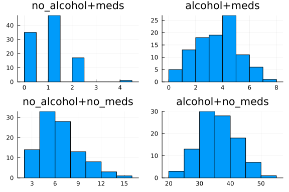

This notebook is ported from the [example notebook](https://docs.pymc.io/notebooks/GLM-poisson-regression.html) of PyMC3 on Poisson Regression.

[Poisson Regression](https://en.wikipedia.org/wiki/Poisson_regression) is a technique commonly used to model count data. Some of the applications include predicting the number of people defaulting on their loans or the number of cars running on a highway on a given day. This example describes a method to implement the Bayesian version of this technique using Turing.

We will generate the dataset that we will be working on which describes the relationship between number of times a person sneezes during the day with his alcohol consumption and medicinal intake.

We start by importing the required libraries.

```julia
#Import Turing, Distributions and DataFrames
using Turing, Distributions, DataFrames, Distributed

# Import MCMCChain, Plots, and StatsPlots for visualizations and diagnostics.
using MCMCChains, Plots, StatsPlots

# Set a seed for reproducibility.
using Random
Random.seed!(12);

# Turn off progress monitor.
Turing.setprogress!(false)
```

```
false
```


# Generating data

We start off by creating a toy dataset. We take the case of a person who takes medicine to prevent excessive sneezing. Alcohol consumption increases the rate of sneezing for that person. Thus, the two factors affecting the number of sneezes in a given day are alcohol consumption and whether the person has taken his medicine. Both these variable are taken as boolean valued while the number of sneezes will be a count valued variable. We also take into consideration that the interaction between the two boolean variables will affect the number of sneezes

5 random rows are printed from the generated data to get a gist of the data generated.

```julia
theta_noalcohol_meds = 1    # no alcohol, took medicine
theta_alcohol_meds = 3      # alcohol, took medicine
theta_noalcohol_nomeds = 6  # no alcohol, no medicine
theta_alcohol_nomeds = 36   # alcohol, no medicine

# no of samples for each of the above cases
q = 100

#Generate data from different Poisson distributions
noalcohol_meds = Poisson(theta_noalcohol_meds)
alcohol_meds = Poisson(theta_alcohol_meds)
noalcohol_nomeds = Poisson(theta_noalcohol_nomeds)
alcohol_nomeds = Poisson(theta_alcohol_nomeds)

nsneeze_data = vcat(
    rand(noalcohol_meds, q),
    rand(alcohol_meds, q),
    rand(noalcohol_nomeds, q),
    rand(alcohol_nomeds, q),
)
alcohol_data = vcat(zeros(q), ones(q), zeros(q), ones(q))
meds_data = vcat(zeros(q), zeros(q), ones(q), ones(q))

df = DataFrame(;
    nsneeze=nsneeze_data,
    alcohol_taken=alcohol_data,
    nomeds_taken=meds_data,
    product_alcohol_meds=meds_data .* alcohol_data,
)
df[sample(1:nrow(df), 5; replace=false), :]
```

```
5×4 DataFrame
 Row │ nsneeze  alcohol_taken  nomeds_taken  product_alcohol_meds
     │ Int64    Float64        Float64       Float64
─────┼────────────────────────────────────────────────────────────
   1 │       3            1.0           0.0                   0.0
   2 │       3            0.0           0.0                   0.0
   3 │       7            0.0           1.0                   0.0
   4 │       3            1.0           0.0                   0.0
   5 │       2            0.0           0.0                   0.0
```


# Visualisation of the dataset

We plot the distribution of the number of sneezes for the 4 different cases taken above. As expected, the person sneezes the most when he has taken alcohol and not taken his medicine. He sneezes the least when he doesn't consume alcohol and takes his medicine.

```julia
#Data Plotting

p1 = Plots.histogram(
    df[(df[:, :alcohol_taken] .== 0) .& (df[:, :nomeds_taken] .== 0), 1];
    title="no_alcohol+meds",
)
p2 = Plots.histogram(
    (df[(df[:, :alcohol_taken] .== 1) .& (df[:, :nomeds_taken] .== 0), 1]);
    title="alcohol+meds",
)
p3 = Plots.histogram(
    (df[(df[:, :alcohol_taken] .== 0) .& (df[:, :nomeds_taken] .== 1), 1]);
    title="no_alcohol+no_meds",
)
p4 = Plots.histogram(
    (df[(df[:, :alcohol_taken] .== 1) .& (df[:, :nomeds_taken] .== 1), 1]);
    title="alcohol+no_meds",
)
plot(p1, p2, p3, p4; layout=(2, 2), legend=false)
```




We must convert our `DataFrame` data into the `Matrix` form as the manipulations that we are about are designed to work with `Matrix` data. We also separate the features from the labels which will be later used by the Turing sampler to generate samples from the posterior.

```julia
# Convert the DataFrame object to matrices.
data = Matrix(df[:, [:alcohol_taken, :nomeds_taken, :product_alcohol_meds]])
data_labels = df[:, :nsneeze]
data
```

```
400×3 Matrix{Float64}:
 0.0  0.0  0.0
 0.0  0.0  0.0
 0.0  0.0  0.0
 0.0  0.0  0.0
 0.0  0.0  0.0
 0.0  0.0  0.0
 0.0  0.0  0.0
 0.0  0.0  0.0
 0.0  0.0  0.0
 0.0  0.0  0.0
 ⋮         
 1.0  1.0  1.0
 1.0  1.0  1.0
 1.0  1.0  1.0
 1.0  1.0  1.0
 1.0  1.0  1.0
 1.0  1.0  1.0
 1.0  1.0  1.0
 1.0  1.0  1.0
 1.0  1.0  1.0
```


We must recenter our data about 0 to help the Turing sampler in initialising the parameter estimates. So, normalising the data in each column by subtracting the mean and dividing by the standard deviation:

```julia
# # Rescale our matrices.
data = (data .- mean(data; dims=1)) ./ std(data; dims=1)
```

```
400×3 Matrix{Float64}:
 -0.998749  -0.998749  -0.576628
 -0.998749  -0.998749  -0.576628
 -0.998749  -0.998749  -0.576628
 -0.998749  -0.998749  -0.576628
 -0.998749  -0.998749  -0.576628
 -0.998749  -0.998749  -0.576628
 -0.998749  -0.998749  -0.576628
 -0.998749  -0.998749  -0.576628
 -0.998749  -0.998749  -0.576628
 -0.998749  -0.998749  -0.576628
  ⋮                    
  0.998749   0.998749   1.72988
  0.998749   0.998749   1.72988
  0.998749   0.998749   1.72988
  0.998749   0.998749   1.72988
  0.998749   0.998749   1.72988
  0.998749   0.998749   1.72988
  0.998749   0.998749   1.72988
  0.998749   0.998749   1.72988
  0.998749   0.998749   1.72988
```


# Declaring the Model: Poisson Regression

Our model, `poisson_regression` takes four arguments:

  - `x` is our set of independent variables;
  - `y` is the element we want to predict;
  - `n` is the number of observations we have; and
  - `σ²` is the standard deviation we want to assume for our priors.

Within the model, we create four coefficients (`b0`, `b1`, `b2`, and `b3`) and assign a prior of normally distributed with means of zero and standard deviations of `σ²`. We want to find values of these four coefficients to predict any given `y`.

Intuitively, we can think of the coefficients as:

  - `b1` is the coefficient which represents the effect of taking alcohol on the number of sneezes;
  - `b2` is the coefficient which represents the effect of taking in no medicines on the number of sneezes;
  - `b3` is the coefficient which represents the effect of interaction between taking alcohol and no medicine on the number of sneezes;

The `for` block creates a variable `theta` which is the weighted combination of the input features. We have defined the priors on these weights above. We then observe the likelihood of calculating `theta` given the actual label, `y[i]`.

```julia
# Bayesian poisson regression (LR)
@model function poisson_regression(x, y, n, σ²)
    b0 ~ Normal(0, σ²)
    b1 ~ Normal(0, σ²)
    b2 ~ Normal(0, σ²)
    b3 ~ Normal(0, σ²)
    for i in 1:n
        theta = b0 + b1 * x[i, 1] + b2 * x[i, 2] + b3 * x[i, 3]
        y[i] ~ Poisson(exp(theta))
    end
end;
```


# Sampling from the posterior

We use the `NUTS` sampler to sample values from the posterior. We run multiple chains using the `MCMCThreads()` function to nullify the effect of a problematic chain. We then use the Gelman, Rubin, and Brooks Diagnostic to check the convergence of these multiple chains.

```julia
# Retrieve the number of observations.
n, _ = size(data)

# Sample using NUTS.

num_chains = 4
m = poisson_regression(data, data_labels, n, 10)
chain = sample(m, NUTS(200, 0.65), MCMCThreads(), 2_500, num_chains; discard_adapt=false)
```

```
Chains MCMC chain (2500×16×4 Array{Float64, 3}):

Iterations        = 1:1:2500
Number of chains  = 4
Samples per chain = 2500
Wall duration     = 8.65 seconds
Compute duration  = 8.35 seconds
parameters        = b0, b1, b2, b3
internals         = lp, n_steps, is_accept, acceptance_rate, log_density, h
amiltonian_energy, hamiltonian_energy_error, max_hamiltonian_energy_error, 
tree_depth, numerical_error, step_size, nom_step_size

Summary Statistics
  parameters      mean       std   naive_se      mcse        ess      rhat 
  e ⋯
      Symbol   Float64   Float64    Float64   Float64    Float64   Float64 
    ⋯

          b0    1.6313    0.1518     0.0015    0.0088   235.7648    1.0115 
    ⋯
          b1    0.5496    0.0925     0.0009    0.0052   242.8889    1.0150 
    ⋯
          b2    0.8848    0.1099     0.0011    0.0075   162.1375    1.0208 
    ⋯
          b3    0.2969    0.1033     0.0010    0.0050   396.4411    1.0120 
    ⋯
                                                                1 column om
itted

Quantiles
  parameters      2.5%     25.0%     50.0%     75.0%     97.5%
      Symbol   Float64   Float64   Float64   Float64   Float64

          b0    1.5770    1.6223    1.6430    1.6635    1.7028
          b1    0.4364    0.5111    0.5491    0.5869    0.6730
          b2    0.7732    0.8429    0.8783    0.9144    0.9950
          b3    0.1831    0.2587    0.2934    0.3300    0.4003
```


# Viewing the Diagnostics

We use the Gelman, Rubin, and Brooks Diagnostic to check whether our chains have converged. Note that we require multiple chains to use this diagnostic which analyses the difference between these multiple chains.

We expect the chains to have converged. This is because we have taken sufficient number of iterations (1500) for the NUTS sampler. However, in case the test fails, then we will have to take a larger number of iterations, resulting in longer computation time.

```julia
gelmandiag(chain)
```

```
Gelman, Rubin, and Brooks diagnostic
  parameters      psrf    psrfci
      Symbol   Float64   Float64

          b0    1.1787    1.2356
          b1    1.0343    1.0574
          b2    1.1943    1.3218
          b3    1.0813    1.1067
```


From the above diagnostic, we can conclude that the chains have converged because the PSRF values of the coefficients are close to 1.

So, we have obtained the posterior distributions of the parameters. We transform the coefficients and recover theta values by taking the exponent of the meaned values of the coefficients `b0`, `b1`, `b2` and `b3`. We take the exponent of the means to get a better comparison of the relative values of the coefficients. We then compare this with the intuitive meaning that was described earlier.

```julia
# Taking the first chain
c1 = chain[:, :, 1]

# Calculating the exponentiated means
b0_exp = exp(mean(c1[:b0]))
b1_exp = exp(mean(c1[:b1]))
b2_exp = exp(mean(c1[:b2]))
b3_exp = exp(mean(c1[:b3]))

print("The exponent of the meaned values of the weights (or coefficients are): \n")
println("b0: ", b0_exp)
println("b1: ", b1_exp)
println("b2: ", b2_exp)
println("b3: ", b3_exp)
print("The posterior distributions obtained after sampling can be visualised as :\n")
```

```
The exponent of the meaned values of the weights (or coefficients are): 
b0: 5.162963380481074
b1: 1.729974010078183
b2: 2.408331691827242
b3: 1.343819380971721
The posterior distributions obtained after sampling can be visualised as :
```


Visualising the posterior by plotting it:

```julia
plot(chain)
```


# Interpreting the Obtained Mean Values

The exponentiated mean of the coefficient `b1` is roughly half of that of `b2`. This makes sense because in the data that we generated, the number of sneezes was more sensitive to the medicinal intake as compared to the alcohol consumption. We also get a weaker dependence on the interaction between the alcohol consumption and the medicinal intake as can be seen from the value of `b3`.

# Removing the Warmup Samples

As can be seen from the plots above, the parameters converge to their final distributions after a few iterations.
The initial values during the warmup phase increase the standard deviations of the parameters and are not required after we get the desired distributions.
Thus, we remove these warmup values and once again view the diagnostics.
To remove these warmup values, we take all values except the first 200.
This is because we set the second parameter of the NUTS sampler (which is the number of adaptations) to be equal to 200.

```julia
chains_new = chain[201:end, :, :]
```

```
Chains MCMC chain (2300×16×4 Array{Float64, 3}):

Iterations        = 201:1:2500
Number of chains  = 4
Samples per chain = 2300
Wall duration     = 8.65 seconds
Compute duration  = 8.35 seconds
parameters        = b0, b1, b2, b3
internals         = lp, n_steps, is_accept, acceptance_rate, log_density, h
amiltonian_energy, hamiltonian_energy_error, max_hamiltonian_energy_error, 
tree_depth, numerical_error, step_size, nom_step_size

Summary Statistics
  parameters      mean       std   naive_se      mcse         ess      rhat
    ⋯
      Symbol   Float64   Float64    Float64   Float64     Float64   Float64
    ⋯

          b0    1.6434    0.0301     0.0003    0.0005   3383.8935    1.0003
    ⋯
          b1    0.5488    0.0560     0.0006    0.0011   2305.7218    1.0014
    ⋯
          b2    0.8789    0.0523     0.0005    0.0010   2380.5917    1.0016
    ⋯
          b3    0.2937    0.0518     0.0005    0.0010   2301.1872    1.0015
    ⋯
                                                                1 column om
itted

Quantiles
  parameters      2.5%     25.0%     50.0%     75.0%     97.5%
      Symbol   Float64   Float64   Float64   Float64   Float64

          b0    1.5846    1.6233    1.6435    1.6636    1.7021
          b1    0.4407    0.5112    0.5485    0.5853    0.6603
          b2    0.7796    0.8430    0.8778    0.9131    0.9850
          b3    0.1900    0.2596    0.2938    0.3296    0.3938
```


```julia
plot(chains_new)
```


As can be seen from the numeric values and the plots above, the standard deviation values have decreased and all the plotted values are from the estimated posteriors. The exponentiated mean values, with the warmup samples removed, have not changed by much and they are still in accordance with their intuitive meanings as described earlier.


## Appendix

These tutorials are a part of the TuringTutorials repository, found at: [https://github.com/TuringLang/TuringTutorials](https://github.com/TuringLang/TuringTutorials).

To locally run this tutorial, do the following commands:

```
using TuringTutorials
TuringTutorials.weave("07-poisson-regression", "07_poisson-regression.jmd")
```

Computer Information:

```
Julia Version 1.6.7
Commit 3b76b25b64 (2022-07-19 15:11 UTC)
Platform Info:
  OS: Linux (x86_64-pc-linux-gnu)
  CPU: Intel(R) Xeon(R) Platinum 8275CL CPU @ 3.00GHz
  WORD_SIZE: 64
  LIBM: libopenlibm
  LLVM: libLLVM-11.0.1 (ORCJIT, cascadelake)
Environment:
  JULIA_CPU_THREADS = 96
  BUILDKITE_PLUGIN_JULIA_CACHE_DIR = /cache/julia-buildkite-plugin
  JULIA_DEPOT_PATH = /cache/julia-buildkite-plugin/depots/7aa0085e-79a4-45f3-a5bd-9743c91cf3da

```

Package Information:

```
      Status `/cache/build/default-aws-vms-1/julialang/turingtutorials/tutorials/07-poisson-regression/Project.toml`
  [a93c6f00] DataFrames v1.4.4
  [b4f34e82] Distances v0.10.7
  [31c24e10] Distributions v0.25.79
  [38e38edf] GLM v1.8.1
  [c7f686f2] MCMCChains v5.6.1
  [cc2ba9b6] MLDataUtils v0.5.4
  [872c559c] NNlib v0.8.12
  [91a5bcdd] Plots v1.38.0
  [ce6b1742] RDatasets v0.7.7
  [4c63d2b9] StatsFuns v1.1.1
  [f3b207a7] StatsPlots v0.15.4
  [fce5fe82] Turing v0.22.0
  [9a3f8284] Random
```

And the full manifest:

```
      Status `/cache/build/default-aws-vms-1/julialang/turingtutorials/tutorials/07-poisson-regression/Manifest.toml`
  [621f4979] AbstractFFTs v1.2.1
  [80f14c24] AbstractMCMC v4.2.0
  [7a57a42e] AbstractPPL v0.5.2
  [1520ce14] AbstractTrees v0.4.3
  [79e6a3ab] Adapt v3.4.0
  [0bf59076] AdvancedHMC v0.3.6
  [5b7e9947] AdvancedMH v0.6.8
  [576499cb] AdvancedPS v0.3.8
  [b5ca4192] AdvancedVI v0.1.6
  [dce04be8] ArgCheck v2.3.0
  [7d9fca2a] Arpack v0.5.4
  [30b0a656] ArrayInterfaceCore v0.1.28
  [dd5226c6] ArrayInterfaceStaticArraysCore v0.1.3
  [13072b0f] AxisAlgorithms v1.0.1
  [39de3d68] AxisArrays v0.4.6
  [198e06fe] BangBang v0.3.37
  [9718e550] Baselet v0.1.1
  [76274a88] Bijectors v0.10.6
  [d1d4a3ce] BitFlags v0.1.7
  [336ed68f] CSV v0.10.8
  [49dc2e85] Calculus v0.5.1
  [324d7699] CategoricalArrays v0.10.7
  [082447d4] ChainRules v1.46.0
  [d360d2e6] ChainRulesCore v1.15.6
  [9e997f8a] ChangesOfVariables v0.1.4
  [aaaa29a8] Clustering v0.14.3
  [944b1d66] CodecZlib v0.7.0
  [35d6a980] ColorSchemes v3.20.0
  [3da002f7] ColorTypes v0.11.4
  [c3611d14] ColorVectorSpace v0.9.9
  [5ae59095] Colors v0.12.10
  [861a8166] Combinatorics v1.0.2
  [38540f10] CommonSolve v0.2.3
  [bbf7d656] CommonSubexpressions v0.3.0
  [34da2185] Compat v4.5.0
  [a33af91c] CompositionsBase v0.1.1
  [88cd18e8] ConsoleProgressMonitor v0.1.2
  [187b0558] ConstructionBase v1.4.1
  [d38c429a] Contour v0.6.2
  [a8cc5b0e] Crayons v4.1.1
  [9a962f9c] DataAPI v1.14.0
  [a93c6f00] DataFrames v1.4.4
  [864edb3b] DataStructures v0.18.13
  [e2d170a0] DataValueInterfaces v1.0.0
  [e7dc6d0d] DataValues v0.4.13
  [244e2a9f] DefineSingletons v0.1.2
  [b429d917] DensityInterface v0.4.0
  [163ba53b] DiffResults v1.1.0
  [b552c78f] DiffRules v1.12.2
  [b4f34e82] Distances v0.10.7
  [31c24e10] Distributions v0.25.79
  [ced4e74d] DistributionsAD v0.6.43
  [ffbed154] DocStringExtensions v0.9.3
  [fa6b7ba4] DualNumbers v0.6.8
  [366bfd00] DynamicPPL v0.21.3
  [cad2338a] EllipticalSliceSampling v1.0.0
  [4e289a0a] EnumX v1.0.4
  [e2ba6199] ExprTools v0.1.8
  [c87230d0] FFMPEG v0.4.1
  [7a1cc6ca] FFTW v1.5.0
  [5789e2e9] FileIO v1.16.0
  [48062228] FilePathsBase v0.9.20
  [1a297f60] FillArrays v0.13.6
  [53c48c17] FixedPointNumbers v0.8.4
  [59287772] Formatting v0.4.2
  [f6369f11] ForwardDiff v0.10.34
  [069b7b12] FunctionWrappers v1.1.3
  [77dc65aa] FunctionWrappersWrappers v0.1.1
  [d9f16b24] Functors v0.3.0
  [38e38edf] GLM v1.8.1
  [46192b85] GPUArraysCore v0.1.2
  [28b8d3ca] GR v0.71.2
  [42e2da0e] Grisu v1.0.2
  [cd3eb016] HTTP v1.6.2
  [34004b35] HypergeometricFunctions v0.3.11
  [7869d1d1] IRTools v0.4.7
  [83e8ac13] IniFile v0.5.1
  [22cec73e] InitialValues v0.3.1
  [842dd82b] InlineStrings v1.3.2
  [505f98c9] InplaceOps v0.3.0
  [a98d9a8b] Interpolations v0.14.7
  [8197267c] IntervalSets v0.7.4
  [3587e190] InverseFunctions v0.1.8
  [41ab1584] InvertedIndices v1.2.0
  [92d709cd] IrrationalConstants v0.1.1
  [c8e1da08] IterTools v1.4.0
  [82899510] IteratorInterfaceExtensions v1.0.0
  [1019f520] JLFzf v0.1.5
  [692b3bcd] JLLWrappers v1.4.1
  [682c06a0] JSON v0.21.3
  [5ab0869b] KernelDensity v0.6.5
  [8ac3fa9e] LRUCache v1.4.0
  [b964fa9f] LaTeXStrings v1.3.0
  [23fbe1c1] Latexify v0.15.17
  [7f8f8fb0] LearnBase v0.3.0
  [1d6d02ad] LeftChildRightSiblingTrees v0.2.0
  [6f1fad26] Libtask v0.7.0
  [6fdf6af0] LogDensityProblems v1.0.3
  [2ab3a3ac] LogExpFunctions v0.3.19
  [e6f89c97] LoggingExtras v0.4.9
  [c7f686f2] MCMCChains v5.6.1
  [be115224] MCMCDiagnosticTools v0.2.1
  [9920b226] MLDataPattern v0.5.4
  [cc2ba9b6] MLDataUtils v0.5.4
  [e80e1ace] MLJModelInterface v1.8.0
  [66a33bbf] MLLabelUtils v0.5.7
  [1914dd2f] MacroTools v0.5.10
  [dbb5928d] MappedArrays v0.4.1
  [739be429] MbedTLS v1.1.7
  [442fdcdd] Measures v0.3.2
  [128add7d] MicroCollections v0.1.3
  [e1d29d7a] Missings v1.1.0
  [78c3b35d] Mocking v0.7.5
  [6f286f6a] MultivariateStats v0.10.0
  [872c559c] NNlib v0.8.12
  [77ba4419] NaNMath v1.0.1
  [86f7a689] NamedArrays v0.9.6
  [c020b1a1] NaturalSort v1.0.0
  [b8a86587] NearestNeighbors v0.4.13
  [510215fc] Observables v0.5.4
  [6fe1bfb0] OffsetArrays v1.12.8
  [4d8831e6] OpenSSL v1.3.2
  [3bd65402] Optimisers v0.2.14
  [bac558e1] OrderedCollections v1.4.1
  [90014a1f] PDMats v0.11.16
  [69de0a69] Parsers v2.5.2
  [b98c9c47] Pipe v1.3.0
  [ccf2f8ad] PlotThemes v3.1.0
  [995b91a9] PlotUtils v1.3.2
  [91a5bcdd] Plots v1.38.0
  [2dfb63ee] PooledArrays v1.4.2
  [21216c6a] Preferences v1.3.0
  [08abe8d2] PrettyTables v2.2.2
  [33c8b6b6] ProgressLogging v0.1.4
  [92933f4c] ProgressMeter v1.7.2
  [1fd47b50] QuadGK v2.6.0
  [df47a6cb] RData v0.8.3
  [ce6b1742] RDatasets v0.7.7
  [b3c3ace0] RangeArrays v0.3.2
  [c84ed2f1] Ratios v0.4.3
  [c1ae055f] RealDot v0.1.0
  [3cdcf5f2] RecipesBase v1.3.2
  [01d81517] RecipesPipeline v0.6.11
  [731186ca] RecursiveArrayTools v2.34.1
  [189a3867] Reexport v1.2.2
  [05181044] RelocatableFolders v1.0.0
  [ae029012] Requires v1.3.0
  [79098fc4] Rmath v0.7.0
  [f2b01f46] Roots v2.0.8
  [7e49a35a] RuntimeGeneratedFunctions v0.5.5
  [0bca4576] SciMLBase v1.81.0
  [30f210dd] ScientificTypesBase v3.0.0
  [6c6a2e73] Scratch v1.1.1
  [91c51154] SentinelArrays v1.3.16
  [efcf1570] Setfield v0.8.2
  [1277b4bf] ShiftedArrays v2.0.0
  [992d4aef] Showoff v1.0.3
  [777ac1f9] SimpleBufferStream v1.1.0
  [66db9d55] SnoopPrecompile v1.0.1
  [a2af1166] SortingAlgorithms v1.1.0
  [276daf66] SpecialFunctions v2.1.7
  [171d559e] SplittablesBase v0.1.15
  [90137ffa] StaticArrays v1.5.12
  [1e83bf80] StaticArraysCore v1.4.0
  [64bff920] StatisticalTraits v3.2.0
  [82ae8749] StatsAPI v1.5.0
  [2913bbd2] StatsBase v0.33.21
  [4c63d2b9] StatsFuns v1.1.1
  [3eaba693] StatsModels v0.6.33
  [f3b207a7] StatsPlots v0.15.4
  [892a3eda] StringManipulation v0.3.0
  [09ab397b] StructArrays v0.6.14
  [2efcf032] SymbolicIndexingInterface v0.2.1
  [ab02a1b2] TableOperations v1.2.0
  [3783bdb8] TableTraits v1.0.1
  [bd369af6] Tables v1.10.0
  [62fd8b95] TensorCore v0.1.1
  [5d786b92] TerminalLoggers v0.1.6
  [f269a46b] TimeZones v1.9.1
  [9f7883ad] Tracker v0.2.22
  [3bb67fe8] TranscodingStreams v0.9.10
  [28d57a85] Transducers v0.4.75
  [fce5fe82] Turing v0.22.0
  [5c2747f8] URIs v1.4.1
  [3a884ed6] UnPack v1.0.2
  [1cfade01] UnicodeFun v0.4.1
  [41fe7b60] Unzip v0.1.2
  [ea10d353] WeakRefStrings v1.4.2
  [cc8bc4a8] Widgets v0.6.6
  [efce3f68] WoodburyMatrices v0.5.5
  [76eceee3] WorkerUtilities v1.6.1
  [700de1a5] ZygoteRules v0.2.2
  [68821587] Arpack_jll v3.5.0+3
  [6e34b625] Bzip2_jll v1.0.8+0
  [83423d85] Cairo_jll v1.16.1+1
  [2e619515] Expat_jll v2.4.8+0
  [b22a6f82] FFMPEG_jll v4.4.2+2
  [f5851436] FFTW_jll v3.3.10+0
  [a3f928ae] Fontconfig_jll v2.13.93+0
  [d7e528f0] FreeType2_jll v2.10.4+0
  [559328eb] FriBidi_jll v1.0.10+0
  [0656b61e] GLFW_jll v3.3.8+0
  [d2c73de3] GR_jll v0.71.2+0
  [78b55507] Gettext_jll v0.21.0+0
  [7746bdde] Glib_jll v2.74.0+2
  [3b182d85] Graphite2_jll v1.3.14+0
  [2e76f6c2] HarfBuzz_jll v2.8.1+1
  [1d5cc7b8] IntelOpenMP_jll v2018.0.3+2
  [aacddb02] JpegTurbo_jll v2.1.2+0
  [c1c5ebd0] LAME_jll v3.100.1+0
  [88015f11] LERC_jll v3.0.0+1
  [dd4b983a] LZO_jll v2.10.1+0
  [e9f186c6] Libffi_jll v3.2.2+1
  [d4300ac3] Libgcrypt_jll v1.8.7+0
  [7e76a0d4] Libglvnd_jll v1.6.0+0
  [7add5ba3] Libgpg_error_jll v1.42.0+0
  [94ce4f54] Libiconv_jll v1.16.1+2
  [4b2f31a3] Libmount_jll v2.35.0+0
  [89763e89] Libtiff_jll v4.4.0+0
  [38a345b3] Libuuid_jll v2.36.0+0
  [856f044c] MKL_jll v2022.2.0+0
  [e7412a2a] Ogg_jll v1.3.5+1
  [458c3c95] OpenSSL_jll v1.1.19+0
  [efe28fd5] OpenSpecFun_jll v0.5.5+0
  [91d4177d] Opus_jll v1.3.2+0
  [30392449] Pixman_jll v0.40.1+0
  [ea2cea3b] Qt5Base_jll v5.15.3+2
  [f50d1b31] Rmath_jll v0.3.0+0
  [a2964d1f] Wayland_jll v1.21.0+0
  [2381bf8a] Wayland_protocols_jll v1.25.0+0
  [02c8fc9c] XML2_jll v2.10.3+0
  [aed1982a] XSLT_jll v1.1.34+0
  [4f6342f7] Xorg_libX11_jll v1.6.9+4
  [0c0b7dd1] Xorg_libXau_jll v1.0.9+4
  [935fb764] Xorg_libXcursor_jll v1.2.0+4
  [a3789734] Xorg_libXdmcp_jll v1.1.3+4
  [1082639a] Xorg_libXext_jll v1.3.4+4
  [d091e8ba] Xorg_libXfixes_jll v5.0.3+4
  [a51aa0fd] Xorg_libXi_jll v1.7.10+4
  [d1454406] Xorg_libXinerama_jll v1.1.4+4
  [ec84b674] Xorg_libXrandr_jll v1.5.2+4
  [ea2f1a96] Xorg_libXrender_jll v0.9.10+4
  [14d82f49] Xorg_libpthread_stubs_jll v0.1.0+3
  [c7cfdc94] Xorg_libxcb_jll v1.13.0+3
  [cc61e674] Xorg_libxkbfile_jll v1.1.0+4
  [12413925] Xorg_xcb_util_image_jll v0.4.0+1
  [2def613f] Xorg_xcb_util_jll v0.4.0+1
  [975044d2] Xorg_xcb_util_keysyms_jll v0.4.0+1
  [0d47668e] Xorg_xcb_util_renderutil_jll v0.3.9+1
  [c22f9ab0] Xorg_xcb_util_wm_jll v0.4.1+1
  [35661453] Xorg_xkbcomp_jll v1.4.2+4
  [33bec58e] Xorg_xkeyboard_config_jll v2.27.0+4
  [c5fb5394] Xorg_xtrans_jll v1.4.0+3
  [3161d3a3] Zstd_jll v1.5.2+0
  [214eeab7] fzf_jll v0.29.0+0
  [a4ae2306] libaom_jll v3.4.0+0
  [0ac62f75] libass_jll v0.15.1+0
  [f638f0a6] libfdk_aac_jll v2.0.2+0
  [b53b4c65] libpng_jll v1.6.38+0
  [f27f6e37] libvorbis_jll v1.3.7+1
  [1270edf5] x264_jll v2021.5.5+0
  [dfaa095f] x265_jll v3.5.0+0
  [d8fb68d0] xkbcommon_jll v1.4.1+0
  [0dad84c5] ArgTools
  [56f22d72] Artifacts
  [2a0f44e3] Base64
  [ade2ca70] Dates
  [8bb1440f] DelimitedFiles
  [8ba89e20] Distributed
  [f43a241f] Downloads
  [9fa8497b] Future
  [b77e0a4c] InteractiveUtils
  [4af54fe1] LazyArtifacts
  [b27032c2] LibCURL
  [76f85450] LibGit2
  [8f399da3] Libdl
  [37e2e46d] LinearAlgebra
  [56ddb016] Logging
  [d6f4376e] Markdown
  [a63ad114] Mmap
  [ca575930] NetworkOptions
  [44cfe95a] Pkg
  [de0858da] Printf
  [3fa0cd96] REPL
  [9a3f8284] Random
  [ea8e919c] SHA
  [9e88b42a] Serialization
  [1a1011a3] SharedArrays
  [6462fe0b] Sockets
  [2f01184e] SparseArrays
  [10745b16] Statistics
  [4607b0f0] SuiteSparse
  [fa267f1f] TOML
  [a4e569a6] Tar
  [8dfed614] Test
  [cf7118a7] UUIDs
  [4ec0a83e] Unicode
  [e66e0078] CompilerSupportLibraries_jll
  [deac9b47] LibCURL_jll
  [29816b5a] LibSSH2_jll
  [c8ffd9c3] MbedTLS_jll
  [14a3606d] MozillaCACerts_jll
  [4536629a] OpenBLAS_jll
  [05823500] OpenLibm_jll
  [efcefdf7] PCRE2_jll
  [83775a58] Zlib_jll
  [8e850ede] nghttp2_jll
  [3f19e933] p7zip_jll
```

