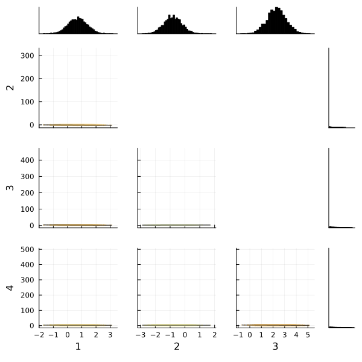

[Multinomial logistic regression](https://en.wikipedia.org/wiki/Multinomial_logistic_regression) is an extension of logistic regression. Logistic regression is used to model problems in which there are exactly two possible discrete outcomes. Multinomial logistic regression is used to model problems in which there are two or more possible discrete outcomes.

In our example, we'll be using the iris dataset. The goal of the iris multiclass problem is to predict the species of a flower given measurements (in centimeters) of sepal length and width and petal length and width. There are three possible species: Iris setosa, Iris versicolor, and Iris virginica.

To start, let's import all the libraries we'll need.

```julia
# Load Turing.
using Turing

# Load RDatasets.
using RDatasets

# Load StatsPlots for visualizations and diagnostics.
using StatsPlots

# Functionality for splitting and normalizing the data.
using MLDataUtils: shuffleobs, splitobs, rescale!

# We need a softmax function which is provided by NNlib.
using NNlib: softmax

# Functionality for constructing arrays with identical elements efficiently.
using FillArrays

# Functionality for working with scaled identity matrices.
using LinearAlgebra

# Set a seed for reproducibility.
using Random
Random.seed!(0);
```


## Data Cleaning & Set Up

Now we're going to import our dataset. Twenty rows of the dataset are shown below so you can get a good feel for what kind of data we have.

```julia
# Import the "iris" dataset.
data = RDatasets.dataset("datasets", "iris");

# Show twenty random rows.
data[rand(1:size(data, 1), 20), :]
```

```
20×5 DataFrame
 Row │ SepalLength  SepalWidth  PetalLength  PetalWidth  Species
     │ Float64      Float64     Float64      Float64     Cat…
─────┼──────────────────────────────────────────────────────────────
   1 │         5.9         3.2          4.8         1.8  versicolor
   2 │         7.7         3.8          6.7         2.2  virginica
   3 │         5.9         3.0          4.2         1.5  versicolor
   4 │         6.3         2.9          5.6         1.8  virginica
   5 │         6.3         2.7          4.9         1.8  virginica
   6 │         4.8         3.4          1.6         0.2  setosa
   7 │         6.5         3.0          5.5         1.8  virginica
   8 │         5.0         3.4          1.5         0.2  setosa
  ⋮  │      ⋮           ⋮            ⋮           ⋮           ⋮
  14 │         5.6         2.8          4.9         2.0  virginica
  15 │         6.4         2.8          5.6         2.1  virginica
  16 │         7.2         3.6          6.1         2.5  virginica
  17 │         5.6         2.5          3.9         1.1  versicolor
  18 │         5.8         2.8          5.1         2.4  virginica
  19 │         5.8         2.7          4.1         1.0  versicolor
  20 │         5.0         3.4          1.5         0.2  setosa
                                                      5 rows omitted
```


In this data set, the outcome `Species` is currently coded as a string. We convert it to a numerical value by using indices `1`, `2`, and `3` to indicate species `setosa`, `versicolor`, and `virginica`, respectively.

```julia
# Recode the `Species` column.
species = ["setosa", "versicolor", "virginica"]
data[!, :Species_index] = indexin(data[!, :Species], species)

# Show twenty random rows of the new species columns
data[rand(1:size(data, 1), 20), [:Species, :Species_index]]
```

```
20×2 DataFrame
 Row │ Species     Species_index
     │ Cat…        Union…
─────┼───────────────────────────
   1 │ setosa      1
   2 │ virginica   3
   3 │ setosa      1
   4 │ versicolor  2
   5 │ setosa      1
   6 │ versicolor  2
   7 │ versicolor  2
   8 │ setosa      1
  ⋮  │     ⋮             ⋮
  14 │ setosa      1
  15 │ virginica   3
  16 │ virginica   3
  17 │ setosa      1
  18 │ versicolor  2
  19 │ virginica   3
  20 │ versicolor  2
                   5 rows omitted
```


After we've done that tidying, it's time to split our dataset into training and testing sets, and separate the features and target from the data. Additionally, we must rescale our feature variables so that they are centered around zero by subtracting each column by the mean and dividing it by the standard deviation. Without this step, Turing's sampler will have a hard time finding a place to start searching for parameter estimates.

```julia
# Split our dataset 50%/50% into training/test sets.
trainset, testset = splitobs(shuffleobs(data), 0.5)

# Define features and target.
features = [:SepalLength, :SepalWidth, :PetalLength, :PetalWidth]
target = :Species_index

# Turing requires data in matrix and vector form.
train_features = Matrix(trainset[!, features])
test_features = Matrix(testset[!, features])
train_target = trainset[!, target]
test_target = testset[!, target]

# Standardize the features.
μ, σ = rescale!(train_features; obsdim=1)
rescale!(test_features, μ, σ; obsdim=1);
```


## Model Declaration

Finally, we can define our model `logistic_regression`. It is a function that takes three arguments where

  - `x` is our set of independent variables;
  - `y` is the element we want to predict;
  - `σ` is the standard deviation we want to assume for our priors.

We select the `setosa` species as the baseline class (the choice does not matter). Then we create the intercepts and vectors of coefficients for the other classes against that baseline. More concretely, we create scalar intercepts `intercept_versicolor` and `intersept_virginica` and coefficient vectors `coefficients_versicolor` and `coefficients_virginica` with four coefficients each for the features `SepalLength`, `SepalWidth`, `PetalLength` and `PetalWidth`. We assume a normal distribution with mean zero and standard deviation `σ` as prior for each scalar parameter. We want to find the posterior distribution of these, in total ten, parameters to be able to predict the species for any given set of features.

```julia
# Bayesian multinomial logistic regression
@model function logistic_regression(x, y, σ)
    n = size(x, 1)
    length(y) == n ||
        throw(DimensionMismatch("number of observations in `x` and `y` is not equal"))

    # Priors of intercepts and coefficients.
    intercept_versicolor ~ Normal(0, σ)
    intercept_virginica ~ Normal(0, σ)
    coefficients_versicolor ~ MvNormal(Zeros(4), σ^2 * I)
    coefficients_virginica ~ MvNormal(Zeros(4), σ^2 * I)

    # Compute the likelihood of the observations.
    values_versicolor = intercept_versicolor .+ x * coefficients_versicolor
    values_virginica = intercept_virginica .+ x * coefficients_virginica
    for i in 1:n
        # the 0 corresponds to the base category `setosa`
        v = softmax([0, values_versicolor[i], values_virginica[i]])
        y[i] ~ Categorical(v)
    end
end;
```


## Sampling

Now we can run our sampler. This time we'll use [`HMC`](http://turing.ml/docs/library/#Turing.HMC) to sample from our posterior.

```julia
m = logistic_regression(train_features, train_target, 1)
chain = sample(m, NUTS(), MCMCThreads(), 1_500, 3)
```

```
Chains MCMC chain (1500×22×3 Array{Float64, 3}):

Iterations        = 751:1:2250
Number of chains  = 3
Samples per chain = 1500
Wall duration     = 14.19 seconds
Compute duration  = 13.36 seconds
parameters        = intercept_versicolor, intercept_virginica, coefficients
_versicolor[1], coefficients_versicolor[2], coefficients_versicolor[3], coe
fficients_versicolor[4], coefficients_virginica[1], coefficients_virginica[
2], coefficients_virginica[3], coefficients_virginica[4]
internals         = lp, n_steps, is_accept, acceptance_rate, log_density, h
amiltonian_energy, hamiltonian_energy_error, max_hamiltonian_energy_error, 
tree_depth, numerical_error, step_size, nom_step_size

Summary Statistics
                  parameters      mean       std   naive_se      mcse      
    ⋯
                      Symbol   Float64   Float64    Float64   Float64     F
loa ⋯

        intercept_versicolor    0.9494    0.5083     0.0076    0.0071   483
6.9 ⋯
         intercept_virginica   -0.6518    0.6739     0.0100    0.0108   495
0.5 ⋯
  coefficients_versicolor[1]    1.0556    0.6479     0.0097    0.0081   463
2.4 ⋯
  coefficients_versicolor[2]   -1.4733    0.5602     0.0084    0.0073   480
0.5 ⋯
  coefficients_versicolor[3]    1.0303    0.7435     0.0111    0.0108   469
7.8 ⋯
  coefficients_versicolor[4]    0.3132    0.7089     0.0106    0.0114   401
8.2 ⋯
   coefficients_virginica[1]    0.9615    0.6790     0.0101    0.0100   443
5.7 ⋯
   coefficients_virginica[2]   -0.7004    0.6586     0.0098    0.0076   486
2.8 ⋯
   coefficients_virginica[3]    2.1020    0.8220     0.0123    0.0109   563
6.6 ⋯
   coefficients_virginica[4]    2.6179    0.7548     0.0113    0.0126   501
1.5 ⋯
                                                               3 columns om
itted

Quantiles
                  parameters      2.5%     25.0%     50.0%     75.0%     97
.5% ⋯
                      Symbol   Float64   Float64   Float64   Float64   Floa
t64 ⋯

        intercept_versicolor   -0.0378    0.6028    0.9550    1.2954    1.9
344 ⋯
         intercept_virginica   -1.9762   -1.1062   -0.6404   -0.1784    0.6
174 ⋯
  coefficients_versicolor[1]   -0.1816    0.6108    1.0546    1.4951    2.3
514 ⋯
  coefficients_versicolor[2]   -2.6360   -1.8418   -1.4428   -1.0772   -0.4
581 ⋯
  coefficients_versicolor[3]   -0.4193    0.5419    1.0388    1.5370    2.4
867 ⋯
  coefficients_versicolor[4]   -1.0839   -0.1781    0.3063    0.7932    1.7
102 ⋯
   coefficients_virginica[1]   -0.3369    0.4910    0.9540    1.4167    2.3
063 ⋯
   coefficients_virginica[2]   -2.0041   -1.1445   -0.6911   -0.2484    0.5
600 ⋯
   coefficients_virginica[3]    0.5236    1.5549    2.0865    2.6542    3.7
392 ⋯
   coefficients_virginica[4]    1.1253    2.1225    2.6243    3.1309    4.0
841 ⋯
```


Since we ran multiple chains, we may as well do a spot check to make sure each chain converges around similar points.

```julia
plot(chain)
```


Looks good!

We can also use the `corner` function from MCMCChains to show the distributions of the various parameters of our multinomial logistic regression. The corner function requires MCMCChains and StatsPlots.

```julia
corner(
    chain,
    MCMCChains.namesingroup(chain, :coefficients_versicolor);
    label=[string(i) for i in 1:4],
)
```


```julia
corner(
    chain,
    MCMCChains.namesingroup(chain, :coefficients_virginica);
    label=[string(i) for i in 1:4],
)
```




Fortunately the corner plots appear to demonstrate unimodal distributions for each of our parameters, so it should be straightforward to take the means of each parameter's sampled values to estimate our model to make predictions.

## Making Predictions

How do we test how well the model actually predicts which of the three classes an iris flower belongs to? We need to build a `prediction` function that takes the test dataset and runs it through the average parameter calculated during sampling.

The `prediction` function below takes a `Matrix` and a `Chains` object. It computes the mean of the sampled parameters and calculates the species with the highest probability for each observation. Note that we do not have to evaluate the `softmax` function since it does not affect the order of its inputs.

```julia
function prediction(x::Matrix, chain)
    # Pull the means from each parameter's sampled values in the chain.
    intercept_versicolor = mean(chain, :intercept_versicolor)
    intercept_virginica = mean(chain, :intercept_virginica)
    coefficients_versicolor = [
        mean(chain, k) for k in MCMCChains.namesingroup(chain, :coefficients_versicolor)
    ]
    coefficients_virginica = [
        mean(chain, k) for k in MCMCChains.namesingroup(chain, :coefficients_virginica)
    ]

    # Compute the index of the species with the highest probability for each observation.
    values_versicolor = intercept_versicolor .+ x * coefficients_versicolor
    values_virginica = intercept_virginica .+ x * coefficients_virginica
    species_indices = [
        argmax((0, x, y)) for (x, y) in zip(values_versicolor, values_virginica)
    ]

    return species_indices
end;
```


Let's see how we did! We run the test matrix through the prediction function, and compute the accuracy for our prediction.

```julia
# Make the predictions.
predictions = prediction(test_features, chain)

# Calculate accuracy for our test set.
mean(predictions .== testset[!, :Species_index])
```

```
0.92
```


Perhaps more important is to see the accuracy per class.

```julia
for s in 1:3
    rows = testset[!, :Species_index] .== s
    println("Number of `", species[s], "`: ", count(rows))
    println(
        "Percentage of `",
        species[s],
        "` predicted correctly: ",
        mean(predictions[rows] .== testset[rows, :Species_index]),
    )
end
```

```
Number of `setosa`: 24
Percentage of `setosa` predicted correctly: 0.9583333333333334
Number of `versicolor`: 25
Percentage of `versicolor` predicted correctly: 0.88
Number of `virginica`: 26
Percentage of `virginica` predicted correctly: 0.9230769230769231
```


This tutorial has demonstrated how to use Turing to perform Bayesian multinomial logistic regression.


## Appendix

These tutorials are a part of the TuringTutorials repository, found at: [https://github.com/TuringLang/TuringTutorials](https://github.com/TuringLang/TuringTutorials).

To locally run this tutorial, do the following commands:

```
using TuringTutorials
TuringTutorials.weave("08-multinomial-logistic-regression", "08_multinomial-logistic-regression.jmd")
```

Computer Information:

```
Julia Version 1.6.7
Commit 3b76b25b64 (2022-07-19 15:11 UTC)
Platform Info:
  OS: Linux (x86_64-pc-linux-gnu)
  CPU: AMD EPYC 7502 32-Core Processor
  WORD_SIZE: 64
  LIBM: libopenlibm
  LLVM: libLLVM-11.0.1 (ORCJIT, znver2)
Environment:
  JULIA_CPU_THREADS = 16
  BUILDKITE_PLUGIN_JULIA_CACHE_DIR = /cache/julia-buildkite-plugin
  JULIA_DEPOT_PATH = /cache/julia-buildkite-plugin/depots/7aa0085e-79a4-45f3-a5bd-9743c91cf3da

```

Package Information:

```
      Status `/cache/build/default-amdci4-7/julialang/turingtutorials/tutorials/08-multinomial-logistic-regression/Project.toml`
  [1a297f60] FillArrays v0.13.7
  [cc2ba9b6] MLDataUtils v0.5.4
  [872c559c] NNlib v0.8.19
  [ce6b1742] RDatasets v0.7.7
  [f3b207a7] StatsPlots v0.15.4
  [fce5fe82] Turing v0.22.0
  [37e2e46d] LinearAlgebra
  [9a3f8284] Random
```

And the full manifest:

```
      Status `/cache/build/default-amdci4-7/julialang/turingtutorials/tutorials/08-multinomial-logistic-regression/Manifest.toml`
  [621f4979] AbstractFFTs v1.2.1
  [80f14c24] AbstractMCMC v4.2.0
  [7a57a42e] AbstractPPL v0.5.4
  [1520ce14] AbstractTrees v0.4.4
  [79e6a3ab] Adapt v3.6.1
  [0bf59076] AdvancedHMC v0.3.6
  [5b7e9947] AdvancedMH v0.6.8
  [576499cb] AdvancedPS v0.3.8
  [b5ca4192] AdvancedVI v0.1.6
  [dce04be8] ArgCheck v2.3.0
  [7d9fca2a] Arpack v0.5.4
  [4fba245c] ArrayInterface v7.2.0
  [13072b0f] AxisAlgorithms v1.0.1
  [39de3d68] AxisArrays v0.4.6
  [198e06fe] BangBang v0.3.37
  [9718e550] Baselet v0.1.1
  [76274a88] Bijectors v0.10.7
  [d1d4a3ce] BitFlags v0.1.7
  [336ed68f] CSV v0.10.9
  [49dc2e85] Calculus v0.5.1
  [324d7699] CategoricalArrays v0.10.7
  [082447d4] ChainRules v1.48.0
  [d360d2e6] ChainRulesCore v1.15.7
  [9e997f8a] ChangesOfVariables v0.1.6
  [aaaa29a8] Clustering v0.14.3
  [944b1d66] CodecZlib v0.7.1
  [35d6a980] ColorSchemes v3.20.0
  [3da002f7] ColorTypes v0.11.4
  [c3611d14] ColorVectorSpace v0.9.10
  [5ae59095] Colors v0.12.10
  [861a8166] Combinatorics v1.0.2
  [38540f10] CommonSolve v0.2.3
  [bbf7d656] CommonSubexpressions v0.3.0
  [34da2185] Compat v4.6.0
  [a33af91c] CompositionsBase v0.1.1
  [88cd18e8] ConsoleProgressMonitor v0.1.2
  [187b0558] ConstructionBase v1.5.1
  [d38c429a] Contour v0.6.2
  [a8cc5b0e] Crayons v4.1.1
  [9a962f9c] DataAPI v1.14.0
  [a93c6f00] DataFrames v1.5.0
  [864edb3b] DataStructures v0.18.13
  [e2d170a0] DataValueInterfaces v1.0.0
  [e7dc6d0d] DataValues v0.4.13
  [244e2a9f] DefineSingletons v0.1.2
  [b429d917] DensityInterface v0.4.0
  [163ba53b] DiffResults v1.1.0
  [b552c78f] DiffRules v1.13.0
  [b4f34e82] Distances v0.10.7
  [31c24e10] Distributions v0.25.86
  [ced4e74d] DistributionsAD v0.6.43
  [ffbed154] DocStringExtensions v0.9.3
  [fa6b7ba4] DualNumbers v0.6.8
  [366bfd00] DynamicPPL v0.21.4
  [cad2338a] EllipticalSliceSampling v1.1.0
  [4e289a0a] EnumX v1.0.4
  [e2ba6199] ExprTools v0.1.8
  [c87230d0] FFMPEG v0.4.1
  [7a1cc6ca] FFTW v1.5.0
  [5789e2e9] FileIO v1.16.0
  [48062228] FilePathsBase v0.9.20
  [1a297f60] FillArrays v0.13.7
  [53c48c17] FixedPointNumbers v0.8.4
  [59287772] Formatting v0.4.2
  [f6369f11] ForwardDiff v0.10.35
  [069b7b12] FunctionWrappers v1.1.3
  [77dc65aa] FunctionWrappersWrappers v0.1.3
  [d9f16b24] Functors v0.3.0
  [46192b85] GPUArraysCore v0.1.4
  [28b8d3ca] GR v0.71.7
  [42e2da0e] Grisu v1.0.2
  [cd3eb016] HTTP v1.7.4
  [34004b35] HypergeometricFunctions v0.3.11
  [7869d1d1] IRTools v0.4.8
  [83e8ac13] IniFile v0.5.1
  [22cec73e] InitialValues v0.3.1
  [842dd82b] InlineStrings v1.4.0
  [505f98c9] InplaceOps v0.3.0
  [a98d9a8b] Interpolations v0.14.7
  [8197267c] IntervalSets v0.7.4
  [3587e190] InverseFunctions v0.1.8
  [41ab1584] InvertedIndices v1.2.0
  [92d709cd] IrrationalConstants v0.1.1
  [c8e1da08] IterTools v1.4.0
  [82899510] IteratorInterfaceExtensions v1.0.0
  [1019f520] JLFzf v0.1.5
  [692b3bcd] JLLWrappers v1.4.1
  [682c06a0] JSON v0.21.3
  [5ab0869b] KernelDensity v0.6.5
  [8ac3fa9e] LRUCache v1.4.0
  [b964fa9f] LaTeXStrings v1.3.0
  [23fbe1c1] Latexify v0.15.18
  [50d2b5c4] Lazy v0.15.1
  [7f8f8fb0] LearnBase v0.3.0
  [1d6d02ad] LeftChildRightSiblingTrees v0.2.0
  [6f1fad26] Libtask v0.7.0
  [6fdf6af0] LogDensityProblems v1.0.3
  [2ab3a3ac] LogExpFunctions v0.3.23
  [e6f89c97] LoggingExtras v0.4.9
  [c7f686f2] MCMCChains v5.7.1
  [be115224] MCMCDiagnosticTools v0.2.6
  [9920b226] MLDataPattern v0.5.4
  [cc2ba9b6] MLDataUtils v0.5.4
  [e80e1ace] MLJModelInterface v1.8.0
  [66a33bbf] MLLabelUtils v0.5.7
  [1914dd2f] MacroTools v0.5.10
  [dbb5928d] MappedArrays v0.4.1
  [739be429] MbedTLS v1.1.7
  [442fdcdd] Measures v0.3.2
  [128add7d] MicroCollections v0.1.3
  [e1d29d7a] Missings v1.1.0
  [78c3b35d] Mocking v0.7.5
  [6f286f6a] MultivariateStats v0.10.1
  [872c559c] NNlib v0.8.19
  [77ba4419] NaNMath v1.0.2
  [86f7a689] NamedArrays v0.9.6
  [c020b1a1] NaturalSort v1.0.0
  [b8a86587] NearestNeighbors v0.4.13
  [510215fc] Observables v0.5.4
  [6fe1bfb0] OffsetArrays v1.12.9
  [4d8831e6] OpenSSL v1.3.3
  [3bd65402] Optimisers v0.2.15
  [bac558e1] OrderedCollections v1.4.1
  [90014a1f] PDMats v0.11.17
  [69de0a69] Parsers v2.5.7
  [b98c9c47] Pipe v1.3.0
  [ccf2f8ad] PlotThemes v3.1.0
  [995b91a9] PlotUtils v1.3.4
  [91a5bcdd] Plots v1.38.6
  [2dfb63ee] PooledArrays v1.4.2
  [21216c6a] Preferences v1.3.0
  [08abe8d2] PrettyTables v2.2.2
  [33c8b6b6] ProgressLogging v0.1.4
  [92933f4c] ProgressMeter v1.7.2
  [1fd47b50] QuadGK v2.8.1
  [df47a6cb] RData v0.8.3
  [ce6b1742] RDatasets v0.7.7
  [b3c3ace0] RangeArrays v0.3.2
  [c84ed2f1] Ratios v0.4.3
  [c1ae055f] RealDot v0.1.0
  [3cdcf5f2] RecipesBase v1.3.3
  [01d81517] RecipesPipeline v0.6.11
  [731186ca] RecursiveArrayTools v2.38.0
  [189a3867] Reexport v1.2.2
  [05181044] RelocatableFolders v1.0.0
  [ae029012] Requires v1.3.0
  [79098fc4] Rmath v0.7.1
  [f2b01f46] Roots v2.0.9
  [7e49a35a] RuntimeGeneratedFunctions v0.5.5
  [0bca4576] SciMLBase v1.88.0
  [c0aeaf25] SciMLOperators v0.1.22
  [30f210dd] ScientificTypesBase v3.0.0
  [6c6a2e73] Scratch v1.1.1
  [91c51154] SentinelArrays v1.3.18
  [efcf1570] Setfield v1.1.1
  [992d4aef] Showoff v1.0.3
  [777ac1f9] SimpleBufferStream v1.1.0
  [66db9d55] SnoopPrecompile v1.0.3
  [a2af1166] SortingAlgorithms v1.1.0
  [276daf66] SpecialFunctions v2.2.0
  [171d559e] SplittablesBase v0.1.15
  [90137ffa] StaticArrays v1.5.16
  [1e83bf80] StaticArraysCore v1.4.0
  [64bff920] StatisticalTraits v3.2.0
  [82ae8749] StatsAPI v1.5.0
  [2913bbd2] StatsBase v0.33.21
  [4c63d2b9] StatsFuns v1.3.0
  [f3b207a7] StatsPlots v0.15.4
  [892a3eda] StringManipulation v0.3.0
  [09ab397b] StructArrays v0.6.14
  [2efcf032] SymbolicIndexingInterface v0.2.2
  [ab02a1b2] TableOperations v1.2.0
  [3783bdb8] TableTraits v1.0.1
  [bd369af6] Tables v1.10.0
  [62fd8b95] TensorCore v0.1.1
  [5d786b92] TerminalLoggers v0.1.6
  [f269a46b] TimeZones v1.9.1
  [9f7883ad] Tracker v0.2.23
  [3bb67fe8] TranscodingStreams v0.9.11
  [28d57a85] Transducers v0.4.75
  [410a4b4d] Tricks v0.1.6
  [781d530d] TruncatedStacktraces v1.0.1
  [fce5fe82] Turing v0.22.0
  [5c2747f8] URIs v1.4.2
  [3a884ed6] UnPack v1.0.2
  [1cfade01] UnicodeFun v0.4.1
  [41fe7b60] Unzip v0.1.2
  [ea10d353] WeakRefStrings v1.4.2
  [cc8bc4a8] Widgets v0.6.6
  [efce3f68] WoodburyMatrices v0.5.5
  [76eceee3] WorkerUtilities v1.6.1
  [700de1a5] ZygoteRules v0.2.2
  [68821587] Arpack_jll v3.5.0+3
  [6e34b625] Bzip2_jll v1.0.8+0
  [83423d85] Cairo_jll v1.16.1+1
  [2e619515] Expat_jll v2.4.8+0
  [b22a6f82] FFMPEG_jll v4.4.2+2
  [f5851436] FFTW_jll v3.3.10+0
  [a3f928ae] Fontconfig_jll v2.13.93+0
  [d7e528f0] FreeType2_jll v2.10.4+0
  [559328eb] FriBidi_jll v1.0.10+0
  [0656b61e] GLFW_jll v3.3.8+0
  [d2c73de3] GR_jll v0.71.7+0
  [78b55507] Gettext_jll v0.21.0+0
  [7746bdde] Glib_jll v2.74.0+2
  [3b182d85] Graphite2_jll v1.3.14+0
  [2e76f6c2] HarfBuzz_jll v2.8.1+1
  [1d5cc7b8] IntelOpenMP_jll v2018.0.3+2
  [aacddb02] JpegTurbo_jll v2.1.91+0
  [c1c5ebd0] LAME_jll v3.100.1+0
  [88015f11] LERC_jll v3.0.0+1
  [dd4b983a] LZO_jll v2.10.1+0
  [e9f186c6] Libffi_jll v3.2.2+1
  [d4300ac3] Libgcrypt_jll v1.8.7+0
  [7e76a0d4] Libglvnd_jll v1.6.0+0
  [7add5ba3] Libgpg_error_jll v1.42.0+0
  [94ce4f54] Libiconv_jll v1.16.1+2
  [4b2f31a3] Libmount_jll v2.35.0+0
  [89763e89] Libtiff_jll v4.4.0+0
  [38a345b3] Libuuid_jll v2.36.0+0
  [856f044c] MKL_jll v2022.2.0+0
  [e7412a2a] Ogg_jll v1.3.5+1
  [458c3c95] OpenSSL_jll v1.1.20+0
  [efe28fd5] OpenSpecFun_jll v0.5.5+0
  [91d4177d] Opus_jll v1.3.2+0
  [30392449] Pixman_jll v0.40.1+0
  [ea2cea3b] Qt5Base_jll v5.15.3+2
  [f50d1b31] Rmath_jll v0.4.0+0
  [a2964d1f] Wayland_jll v1.21.0+0
  [2381bf8a] Wayland_protocols_jll v1.25.0+0
  [02c8fc9c] XML2_jll v2.10.3+0
  [aed1982a] XSLT_jll v1.1.34+0
  [4f6342f7] Xorg_libX11_jll v1.6.9+4
  [0c0b7dd1] Xorg_libXau_jll v1.0.9+4
  [935fb764] Xorg_libXcursor_jll v1.2.0+4
  [a3789734] Xorg_libXdmcp_jll v1.1.3+4
  [1082639a] Xorg_libXext_jll v1.3.4+4
  [d091e8ba] Xorg_libXfixes_jll v5.0.3+4
  [a51aa0fd] Xorg_libXi_jll v1.7.10+4
  [d1454406] Xorg_libXinerama_jll v1.1.4+4
  [ec84b674] Xorg_libXrandr_jll v1.5.2+4
  [ea2f1a96] Xorg_libXrender_jll v0.9.10+4
  [14d82f49] Xorg_libpthread_stubs_jll v0.1.0+3
  [c7cfdc94] Xorg_libxcb_jll v1.13.0+3
  [cc61e674] Xorg_libxkbfile_jll v1.1.0+4
  [12413925] Xorg_xcb_util_image_jll v0.4.0+1
  [2def613f] Xorg_xcb_util_jll v0.4.0+1
  [975044d2] Xorg_xcb_util_keysyms_jll v0.4.0+1
  [0d47668e] Xorg_xcb_util_renderutil_jll v0.3.9+1
  [c22f9ab0] Xorg_xcb_util_wm_jll v0.4.1+1
  [35661453] Xorg_xkbcomp_jll v1.4.2+4
  [33bec58e] Xorg_xkeyboard_config_jll v2.27.0+4
  [c5fb5394] Xorg_xtrans_jll v1.4.0+3
  [3161d3a3] Zstd_jll v1.5.4+0
  [214eeab7] fzf_jll v0.29.0+0
  [a4ae2306] libaom_jll v3.4.0+0
  [0ac62f75] libass_jll v0.15.1+0
  [f638f0a6] libfdk_aac_jll v2.0.2+0
  [b53b4c65] libpng_jll v1.6.38+0
  [f27f6e37] libvorbis_jll v1.3.7+1
  [1270edf5] x264_jll v2021.5.5+0
  [dfaa095f] x265_jll v3.5.0+0
  [d8fb68d0] xkbcommon_jll v1.4.1+0
  [0dad84c5] ArgTools
  [56f22d72] Artifacts
  [2a0f44e3] Base64
  [ade2ca70] Dates
  [8bb1440f] DelimitedFiles
  [8ba89e20] Distributed
  [f43a241f] Downloads
  [9fa8497b] Future
  [b77e0a4c] InteractiveUtils
  [4af54fe1] LazyArtifacts
  [b27032c2] LibCURL
  [76f85450] LibGit2
  [8f399da3] Libdl
  [37e2e46d] LinearAlgebra
  [56ddb016] Logging
  [d6f4376e] Markdown
  [a63ad114] Mmap
  [ca575930] NetworkOptions
  [44cfe95a] Pkg
  [de0858da] Printf
  [3fa0cd96] REPL
  [9a3f8284] Random
  [ea8e919c] SHA
  [9e88b42a] Serialization
  [1a1011a3] SharedArrays
  [6462fe0b] Sockets
  [2f01184e] SparseArrays
  [10745b16] Statistics
  [4607b0f0] SuiteSparse
  [fa267f1f] TOML
  [a4e569a6] Tar
  [8dfed614] Test
  [cf7118a7] UUIDs
  [4ec0a83e] Unicode
  [e66e0078] CompilerSupportLibraries_jll
  [deac9b47] LibCURL_jll
  [29816b5a] LibSSH2_jll
  [c8ffd9c3] MbedTLS_jll
  [14a3606d] MozillaCACerts_jll
  [4536629a] OpenBLAS_jll
  [05823500] OpenLibm_jll
  [efcefdf7] PCRE2_jll
  [83775a58] Zlib_jll
  [8e850ede] nghttp2_jll
  [3f19e933] p7zip_jll
```

