In this post we'll have a look at what's know as **variational inference (VI)**, a family of _approximate_ Bayesian inference methods, and how to use it in Turing.jl as an alternative to other approaches such as MCMC. In particular, we will focus on one of the more standard VI methods called **Automatic Differentation Variational Inference (ADVI)**.

Here we will focus on how to use VI in Turing and not much on the theory underlying VI.
If you are interested in understanding the mathematics you can checkout [our write-up](../../docs/for-developers/variational_inference) or any other resource online (there a lot of great ones).

Using VI in Turing.jl is very straight forward.
If `model` denotes a definition of a `Turing.Model`, performing VI is as simple as

```julia
m = model(data...) # instantiate model on the data
q = vi(m, vi_alg)  # perform VI on `m` using the VI method `vi_alg`, which returns a `VariationalPosterior`
```


Thus it's no more work than standard MCMC sampling in Turing.

To get a bit more into what we can do with `vi`, we'll first have a look at a simple example and then we'll reproduce the [tutorial on Bayesian linear regression](../../tutorials/5-linearregression) using VI instead of MCMC. Finally we'll look at some of the different parameters of `vi` and how you for example can use your own custom variational family.

We first import the packages to be used:

```julia
using Random
using Turing
using Turing: Variational
using StatsPlots, Measures

Random.seed!(42);
```


## Simple example: Normal-Gamma conjugate model

The Normal-(Inverse)Gamma conjugate model is defined by the following generative process

\begin{align}
s &\sim \mathrm{InverseGamma}(2, 3) \\
m &\sim \mathcal{N}(0, s) \\
x_i &\overset{\text{i.i.d.}}{=} \mathcal{N}(m, s), \quad i = 1, \dots, n
\end{align}

Recall that *conjugate* refers to the fact that we can obtain a closed-form expression for the posterior. Of course one wouldn't use something like variational inference for a conjugate model, but it's useful as a simple demonstration as we can compare the result to the true posterior.

First we generate some synthetic data, define the `Turing.Model` and instantiate the model on the data:

```julia
# generate data
x = randn(2000);
```


```julia
@model function model(x)
    s ~ InverseGamma(2, 3)
    m ~ Normal(0.0, sqrt(s))
    for i in 1:length(x)
        x[i] ~ Normal(m, sqrt(s))
    end
end;
```


```julia
# Instantiate model
m = model(x);
```


Now we'll produce some samples from the posterior using a MCMC method, which in constrast to VI is guaranteed to converge to the *exact* posterior (as the number of samples go to infinity).

We'll produce 10 000 samples with 200 steps used for adaptation and a target acceptance rate of 0.65

If you don't understand what "adaptation" or "target acceptance rate" refers to, all you really need to know is that `NUTS` is known to be one of the most accurate and efficient samplers (when applicable) while requiring little to no hand-tuning to work well.

```julia
samples_nuts = sample(m, NUTS(), 10_000);
```


Now let's try VI. The most important function you need to now about to do VI in Turing is `vi`:

```julia
@doc(Variational.vi)
```


```
vi(model, alg::VariationalInference)
vi(model, alg::VariationalInference, q::VariationalPosterior)
vi(model, alg::VariationalInference, getq::Function, θ::AbstractArray)
```

Constructs the variational posterior from the `model` and performs the optimization following the configuration of the given `VariationalInference` instance.

# Arguments

  * `model`: `Turing.Model` or `Function` z ↦ log p(x, z) where `x` denotes the observations
  * `alg`: the VI algorithm used
  * `q`: a `VariationalPosterior` for which it is assumed a specialized implementation of the variational objective used exists.
  * `getq`: function taking parameters `θ` as input and returns a `VariationalPosterior`
  * `θ`: only required if `getq` is used, in which case it is the initial parameters for the variational posterior


Additionally, you can pass

  - an initial variational posterior `q`, for which we assume there exists a implementation of `update(::typeof(q), θ::AbstractVector)` returning an updated posterior `q` with parameters `θ`.
  - a function mapping $\theta \mapsto q_{\theta}$ (denoted above `getq`) together with initial parameters `θ`. This provides more flexibility in the types of variational families that we can use, and can sometimes be slightly more convenient for quick and rough work.

By default, i.e. when calling `vi(m, advi)`, Turing use a *mean-field* approximation with a multivariate normal as the base-distribution. Mean-field refers to the fact that we assume all the latent variables to be *independent*. This the "standard" ADVI approach; see [Automatic Differentiation Variational Inference (2016)](https://arxiv.org/abs/1603.00788) for more. In Turing, one can obtain such a mean-field approximation by calling `Variational.meanfield(model)` for which there exists an internal implementation for `update`:

```julia
@doc(Variational.meanfield)
```


```
meanfield([rng, ]model::Model)
```

Creates a mean-field approximation with multivariate normal as underlying distribution.


Currently the only implementation of `VariationalInference` available is `ADVI`, which is very convenient and applicable as long as your `Model` is differentiable with respect to the *variational parameters*, that is, the parameters of your variational distribution, e.g. mean and variance in the mean-field approximation.

```julia
@doc(Variational.ADVI)
```


```julia
struct ADVI{AD} <: AdvancedVI.VariationalInference{AD}
```

Automatic Differentiation Variational Inference (ADVI) with automatic differentiation backend `AD`.

# Fields

  * `samples_per_step::Int64`: Number of samples used to estimate the ELBO in each optimization step.
  * `max_iters::Int64`: Maximum number of gradient steps.


To perform VI on the model `m` using 10 samples for gradient estimation and taking 1000 gradient steps is then as simple as:

```julia
# ADVI
advi = ADVI(10, 1000)
q = vi(m, advi);
```


Unfortunately, for such a small problem Turing's new `NUTS` sampler is *so* efficient now that it's not that much more efficient to use ADVI. So, so very unfortunate...

With that being said, this is not the case in general. For very complex models we'll later find that `ADVI` produces very reasonable results in a much shorter time than `NUTS`.

And one significant advantage of using `vi` is that we can sample from the resulting `q` with ease. In fact, the result of the `vi` call is a `TransformedDistribution` from Bijectors.jl, and it implements the Distributions.jl interface for a `Distribution`:

```julia
q isa MultivariateDistribution
```

```
true
```


This means that we can call `rand` to sample from the variational posterior `q`

```julia
histogram(rand(q, 1_000)[1, :])
```

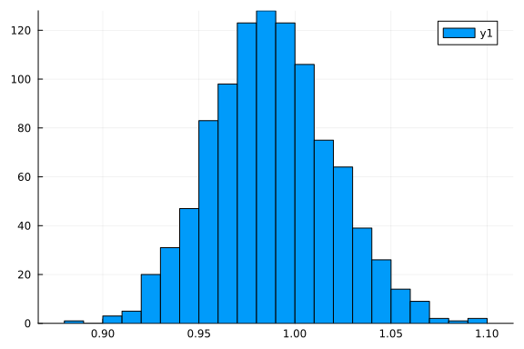


and `logpdf` to compute the log-probability

```julia
logpdf(q, rand(q))
```

```
5.175607551862831
```


Let's check the first and second moments of the data to see how our approximation compares to the point-estimates form the data:

```julia
var(x), mean(x)
```

```
(1.0225001600719719, -0.027900450605557185)
```


```julia
(mean(rand(q, 1000); dims=2)...,)
```

```
(1.0166331695234854, -0.02063562045151621)
```


That's pretty close! But we're Bayesian so we're not interested in *just* matching the mean.
Let's instead look the actual density `q`.

For that we need samples:

```julia
samples = rand(q, 10000);
size(samples)
```

```
(2, 10000)
```


```julia
p1 = histogram(
    samples[1, :]; bins=100, normed=true, alpha=0.2, color=:blue, label="", ylabel="density"
)
density!(samples[1, :]; label="s (ADVI)", color=:blue, linewidth=2)
density!(samples_nuts, :s; label="s (NUTS)", color=:green, linewidth=2)
vline!([var(x)]; label="s (data)", color=:black)
vline!([mean(samples[1, :])]; color=:blue, label="")

p2 = histogram(
    samples[2, :]; bins=100, normed=true, alpha=0.2, color=:blue, label="", ylabel="density"
)
density!(samples[2, :]; label="m (ADVI)", color=:blue, linewidth=2)
density!(samples_nuts, :m; label="m (NUTS)", color=:green, linewidth=2)
vline!([mean(x)]; color=:black, label="m (data)")
vline!([mean(samples[2, :])]; color=:blue, label="")

plot(p1, p2; layout=(2, 1), size=(900, 500), legend=true)
```

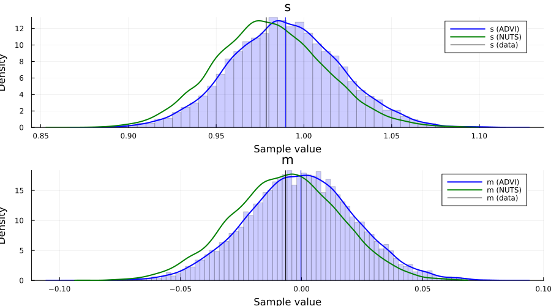


For this particular `Model`, we can in fact obtain the posterior of the latent variables in closed form. This allows us to compare both `NUTS` and `ADVI` to the true posterior $p(s, m \mid x_1, \ldots, x_n)$.

*The code below is just work to get the marginals $p(s \mid x_1, \ldots, x_n)$ and $p(m \mid x_1, \ldots, x_n)$. Feel free to skip it.*

```julia
# closed form computation of the Normal-inverse-gamma posterior
# based on "Conjugate Bayesian analysis of the Gaussian distribution" by Murphy
function posterior(μ₀::Real, κ₀::Real, α₀::Real, β₀::Real, x::AbstractVector{<:Real})
    # Compute summary statistics
    n = length(x)
    x̄ = mean(x)
    sum_of_squares = sum(xi -> (xi - x̄)^2, x)

    # Compute parameters of the posterior
    κₙ = κ₀ + n
    μₙ = (κ₀ * μ₀ + n * x̄) / κₙ
    αₙ = α₀ + n / 2
    βₙ = β₀ + (sum_of_squares + n * κ₀ / κₙ * (x̄ - μ₀)^2) / 2

    return μₙ, κₙ, αₙ, βₙ
end
μₙ, κₙ, αₙ, βₙ = posterior(0.0, 1.0, 2.0, 3.0, x)

# marginal distribution of σ²
# cf. Eq. (90) in "Conjugate Bayesian analysis of the Gaussian distribution" by Murphy
p_σ² = InverseGamma(αₙ, βₙ)
p_σ²_pdf = z -> pdf(p_σ², z)

# marginal of μ
# Eq. (91) in "Conjugate Bayesian analysis of the Gaussian distribution" by Murphy
p_μ = μₙ + sqrt(βₙ / (αₙ * κₙ)) * TDist(2 * αₙ)
p_μ_pdf = z -> pdf(p_μ, z)

# posterior plots
p1 = plot()
histogram!(samples[1, :]; bins=100, normed=true, alpha=0.2, color=:blue, label="")
density!(samples[1, :]; label="s (ADVI)", color=:blue)
density!(samples_nuts, :s; label="s (NUTS)", color=:green)
vline!([mean(samples[1, :])]; linewidth=1.5, color=:blue, label="")
plot!(range(0.75, 1.35; length=1_001), p_σ²_pdf; label="s (posterior)", color=:red)
vline!([var(x)]; label="s (data)", linewidth=1.5, color=:black, alpha=0.7)
xlims!(0.75, 1.35)

p2 = plot()
histogram!(samples[2, :]; bins=100, normed=true, alpha=0.2, color=:blue, label="")
density!(samples[2, :]; label="m (ADVI)", color=:blue)
density!(samples_nuts, :m; label="m (NUTS)", color=:green)
vline!([mean(samples[2, :])]; linewidth=1.5, color=:blue, label="")
plot!(range(-0.25, 0.25; length=1_001), p_μ_pdf; label="m (posterior)", color=:red)
vline!([mean(x)]; label="m (data)", linewidth=1.5, color=:black, alpha=0.7)
xlims!(-0.25, 0.25)

plot(p1, p2; layout=(2, 1), size=(900, 500))
```

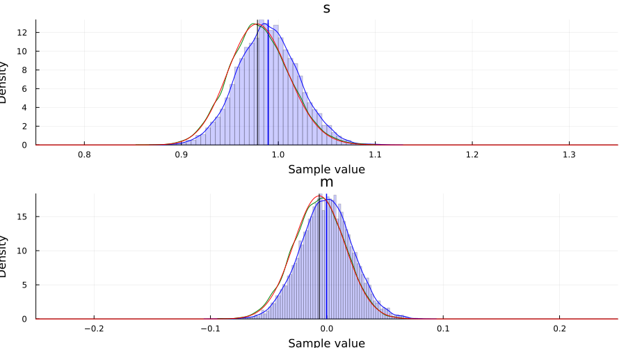


## Bayesian linear regression example using ADVI

This is simply a duplication of the tutorial [5. Linear regression](../regression/02_linear-regression) but now with the addition of an approximate posterior obtained using `ADVI`.

As we'll see, there is really no additional work required to apply variational inference to a more complex `Model`.

This section is basically copy-pasting the code from the [linear regression tutorial](../regression/02_linear-regression).

```julia
Random.seed!(1);
```


```julia
using FillArrays
using RDatasets

using LinearAlgebra
```


```julia
# Import the "Default" dataset.
data = RDatasets.dataset("datasets", "mtcars");

# Show the first six rows of the dataset.
first(data, 6)
```

```
6×12 DataFrame
 Row │ Model              MPG      Cyl    Disp     HP     DRat     WT      
 QS ⋯
     │ String31           Float64  Int64  Float64  Int64  Float64  Float64 
 Fl ⋯
─────┼─────────────────────────────────────────────────────────────────────
─────
   1 │ Mazda RX4             21.0      6    160.0    110     3.9     2.62  
    ⋯
   2 │ Mazda RX4 Wag         21.0      6    160.0    110     3.9     2.875
   3 │ Datsun 710            22.8      4    108.0     93     3.85    2.32
   4 │ Hornet 4 Drive        21.4      6    258.0    110     3.08    3.215
   5 │ Hornet Sportabout     18.7      8    360.0    175     3.15    3.44  
    ⋯
   6 │ Valiant               18.1      6    225.0    105     2.76    3.46
                                                               5 columns om
itted
```


```julia
# Function to split samples.
function split_data(df, at=0.70)
    r = size(df, 1)
    index = Int(round(r * at))
    train = df[1:index, :]
    test = df[(index + 1):end, :]
    return train, test
end

# A handy helper function to rescale our dataset.
function standardize(x)
    return (x .- mean(x; dims=1)) ./ std(x; dims=1)
end

function standardize(x, orig)
    return (x .- mean(orig; dims=1)) ./ std(orig; dims=1)
end

# Another helper function to unstandardize our datasets.
function unstandardize(x, orig)
    return x .* std(orig; dims=1) .+ mean(orig; dims=1)
end

function unstandardize(x, mean_train, std_train)
    return x .* std_train .+ mean_train
end
```

```
unstandardize (generic function with 2 methods)
```


```julia
# Remove the model column.
select!(data, Not(:Model))

# Split our dataset 70%/30% into training/test sets.
train, test = split_data(data, 0.7)
train_unstandardized = copy(train)

# Standardize both datasets.
std_train = standardize(Matrix(train))
std_test = standardize(Matrix(test), Matrix(train))

# Save dataframe versions of our dataset.
train_cut = DataFrame(std_train, names(data))
test_cut = DataFrame(std_test, names(data))

# Create our labels. These are the values we are trying to predict.
train_label = train_cut[:, :MPG]
test_label = test_cut[:, :MPG]

# Get the list of columns to keep.
remove_names = filter(x -> !in(x, [:MPG, :Model]), names(data))

# Filter the test and train sets.
train = Matrix(train_cut[:, remove_names]);
test = Matrix(test_cut[:, remove_names]);
```


```julia
# Bayesian linear regression.
@model function linear_regression(x, y, n_obs, n_vars, ::Type{T}=Vector{Float64}) where {T}
    # Set variance prior.
    σ² ~ truncated(Normal(0, 100), 0, Inf)

    # Set intercept prior.
    intercept ~ Normal(0, 3)

    # Set the priors on our coefficients.
    coefficients ~ MvNormal(Zeros(n_vars), 10.0 * I)

    # Calculate all the mu terms.
    mu = intercept .+ x * coefficients
    return y ~ MvNormal(mu, σ² * I)
end;
```


```julia
n_obs, n_vars = size(train)
m = linear_regression(train, train_label, n_obs, n_vars);
```


## Performing VI

First we define the initial variational distribution, or, equivalently, the family of distributions to consider. We're going to use the same mean-field approximation as Turing will use by default when we call `vi(m, advi)`, which we obtain by calling `Variational.meanfield`. This returns a `TransformedDistribution` with a `TuringDiagMvNormal` as the underlying distribution and the transformation mapping from the reals to the domain of the latent variables.

```julia
q0 = Variational.meanfield(m)
typeof(q0)
```

```
Bijectors.MultivariateTransformed{DistributionsAD.TuringDiagMvNormal{Vector
{Float64}, Vector{Float64}}, Bijectors.Stacked{Tuple{Bijectors.Inverse{Bije
ctors.TruncatedBijector{0, Float64, Float64}, 0}, Bijectors.Identity{0}, Bi
jectors.Identity{1}}, Vector{UnitRange{Int64}}}} (alias for Bijectors.Trans
formedDistribution{DistributionsAD.TuringDiagMvNormal{Array{Float64, 1}, Ar
ray{Float64, 1}}, Bijectors.Stacked{Tuple{Bijectors.Inverse{Bijectors.Trunc
atedBijector{0, Float64, Float64}, 0}, Bijectors.Identity{0}, Bijectors.Ide
ntity{1}}, Array{UnitRange{Int64}, 1}}, Distributions.ArrayLikeVariate{1}})
```


```julia
advi = ADVI(10, 10_000)
```

```
AdvancedVI.ADVI{AdvancedVI.ForwardDiffAD{0}}(10, 10000)
```


Turing also provides a couple of different optimizers:

  - `TruncatedADAGrad` (default)
  - `DecayedADAGrad`
    as these are well-suited for problems with high-variance stochastic objectives, which is usually what the ELBO ends up being at different times in our optimization process.

With that being said, thanks to Requires.jl, if we add a `using Flux` prior to `using Turing` we can also make use of all the optimizers in `Flux`, e.g. `ADAM`, without any additional changes to your code! For example:

```julia
using Flux, Turing
using Turing.Variational

vi(m, advi; optimizer=Flux.ADAM())
```


just works.

For this problem we'll use the `DecayedADAGrad` from Turing:

```julia
opt = Variational.DecayedADAGrad(1e-2, 1.1, 0.9)
```

```
AdvancedVI.DecayedADAGrad(0.01, 1.1, 0.9, IdDict{Any, Any}())
```


```julia
q = vi(m, advi, q0; optimizer=opt)
typeof(q)
```

```
Bijectors.MultivariateTransformed{DistributionsAD.TuringDiagMvNormal{Vector
{Float64}, Vector{Float64}}, Bijectors.Stacked{Tuple{Bijectors.Inverse{Bije
ctors.TruncatedBijector{0, Float64, Float64}, 0}, Bijectors.Identity{0}, Bi
jectors.Identity{1}}, Vector{UnitRange{Int64}}}} (alias for Bijectors.Trans
formedDistribution{DistributionsAD.TuringDiagMvNormal{Array{Float64, 1}, Ar
ray{Float64, 1}}, Bijectors.Stacked{Tuple{Bijectors.Inverse{Bijectors.Trunc
atedBijector{0, Float64, Float64}, 0}, Bijectors.Identity{0}, Bijectors.Ide
ntity{1}}, Array{UnitRange{Int64}, 1}}, Distributions.ArrayLikeVariate{1}})
```


*Note: as mentioned before, we internally define a `update(q::TransformedDistribution{<:TuringDiagMvNormal}, θ::AbstractVector)` method which takes in the current variational approximation `q` together with new parameters `z` and returns the new variational approximation. This is required so that we can actually update the `Distribution` object after each optimization step.*

*Alternatively, we can instead provide the mapping $\theta \mapsto q_{\theta}$ directly together with initial parameters using the signature `vi(m, advi, getq, θ_init)` as mentioned earlier. We'll see an explicit example of this later on!*

To compute statistics for our approximation we need samples:

```julia
z = rand(q, 10_000);
```


Now we can for example look at the average

```julia
avg = vec(mean(z; dims=2))
```

```
13-element Vector{Float64}:
  0.0005350545238934559
 -0.0008135365069472977
  1.0015523412905114
 -0.0009126978807879137
  0.0021597630352901014
  0.0009049826709099784
 -0.0031479280243483588
 -0.0020332393740695974
 -0.001276358603668492
  0.0003629987092139663
 -0.0002843656451937193
 -0.000525550043077333
  0.002739324522866989
```


The vector has the same ordering as the model, e.g. in this case `σ²` has index `1`, `intercept` has index `2` and `coefficients` has indices `3:12`. If  you forget or you might want to do something programmatically with the result, you can obtain the `sym → indices` mapping as follows:

```julia
_, sym2range = bijector(m, Val(true));
sym2range
```

```
(intercept = UnitRange{Int64}[2:2], σ² = UnitRange{Int64}[1:1], coefficient
s = UnitRange{Int64}[3:13])
```


For example, we can check the sample distribution and mean value of `σ²`:

```julia
histogram(z[1, :])
avg[union(sym2range[:σ²]...)]
```

```
1-element Vector{Float64}:
 0.0005350545238934559
```


```julia
avg[union(sym2range[:intercept]...)]
```

```
1-element Vector{Float64}:
 -0.0008135365069472977
```


```julia
avg[union(sym2range[:coefficients]...)]
```

```
11-element Vector{Float64}:
  1.0015523412905114
 -0.0009126978807879137
  0.0021597630352901014
  0.0009049826709099784
 -0.0031479280243483588
 -0.0020332393740695974
 -0.001276358603668492
  0.0003629987092139663
 -0.0002843656451937193
 -0.000525550043077333
  0.002739324522866989
```


*Note: as you can see, this is slightly awkward to work with at the moment. We'll soon add a better way of dealing with this.*

With a bit of work (this will be much easier in the future), we can also visualize the approximate marginals of the different variables, similar to `plot(chain)`:

```julia
function plot_variational_marginals(z, sym2range)
    ps = []

    for (i, sym) in enumerate(keys(sym2range))
        indices = union(sym2range[sym]...)  # <= array of ranges
        if sum(length.(indices)) > 1
            offset = 1
            for r in indices
                p = density(
                    z[r, :];
                    title="$(sym)[$offset]",
                    titlefontsize=10,
                    label="",
                    ylabel="Density",
                    margin=1.5mm,
                )
                push!(ps, p)
                offset += 1
            end
        else
            p = density(
                z[first(indices), :];
                title="$(sym)",
                titlefontsize=10,
                label="",
                ylabel="Density",
                margin=1.5mm,
            )
            push!(ps, p)
        end
    end

    return plot(ps...; layout=(length(ps), 1), size=(500, 2000), margin=4.0mm)
end
```

```
plot_variational_marginals (generic function with 1 method)
```


```julia
plot_variational_marginals(z, sym2range)
```

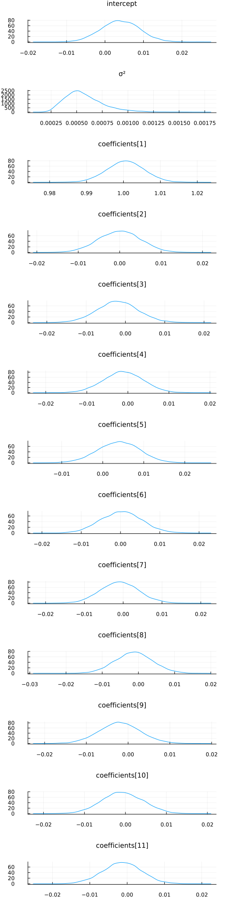


And let's compare this to using the `NUTS` sampler:

```julia
chain = sample(m, NUTS(), 10_000);
```


```julia
plot(chain; margin=12.00mm)
```

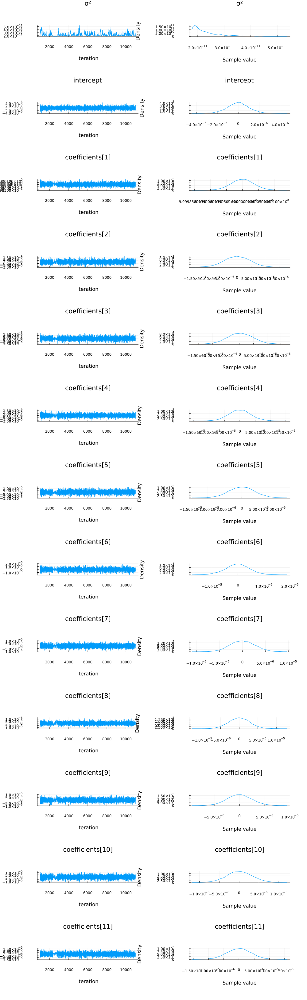

```julia
vi_mean = vec(mean(z; dims=2))[[
    union(sym2range[:coefficients]...)...,
    union(sym2range[:intercept]...)...,
    union(sym2range[:σ²]...)...,
]]
```

```
13-element Vector{Float64}:
  1.0015523412905114
 -0.0009126978807879137
  0.0021597630352901014
  0.0009049826709099784
 -0.0031479280243483588
 -0.0020332393740695974
 -0.001276358603668492
  0.0003629987092139663
 -0.0002843656451937193
 -0.000525550043077333
  0.002739324522866989
 -0.0008135365069472977
  0.0005350545238934559
```


```julia
mcmc_mean = mean(chain, names(chain, :parameters))[:, 2]
```

```
13-element Vector{Float64}:
  5.732706037579716e-12
 -2.556022081637006e-9
  0.9999999814980293
  3.0802377071399787e-8
 -5.1838020679090385e-8
  2.3696412508411026e-9
  6.130915423856005e-8
  8.232734157670126e-8
 -2.399389898268805e-8
 -2.4730963638189145e-8
 -1.0031499850652666e-8
  2.1293919013467664e-8
 -7.342046410350066e-8
```


```julia
plot(mcmc_mean; xticks=1:1:length(mcmc_mean), linestyle=:dot, label="NUTS")
plot!(vi_mean; linestyle=:dot, label="VI")
```

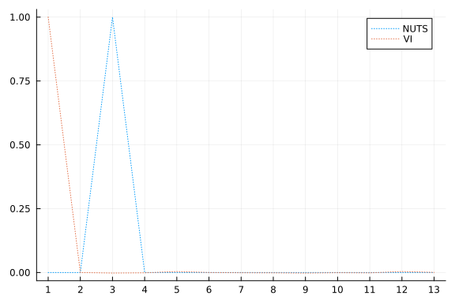


One thing we can look at is simply the squared error between the means:

```julia
sum(abs2, mcmc_mean .- vi_mean)
```

```
1.998818459237037
```


That looks pretty good! But let's see how the predictive distributions looks for the two.

## Prediction

Similarily to the linear regression tutorial, we're going to compare to multivariate ordinary linear regression using the `GLM` package:

```julia
# Import the GLM package.
using GLM

# Perform multivariate OLS.
ols = lm(
    @formula(MPG ~ Cyl + Disp + HP + DRat + WT + QSec + VS + AM + Gear + Carb), train_cut
)

# Store our predictions in the original dataframe.
train_cut.OLSPrediction = unstandardize(GLM.predict(ols), train_unstandardized.MPG)
test_cut.OLSPrediction = unstandardize(GLM.predict(ols, test_cut), train_unstandardized.MPG);
```


```julia
# Make a prediction given an input vector, using mean parameter values from a chain.
function prediction_chain(chain, x)
    p = get_params(chain)
    α = mean(p.intercept)
    β = collect(mean.(p.coefficients))
    return α .+ x * β
end
```

```
prediction_chain (generic function with 1 method)
```


```julia
# Make a prediction using samples from the variational posterior given an input vector.
function prediction(samples::AbstractVector, sym2ranges, x)
    α = mean(samples[union(sym2ranges[:intercept]...)])
    β = vec(mean(samples[union(sym2ranges[:coefficients]...)]; dims=2))
    return α .+ x * β
end

function prediction(samples::AbstractMatrix, sym2ranges, x)
    α = mean(samples[union(sym2ranges[:intercept]...), :])
    β = vec(mean(samples[union(sym2ranges[:coefficients]...), :]; dims=2))
    return α .+ x * β
end
```

```
prediction (generic function with 2 methods)
```


```julia
# Unstandardize the dependent variable.
train_cut.MPG = unstandardize(train_cut.MPG, train_unstandardized.MPG)
test_cut.MPG = unstandardize(test_cut.MPG, train_unstandardized.MPG);
```


```julia
# Show the first side rows of the modified dataframe.
first(test_cut, 6)
```

```
6×12 DataFrame
 Row │ MPG      Cyl       Disp       HP         DRat       WT          QSec
    ⋯
     │ Float64  Float64   Float64    Float64    Float64    Float64     Floa
t64 ⋯
─────┼─────────────────────────────────────────────────────────────────────
─────
   1 │    15.2   1.04746   0.565102   0.258882  -0.652405   0.0714991  -0.7
167 ⋯
   2 │    13.3   1.04746   0.929057   1.90345    0.380435   0.465717   -1.9
040
   3 │    19.2   1.04746   1.32466    0.691663  -0.777058   0.470584   -0.8
737
   4 │    27.3  -1.25696  -1.21511   -1.19526    1.0037    -1.38857     0.2
884
   5 │    26.0  -1.25696  -0.888346  -0.762482   1.62697   -1.18903    -1.0
936 ⋯
   6 │    30.4  -1.25696  -1.08773   -0.381634   0.451665  -1.79933    -0.9
680
                                                               6 columns om
itted
```


```julia
z = rand(q, 10_000);
```


```julia
# Calculate the predictions for the training and testing sets using the samples `z` from variational posterior
train_cut.VIPredictions = unstandardize(
    prediction(z, sym2range, train), train_unstandardized.MPG
)
test_cut.VIPredictions = unstandardize(
    prediction(z, sym2range, test), train_unstandardized.MPG
)

train_cut.BayesPredictions = unstandardize(
    prediction_chain(chain, train), train_unstandardized.MPG
)
test_cut.BayesPredictions = unstandardize(
    prediction_chain(chain, test), train_unstandardized.MPG
);
```


```julia
vi_loss1 = mean((train_cut.VIPredictions - train_cut.MPG) .^ 2)
bayes_loss1 = mean((train_cut.BayesPredictions - train_cut.MPG) .^ 2)
ols_loss1 = mean((train_cut.OLSPrediction - train_cut.MPG) .^ 2)

vi_loss2 = mean((test_cut.VIPredictions - test_cut.MPG) .^ 2)
bayes_loss2 = mean((test_cut.BayesPredictions - test_cut.MPG) .^ 2)
ols_loss2 = mean((test_cut.OLSPrediction - test_cut.MPG) .^ 2)

println("Training set:
    VI loss: $vi_loss1
    Bayes loss: $bayes_loss1
    OLS loss: $ols_loss1
Test set: 
    VI loss: $vi_loss2
    Bayes loss: $bayes_loss2
    OLS loss: $ols_loss2")
```

```
Training set:
    VI loss: 0.000781547968746938
    Bayes loss: 2.0859665717821778e-14
    OLS loss: 3.0709261248930093
Test set: 
    VI loss: 0.0014552351708031945
    Bayes loss: 2.414747877429496e-13
    OLS loss: 27.094813070760562
```


Interestingly the squared difference between true- and mean-prediction on the test-set is actually *better* for the mean-field variational posterior than for the "true" posterior obtained by MCMC sampling using `NUTS`. But, as Bayesians, we know that the mean doesn't tell the entire story. One quick check is to look at the mean predictions ± standard deviation of the two different approaches:

```julia
z = rand(q, 1000);
preds = mapreduce(hcat, eachcol(z)) do zi
    return unstandardize(prediction(zi, sym2range, test), train_unstandardized.MPG)
end

scatter(
    1:size(test, 1),
    mean(preds; dims=2);
    yerr=std(preds; dims=2),
    label="prediction (mean ± std)",
    size=(900, 500),
    markersize=8,
)
scatter!(1:size(test, 1), unstandardize(test_label, train_unstandardized.MPG); label="true")
xaxis!(1:size(test, 1))
ylims!(10, 40)
title!("Mean-field ADVI (Normal)")
```

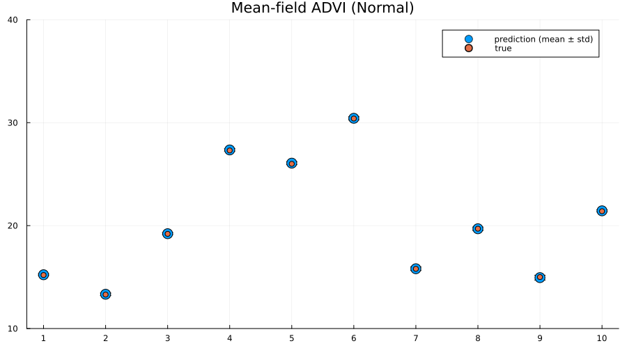

```julia
preds = mapreduce(hcat, 1:5:size(chain, 1)) do i
    return unstandardize(prediction_chain(chain[i], test), train_unstandardized.MPG)
end

scatter(
    1:size(test, 1),
    mean(preds; dims=2);
    yerr=std(preds; dims=2),
    label="prediction (mean ± std)",
    size=(900, 500),
    markersize=8,
)
scatter!(1:size(test, 1), unstandardize(test_label, train_unstandardized.MPG); label="true")
xaxis!(1:size(test, 1))
ylims!(10, 40)
title!("MCMC (NUTS)")
```


Indeed we see that the MCMC approach generally provides better uncertainty estimates than the mean-field ADVI approach! Good. So all the work we've done to make MCMC fast isn't for nothing.

## Alternative: provide parameter-to-distribution instead of $q$ with `update` implemented

As mentioned earlier, it's also possible to just provide the mapping $\theta \mapsto q_{\theta}$ rather than the variational family / initial variational posterior `q`, i.e. use the interface `vi(m, advi, getq, θ_init)` where `getq` is the mapping $\theta \mapsto q_{\theta}$

In this section we're going to construct a mean-field approximation to the model by hand using a composition of`Shift` and `Scale` from Bijectors.jl togheter with a standard multivariate Gaussian as the base distribution.

```julia
using Bijectors
```


```julia
using Bijectors: Scale, Shift
```


```julia
d = length(q)
base_dist = Turing.DistributionsAD.TuringDiagMvNormal(zeros(d), ones(d))
```

```
DistributionsAD.TuringDiagMvNormal{Vector{Float64}, Vector{Float64}}(
m: [0.0, 0.0, 0.0, 0.0, 0.0, 0.0, 0.0, 0.0, 0.0, 0.0, 0.0, 0.0, 0.0]
σ: [1.0, 1.0, 1.0, 1.0, 1.0, 1.0, 1.0, 1.0, 1.0, 1.0, 1.0, 1.0, 1.0]
)
```


`bijector(model::Turing.Model)` is defined by Turing, and will return a `bijector` which takes you from the space of the latent variables to the real space. In this particular case, this is a mapping `((0, ∞) × ℝ × ℝ¹⁰) → ℝ¹²`. We're interested in using a normal distribution as a base-distribution and transform samples to the latent space, thus we need the inverse mapping from the reals to the latent space:

```julia
to_constrained = inv(bijector(m));
```


```julia
function getq(θ)
    d = length(θ) ÷ 2
    A = @inbounds θ[1:d]
    b = @inbounds θ[(d + 1):(2 * d)]

    b = to_constrained ∘ Shift(b; dim=Val(1)) ∘ Scale(exp.(A); dim=Val(1))

    return transformed(base_dist, b)
end
```

```
getq (generic function with 1 method)
```


```julia
q_mf_normal = vi(m, advi, getq, randn(2 * d));
```


```julia
p1 = plot_variational_marginals(rand(q_mf_normal, 10_000), sym2range) # MvDiagNormal + Affine transformation + to_constrained
p2 = plot_variational_marginals(rand(q, 10_000), sym2range)  # Turing.meanfield(m)

plot(p1, p2; layout=(1, 2), size=(800, 2000))
```

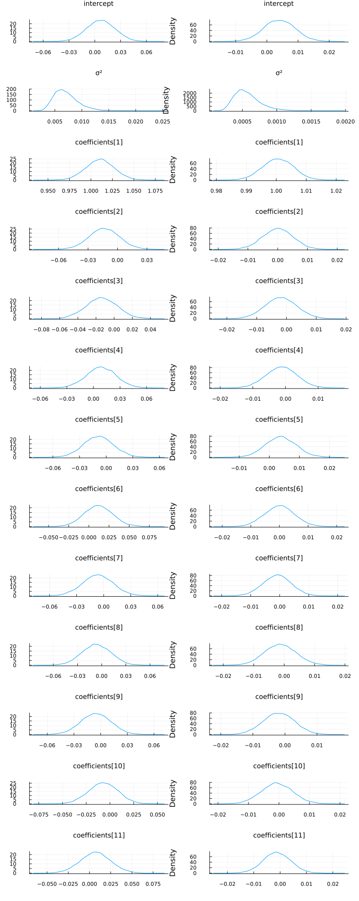


As expected, the fits look pretty much identical.

But using this interface it becomes trivial to go beyond the mean-field assumption we made for the variational posterior, as we'll see in the next section.

### Relaxing the mean-field assumption

Here we'll instead consider the variational family to be a full non-diagonal multivariate Gaussian. As in the previous section we'll implement this by transforming a standard multivariate Gaussian using `Scale` and `Shift`, but now `Scale` will instead be using a lower-triangular matrix (representing the Cholesky of the covariance matrix of a multivariate normal) in contrast to the diagonal matrix we used in for the mean-field approximate posterior.

```julia
# Using `ComponentArrays.jl` together with `UnPack.jl` makes our lives much easier.
using ComponentArrays, UnPack
```


```julia
proto_arr = ComponentArray(; L=zeros(d, d), b=zeros(d))
proto_axes = getaxes(proto_arr)
num_params = length(proto_arr)

function getq(θ)
    L, b = begin
        @unpack L, b = ComponentArray(θ, proto_axes)
        LowerTriangular(L), b
    end
    # For this to represent a covariance matrix we need to ensure that the diagonal is positive.
    # We can enforce this by zeroing out the diagonal and then adding back the diagonal exponentiated.
    D = Diagonal(diag(L))
    A = L - D + exp(D) # exp for Diagonal is the same as exponentiating only the diagonal entries

    b = to_constrained ∘ Shift(b; dim=Val(1)) ∘ Scale(A; dim=Val(1))

    return transformed(base_dist, b)
end
```

```
getq (generic function with 1 method)
```


```julia
advi = ADVI(10, 20_000)
```

```
AdvancedVI.ADVI{AdvancedVI.ForwardDiffAD{0}}(10, 20000)
```


```julia
q_full_normal = vi(
    m, advi, getq, randn(num_params); optimizer=Variational.DecayedADAGrad(1e-2)
);
```


Let's have a look at the learned covariance matrix:

```julia
A = q_full_normal.transform.ts[1].a
```

```
13×13 LinearAlgebra.LowerTriangular{Float64, Matrix{Float64}}:
  0.315351       ⋅          …    ⋅            ⋅           ⋅ 
  0.000804197   0.0161241        ⋅            ⋅           ⋅ 
 -0.00904934    0.00770531       ⋅            ⋅           ⋅ 
  0.00103201   -0.00716426       ⋅            ⋅           ⋅ 
  0.00293685   -0.00564296       ⋅            ⋅           ⋅ 
  0.00587384   -0.0104423   …    ⋅            ⋅           ⋅ 
  0.00793358    0.00389553       ⋅            ⋅           ⋅ 
  0.00144795   -0.0043923        ⋅            ⋅           ⋅ 
 -0.00244058    0.00571685       ⋅            ⋅           ⋅ 
 -0.0056704     0.00614071       ⋅            ⋅           ⋅ 
 -0.00322689    0.00837616  …   0.0225989     ⋅           ⋅ 
  0.0155249    -0.0321327      -0.0180487    0.0160955    ⋅ 
 -0.0173572     0.0265413       0.00392911  -0.00621344  0.0158986
```


```julia
heatmap(cov(A * A'))
```

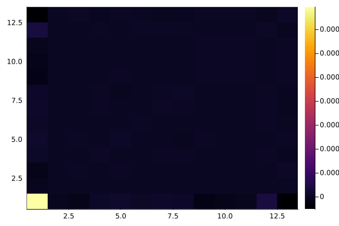

```julia
zs = rand(q_full_normal, 10_000);
```


```julia
p1 = plot_variational_marginals(rand(q_mf_normal, 10_000), sym2range)
p2 = plot_variational_marginals(rand(q_full_normal, 10_000), sym2range)

plot(p1, p2; layout=(1, 2), size=(800, 2000))
```

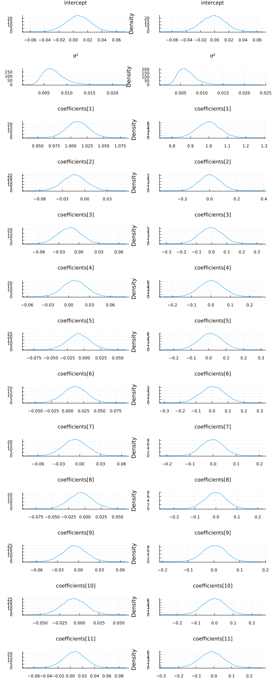


So it seems like the "full" ADVI approach, i.e. no mean-field assumption, obtain the same modes as the mean-field approach but with greater uncertainty for some of the `coefficients`. This

```julia
# Unfortunately, it seems like this has quite a high variance which is likely to be due to numerical instability, 
# so we consider a larger number of samples. If we get a couple of outliers due to numerical issues, 
# these kind affect the mean prediction greatly.
z = rand(q_full_normal, 10_000);
```


```julia
train_cut.VIFullPredictions = unstandardize(
    prediction(z, sym2range, train), train_unstandardized.MPG
)
test_cut.VIFullPredictions = unstandardize(
    prediction(z, sym2range, test), train_unstandardized.MPG
);
```


```julia
vi_loss1 = mean((train_cut.VIPredictions - train_cut.MPG) .^ 2)
vifull_loss1 = mean((train_cut.VIFullPredictions - train_cut.MPG) .^ 2)
bayes_loss1 = mean((train_cut.BayesPredictions - train_cut.MPG) .^ 2)
ols_loss1 = mean((train_cut.OLSPrediction - train_cut.MPG) .^ 2)

vi_loss2 = mean((test_cut.VIPredictions - test_cut.MPG) .^ 2)
vifull_loss2 = mean((test_cut.VIFullPredictions - test_cut.MPG) .^ 2)
bayes_loss2 = mean((test_cut.BayesPredictions - test_cut.MPG) .^ 2)
ols_loss2 = mean((test_cut.OLSPrediction - test_cut.MPG) .^ 2)

println("Training set:
    VI loss: $vi_loss1
    Bayes loss: $bayes_loss1
    OLS loss: $ols_loss1
Test set: 
    VI loss: $vi_loss2
    Bayes loss: $bayes_loss2
    OLS loss: $ols_loss2")
```

```
Training set:
    VI loss: 0.000781547968746938
    Bayes loss: 2.0859665717821778e-14
    OLS loss: 3.0709261248930093
Test set: 
    VI loss: 0.0014552351708031945
    Bayes loss: 2.414747877429496e-13
    OLS loss: 27.094813070760562
```


```julia
z = rand(q_mf_normal, 1000);
preds = mapreduce(hcat, eachcol(z)) do zi
    return unstandardize(prediction(zi, sym2range, test), train_unstandardized.MPG)
end

p1 = scatter(
    1:size(test, 1),
    mean(preds; dims=2);
    yerr=std(preds; dims=2),
    label="prediction (mean ± std)",
    size=(900, 500),
    markersize=8,
)
scatter!(1:size(test, 1), unstandardize(test_label, train_unstandardized.MPG); label="true")
xaxis!(1:size(test, 1))
ylims!(10, 40)
title!("Mean-field ADVI (Normal)")
```

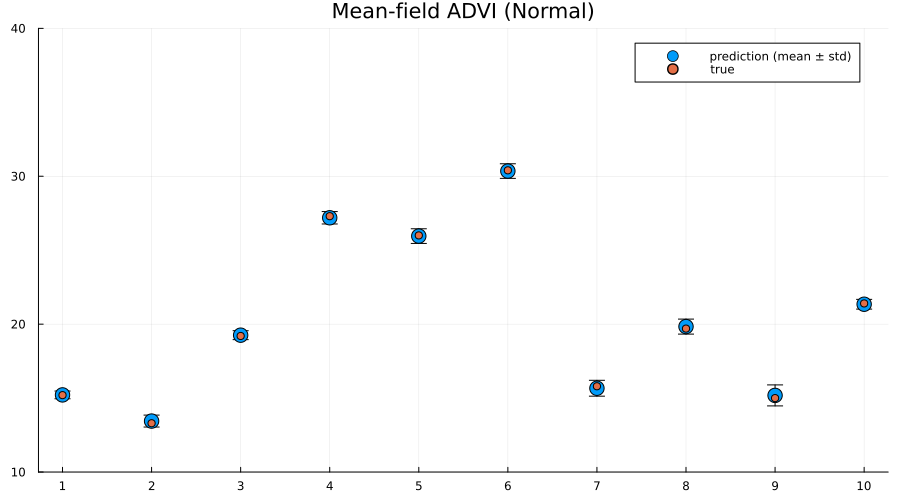

```julia
z = rand(q_full_normal, 1000);
preds = mapreduce(hcat, eachcol(z)) do zi
    return unstandardize(prediction(zi, sym2range, test), train_unstandardized.MPG)
end

p2 = scatter(
    1:size(test, 1),
    mean(preds; dims=2);
    yerr=std(preds; dims=2),
    label="prediction (mean ± std)",
    size=(900, 500),
    markersize=8,
)
scatter!(1:size(test, 1), unstandardize(test_label, train_unstandardized.MPG); label="true")
xaxis!(1:size(test, 1))
ylims!(10, 40)
title!("Full ADVI (Normal)")
```

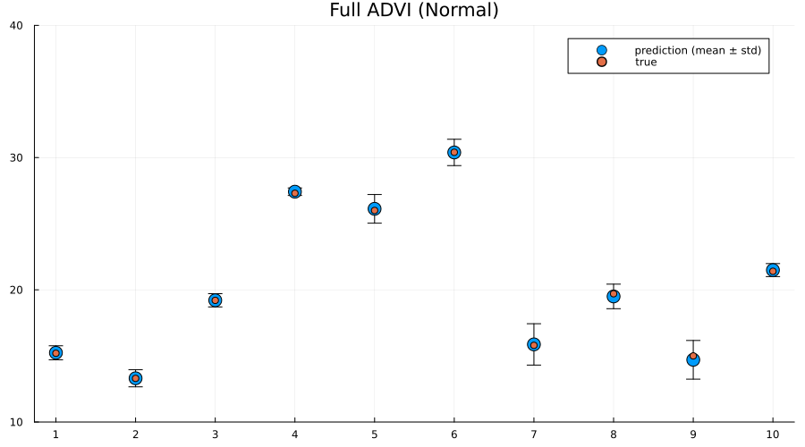

```julia
preds = mapreduce(hcat, 1:5:size(chain, 1)) do i
    return unstandardize(prediction_chain(chain[i], test), train_unstandardized.MPG)
end

p3 = scatter(
    1:size(test, 1),
    mean(preds; dims=2);
    yerr=std(preds; dims=2),
    label="prediction (mean ± std)",
    size=(900, 500),
    markersize=8,
)
scatter!(1:size(test, 1), unstandardize(test_label, train_unstandardized.MPG); label="true")
xaxis!(1:size(test, 1))
ylims!(10, 40)
title!("MCMC (NUTS)")
```

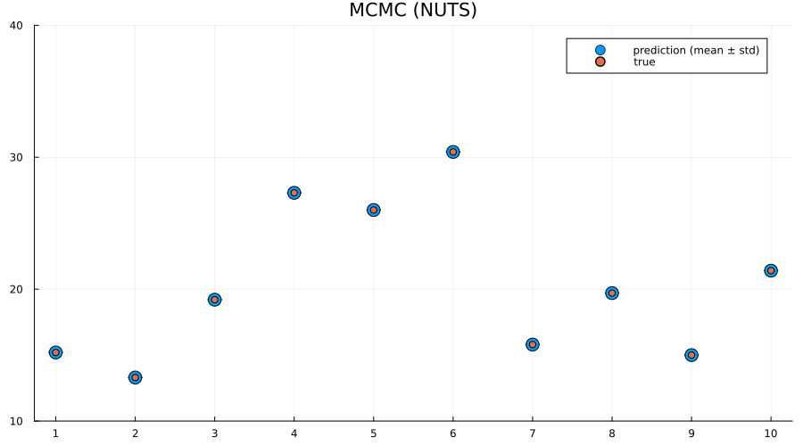

```julia
plot(p1, p2, p3; layout=(1, 3), size=(900, 250), label="")
```

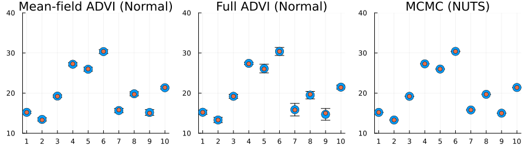


Here we actually see that indeed both the full ADVI and the MCMC approaches does a much better job of quantifying the uncertainty of predictions for never-before-seen samples, with full ADVI seemingly *underestimating* the variance slightly compared to MCMC.

So now you know how to do perform VI on your Turing.jl model! Great isn't it?


## Appendix

These tutorials are a part of the TuringTutorials repository, found at: [https://github.com/TuringLang/TuringTutorials](https://github.com/TuringLang/TuringTutorials).

To locally run this tutorial, do the following commands:

```
using TuringTutorials
TuringTutorials.weave("09-variational-inference", "09_variational-inference.jmd")
```

Computer Information:

```
Julia Version 1.6.7
Commit 3b76b25b64 (2022-07-19 15:11 UTC)
Platform Info:
  OS: Linux (x86_64-pc-linux-gnu)
  CPU: AMD EPYC 7502 32-Core Processor
  WORD_SIZE: 64
  LIBM: libopenlibm
  LLVM: libLLVM-11.0.1 (ORCJIT, znver2)
Environment:
  JULIA_CPU_THREADS = 128
  BUILDKITE_PLUGIN_JULIA_CACHE_DIR = /cache/julia-buildkite-plugin
  JULIA_DEPOT_PATH = /cache/julia-buildkite-plugin/depots/7aa0085e-79a4-45f3-a5bd-9743c91cf3da

```

Package Information:

```
      Status `/cache/build/exclusive-amdci3-0/julialang/turingtutorials/tutorials/09-variational-inference/Project.toml`
  [76274a88] Bijectors v0.10.8
  [b0b7db55] ComponentArrays v0.13.8
  [1a297f60] FillArrays v0.13.10
  [587475ba] Flux v0.13.14
  [38e38edf] GLM v1.8.2
  [442fdcdd] Measures v0.3.2
  [ce6b1742] RDatasets v0.7.7
  [f3b207a7] StatsPlots v0.15.4
  [fce5fe82] Turing v0.22.0
  [3a884ed6] UnPack v1.0.2
  [37e2e46d] LinearAlgebra
  [9a3f8284] Random
```

And the full manifest:

```
      Status `/cache/build/exclusive-amdci3-0/julialang/turingtutorials/tutorials/09-variational-inference/Manifest.toml`
  [621f4979] AbstractFFTs v1.3.1
  [80f14c24] AbstractMCMC v4.2.0
  [7a57a42e] AbstractPPL v0.5.4
  [1520ce14] AbstractTrees v0.4.4
  [7d9f7c33] Accessors v0.1.28
  [79e6a3ab] Adapt v3.6.1
  [0bf59076] AdvancedHMC v0.3.6
  [5b7e9947] AdvancedMH v0.6.8
  [576499cb] AdvancedPS v0.3.8
  [b5ca4192] AdvancedVI v0.1.6
  [dce04be8] ArgCheck v2.3.0
  [7d9fca2a] Arpack v0.5.4
  [4fba245c] ArrayInterface v7.3.1
  [30b0a656] ArrayInterfaceCore v0.1.29
  [dd5226c6] ArrayInterfaceStaticArraysCore v0.1.4
  [a9b6321e] Atomix v0.1.0
  [13072b0f] AxisAlgorithms v1.0.1
  [39de3d68] AxisArrays v0.4.6
  [ab4f0b2a] BFloat16s v0.4.2
  [198e06fe] BangBang v0.3.37
  [9718e550] Baselet v0.1.1
  [76274a88] Bijectors v0.10.8
  [fa961155] CEnum v0.4.2
  [336ed68f] CSV v0.10.9
  [052768ef] CUDA v4.1.0
  [1af6417a] CUDA_Runtime_Discovery v0.1.1
  [49dc2e85] Calculus v0.5.1
  [324d7699] CategoricalArrays v0.10.7
  [082447d4] ChainRules v1.48.0
  [d360d2e6] ChainRulesCore v1.15.7
  [9e997f8a] ChangesOfVariables v0.1.6
  [aaaa29a8] Clustering v0.14.4
  [944b1d66] CodecZlib v0.7.1
  [35d6a980] ColorSchemes v3.20.0
  [3da002f7] ColorTypes v0.11.4
  [c3611d14] ColorVectorSpace v0.9.10
  [5ae59095] Colors v0.12.10
  [861a8166] Combinatorics v1.0.2
  [38540f10] CommonSolve v0.2.3
  [bbf7d656] CommonSubexpressions v0.3.0
  [34da2185] Compat v4.6.1
  [b0b7db55] ComponentArrays v0.13.8
  [a33af91c] CompositionsBase v0.1.1
  [88cd18e8] ConsoleProgressMonitor v0.1.2
  [187b0558] ConstructionBase v1.5.1
  [6add18c4] ContextVariablesX v0.1.3
  [d38c429a] Contour v0.6.2
  [a8cc5b0e] Crayons v4.1.1
  [9a962f9c] DataAPI v1.14.0
  [a93c6f00] DataFrames v1.5.0
  [864edb3b] DataStructures v0.18.13
  [e2d170a0] DataValueInterfaces v1.0.0
  [e7dc6d0d] DataValues v0.4.13
  [244e2a9f] DefineSingletons v0.1.2
  [b429d917] DensityInterface v0.4.0
  [163ba53b] DiffResults v1.1.0
  [b552c78f] DiffRules v1.13.0
  [b4f34e82] Distances v0.10.8
  [31c24e10] Distributions v0.25.86
  [ced4e74d] DistributionsAD v0.6.43
  [ffbed154] DocStringExtensions v0.8.6
  [fa6b7ba4] DualNumbers v0.6.8
  [366bfd00] DynamicPPL v0.21.4
  [cad2338a] EllipticalSliceSampling v1.1.0
  [4e289a0a] EnumX v1.0.4
  [e2ba6199] ExprTools v0.1.9
  [c87230d0] FFMPEG v0.4.1
  [7a1cc6ca] FFTW v1.6.0
  [cc61a311] FLoops v0.2.1
  [b9860ae5] FLoopsBase v0.1.1
  [5789e2e9] FileIO v1.16.0
  [48062228] FilePathsBase v0.9.20
  [1a297f60] FillArrays v0.13.10
  [53c48c17] FixedPointNumbers v0.8.4
  [587475ba] Flux v0.13.14
  [9c68100b] FoldsThreads v0.1.1
  [59287772] Formatting v0.4.2
  [f6369f11] ForwardDiff v0.10.35
  [069b7b12] FunctionWrappers v1.1.3
  [77dc65aa] FunctionWrappersWrappers v0.1.3
  [d9f16b24] Functors v0.3.0
  [38e38edf] GLM v1.8.2
  [0c68f7d7] GPUArrays v8.6.5
  [46192b85] GPUArraysCore v0.1.4
  [61eb1bfa] GPUCompiler v0.18.0
  [28b8d3ca] GR v0.71.8
  [42e2da0e] Grisu v1.0.2
  [cd3eb016] HTTP v0.8.19
  [34004b35] HypergeometricFunctions v0.3.11
  [7869d1d1] IRTools v0.4.9
  [615f187c] IfElse v0.1.1
  [83e8ac13] IniFile v0.5.1
  [22cec73e] InitialValues v0.3.1
  [842dd82b] InlineStrings v1.4.0
  [505f98c9] InplaceOps v0.3.0
  [a98d9a8b] Interpolations v0.14.7
  [8197267c] IntervalSets v0.7.4
  [3587e190] InverseFunctions v0.1.8
  [41ab1584] InvertedIndices v1.3.0
  [92d709cd] IrrationalConstants v0.2.2
  [c8e1da08] IterTools v1.4.0
  [82899510] IteratorInterfaceExtensions v1.0.0
  [1019f520] JLFzf v0.1.5
  [692b3bcd] JLLWrappers v1.4.1
  [682c06a0] JSON v0.21.3
  [b14d175d] JuliaVariables v0.2.4
  [63c18a36] KernelAbstractions v0.9.0
  [5ab0869b] KernelDensity v0.6.5
  [929cbde3] LLVM v4.17.1
  [8ac3fa9e] LRUCache v1.4.0
  [b964fa9f] LaTeXStrings v1.3.0
  [23fbe1c1] Latexify v0.15.18
  [1d6d02ad] LeftChildRightSiblingTrees v0.2.0
  [6f1fad26] Libtask v0.7.0
  [6fdf6af0] LogDensityProblems v1.0.3
  [2ab3a3ac] LogExpFunctions v0.3.23
  [e6f89c97] LoggingExtras v0.4.9
  [c7f686f2] MCMCChains v5.7.1
  [be115224] MCMCDiagnosticTools v0.2.6
  [e80e1ace] MLJModelInterface v1.8.0
  [d8e11817] MLStyle v0.4.17
  [f1d291b0] MLUtils v0.4.1
  [1914dd2f] MacroTools v0.5.10
  [dbb5928d] MappedArrays v0.4.1
  [739be429] MbedTLS v1.1.7
  [442fdcdd] Measures v0.3.2
  [128add7d] MicroCollections v0.1.4
  [e1d29d7a] Missings v1.1.0
  [78c3b35d] Mocking v0.7.6
  [6f286f6a] MultivariateStats v0.10.1
  [872c559c] NNlib v0.8.19
  [a00861dc] NNlibCUDA v0.2.7
  [77ba4419] NaNMath v1.0.2
  [71a1bf82] NameResolution v0.1.5
  [86f7a689] NamedArrays v0.9.7
  [c020b1a1] NaturalSort v1.0.0
  [b8a86587] NearestNeighbors v0.4.13
  [510215fc] Observables v0.5.4
  [6fe1bfb0] OffsetArrays v1.12.9
  [0b1bfda6] OneHotArrays v0.2.3
  [3bd65402] Optimisers v0.2.15
  [bac558e1] OrderedCollections v1.4.1
  [90014a1f] PDMats v0.11.17
  [69de0a69] Parsers v2.5.8
  [b98c9c47] Pipe v1.3.0
  [ccf2f8ad] PlotThemes v3.1.0
  [995b91a9] PlotUtils v1.3.4
  [91a5bcdd] Plots v1.38.8
  [2dfb63ee] PooledArrays v1.4.2
  [21216c6a] Preferences v1.3.0
  [8162dcfd] PrettyPrint v0.2.0
  [08abe8d2] PrettyTables v2.2.3
  [33c8b6b6] ProgressLogging v0.1.4
  [92933f4c] ProgressMeter v1.7.2
  [1fd47b50] QuadGK v2.8.2
  [df47a6cb] RData v0.8.3
  [ce6b1742] RDatasets v0.7.7
  [74087812] Random123 v1.6.0
  [e6cf234a] RandomNumbers v1.5.3
  [b3c3ace0] RangeArrays v0.3.2
  [c84ed2f1] Ratios v0.4.3
  [c1ae055f] RealDot v0.1.0
  [3cdcf5f2] RecipesBase v1.3.3
  [01d81517] RecipesPipeline v0.6.11
  [731186ca] RecursiveArrayTools v2.32.3
  [189a3867] Reexport v1.2.2
  [05181044] RelocatableFolders v1.0.0
  [ae029012] Requires v1.3.0
  [79098fc4] Rmath v0.7.1
  [f2b01f46] Roots v2.0.10
  [7e49a35a] RuntimeGeneratedFunctions v0.5.6
  [0bca4576] SciMLBase v1.81.0
  [30f210dd] ScientificTypesBase v3.0.0
  [6c6a2e73] Scratch v1.2.0
  [91c51154] SentinelArrays v1.3.18
  [efcf1570] Setfield v1.1.1
  [1277b4bf] ShiftedArrays v2.0.0
  [605ecd9f] ShowCases v0.1.0
  [992d4aef] Showoff v1.0.3
  [699a6c99] SimpleTraits v0.9.4
  [66db9d55] SnoopPrecompile v1.0.3
  [a2af1166] SortingAlgorithms v1.1.0
  [276daf66] SpecialFunctions v2.2.0
  [171d559e] SplittablesBase v0.1.15
  [aedffcd0] Static v0.8.6
  [0d7ed370] StaticArrayInterface v1.3.0
  [90137ffa] StaticArrays v1.5.19
  [1e83bf80] StaticArraysCore v1.4.0
  [64bff920] StatisticalTraits v3.2.0
  [82ae8749] StatsAPI v1.5.0
  [2913bbd2] StatsBase v0.33.21
  [4c63d2b9] StatsFuns v1.3.0
  [3eaba693] StatsModels v0.7.0
  [f3b207a7] StatsPlots v0.15.4
  [892a3eda] StringManipulation v0.3.0
  [09ab397b] StructArrays v0.6.15
  [ab02a1b2] TableOperations v1.2.0
  [3783bdb8] TableTraits v1.0.1
  [bd369af6] Tables v1.10.1
  [62fd8b95] TensorCore v0.1.1
  [5d786b92] TerminalLoggers v0.1.6
  [f269a46b] TimeZones v1.9.1
  [a759f4b9] TimerOutputs v0.5.22
  [9f7883ad] Tracker v0.2.23
  [3bb67fe8] TranscodingStreams v0.9.11
  [28d57a85] Transducers v0.4.75
  [fce5fe82] Turing v0.22.0
  [3a884ed6] UnPack v1.0.2
  [1cfade01] UnicodeFun v0.4.1
  [013be700] UnsafeAtomics v0.2.1
  [d80eeb9a] UnsafeAtomicsLLVM v0.1.0
  [41fe7b60] Unzip v0.1.2
  [ea10d353] WeakRefStrings v1.4.2
  [cc8bc4a8] Widgets v0.6.6
  [efce3f68] WoodburyMatrices v0.5.5
  [76eceee3] WorkerUtilities v1.6.1
  [e88e6eb3] Zygote v0.6.59
  [700de1a5] ZygoteRules v0.2.3
  [02a925ec] cuDNN v1.0.2
  [68821587] Arpack_jll v3.5.0+3
  [6e34b625] Bzip2_jll v1.0.8+0
  [4ee394cb] CUDA_Driver_jll v0.4.0+2
  [76a88914] CUDA_Runtime_jll v0.4.0+2
  [62b44479] CUDNN_jll v8.8.1+0
  [83423d85] Cairo_jll v1.16.1+1
  [2e619515] Expat_jll v2.4.8+0
  [b22a6f82] FFMPEG_jll v4.4.2+2
  [f5851436] FFTW_jll v3.3.10+0
  [a3f928ae] Fontconfig_jll v2.13.93+0
  [d7e528f0] FreeType2_jll v2.10.4+0
  [559328eb] FriBidi_jll v1.0.10+0
  [0656b61e] GLFW_jll v3.3.8+0
  [d2c73de3] GR_jll v0.71.8+0
  [78b55507] Gettext_jll v0.21.0+0
  [7746bdde] Glib_jll v2.74.0+2
  [3b182d85] Graphite2_jll v1.3.14+0
  [2e76f6c2] HarfBuzz_jll v2.8.1+1
  [1d5cc7b8] IntelOpenMP_jll v2018.0.3+2
  [aacddb02] JpegTurbo_jll v2.1.91+0
  [c1c5ebd0] LAME_jll v3.100.1+0
  [88015f11] LERC_jll v3.0.0+1
  [dad2f222] LLVMExtra_jll v0.0.18+0
  [dd4b983a] LZO_jll v2.10.1+0
  [e9f186c6] Libffi_jll v3.2.2+1
  [d4300ac3] Libgcrypt_jll v1.8.7+0
  [7e76a0d4] Libglvnd_jll v1.6.0+0
  [7add5ba3] Libgpg_error_jll v1.42.0+0
  [94ce4f54] Libiconv_jll v1.16.1+2
  [4b2f31a3] Libmount_jll v2.35.0+0
  [89763e89] Libtiff_jll v4.4.0+0
  [38a345b3] Libuuid_jll v2.36.0+0
  [856f044c] MKL_jll v2022.2.0+0
  [e7412a2a] Ogg_jll v1.3.5+1
  [458c3c95] OpenSSL_jll v1.1.20+0
  [efe28fd5] OpenSpecFun_jll v0.5.5+0
  [91d4177d] Opus_jll v1.3.2+0
  [30392449] Pixman_jll v0.40.1+0
  [ea2cea3b] Qt5Base_jll v5.15.3+2
  [f50d1b31] Rmath_jll v0.4.0+0
  [a2964d1f] Wayland_jll v1.21.0+0
  [2381bf8a] Wayland_protocols_jll v1.25.0+0
  [02c8fc9c] XML2_jll v2.10.3+0
  [aed1982a] XSLT_jll v1.1.34+0
  [4f6342f7] Xorg_libX11_jll v1.6.9+4
  [0c0b7dd1] Xorg_libXau_jll v1.0.9+4
  [935fb764] Xorg_libXcursor_jll v1.2.0+4
  [a3789734] Xorg_libXdmcp_jll v1.1.3+4
  [1082639a] Xorg_libXext_jll v1.3.4+4
  [d091e8ba] Xorg_libXfixes_jll v5.0.3+4
  [a51aa0fd] Xorg_libXi_jll v1.7.10+4
  [d1454406] Xorg_libXinerama_jll v1.1.4+4
  [ec84b674] Xorg_libXrandr_jll v1.5.2+4
  [ea2f1a96] Xorg_libXrender_jll v0.9.10+4
  [14d82f49] Xorg_libpthread_stubs_jll v0.1.0+3
  [c7cfdc94] Xorg_libxcb_jll v1.13.0+3
  [cc61e674] Xorg_libxkbfile_jll v1.1.0+4
  [12413925] Xorg_xcb_util_image_jll v0.4.0+1
  [2def613f] Xorg_xcb_util_jll v0.4.0+1
  [975044d2] Xorg_xcb_util_keysyms_jll v0.4.0+1
  [0d47668e] Xorg_xcb_util_renderutil_jll v0.3.9+1
  [c22f9ab0] Xorg_xcb_util_wm_jll v0.4.1+1
  [35661453] Xorg_xkbcomp_jll v1.4.2+4
  [33bec58e] Xorg_xkeyboard_config_jll v2.27.0+4
  [c5fb5394] Xorg_xtrans_jll v1.4.0+3
  [3161d3a3] Zstd_jll v1.5.4+0
  [214eeab7] fzf_jll v0.29.0+0
  [a4ae2306] libaom_jll v3.4.0+0
  [0ac62f75] libass_jll v0.15.1+0
  [f638f0a6] libfdk_aac_jll v2.0.2+0
  [b53b4c65] libpng_jll v1.6.38+0
  [f27f6e37] libvorbis_jll v1.3.7+1
  [1270edf5] x264_jll v2021.5.5+0
  [dfaa095f] x265_jll v3.5.0+0
  [d8fb68d0] xkbcommon_jll v1.4.1+0
  [0dad84c5] ArgTools
  [56f22d72] Artifacts
  [2a0f44e3] Base64
  [ade2ca70] Dates
  [8bb1440f] DelimitedFiles
  [8ba89e20] Distributed
  [f43a241f] Downloads
  [9fa8497b] Future
  [b77e0a4c] InteractiveUtils
  [4af54fe1] LazyArtifacts
  [b27032c2] LibCURL
  [76f85450] LibGit2
  [8f399da3] Libdl
  [37e2e46d] LinearAlgebra
  [56ddb016] Logging
  [d6f4376e] Markdown
  [a63ad114] Mmap
  [ca575930] NetworkOptions
  [44cfe95a] Pkg
  [de0858da] Printf
  [3fa0cd96] REPL
  [9a3f8284] Random
  [ea8e919c] SHA
  [9e88b42a] Serialization
  [1a1011a3] SharedArrays
  [6462fe0b] Sockets
  [2f01184e] SparseArrays
  [10745b16] Statistics
  [4607b0f0] SuiteSparse
  [fa267f1f] TOML
  [a4e569a6] Tar
  [8dfed614] Test
  [cf7118a7] UUIDs
  [4ec0a83e] Unicode
  [e66e0078] CompilerSupportLibraries_jll
  [deac9b47] LibCURL_jll
  [29816b5a] LibSSH2_jll
  [c8ffd9c3] MbedTLS_jll
  [14a3606d] MozillaCACerts_jll
  [4536629a] OpenBLAS_jll
  [05823500] OpenLibm_jll
  [efcefdf7] PCRE2_jll
  [83775a58] Zlib_jll
  [8e850ede] nghttp2_jll
  [3f19e933] p7zip_jll
```


```julia
```
