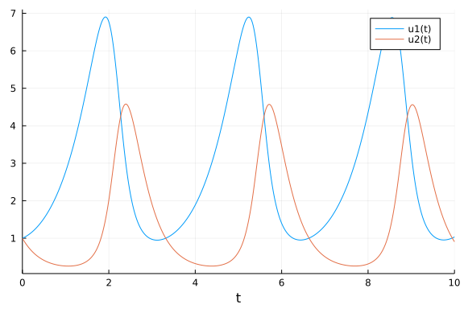
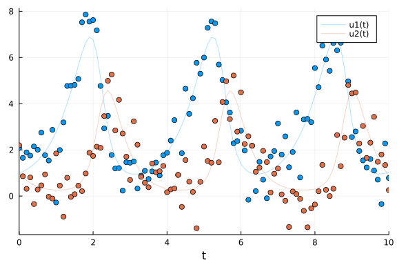
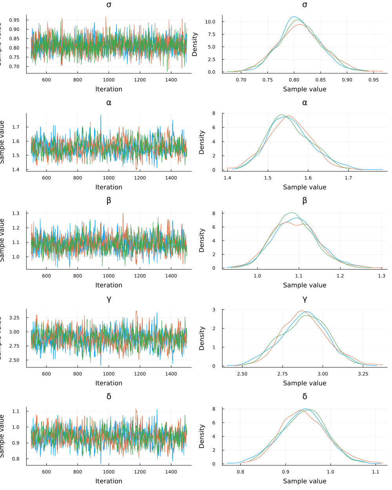
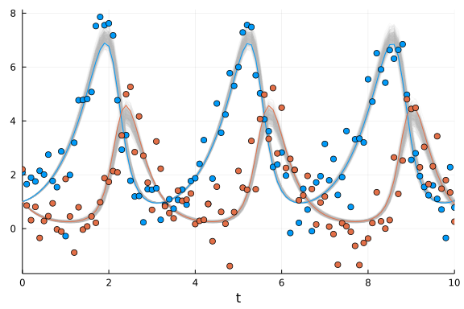
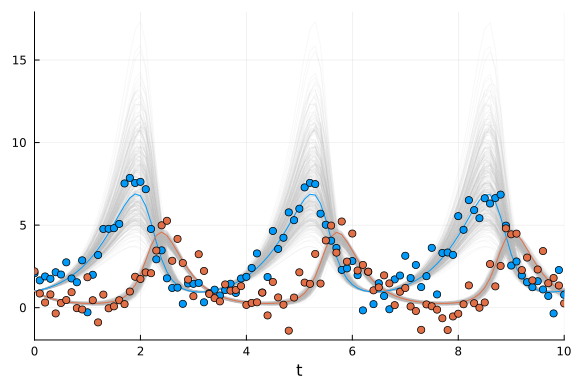
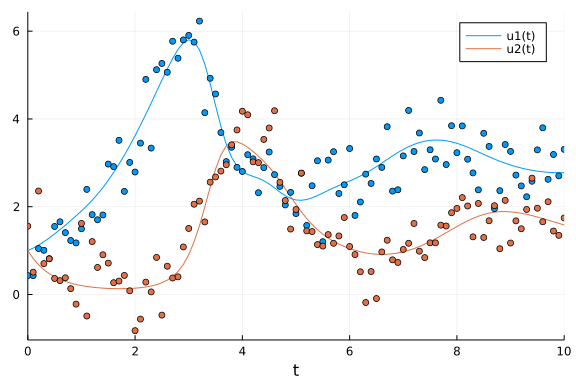
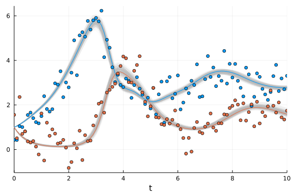
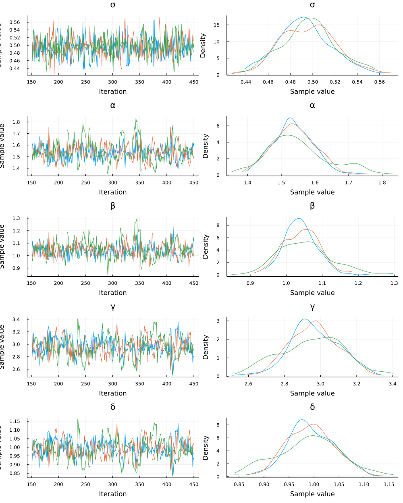
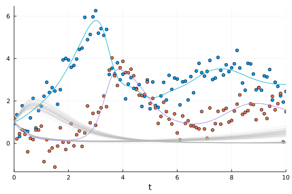

Most of the scientific community deals with the basic problem of trying to mathematically model the reality around them and this often involves dynamical systems. The general trend to model these complex dynamical systems is through the use of differential equations. Differential equation models often have non-measurable parameters. The popular “forward-problem” of simulation consists of solving the differential equations for a given set of parameters, the “inverse problem” to simulation, known as parameter estimation, is the process of utilizing data to determine these model parameters.
Bayesian inference provides a robust approach to parameter estimation with quantified uncertainty.

```julia
using Turing
using DifferentialEquations

# Load StatsPlots for visualizations and diagnostics.
using StatsPlots

using LinearAlgebra

# Set a seed for reproducibility.
using Random
Random.seed!(14);
```


## The Lotka-Volterra Model

The Lotka–Volterra equations, also known as the predator–prey equations, are a pair of first-order nonlinear differential equations.
These differential equations are frequently used to describe the dynamics of biological systems in which two species interact, one as a predator and the other as prey.
The populations change through time according to the pair of equations

$$
\begin{aligned}
\frac{\mathrm{d}x}{\mathrm{d}t} &= (\alpha - \beta y(t))x(t), \\
\frac{\mathrm{d}y}{\mathrm{d}t} &= (\delta x(t) - \gamma)y(t)
\end{aligned}
$$

where $x(t)$ and $y(t)$ denote the populations of prey and predator at time $t$, respectively, and $\alpha, \beta, \gamma, \delta$ are positive parameters.

We implement the Lotka-Volterra model and simulate it with parameters $\alpha = 1.5$, $\beta = 1$, $\gamma = 3$, and $\delta = 1$ and initial conditions $x(0) = y(0) = 1$.

```julia
# Define Lotka-Volterra model.
function lotka_volterra(du, u, p, t)
    # Model parameters.
    α, β, γ, δ = p
    # Current state.
    x, y = u

    # Evaluate differential equations.
    du[1] = (α - β * y) * x # prey
    du[2] = (δ * x - γ) * y # predator

    return nothing
end

# Define initial-value problem.
u0 = [1.0, 1.0]
p = [1.5, 1.0, 3.0, 1.0]
tspan = (0.0, 10.0)
prob = ODEProblem(lotka_volterra, u0, tspan, p)

# Plot simulation.
plot(solve(prob, Tsit5()))
```




We generate noisy observations to use for the parameter estimation tasks in this tutorial.
With the [`saveat` argument](https://docs.sciml.ai/latest/basics/common_solver_opts/) we specify that the solution is stored only at `0.1` time units.
To make the example more realistic we add random normally distributed noise to the simulation.

```julia
sol = solve(prob, Tsit5(); saveat=0.1)
odedata = Array(sol) + 0.8 * randn(size(Array(sol)))

# Plot simulation and noisy observations.
plot(sol; alpha=0.3)
scatter!(sol.t, odedata'; color=[1 2], label="")
```




## Direct Handling of Bayesian Estimation with Turing

Previously, functions in Turing and DifferentialEquations were not inter-composable, so Bayesian inference of differential equations needed to be handled by another package called [DiffEqBayes.jl](https://github.com/SciML/DiffEqBayes.jl) (note that DiffEqBayes works also with CmdStan.jl, Turing.jl, DynamicHMC.jl and ApproxBayes.jl - see the [DiffEqBayes docs](https://docs.sciml.ai/latest/analysis/parameter_estimation/#Bayesian-Methods-1) for more info).

Nowadays, however, Turing and DifferentialEquations are completely composable and we can just simulate differential equations inside a Turing `@model`.
Therefore, we write the Lotka-Volterra parameter estimation problem using the Turing `@model` macro as below:

```julia
@model function fitlv(data, prob)
    # Prior distributions.
    σ ~ InverseGamma(2, 3)
    α ~ truncated(Normal(1.5, 0.5), 0.5, 2.5)
    β ~ truncated(Normal(1.2, 0.5), 0, 2)
    γ ~ truncated(Normal(3.0, 0.5), 1, 4)
    δ ~ truncated(Normal(1.0, 0.5), 0, 2)

    # Simulate Lotka-Volterra model. 
    p = [α, β, γ, δ]
    predicted = solve(prob, Tsit5(); p=p, saveat=0.1)

    # Observations.
    for i in 1:length(predicted)
        data[:, i] ~ MvNormal(predicted[i], σ^2 * I)
    end

    return nothing
end

model = fitlv(odedata, prob)

# Sample 3 independent chains with forward-mode automatic differentiation (the default).
chain = sample(model, NUTS(0.65), MCMCSerial(), 1000, 3; progress=false)
```

```
Chains MCMC chain (1000×17×3 Array{Float64, 3}):

Iterations        = 501:1:1500
Number of chains  = 3
Samples per chain = 1000
Wall duration     = 52.56 seconds
Compute duration  = 52.13 seconds
parameters        = σ, α, β, γ, δ
internals         = lp, n_steps, is_accept, acceptance_rate, log_density, h
amiltonian_energy, hamiltonian_energy_error, max_hamiltonian_energy_error, 
tree_depth, numerical_error, step_size, nom_step_size

Summary Statistics
  parameters      mean       std   naive_se      mcse         ess      rhat
    ⋯
      Symbol   Float64   Float64    Float64   Float64     Float64   Float64
    ⋯

           σ    0.8120    0.0410     0.0007    0.0011   1734.7161    1.0007
    ⋯
           α    1.5541    0.0538     0.0010    0.0021    793.4515    1.0011
    ⋯
           β    1.0904    0.0533     0.0010    0.0018    915.4801    1.0012
    ⋯
           γ    2.8852    0.1427     0.0026    0.0053    815.7527    1.0009
    ⋯
           δ    0.9403    0.0506     0.0009    0.0019    806.1465    1.0010
    ⋯
                                                                1 column om
itted

Quantiles
  parameters      2.5%     25.0%     50.0%     75.0%     97.5%
      Symbol   Float64   Float64   Float64   Float64   Float64

           σ    0.7342    0.7853    0.8099    0.8379    0.8958
           α    1.4551    1.5169    1.5509    1.5888    1.6645
           β    0.9930    1.0533    1.0882    1.1248    1.2030
           γ    2.6111    2.7871    2.8858    2.9821    3.1675
           δ    0.8422    0.9053    0.9404    0.9736    1.0395
```


The estimated parameters are close to the parameter values the observations were generated with.
We can also check visually that the chains have converged.

```julia
plot(chain)
```




### Data retrodiction

In Bayesian analysis it is often useful to retrodict the data, i.e. generate simulated data using samples from the posterior distribution, and compare to the original data (see for instance section 3.3.2 - model checking of McElreath's book "Statistical Rethinking").
Here, we solve the ODE for 300 randomly picked posterior samples in the `chain`.
We plot the ensemble of solutions to check if the solution resembles the data.
The 300 retrodicted time courses from the posterior are plotted in gray, the noisy observations are shown as blue and red dots, and the green and purple lines are the ODE solution that was used to generate the data.

```julia
plot(; legend=false)
posterior_samples = sample(chain[[:α, :β, :γ, :δ]], 300; replace=false)
for p in eachrow(Array(posterior_samples))
    sol_p = solve(prob, Tsit5(); p=p, saveat=0.1)
    plot!(sol_p; alpha=0.1, color="#BBBBBB")
end

# Plot simulation and noisy observations.
plot!(sol; color=[1 2], linewidth=1)
scatter!(sol.t, odedata'; color=[1 2])
```




We can see that, even though we added quite a bit of noise to the data the posterior distribution reproduces quite accurately the "true" ODE solution.

## Lotka-Volterra model without data of prey

One can also perform parameter inference for a Lotka-Volterra model with incomplete data.
For instance, let us suppose we have only observations of the predators but not of the prey.
I.e., we fit the model only to the $y$ variable of the system without providing any data for $x$:

```julia
@model function fitlv2(data::AbstractVector, prob)
    # Prior distributions.
    σ ~ InverseGamma(2, 3)
    α ~ truncated(Normal(1.5, 0.5), 0.5, 2.5)
    β ~ truncated(Normal(1.2, 0.5), 0, 2)
    γ ~ truncated(Normal(3.0, 0.5), 1, 4)
    δ ~ truncated(Normal(1.0, 0.5), 0, 2)

    # Simulate Lotka-Volterra model but save only the second state of the system (predators).
    p = [α, β, γ, δ]
    predicted = solve(prob, Tsit5(); p=p, saveat=0.1, save_idxs=2)

    # Observations of the predators.
    data ~ MvNormal(predicted.u, σ^2 * I)

    return nothing
end

model2 = fitlv2(odedata[2, :], prob)

# Sample 3 independent chains.
chain2 = sample(model2, NUTS(0.45), MCMCSerial(), 5000, 3; progress=false)
```

```
Chains MCMC chain (5000×17×3 Array{Float64, 3}):

Iterations        = 1001:1:6000
Number of chains  = 3
Samples per chain = 5000
Wall duration     = 39.17 seconds
Compute duration  = 38.66 seconds
parameters        = σ, α, β, γ, δ
internals         = lp, n_steps, is_accept, acceptance_rate, log_density, h
amiltonian_energy, hamiltonian_energy_error, max_hamiltonian_energy_error, 
tree_depth, numerical_error, step_size, nom_step_size

Summary Statistics
  parameters      mean       std   naive_se      mcse        ess      rhat 
  e ⋯
      Symbol   Float64   Float64    Float64   Float64    Float64   Float64 
    ⋯

           σ    0.8122    0.0601     0.0005    0.0034   178.0090    1.0098 
    ⋯
           α    1.5606    0.1854     0.0015    0.0093   194.7338    1.0109 
    ⋯
           β    1.1210    0.1483     0.0012    0.0072   209.2477    1.0063 
    ⋯
           γ    2.9673    0.3052     0.0025    0.0157   188.1207    1.0214 
    ⋯
           δ    0.9510    0.2444     0.0020    0.0120   208.6355    1.0119 
    ⋯
                                                                1 column om
itted

Quantiles
  parameters      2.5%     25.0%     50.0%     75.0%     97.5%
      Symbol   Float64   Float64   Float64   Float64   Float64

           σ    0.7105    0.7688    0.8046    0.8495    0.9449
           α    1.2446    1.4351    1.5359    1.6718    1.9816
           β    0.8729    1.0184    1.1030    1.2133    1.4521
           γ    2.3967    2.7612    2.9610    3.1443    3.6634
           δ    0.5074    0.7749    0.9463    1.1042    1.4739
```


Again we inspect the trajectories of 300 randomly selected posterior samples.

```julia
plot(; legend=false)
posterior_samples = sample(chain2[[:α, :β, :γ, :δ]], 300; replace=false)
for p in eachrow(Array(posterior_samples))
    sol_p = solve(prob, Tsit5(); p=p, saveat=0.1)
    plot!(sol_p; alpha=0.1, color="#BBBBBB")
end

# Plot simulation and noisy observations.
plot!(sol; color=[1 2], linewidth=1)
scatter!(sol.t, odedata'; color=[1 2])
```




Note that here the observations of the prey (blue dots) were not used in the parameter estimation!
Yet, the model can predict the values of $x$ relatively accurately, albeit with a wider distribution of solutions, reflecting the greater uncertainty in the prediction of the $x$ values.

## Inference of Delay Differential Equations

Here we show an example of inference with another type of differential equation: a Delay Differential Equation (DDE).
DDEs are differential equations where derivatives are function of values at an earlier point in time.
This is useful to model a delayed effect, like incubation time of a virus for instance.

Here is a delayed version of the Lokta-Voltera system:

$$
\begin{aligned}
\frac{\mathrm{d}x}{\mathrm{d}t} &= \alpha x(t-\tau) - \beta y(t) x(t),\\
\frac{\mathrm{d}y}{\mathrm{d}t} &= - \gamma y(t) + \delta x(t) y(t),
\end{aligned}
$$

where $\tau$ is a (positive) delay and $x(t-\tau)$ is the variable $x$ at an earlier time point $t - \tau$.

The initial-value problem of the delayed system can be implemented as a [`DDEProblem`](https://diffeq.sciml.ai/stable/tutorials/dde_example/).
As described in the [DDE example](https://diffeq.sciml.ai/stable/tutorials/dde_example/), here the function `h` is the history function that can be used to obtain a state at an earlier time point.
Again we use parameters $\alpha = 1.5$, $\beta = 1$, $\gamma = 3$, and $\delta = 1$ and initial conditions $x(0) = y(0) = 1$.
Moreover, we assume $x(t) = 1$ for $t < 0$.

```julia
function delay_lotka_volterra(du, u, h, p, t)
    # Model parameters.
    α, β, γ, δ = p

    # Current state.
    x, y = u
    # Evaluate differential equations
    du[1] = α * h(p, t - 1; idxs=1) - β * x * y
    du[2] = -γ * y + δ * x * y

    return nothing
end

# Define initial-value problem.
p = (1.5, 1.0, 3.0, 1.0)
u0 = [1.0; 1.0]
tspan = (0.0, 10.0)
h(p, t; idxs::Int) = 1.0
prob_dde = DDEProblem(delay_lotka_volterra, u0, h, tspan, p);
```


We generate observations by adding normally distributed noise to the results of our simulations.

```julia
sol_dde = solve(prob_dde; saveat=0.1)
ddedata = Array(sol_dde) + 0.5 * randn(size(sol_dde))

# Plot simulation and noisy observations.
plot(sol_dde)
scatter!(sol_dde.t, ddedata'; color=[1 2], label="")
```




Now we define the Turing model for the Lotka-Volterra model with delay and sample 3 independent chains.

```julia
@model function fitlv_dde(data, prob)
    # Prior distributions.
    σ ~ InverseGamma(2, 3)
    α ~ Truncated(Normal(1.5, 0.5), 0.5, 2.5)
    β ~ Truncated(Normal(1.2, 0.5), 0, 2)
    γ ~ Truncated(Normal(3.0, 0.5), 1, 4)
    δ ~ Truncated(Normal(1.0, 0.5), 0, 2)

    # Simulate Lotka-Volterra model.
    p = [α, β, γ, δ]
    predicted = solve(prob, MethodOfSteps(Tsit5()); p=p, saveat=0.1)

    # Observations.
    for i in 1:length(predicted)
        data[:, i] ~ MvNormal(predicted[i], σ^2 * I)
    end
end

model_dde = fitlv_dde(ddedata, prob_dde)

# Sample 3 independent chains.
chain_dde = sample(model_dde, NUTS(0.65), MCMCSerial(), 300, 3; progress=false)
```

```
Chains MCMC chain (300×17×3 Array{Float64, 3}):

Iterations        = 151:1:450
Number of chains  = 3
Samples per chain = 300
Wall duration     = 22.38 seconds
Compute duration  = 21.99 seconds
parameters        = σ, α, β, γ, δ
internals         = lp, n_steps, is_accept, acceptance_rate, log_density, h
amiltonian_energy, hamiltonian_energy_error, max_hamiltonian_energy_error, 
tree_depth, numerical_error, step_size, nom_step_size

Summary Statistics
  parameters      mean       std   naive_se      mcse        ess      rhat 
  e ⋯
      Symbol   Float64   Float64    Float64   Float64    Float64   Float64 
    ⋯

           σ    0.5274    0.0275     0.0009    0.0009   713.6394    1.0017 
    ⋯
           α    1.5019    0.0657     0.0022    0.0043   187.5820    1.0312 
    ⋯
           β    0.9800    0.0480     0.0016    0.0029   227.2167    1.0193 
    ⋯
           γ    2.9852    0.1538     0.0051    0.0097   198.0514    1.0280 
    ⋯
           δ    1.0023    0.0537     0.0018    0.0034   190.5342    1.0255 
    ⋯
                                                                1 column om
itted

Quantiles
  parameters      2.5%     25.0%     50.0%     75.0%     97.5%
      Symbol   Float64   Float64   Float64   Float64   Float64

           σ    0.4812    0.5070    0.5249    0.5451    0.5856
           α    1.3771    1.4555    1.5034    1.5449    1.6252
           β    0.8898    0.9474    0.9793    1.0116    1.0788
           γ    2.7227    2.8751    2.9726    3.0835    3.2956
           δ    0.9098    0.9639    0.9963    1.0359    1.1115
```


```julia
plot(chain_dde)
```


Finally, plot trajectories of 300 randomly selected samples from the posterior.
Again, the dots indicate our observations, the colored lines are the "true" simulations without noise, and the gray lines are trajectories from the posterior samples.

```julia
plot(; legend=false)
posterior_samples = sample(chain_dde[[:α, :β, :γ, :δ]], 300; replace=false)
for p in eachrow(Array(posterior_samples))
    sol_p = solve(prob_dde, MethodOfSteps(Tsit5()); p=p, saveat=0.1)
    plot!(sol_p; alpha=0.1, color="#BBBBBB")
end

# Plot simulation and noisy observations.
plot!(sol_dde; color=[1 2], linewidth=1)
scatter!(sol_dde.t, ddedata'; color=[1 2])
```




The fit is pretty good even though the data was quite noisy to start.

## Scaling to Large Models: Adjoint Sensitivities

DifferentialEquations.jl's efficiency for large stiff models has been shown in multiple [benchmarks](https://github.com/SciML/DiffEqBenchmarks.jl).
To learn more about how to optimize solving performance for stiff problems you can take a look at the [docs](https://docs.sciml.ai/latest/tutorials/advanced_ode_example/).

[Sensitivity analysis](https://docs.sciml.ai/latest/analysis/sensitivity/), or automatic differentiation (AD) of the solver, is provided by the DiffEq suite.
The model sensitivities are the derivatives of the solution with respect to the parameters.
Specifically, the local sensitivity of the solution to a parameter is defined by how much the solution would change by changes in the parameter.
Sensitivity analysis provides a cheap way to calculate the gradient of the solution which can be used in parameter estimation and other optimization tasks.

The AD ecosystem in Julia allows you to switch between forward mode, reverse mode, source to source and other choices of AD and have it work with any Julia code.
For a user to make use of this within [SciML](https://sciml.ai), [high level interactions in `solve`](https://sensitivity.sciml.ai/dev/ad_examples/differentiating_ode/) automatically plug into those AD systems to allow for choosing advanced sensitivity analysis (derivative calculation) [methods](https://sensitivity.sciml.ai/dev/manual/differential_equation_sensitivities/).

More theoretical details on these methods can be found at: https://docs.sciml.ai/latest/extras/sensitivity_math/.

While these sensitivity analysis methods may seem complicated, using them is dead simple.
Here is a version of the Lotka-Volterra model using adjoint sensitivities.

All we have to do is switch the AD backend to one of the adjoint-compatible backends (ReverseDiff, Tracker, or Zygote)!
Notice that on this model adjoints are slower.
This is because adjoints have a higher overhead on small parameter models and therefore we suggest using these methods only for models with around 100 parameters or more.
For more details, see https://arxiv.org/abs/1812.01892.

```julia
using Zygote, DiffEqSensitivity

# Sample a single chain with 1000 samples using Zygote.
setadbackend(:zygote)
sample(model, NUTS(0.65), 1000; progress=false)
```

```
Chains MCMC chain (1000×17×1 Array{Float64, 3}):

Iterations        = 501:1:1500
Number of chains  = 1
Samples per chain = 1000
Wall duration     = 947.99 seconds
Compute duration  = 947.99 seconds
parameters        = σ, α, β, γ, δ
internals         = lp, n_steps, is_accept, acceptance_rate, log_density, h
amiltonian_energy, hamiltonian_energy_error, max_hamiltonian_energy_error, 
tree_depth, numerical_error, step_size, nom_step_size

Summary Statistics
  parameters      mean       std   naive_se      mcse        ess      rhat 
  e ⋯
      Symbol   Float64   Float64    Float64   Float64    Float64   Float64 
    ⋯

           σ    0.8134    0.0395     0.0012    0.0017   414.6996    1.0004 
    ⋯
           α    1.5653    0.0545     0.0017    0.0042   173.7679    0.9993 
    ⋯
           β    1.0989    0.0534     0.0017    0.0034   242.8625    0.9992 
    ⋯
           γ    2.8552    0.1411     0.0045    0.0109   178.5271    0.9990 
    ⋯
           δ    0.9293    0.0501     0.0016    0.0038   180.0480    0.9992 
    ⋯
                                                                1 column om
itted

Quantiles
  parameters      2.5%     25.0%     50.0%     75.0%     97.5%
      Symbol   Float64   Float64   Float64   Float64   Float64

           σ    0.7400    0.7875    0.8121    0.8382    0.8953
           α    1.4667    1.5284    1.5611    1.5988    1.6778
           β    1.0034    1.0615    1.0951    1.1343    1.2115
           γ    2.5903    2.7618    2.8565    2.9472    3.1393
           δ    0.8294    0.8951    0.9306    0.9615    1.0277
```


If desired, we can control the sensitivity analysis method that is used by providing the `sensealg` keyword argument to `solve`.
Here we will not choose a `sensealg` and let it use the default choice:

```julia
@model function fitlv_sensealg(data, prob)
    # Prior distributions.
    σ ~ InverseGamma(2, 3)
    α ~ truncated(Normal(1.5, 0.5), 0.5, 2.5)
    β ~ truncated(Normal(1.2, 0.5), 0, 2)
    γ ~ truncated(Normal(3.0, 0.5), 1, 4)
    δ ~ truncated(Normal(1.0, 0.5), 0, 2)

    # Simulate Lotka-Volterra model and use a specific algorithm for computing sensitivities.
    p = [α, β, γ, δ]
    predicted = solve(prob; p=p, saveat=0.1)

    # Observations.
    for i in 1:length(predicted)
        data[:, i] ~ MvNormal(predicted[i], σ^2 * I)
    end

    return nothing
end;

model_sensealg = fitlv_sensealg(odedata, prob)

# Sample a single chain with 1000 samples using Zygote.
setadbackend(:zygote)
sample(model_sensealg, NUTS(0.65), 1000; progress=false)
```

```
Chains MCMC chain (1000×17×1 Array{Float64, 3}):

Iterations        = 501:1:1500
Number of chains  = 1
Samples per chain = 1000
Wall duration     = 1032.06 seconds
Compute duration  = 1032.06 seconds
parameters        = σ, α, β, γ, δ
internals         = lp, n_steps, is_accept, acceptance_rate, log_density, h
amiltonian_energy, hamiltonian_energy_error, max_hamiltonian_energy_error, 
tree_depth, numerical_error, step_size, nom_step_size

Summary Statistics
  parameters      mean       std   naive_se      mcse        ess      rhat 
  e ⋯
      Symbol   Float64   Float64    Float64   Float64    Float64   Float64 
    ⋯

           σ    0.8119    0.0411     0.0013    0.0019   547.8959    0.9990 
    ⋯
           α    1.5477    0.0526     0.0017    0.0030   260.9383    0.9992 
    ⋯
           β    1.0859    0.0529     0.0017    0.0026   323.9556    0.9992 
    ⋯
           γ    2.9025    0.1420     0.0045    0.0081   266.7772    0.9995 
    ⋯
           δ    0.9461    0.0507     0.0016    0.0029   264.4642    0.9991 
    ⋯
                                                                1 column om
itted

Quantiles
  parameters      2.5%     25.0%     50.0%     75.0%     97.5%
      Symbol   Float64   Float64   Float64   Float64   Float64

           σ    0.7388    0.7820    0.8100    0.8397    0.8988
           α    1.4480    1.5115    1.5457    1.5820    1.6591
           β    0.9916    1.0469    1.0817    1.1201    1.2014
           γ    2.6288    2.8091    2.9036    2.9939    3.2115
           δ    0.8492    0.9116    0.9452    0.9792    1.0504
```


For more examples of adjoint usage on large parameter models, consult the [DiffEqFlux documentation](https://diffeqflux.sciml.ai/dev/).

## Inference of a Stochastic Differential Equation

A [Stochastic Differential Equation (SDE)](https://diffeq.sciml.ai/stable/tutorials/sde_example/) is a differential equation that has a stochastic (noise) term in the expression of the derivatives.
Here we fit a stochastic version of the Lokta-Volterra system.

We use a quasi-likelihood approach in which all trajectories of a solution are compared instead of a reduction such as mean, this increases the robustness of fitting and makes the likelihood more identifiable.
We use SOSRI to solve the equation.

```julia
u0 = [1.0, 1.0]
tspan = (0.0, 10.0)
function multiplicative_noise!(du, u, p, t)
    x, y = u
    du[1] = p[5] * x
    return du[2] = p[6] * y
end
p = [1.5, 1.0, 3.0, 1.0, 0.1, 0.1]

function lotka_volterra!(du, u, p, t)
    x, y = u
    α, β, γ, δ = p
    du[1] = dx = α * x - β * x * y
    return du[2] = dy = δ * x * y - γ * y
end

prob_sde = SDEProblem(lotka_volterra!, multiplicative_noise!, u0, tspan, p)

ensembleprob = EnsembleProblem(prob_sde)
data = solve(ensembleprob, SOSRI(); saveat=0.1, trajectories=1000)
plot(EnsembleSummary(data))
```



```julia
@model function fitlv_sde(data, prob)
    # Prior distributions.
    σ ~ InverseGamma(2, 3)
    α ~ truncated(Normal(1.3, 0.5), 0.5, 2.5)
    β ~ truncated(Normal(1.2, 0.25), 0.5, 2)
    γ ~ truncated(Normal(3.2, 0.25), 2.2, 4.0)
    δ ~ truncated(Normal(1.2, 0.25), 0.5, 2.0)
    ϕ1 ~ truncated(Normal(0.12, 0.3), 0.05, 0.25)
    ϕ2 ~ truncated(Normal(0.12, 0.3), 0.05, 0.25)

    # Simulate stochastic Lotka-Volterra model.
    p = [α, β, γ, δ, ϕ1, ϕ2]
    predicted = solve(prob, SOSRI(); p=p, saveat=0.1)

    # Early exit if simulation could not be computed successfully.
    if predicted.retcode !== :Success
        Turing.@addlogprob! -Inf
        return nothing
    end

    # Observations.
    for i in 1:length(predicted)
        data[:, i] ~ MvNormal(predicted[i], σ^2 * I)
    end

    return nothing
end;
```


The probabilistic nature of the SDE solution makes the likelihood function noisy which poses a challenge for NUTS since the gradient is changing with every calculation.
Therefore we use NUTS with a low target acceptance rate of `0.25` and specify a set of initial parameters.
SGHMC might be a more suitable algorithm to be used here.

```julia
model_sde = fitlv_sde(odedata, prob_sde)

setadbackend(:forwarddiff)
chain_sde = sample(
    model_sde,
    NUTS(0.25),
    5000;
    init_params=[1.5, 1.3, 1.2, 2.7, 1.2, 0.12, 0.12],
    progress=false,
)
plot(chain_sde)
```




## Appendix

These tutorials are a part of the TuringTutorials repository, found at: [https://github.com/TuringLang/TuringTutorials](https://github.com/TuringLang/TuringTutorials).

To locally run this tutorial, do the following commands:

```
using TuringTutorials
TuringTutorials.weave("10-bayesian-differential-equations", "10_bayesian-differential-equations.jmd")
```

Computer Information:

```
Julia Version 1.6.7
Commit 3b76b25b64 (2022-07-19 15:11 UTC)
Platform Info:
  OS: Linux (x86_64-pc-linux-gnu)
  CPU: AMD EPYC 7502 32-Core Processor
  WORD_SIZE: 64
  LIBM: libopenlibm
  LLVM: libLLVM-11.0.1 (ORCJIT, znver2)
Environment:
  JULIA_CPU_THREADS = 16
  BUILDKITE_PLUGIN_JULIA_CACHE_DIR = /cache/julia-buildkite-plugin
  JULIA_DEPOT_PATH = /cache/julia-buildkite-plugin/depots/7aa0085e-79a4-45f3-a5bd-9743c91cf3da

```

Package Information:

```
      Status `/cache/build/default-amdci7-3/julialang/turingtutorials/tutorials/10-bayesian-differential-equations/Project.toml`
  [41bf760c] DiffEqSensitivity v6.72.0
  [0c46a032] DifferentialEquations v7.1.0
  [f3b207a7] StatsPlots v0.14.33
  [fce5fe82] Turing v0.21.1
  [e88e6eb3] Zygote v0.6.39
  [37e2e46d] LinearAlgebra
  [9a3f8284] Random
```

And the full manifest:

```
      Status `/cache/build/default-amdci7-3/julialang/turingtutorials/tutorials/10-bayesian-differential-equations/Manifest.toml`
  [621f4979] AbstractFFTs v1.1.0
  [80f14c24] AbstractMCMC v4.0.0
  [7a57a42e] AbstractPPL v0.5.2
  [1520ce14] AbstractTrees v0.3.4
  [79e6a3ab] Adapt v3.3.3
  [0bf59076] AdvancedHMC v0.3.4
  [5b7e9947] AdvancedMH v0.6.7
  [576499cb] AdvancedPS v0.3.7
  [b5ca4192] AdvancedVI v0.1.4
  [dce04be8] ArgCheck v2.3.0
  [ec485272] ArnoldiMethod v0.2.0
  [7d9fca2a] Arpack v0.5.3
  [4fba245c] ArrayInterface v5.0.7
  [4c555306] ArrayLayouts v0.8.6
  [13072b0f] AxisAlgorithms v1.0.1
  [39de3d68] AxisArrays v0.4.5
  [aae01518] BandedMatrices v0.16.13
  [198e06fe] BangBang v0.3.36
  [9718e550] Baselet v0.1.1
  [76274a88] Bijectors v0.9.11
  [62783981] BitTwiddlingConvenienceFunctions v0.1.3
  [8e7c35d0] BlockArrays v0.16.16
  [ffab5731] BlockBandedMatrices v0.11.6
  [764a87c0] BoundaryValueDiffEq v2.7.1
  [fa961155] CEnum v0.4.2
  [2a0fbf3d] CPUSummary v0.1.21
  [7057c7e9] Cassette v0.3.10
  [082447d4] ChainRules v1.28.3
  [d360d2e6] ChainRulesCore v1.14.0
  [9e997f8a] ChangesOfVariables v0.1.2
  [fb6a15b2] CloseOpenIntervals v0.1.6
  [aaaa29a8] Clustering v0.14.2
  [35d6a980] ColorSchemes v3.17.1
  [3da002f7] ColorTypes v0.11.0
  [5ae59095] Colors v0.12.8
  [861a8166] Combinatorics v1.0.2
  [38540f10] CommonSolve v0.2.0
  [bbf7d656] CommonSubexpressions v0.3.0
  [34da2185] Compat v3.43.0
  [b152e2b5] CompositeTypes v0.1.2
  [a33af91c] CompositionsBase v0.1.1
  [88cd18e8] ConsoleProgressMonitor v0.1.2
  [187b0558] ConstructionBase v1.3.0
  [d38c429a] Contour v0.5.7
  [adafc99b] CpuId v0.3.0
  [a8cc5b0e] Crayons v4.1.1
  [754358af] DEDataArrays v0.2.2
  [9a962f9c] DataAPI v1.10.0
  [864edb3b] DataStructures v0.18.11
  [e2d170a0] DataValueInterfaces v1.0.0
  [e7dc6d0d] DataValues v0.4.13
  [244e2a9f] DefineSingletons v0.1.2
  [bcd4f6db] DelayDiffEq v5.35.1
  [b429d917] DensityInterface v0.4.0
  [2b5f629d] DiffEqBase v6.83.2
  [459566f4] DiffEqCallbacks v2.22.0
  [c894b116] DiffEqJump v8.3.1
  [77a26b50] DiffEqNoiseProcess v5.9.0
  [9fdde737] DiffEqOperators v4.43.0
  [41bf760c] DiffEqSensitivity v6.72.0
  [163ba53b] DiffResults v1.0.3
  [b552c78f] DiffRules v1.11.0
  [0c46a032] DifferentialEquations v7.1.0
  [b4f34e82] Distances v0.10.7
  [31c24e10] Distributions v0.25.55
  [ced4e74d] DistributionsAD v0.6.38
  [ffbed154] DocStringExtensions v0.8.6
  [5b8099bc] DomainSets v0.5.9
  [366bfd00] DynamicPPL v0.19.1
  [da5c29d0] EllipsisNotation v1.5.0
  [cad2338a] EllipticalSliceSampling v0.5.0
  [7da242da] Enzyme v0.9.3
  [d4d017d3] ExponentialUtilities v1.14.0
  [e2ba6199] ExprTools v0.1.8
  [c87230d0] FFMPEG v0.4.1
  [7a1cc6ca] FFTW v1.4.6
  [7034ab61] FastBroadcast v0.1.15
  [9aa1b823] FastClosures v0.3.2
  [1a297f60] FillArrays v0.13.2
  [6a86dc24] FiniteDiff v2.11.0
  [53c48c17] FixedPointNumbers v0.8.4
  [59287772] Formatting v0.4.2
  [f6369f11] ForwardDiff v0.10.27
  [069b7b12] FunctionWrappers v1.1.2
  [d9f16b24] Functors v0.2.8
  [61eb1bfa] GPUCompiler v0.14.1
  [28b8d3ca] GR v0.64.2
  [c145ed77] GenericSchur v0.5.3
  [5c1252a2] GeometryBasics v0.4.2
  [af5da776] GlobalSensitivity v1.3.2
  [86223c79] Graphs v1.6.0
  [42e2da0e] Grisu v1.0.2
  [cd3eb016] HTTP v0.9.17
  [3e5b6fbb] HostCPUFeatures v0.1.7
  [0e44f5e4] Hwloc v2.0.0
  [7869d1d1] IRTools v0.4.5
  [615f187c] IfElse v0.1.1
  [d25df0c9] Inflate v0.1.2
  [83e8ac13] IniFile v0.5.1
  [22cec73e] InitialValues v0.3.1
  [505f98c9] InplaceOps v0.3.0
  [a98d9a8b] Interpolations v0.13.6
  [8197267c] IntervalSets v0.5.4
  [3587e190] InverseFunctions v0.1.3
  [41ab1584] InvertedIndices v1.1.0
  [92d709cd] IrrationalConstants v0.1.1
  [c8e1da08] IterTools v1.4.0
  [42fd0dbc] IterativeSolvers v0.9.2
  [82899510] IteratorInterfaceExtensions v1.0.0
  [692b3bcd] JLLWrappers v1.4.1
  [682c06a0] JSON v0.21.3
  [ef3ab10e] KLU v0.3.0
  [5ab0869b] KernelDensity v0.6.3
  [ba0b0d4f] Krylov v0.8.0
  [0b1a1467] KrylovKit v0.5.4
  [929cbde3] LLVM v4.9.1
  [8ac3fa9e] LRUCache v1.3.0
  [b964fa9f] LaTeXStrings v1.3.0
  [2ee39098] LabelledArrays v1.8.0
  [23fbe1c1] Latexify v0.15.15
  [a5e1c1ea] LatinHypercubeSampling v1.8.0
  [73f95e8e] LatticeRules v0.0.1
  [10f19ff3] LayoutPointers v0.1.6
  [5078a376] LazyArrays v0.22.10
  [d7e5e226] LazyBandedMatrices v0.7.9
  [1d6d02ad] LeftChildRightSiblingTrees v0.1.3
  [2d8b4e74] LevyArea v1.0.0
  [6f1fad26] Libtask v0.7.0
  [d3d80556] LineSearches v7.1.1
  [7ed4a6bd] LinearSolve v1.15.0
  [2ab3a3ac] LogExpFunctions v0.3.13
  [e6f89c97] LoggingExtras v0.4.7
  [bdcacae8] LoopVectorization v0.12.108
  [c7f686f2] MCMCChains v5.2.0
  [be115224] MCMCDiagnosticTools v0.1.3
  [e80e1ace] MLJModelInterface v1.4.2
  [1914dd2f] MacroTools v0.5.9
  [d125e4d3] ManualMemory v0.1.8
  [dbb5928d] MappedArrays v0.4.1
  [a3b82374] MatrixFactorizations v0.9.1
  [739be429] MbedTLS v1.0.3
  [442fdcdd] Measures v0.3.1
  [128add7d] MicroCollections v0.1.2
  [e1d29d7a] Missings v1.0.2
  [46d2c3a1] MuladdMacro v0.2.2
  [6f286f6a] MultivariateStats v0.9.1
  [d41bc354] NLSolversBase v7.8.2
  [2774e3e8] NLsolve v4.5.1
  [872c559c] NNlib v0.8.4
  [77ba4419] NaNMath v0.3.7
  [86f7a689] NamedArrays v0.9.6
  [c020b1a1] NaturalSort v1.0.0
  [b8a86587] NearestNeighbors v0.4.10
  [8913a72c] NonlinearSolve v0.3.16
  [d8793406] ObjectFile v0.3.7
  [510215fc] Observables v0.4.0
  [6fe1bfb0] OffsetArrays v1.10.8
  [429524aa] Optim v1.6.2
  [bac558e1] OrderedCollections v1.4.1
  [1dea7af3] OrdinaryDiffEq v6.10.0
  [90014a1f] PDMats v0.11.8
  [d96e819e] Parameters v0.12.3
  [69de0a69] Parsers v2.3.1
  [ccf2f8ad] PlotThemes v3.0.0
  [995b91a9] PlotUtils v1.2.0
  [91a5bcdd] Plots v1.28.0
  [e409e4f3] PoissonRandom v0.4.0
  [f517fe37] Polyester v0.6.8
  [1d0040c9] PolyesterWeave v0.1.5
  [85a6dd25] PositiveFactorizations v0.2.4
  [d236fae5] PreallocationTools v0.2.4
  [21216c6a] Preferences v1.3.0
  [08abe8d2] PrettyTables v1.3.1
  [33c8b6b6] ProgressLogging v0.1.4
  [92933f4c] ProgressMeter v1.7.2
  [1fd47b50] QuadGK v2.4.2
  [8a4e6c94] QuasiMonteCarlo v0.2.4
  [74087812] Random123 v1.5.0
  [e6cf234a] RandomNumbers v1.5.3
  [b3c3ace0] RangeArrays v0.3.2
  [c84ed2f1] Ratios v0.4.3
  [c1ae055f] RealDot v0.1.0
  [3cdcf5f2] RecipesBase v1.2.1
  [01d81517] RecipesPipeline v0.5.2
  [731186ca] RecursiveArrayTools v2.26.3
  [f2c3362d] RecursiveFactorization v0.2.10
  [189a3867] Reexport v1.2.2
  [05181044] RelocatableFolders v0.1.3
  [ae029012] Requires v1.3.0
  [ae5879a3] ResettableStacks v1.1.1
  [37e2e3b7] ReverseDiff v1.13.0
  [79098fc4] Rmath v0.7.0
  [f2b01f46] Roots v1.4.1
  [7e49a35a] RuntimeGeneratedFunctions v0.5.3
  [3cdde19b] SIMDDualNumbers v0.1.0
  [94e857df] SIMDTypes v0.1.0
  [476501e8] SLEEFPirates v0.6.32
  [0bca4576] SciMLBase v1.31.0
  [30f210dd] ScientificTypesBase v3.0.0
  [6c6a2e73] Scratch v1.1.0
  [91c51154] SentinelArrays v1.3.12
  [efcf1570] Setfield v0.8.2
  [992d4aef] Showoff v1.0.3
  [699a6c99] SimpleTraits v0.9.4
  [ed01d8cd] Sobol v1.5.0
  [a2af1166] SortingAlgorithms v1.0.1
  [47a9eef4] SparseDiffTools v1.21.0
  [276daf66] SpecialFunctions v2.1.4
  [171d559e] SplittablesBase v0.1.14
  [860ef19b] StableRNGs v1.0.0
  [aedffcd0] Static v0.6.3
  [90137ffa] StaticArrays v1.4.4
  [64bff920] StatisticalTraits v3.0.0
  [82ae8749] StatsAPI v1.2.2
  [2913bbd2] StatsBase v0.33.16
  [4c63d2b9] StatsFuns v0.9.18
  [f3b207a7] StatsPlots v0.14.33
  [9672c7b4] SteadyStateDiffEq v1.6.6
  [789caeaf] StochasticDiffEq v6.46.0
  [7792a7ef] StrideArraysCore v0.3.3
  [09ab397b] StructArrays v0.6.6
  [53d494c1] StructIO v0.3.0
  [c3572dad] Sundials v4.9.3
  [ab02a1b2] TableOperations v1.2.0
  [3783bdb8] TableTraits v1.0.1
  [bd369af6] Tables v1.7.0
  [5d786b92] TerminalLoggers v0.1.5
  [8290d209] ThreadingUtilities v0.5.0
  [a759f4b9] TimerOutputs v0.5.17
  [9f7883ad] Tracker v0.2.20
  [28d57a85] Transducers v0.4.73
  [592b5752] Trapz v2.0.3
  [a2a6695c] TreeViews v0.3.0
  [d5829a12] TriangularSolve v0.1.11
  [fce5fe82] Turing v0.21.1
  [5c2747f8] URIs v1.3.0
  [3a884ed6] UnPack v1.0.2
  [1cfade01] UnicodeFun v0.4.1
  [41fe7b60] Unzip v0.1.2
  [3d5dd08c] VectorizationBase v0.21.30
  [19fa3120] VertexSafeGraphs v0.2.0
  [cc8bc4a8] Widgets v0.6.5
  [efce3f68] WoodburyMatrices v0.5.5
  [e88e6eb3] Zygote v0.6.39
  [700de1a5] ZygoteRules v0.2.2
  [68821587] Arpack_jll v3.5.0+3
  [6e34b625] Bzip2_jll v1.0.8+0
  [83423d85] Cairo_jll v1.16.1+1
  [5ae413db] EarCut_jll v2.2.3+0
  [7cc45869] Enzyme_jll v0.0.29+0
  [2e619515] Expat_jll v2.4.8+0
  [b22a6f82] FFMPEG_jll v4.4.0+0
  [f5851436] FFTW_jll v3.3.10+0
  [a3f928ae] Fontconfig_jll v2.13.93+0
  [d7e528f0] FreeType2_jll v2.10.4+0
  [559328eb] FriBidi_jll v1.0.10+0
  [0656b61e] GLFW_jll v3.3.6+0
  [d2c73de3] GR_jll v0.64.2+0
  [78b55507] Gettext_jll v0.21.0+0
  [7746bdde] Glib_jll v2.68.3+2
  [3b182d85] Graphite2_jll v1.3.14+0
  [2e76f6c2] HarfBuzz_jll v2.8.1+1
  [e33a78d0] Hwloc_jll v2.7.1+0
  [1d5cc7b8] IntelOpenMP_jll v2018.0.3+2
  [aacddb02] JpegTurbo_jll v2.1.2+0
  [c1c5ebd0] LAME_jll v3.100.1+0
  [88015f11] LERC_jll v3.0.0+1
  [dad2f222] LLVMExtra_jll v0.0.14+2
  [dd4b983a] LZO_jll v2.10.1+0
  [e9f186c6] Libffi_jll v3.2.2+1
  [d4300ac3] Libgcrypt_jll v1.8.7+0
  [7e76a0d4] Libglvnd_jll v1.3.0+3
  [7add5ba3] Libgpg_error_jll v1.42.0+0
  [94ce4f54] Libiconv_jll v1.16.1+1
  [4b2f31a3] Libmount_jll v2.35.0+0
  [89763e89] Libtiff_jll v4.3.0+1
  [38a345b3] Libuuid_jll v2.36.0+0
  [856f044c] MKL_jll v2022.0.0+0
  [e7412a2a] Ogg_jll v1.3.5+1
  [458c3c95] OpenSSL_jll v1.1.14+0
  [efe28fd5] OpenSpecFun_jll v0.5.5+0
  [91d4177d] Opus_jll v1.3.2+0
  [2f80f16e] PCRE_jll v8.44.0+0
  [30392449] Pixman_jll v0.40.1+0
  [ea2cea3b] Qt5Base_jll v5.15.3+1
  [f50d1b31] Rmath_jll v0.3.0+0
  [fb77eaff] Sundials_jll v5.2.0+1
  [a2964d1f] Wayland_jll v1.19.0+0
  [2381bf8a] Wayland_protocols_jll v1.25.0+0
  [02c8fc9c] XML2_jll v2.9.12+0
  [aed1982a] XSLT_jll v1.1.34+0
  [4f6342f7] Xorg_libX11_jll v1.6.9+4
  [0c0b7dd1] Xorg_libXau_jll v1.0.9+4
  [935fb764] Xorg_libXcursor_jll v1.2.0+4
  [a3789734] Xorg_libXdmcp_jll v1.1.3+4
  [1082639a] Xorg_libXext_jll v1.3.4+4
  [d091e8ba] Xorg_libXfixes_jll v5.0.3+4
  [a51aa0fd] Xorg_libXi_jll v1.7.10+4
  [d1454406] Xorg_libXinerama_jll v1.1.4+4
  [ec84b674] Xorg_libXrandr_jll v1.5.2+4
  [ea2f1a96] Xorg_libXrender_jll v0.9.10+4
  [14d82f49] Xorg_libpthread_stubs_jll v0.1.0+3
  [c7cfdc94] Xorg_libxcb_jll v1.13.0+3
  [cc61e674] Xorg_libxkbfile_jll v1.1.0+4
  [12413925] Xorg_xcb_util_image_jll v0.4.0+1
  [2def613f] Xorg_xcb_util_jll v0.4.0+1
  [975044d2] Xorg_xcb_util_keysyms_jll v0.4.0+1
  [0d47668e] Xorg_xcb_util_renderutil_jll v0.3.9+1
  [c22f9ab0] Xorg_xcb_util_wm_jll v0.4.1+1
  [35661453] Xorg_xkbcomp_jll v1.4.2+4
  [33bec58e] Xorg_xkeyboard_config_jll v2.27.0+4
  [c5fb5394] Xorg_xtrans_jll v1.4.0+3
  [3161d3a3] Zstd_jll v1.5.2+0
  [0ac62f75] libass_jll v0.15.1+0
  [8e850b90] libblastrampoline_jll v3.1.0+2
  [f638f0a6] libfdk_aac_jll v2.0.2+0
  [b53b4c65] libpng_jll v1.6.38+0
  [f27f6e37] libvorbis_jll v1.3.7+1
  [1270edf5] x264_jll v2021.5.5+0
  [dfaa095f] x265_jll v3.5.0+0
  [d8fb68d0] xkbcommon_jll v0.9.1+5
  [0dad84c5] ArgTools
  [56f22d72] Artifacts
  [2a0f44e3] Base64
  [ade2ca70] Dates
  [8bb1440f] DelimitedFiles
  [8ba89e20] Distributed
  [f43a241f] Downloads
  [9fa8497b] Future
  [b77e0a4c] InteractiveUtils
  [4af54fe1] LazyArtifacts
  [b27032c2] LibCURL
  [76f85450] LibGit2
  [8f399da3] Libdl
  [37e2e46d] LinearAlgebra
  [56ddb016] Logging
  [d6f4376e] Markdown
  [a63ad114] Mmap
  [ca575930] NetworkOptions
  [44cfe95a] Pkg
  [de0858da] Printf
  [3fa0cd96] REPL
  [9a3f8284] Random
  [ea8e919c] SHA
  [9e88b42a] Serialization
  [1a1011a3] SharedArrays
  [6462fe0b] Sockets
  [2f01184e] SparseArrays
  [10745b16] Statistics
  [4607b0f0] SuiteSparse
  [fa267f1f] TOML
  [a4e569a6] Tar
  [8dfed614] Test
  [cf7118a7] UUIDs
  [4ec0a83e] Unicode
  [e66e0078] CompilerSupportLibraries_jll
  [deac9b47] LibCURL_jll
  [29816b5a] LibSSH2_jll
  [c8ffd9c3] MbedTLS_jll
  [14a3606d] MozillaCACerts_jll
  [4536629a] OpenBLAS_jll
  [05823500] OpenLibm_jll
  [bea87d4a] SuiteSparse_jll
  [83775a58] Zlib_jll
  [8e850ede] nghttp2_jll
  [3f19e933] p7zip_jll
```

