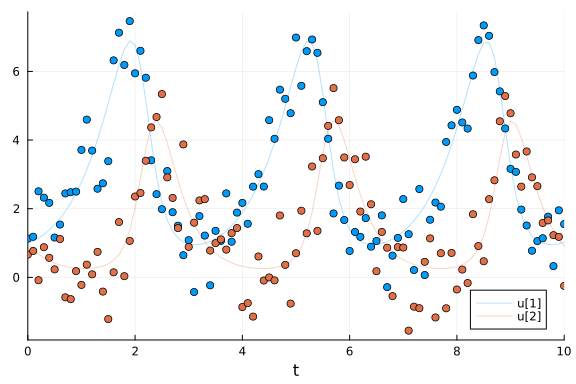
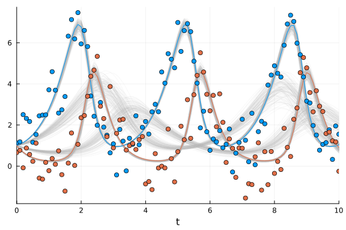
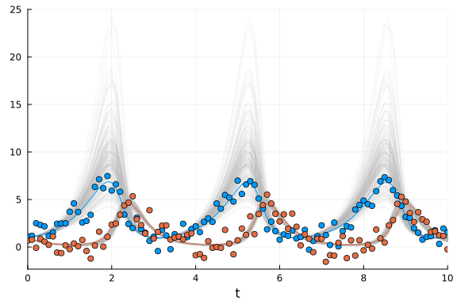

Most of the scientific community deals with the basic problem of trying to mathematically model the reality around them and this often involves dynamical systems. The general trend to model these complex dynamical systems is through the use of differential equations.
Differential equation models often have non-measurable parameters.
The popular “forward-problem” of simulation consists of solving the differential equations for a given set of parameters, the “inverse problem” to simulation, known as parameter estimation, is the process of utilizing data to determine these model parameters.
Bayesian inference provides a robust approach to parameter estimation with quantified uncertainty.

```julia
using Turing
using DifferentialEquations

# Load StatsPlots for visualizations and diagnostics.
using StatsPlots

using LinearAlgebra

# Set a seed for reproducibility.
using Random
Random.seed!(14);
```


## The Lotka-Volterra Model

The Lotka–Volterra equations, also known as the predator–prey equations, are a pair of first-order nonlinear differential equations.
These differential equations are frequently used to describe the dynamics of biological systems in which two species interact, one as a predator and the other as prey.
The populations change through time according to the pair of equations

$$
\begin{aligned}
\frac{\mathrm{d}x}{\mathrm{d}t} &= (\alpha - \beta y(t))x(t), \\
\frac{\mathrm{d}y}{\mathrm{d}t} &= (\delta x(t) - \gamma)y(t)
\end{aligned}
$$

where $x(t)$ and $y(t)$ denote the populations of prey and predator at time $t$, respectively, and $\alpha, \beta, \gamma, \delta$ are positive parameters.

We implement the Lotka-Volterra model and simulate it with parameters $\alpha = 1.5$, $\beta = 1$, $\gamma = 3$, and $\delta = 1$ and initial conditions $x(0) = y(0) = 1$.

```julia
# Define Lotka-Volterra model.
function lotka_volterra(du, u, p, t)
    # Model parameters.
    α, β, γ, δ = p
    # Current state.
    x, y = u

    # Evaluate differential equations.
    du[1] = (α - β * y) * x # prey
    du[2] = (δ * x - γ) * y # predator

    return nothing
end

# Define initial-value problem.
u0 = [1.0, 1.0]
p = [1.5, 1.0, 3.0, 1.0]
tspan = (0.0, 10.0)
prob = ODEProblem(lotka_volterra, u0, tspan, p)

# Plot simulation.
plot(solve(prob, Tsit5()))
```


We generate noisy observations to use for the parameter estimation tasks in this tutorial.
With the [`saveat` argument](https://docs.sciml.ai/latest/basics/common_solver_opts/) we specify that the solution is stored only at `0.1` time units.
To make the example more realistic we add random normally distributed noise to the simulation.

```julia
sol = solve(prob, Tsit5(); saveat=0.1)
odedata = Array(sol) + 0.8 * randn(size(Array(sol)))

# Plot simulation and noisy observations.
plot(sol; alpha=0.3)
scatter!(sol.t, odedata'; color=[1 2], label="")
```




Alternatively, we can use real-world data from Hudson’s Bay Company records (an Stan implementation with slightly different priors can be found here: https://mc-stan.org/users/documentation/case-studies/lotka-volterra-predator-prey.html).

## Direct Handling of Bayesian Estimation with Turing

Previously, functions in Turing and DifferentialEquations were not inter-composable, so Bayesian inference of differential equations needed to be handled by another package called [DiffEqBayes.jl](https://github.com/SciML/DiffEqBayes.jl) (note that DiffEqBayes works also with CmdStan.jl, Turing.jl, DynamicHMC.jl and ApproxBayes.jl - see the [DiffEqBayes docs](https://docs.sciml.ai/latest/analysis/parameter_estimation/#Bayesian-Methods-1) for more info).

Nowadays, however, Turing and DifferentialEquations are completely composable and we can just simulate differential equations inside a Turing `@model`.
Therefore, we write the Lotka-Volterra parameter estimation problem using the Turing `@model` macro as below:

```julia
@model function fitlv(data, prob)
    # Prior distributions.
    σ ~ InverseGamma(2, 3)
    α ~ truncated(Normal(1.5, 0.5); lower=0.5, upper=2.5)
    β ~ truncated(Normal(1.2, 0.5); lower=0, upper=2)
    γ ~ truncated(Normal(3.0, 0.5); lower=1, upper=4)
    δ ~ truncated(Normal(1.0, 0.5); lower=0, upper=2)

    # Simulate Lotka-Volterra model. 
    p = [α, β, γ, δ]
    predicted = solve(prob, Tsit5(); p=p, saveat=0.1)

    # Observations.
    for i in 1:length(predicted)
        data[:, i] ~ MvNormal(predicted[i], σ^2 * I)
    end

    return nothing
end

model = fitlv(odedata, prob)

# Sample 3 independent chains with forward-mode automatic differentiation (the default).
chain = sample(model, NUTS(), MCMCSerial(), 1000, 3; progress=false)
```

```
Chains MCMC chain (1000×17×3 Array{Float64, 3}):

Iterations        = 501:1:1500
Number of chains  = 3
Samples per chain = 1000
Wall duration     = 74.52 seconds
Compute duration  = 73.87 seconds
parameters        = σ, α, β, γ, δ
internals         = lp, n_steps, is_accept, acceptance_rate, log_density, h
amiltonian_energy, hamiltonian_energy_error, max_hamiltonian_energy_error, 
tree_depth, numerical_error, step_size, nom_step_size

Summary Statistics
  parameters      mean       std      mcse   ess_bulk   ess_tail      rhat 
  e ⋯
      Symbol   Float64   Float64   Float64    Float64    Float64   Float64 
    ⋯

           σ    1.1964    0.5928    0.2407     9.5333    74.8902    1.6656 
    ⋯
           α    1.3843    0.1343    0.0485     9.7698    93.1939    1.6559 
    ⋯
           β    0.9521    0.0972    0.0273    15.9815    81.5915    1.2909 
    ⋯
           γ    2.4593    0.9528    0.3857     9.7506    91.3471    1.6648 
    ⋯
           δ    0.8859    0.2329    0.0924     9.7353    76.8219    1.6640 
    ⋯
                                                                1 column om
itted

Quantiles
  parameters      2.5%     25.0%     50.0%     75.0%     97.5%
      Symbol   Float64   Float64   Float64   Float64   Float64

           σ    0.7139    0.7664    0.8057    1.9560    2.1756
           α    1.0612    1.2887    1.4403    1.4798    1.5479
           β    0.7196    0.9106    0.9759    1.0147    1.0897
           γ    1.0084    1.1759    3.0354    3.1629    3.3908
           δ    0.4865    0.6036    1.0121    1.0588    1.1404
```


The estimated parameters are close to the parameter values the observations were generated with.
We can also check visually that the chains have converged.

```julia
plot(chain)
```


### Data retrodiction

In Bayesian analysis it is often useful to retrodict the data, i.e. generate simulated data using samples from the posterior distribution, and compare to the original data (see for instance section 3.3.2 - model checking of McElreath's book "Statistical Rethinking").
Here, we solve the ODE for 300 randomly picked posterior samples in the `chain`.
We plot the ensemble of solutions to check if the solution resembles the data.
The 300 retrodicted time courses from the posterior are plotted in gray, the noisy observations are shown as blue and red dots, and the green and purple lines are the ODE solution that was used to generate the data.

```julia
plot(; legend=false)
posterior_samples = sample(chain[[:α, :β, :γ, :δ]], 300; replace=false)
for p in eachrow(Array(posterior_samples))
    sol_p = solve(prob, Tsit5(); p=p, saveat=0.1)
    plot!(sol_p; alpha=0.1, color="#BBBBBB")
end

# Plot simulation and noisy observations.
plot!(sol; color=[1 2], linewidth=1)
scatter!(sol.t, odedata'; color=[1 2])
```




We can see that, even though we added quite a bit of noise to the data the posterior distribution reproduces quite accurately the "true" ODE solution.

## Lotka-Volterra model without data of prey

One can also perform parameter inference for a Lotka-Volterra model with incomplete data.
For instance, let us suppose we have only observations of the predators but not of the prey.
I.e., we fit the model only to the $y$ variable of the system without providing any data for $x$:

```julia
@model function fitlv2(data::AbstractVector, prob)
    # Prior distributions.
    σ ~ InverseGamma(2, 3)
    α ~ truncated(Normal(1.5, 0.5); lower=0.5, upper=2.5)
    β ~ truncated(Normal(1.2, 0.5); lower=0, upper=2)
    γ ~ truncated(Normal(3.0, 0.5); lower=1, upper=4)
    δ ~ truncated(Normal(1.0, 0.5); lower=0, upper=2)

    # Simulate Lotka-Volterra model but save only the second state of the system (predators).
    p = [α, β, γ, δ]
    predicted = solve(prob, Tsit5(); p=p, saveat=0.1, save_idxs=2)

    # Observations of the predators.
    data ~ MvNormal(predicted.u, σ^2 * I)

    return nothing
end

model2 = fitlv2(odedata[2, :], prob)

# Sample 3 independent chains.
chain2 = sample(model2, NUTS(0.45), MCMCSerial(), 5000, 3; progress=false)
```

```
Chains MCMC chain (5000×17×3 Array{Float64, 3}):

Iterations        = 1001:1:6000
Number of chains  = 3
Samples per chain = 5000
Wall duration     = 46.04 seconds
Compute duration  = 45.12 seconds
parameters        = σ, α, β, γ, δ
internals         = lp, n_steps, is_accept, acceptance_rate, log_density, h
amiltonian_energy, hamiltonian_energy_error, max_hamiltonian_energy_error, 
tree_depth, numerical_error, step_size, nom_step_size

Summary Statistics
  parameters      mean       std      mcse   ess_bulk   ess_tail      rhat 
  e ⋯
      Symbol   Float64   Float64   Float64    Float64    Float64   Float64 
    ⋯

           σ    0.8193    0.0583    0.0060    89.7009   148.9441    1.0359 
    ⋯
           α    1.6251    0.2058    0.0216    91.5734    44.9757    1.0361 
    ⋯
           β    1.1340    0.1552    0.0150   105.2601    70.6519    1.0318 
    ⋯
           γ    3.0001    0.3490    0.0437    87.2439    36.8948    1.0543 
    ⋯
           δ    0.8630    0.2682    0.0322    94.6963    49.4864    1.0495 
    ⋯
                                                                1 column om
itted

Quantiles
  parameters      2.5%     25.0%     50.0%     75.0%     97.5%
      Symbol   Float64   Float64   Float64   Float64   Float64

           σ    0.7143    0.7764    0.8181    0.8585    0.9393
           α    1.1997    1.5064    1.6265    1.7440    2.0639
           β    0.8291    1.0438    1.1311    1.2247    1.4706
           γ    2.4340    2.7761    2.9422    3.1600    3.9395
           δ    0.4415    0.6881    0.8228    0.9775    1.5534
```


Again we inspect the trajectories of 300 randomly selected posterior samples.

```julia
plot(; legend=false)
posterior_samples = sample(chain2[[:α, :β, :γ, :δ]], 300; replace=false)
for p in eachrow(Array(posterior_samples))
    sol_p = solve(prob, Tsit5(); p=p, saveat=0.1)
    plot!(sol_p; alpha=0.1, color="#BBBBBB")
end

# Plot simulation and noisy observations.
plot!(sol; color=[1 2], linewidth=1)
scatter!(sol.t, odedata'; color=[1 2])
```




Note that here the observations of the prey (blue dots) were not used in the parameter estimation!
Yet, the model can predict the values of $x$ relatively accurately, albeit with a wider distribution of solutions, reflecting the greater uncertainty in the prediction of the $x$ values.

## Inference of Delay Differential Equations

Here we show an example of inference with another type of differential equation: a Delay Differential Equation (DDE).
DDEs are differential equations where derivatives are function of values at an earlier point in time.
This is useful to model a delayed effect, like incubation time of a virus for instance.

Here is a delayed version of the Lokta-Voltera system:

$$
\begin{aligned}
\frac{\mathrm{d}x}{\mathrm{d}t} &= \alpha x(t-\tau) - \beta y(t) x(t),\\
\frac{\mathrm{d}y}{\mathrm{d}t} &= - \gamma y(t) + \delta x(t) y(t),
\end{aligned}
$$

where $\tau$ is a (positive) delay and $x(t-\tau)$ is the variable $x$ at an earlier time point $t - \tau$.

The initial-value problem of the delayed system can be implemented as a [`DDEProblem`](https://diffeq.sciml.ai/stable/tutorials/dde_example/).
As described in the [DDE example](https://diffeq.sciml.ai/stable/tutorials/dde_example/), here the function `h` is the history function that can be used to obtain a state at an earlier time point.
Again we use parameters $\alpha = 1.5$, $\beta = 1$, $\gamma = 3$, and $\delta = 1$ and initial conditions $x(0) = y(0) = 1$.
Moreover, we assume $x(t) = 1$ for $t < 0$.

```julia
function delay_lotka_volterra(du, u, h, p, t)
    # Model parameters.
    α, β, γ, δ = p

    # Current state.
    x, y = u
    # Evaluate differential equations
    du[1] = α * h(p, t - 1; idxs=1) - β * x * y
    du[2] = -γ * y + δ * x * y

    return nothing
end

# Define initial-value problem.
p = (1.5, 1.0, 3.0, 1.0)
u0 = [1.0; 1.0]
tspan = (0.0, 10.0)
h(p, t; idxs::Int) = 1.0
prob_dde = DDEProblem(delay_lotka_volterra, u0, h, tspan, p);
```


We generate observations by adding normally distributed noise to the results of our simulations.

```julia
sol_dde = solve(prob_dde; saveat=0.1)
ddedata = Array(sol_dde) + 0.5 * randn(size(sol_dde))

# Plot simulation and noisy observations.
plot(sol_dde)
scatter!(sol_dde.t, ddedata'; color=[1 2], label="")
```


Now we define the Turing model for the Lotka-Volterra model with delay and sample 3 independent chains.

```julia
@model function fitlv_dde(data, prob)
    # Prior distributions.
    σ ~ InverseGamma(2, 3)
    α ~ truncated(Normal(1.5, 0.5); lower=0.5, upper=2.5)
    β ~ truncated(Normal(1.2, 0.5); lower=0, upper=2)
    γ ~ truncated(Normal(3.0, 0.5); lower=1, upper=4)
    δ ~ truncated(Normal(1.0, 0.5); lower=0, upper=2)

    # Simulate Lotka-Volterra model.
    p = [α, β, γ, δ]
    predicted = solve(prob, MethodOfSteps(Tsit5()); p=p, saveat=0.1)

    # Observations.
    for i in 1:length(predicted)
        data[:, i] ~ MvNormal(predicted[i], σ^2 * I)
    end
end

model_dde = fitlv_dde(ddedata, prob_dde)

# Sample 3 independent chains.
chain_dde = sample(model_dde, NUTS(), MCMCSerial(), 300, 3; progress=false)
```

```
Chains MCMC chain (300×17×3 Array{Float64, 3}):

Iterations        = 151:1:450
Number of chains  = 3
Samples per chain = 300
Wall duration     = 24.6 seconds
Compute duration  = 23.99 seconds
parameters        = σ, α, β, γ, δ
internals         = lp, n_steps, is_accept, acceptance_rate, log_density, h
amiltonian_energy, hamiltonian_energy_error, max_hamiltonian_energy_error, 
tree_depth, numerical_error, step_size, nom_step_size

Summary Statistics
  parameters      mean       std      mcse   ess_bulk   ess_tail      rhat 
  e ⋯
      Symbol   Float64   Float64   Float64    Float64    Float64   Float64 
    ⋯

           σ    0.5117    0.0248    0.0009   753.7681   414.8932    1.0036 
    ⋯
           α    1.5792    0.0700    0.0047   223.7483   290.8871    1.0108 
    ⋯
           β    1.0445    0.0552    0.0034   261.8040   308.1885    1.0057 
    ⋯
           γ    2.8438    0.1453    0.0092   248.6835   279.3992    1.0098 
    ⋯
           δ    0.9340    0.0489    0.0032   229.1074   264.9931    1.0108 
    ⋯
                                                                1 column om
itted

Quantiles
  parameters      2.5%     25.0%     50.0%     75.0%     97.5%
      Symbol   Float64   Float64   Float64   Float64   Float64

           σ    0.4672    0.4938    0.5107    0.5286    0.5628
           α    1.4497    1.5294    1.5796    1.6217    1.7323
           β    0.9461    1.0057    1.0409    1.0811    1.1616
           γ    2.5767    2.7441    2.8413    2.9452    3.1255
           δ    0.8442    0.8994    0.9326    0.9673    1.0294
```


```julia
plot(chain_dde)
```


Finally, plot trajectories of 300 randomly selected samples from the posterior.
Again, the dots indicate our observations, the colored lines are the "true" simulations without noise, and the gray lines are trajectories from the posterior samples.

```julia
plot(; legend=false)
posterior_samples = sample(chain_dde[[:α, :β, :γ, :δ]], 300; replace=false)
for p in eachrow(Array(posterior_samples))
    sol_p = solve(prob_dde, MethodOfSteps(Tsit5()); p=p, saveat=0.1)
    plot!(sol_p; alpha=0.1, color="#BBBBBB")
end

# Plot simulation and noisy observations.
plot!(sol_dde; color=[1 2], linewidth=1)
scatter!(sol_dde.t, ddedata'; color=[1 2])
```


The fit is pretty good even though the data was quite noisy to start.

## Scaling to Large Models: Adjoint Sensitivities

DifferentialEquations.jl's efficiency for large stiff models has been shown in multiple [benchmarks](https://github.com/SciML/DiffEqBenchmarks.jl).
To learn more about how to optimize solving performance for stiff problems you can take a look at the [docs](https://docs.sciml.ai/latest/tutorials/advanced_ode_example/).

[Sensitivity analysis](https://docs.sciml.ai/latest/analysis/sensitivity/), or automatic differentiation (AD) of the solver, is provided by the DiffEq suite.
The model sensitivities are the derivatives of the solution with respect to the parameters.
Specifically, the local sensitivity of the solution to a parameter is defined by how much the solution would change by changes in the parameter.
Sensitivity analysis provides a cheap way to calculate the gradient of the solution which can be used in parameter estimation and other optimization tasks.

The AD ecosystem in Julia allows you to switch between forward mode, reverse mode, source to source and other choices of AD and have it work with any Julia code.
For a user to make use of this within [SciML](https://sciml.ai), [high level interactions in `solve`](https://sensitivity.sciml.ai/dev/ad_examples/differentiating_ode/) automatically plug into those AD systems to allow for choosing advanced sensitivity analysis (derivative calculation) [methods](https://sensitivity.sciml.ai/dev/manual/differential_equation_sensitivities/).

More theoretical details on these methods can be found at: https://docs.sciml.ai/latest/extras/sensitivity_math/.

While these sensitivity analysis methods may seem complicated, using them is dead simple.
Here is a version of the Lotka-Volterra model using adjoint sensitivities.

All we have to do is switch the AD backend to one of the adjoint-compatible backends (ReverseDiff, Tracker, or Zygote)!
Notice that on this model adjoints are slower.
This is because adjoints have a higher overhead on small parameter models and therefore we suggest using these methods only for models with around 100 parameters or more.
For more details, see https://arxiv.org/abs/1812.01892.

```julia
using Zygote, SciMLSensitivity

# Sample a single chain with 1000 samples using Zygote.
setadbackend(:zygote)
sample(model, NUTS(), 1000; progress=false)
```

```
Chains MCMC chain (1000×17×1 Array{Float64, 3}):

Iterations        = 501:1:1500
Number of chains  = 1
Samples per chain = 1000
Wall duration     = 16.09 seconds
Compute duration  = 16.09 seconds
parameters        = σ, α, β, γ, δ
internals         = lp, n_steps, is_accept, acceptance_rate, log_density, h
amiltonian_energy, hamiltonian_energy_error, max_hamiltonian_energy_error, 
tree_depth, numerical_error, step_size, nom_step_size

Summary Statistics
  parameters      mean       std      mcse   ess_bulk   ess_tail      rhat 
  e ⋯
      Symbol   Float64   Float64   Float64    Float64    Float64   Float64 
    ⋯

           σ    2.1456    0.1140    0.0050   554.0258   575.8697    0.9998 
    ⋯
           α    0.5156    0.0160    0.0008   400.1894   443.0712    1.0011 
    ⋯
           β    0.9735    0.2324    0.0131   365.6077   306.9241    0.9996 
    ⋯
           γ    2.7023    0.3940    0.0204   380.2789   324.1258    1.0013 
    ⋯
           δ    1.0022    0.1350    0.0081   291.7717   425.6181    1.0007 
    ⋯
                                                                1 column om
itted

Quantiles
  parameters      2.5%     25.0%     50.0%     75.0%     97.5%
      Symbol   Float64   Float64   Float64   Float64   Float64

           σ    1.9419    2.0656    2.1371    2.2170    2.3916
           α    0.5004    0.5041    0.5107    0.5219    0.5597
           β    0.5853    0.8077    0.9370    1.1182    1.5498
           γ    1.9873    2.4388    2.6824    2.9594    3.5190
           δ    0.7672    0.9105    0.9916    1.0817    1.2969
```


If desired, we can control the sensitivity analysis method that is used by providing the `sensealg` keyword argument to `solve`.
Here we will not choose a `sensealg` and let it use the default choice:

```julia
@model function fitlv_sensealg(data, prob)
    # Prior distributions.
    σ ~ InverseGamma(2, 3)
    α ~ truncated(Normal(1.5, 0.5); lower=0.5, upper=2.5)
    β ~ truncated(Normal(1.2, 0.5); lower=0, upper=2)
    γ ~ truncated(Normal(3.0, 0.5); lower=1, upper=4)
    δ ~ truncated(Normal(1.0, 0.5); lower=0, upper=2)

    # Simulate Lotka-Volterra model and use a specific algorithm for computing sensitivities.
    p = [α, β, γ, δ]
    predicted = solve(prob; p=p, saveat=0.1)

    # Observations.
    for i in 1:length(predicted)
        data[:, i] ~ MvNormal(predicted[i], σ^2 * I)
    end

    return nothing
end;

model_sensealg = fitlv_sensealg(odedata, prob)

# Sample a single chain with 1000 samples using Zygote.
setadbackend(:zygote)
sample(model_sensealg, NUTS(), 1000; progress=false)
```

```
Chains MCMC chain (1000×17×1 Array{Float64, 3}):

Iterations        = 501:1:1500
Number of chains  = 1
Samples per chain = 1000
Wall duration     = 31.2 seconds
Compute duration  = 31.2 seconds
parameters        = σ, α, β, γ, δ
internals         = lp, n_steps, is_accept, acceptance_rate, log_density, h
amiltonian_energy, hamiltonian_energy_error, max_hamiltonian_energy_error, 
tree_depth, numerical_error, step_size, nom_step_size

Summary Statistics
  parameters      mean       std      mcse   ess_bulk   ess_tail      rhat 
  e ⋯
      Symbol   Float64   Float64   Float64    Float64    Float64   Float64 
    ⋯

           σ    0.7760    0.0408    0.0018   528.9255   416.5424    0.9995 
    ⋯
           α    1.4665    0.0458    0.0032   197.7135   275.6158    1.0063 
    ⋯
           β    0.9988    0.0471    0.0032   219.7447   385.1920    1.0028 
    ⋯
           γ    3.1320    0.1434    0.0096   221.9071   322.4638    1.0048 
    ⋯
           δ    1.0470    0.0525    0.0035   217.3994   300.5296    1.0062 
    ⋯
                                                                1 column om
itted

Quantiles
  parameters      2.5%     25.0%     50.0%     75.0%     97.5%
      Symbol   Float64   Float64   Float64   Float64   Float64

           σ    0.7018    0.7487    0.7733    0.8016    0.8674
           α    1.3877    1.4329    1.4639    1.4967    1.5632
           β    0.9213    0.9654    0.9941    1.0287    1.0982
           γ    2.8517    3.0412    3.1368    3.2326    3.4035
           δ    0.9424    1.0105    1.0466    1.0840    1.1451
```


For more examples of adjoint usage on large parameter models, consult the [DiffEqFlux documentation](https://diffeqflux.sciml.ai/dev/).

## Inference of a Stochastic Differential Equation

A [Stochastic Differential Equation (SDE)](https://diffeq.sciml.ai/stable/tutorials/sde_example/) is a differential equation that has a stochastic (noise) term in the expression of the derivatives.
Here we fit a stochastic version of the Lokta-Volterra system.

We use a quasi-likelihood approach in which all trajectories of a solution are compared instead of a reduction such as mean, this increases the robustness of fitting and makes the likelihood more identifiable.
We use SOSRI to solve the equation.

```julia
u0 = [1.0, 1.0]
tspan = (0.0, 10.0)
function multiplicative_noise!(du, u, p, t)
    x, y = u
    du[1] = p[5] * x
    return du[2] = p[6] * y
end
p = [1.5, 1.0, 3.0, 1.0, 0.1, 0.1]

function lotka_volterra!(du, u, p, t)
    x, y = u
    α, β, γ, δ = p
    du[1] = dx = α * x - β * x * y
    return du[2] = dy = δ * x * y - γ * y
end

prob_sde = SDEProblem(lotka_volterra!, multiplicative_noise!, u0, tspan, p)

ensembleprob = EnsembleProblem(prob_sde)
data = solve(ensembleprob, SOSRI(); saveat=0.1, trajectories=1000)
plot(EnsembleSummary(data))
```


```julia
@model function fitlv_sde(data, prob)
    # Prior distributions.
    σ ~ InverseGamma(2, 3)
    α ~ truncated(Normal(1.3, 0.5); lower=0.5, upper=2.5)
    β ~ truncated(Normal(1.2, 0.25); lower=0.5, upper=2)
    γ ~ truncated(Normal(3.2, 0.25); lower=2.2, upper=4)
    δ ~ truncated(Normal(1.2, 0.25); lower=0.5, upper=2)
    ϕ1 ~ truncated(Normal(0.12, 0.3); lower=0.05, upper=0.25)
    ϕ2 ~ truncated(Normal(0.12, 0.3); lower=0.05, upper=0.25)

    # Simulate stochastic Lotka-Volterra model.
    p = [α, β, γ, δ, ϕ1, ϕ2]
    predicted = solve(prob, SOSRI(); p=p, saveat=0.1)

    # Early exit if simulation could not be computed successfully.
    if predicted.retcode !== :Success
        Turing.@addlogprob! -Inf
        return nothing
    end

    # Observations.
    for i in 1:length(predicted)
        data[:, i] ~ MvNormal(predicted[i], σ^2 * I)
    end

    return nothing
end;
```


The probabilistic nature of the SDE solution makes the likelihood function noisy which poses a challenge for NUTS since the gradient is changing with every calculation.
Therefore we use NUTS with a low target acceptance rate of `0.25` and specify a set of initial parameters.
SGHMC might be a more suitable algorithm to be used here.

```julia
model_sde = fitlv_sde(odedata, prob_sde)

setadbackend(:forwarddiff)
chain_sde = sample(
    model_sde,
    NUTS(0.25),
    5000;
    initial_params=[1.5, 1.3, 1.2, 2.7, 1.2, 0.12, 0.12],
    progress=false,
)
plot(chain_sde)
```


## Appendix

These tutorials are a part of the TuringTutorials repository, found at: [https://github.com/TuringLang/TuringTutorials](https://github.com/TuringLang/TuringTutorials).

To locally run this tutorial, do the following commands:

```
using TuringTutorials
TuringTutorials.weave("10-bayesian-differential-equations", "10_bayesian-differential-equations.jmd")
```

Computer Information:

```
Julia Version 1.10.1
Commit 7790d6f0641 (2024-02-13 20:41 UTC)
Build Info:
  Official https://julialang.org/ release
Platform Info:
  OS: Linux (x86_64-linux-gnu)
  CPU: 128 × AMD EPYC 7502 32-Core Processor
  WORD_SIZE: 64
  LIBM: libopenlibm
  LLVM: libLLVM-15.0.7 (ORCJIT, znver2)
Threads: 1 default, 0 interactive, 1 GC (on 16 virtual cores)
Environment:
  JULIA_CPU_THREADS = 16
  JULIA_DEPOT_PATH = /cache/julia-buildkite-plugin/depots/7aa0085e-79a4-45f3-a5bd-9743c91cf3da

```

Package Information:

```
Status `/cache/build/tester-amdci4-11/julialang/turingtutorials/tutorials/10-bayesian-differential-equations/Project.toml`
  [0c46a032] DifferentialEquations v7.12.0
  [1ed8b502] SciMLSensitivity v7.56.0
  [f3b207a7] StatsPlots v0.15.7
  [fce5fe82] Turing v0.30.5
  [e88e6eb3] Zygote v0.6.69
  [37e2e46d] LinearAlgebra
  [9a3f8284] Random
```

And the full manifest:

```
Status `/cache/build/tester-amdci4-11/julialang/turingtutorials/tutorials/10-bayesian-differential-equations/Manifest.toml`
  [47edcb42] ADTypes v0.2.6
  [621f4979] AbstractFFTs v1.5.0
  [80f14c24] AbstractMCMC v5.2.0
  [7a57a42e] AbstractPPL v0.7.0
  [1520ce14] AbstractTrees v0.4.5
  [7d9f7c33] Accessors v0.1.35
  [79e6a3ab] Adapt v4.0.1
  [0bf59076] AdvancedHMC v0.6.1
  [5b7e9947] AdvancedMH v0.8.1
  [576499cb] AdvancedPS v0.5.4
  [b5ca4192] AdvancedVI v0.2.4
  [dce04be8] ArgCheck v2.3.0
⌅ [ec485272] ArnoldiMethod v0.2.0
  [7d9fca2a] Arpack v0.5.4
  [4fba245c] ArrayInterface v7.7.1
  [4c555306] ArrayLayouts v1.6.0
  [a9b6321e] Atomix v0.1.0
  [13072b0f] AxisAlgorithms v1.1.0
  [39de3d68] AxisArrays v0.4.7
  [aae01518] BandedMatrices v1.5.0
⌅ [198e06fe] BangBang v0.3.40
  [9718e550] Baselet v0.1.1
  [6e4b80f9] BenchmarkTools v1.5.0
  [76274a88] Bijectors v0.13.8
  [d1d4a3ce] BitFlags v0.1.8
  [62783981] BitTwiddlingConvenienceFunctions v0.1.5
  [764a87c0] BoundaryValueDiffEq v5.6.3
  [fa961155] CEnum v0.5.0
  [2a0fbf3d] CPUSummary v0.2.4
  [49dc2e85] Calculus v0.5.1
  [7057c7e9] Cassette v0.3.13
  [082447d4] ChainRules v1.63.0
  [d360d2e6] ChainRulesCore v1.23.0
  [9e997f8a] ChangesOfVariables v0.1.8
  [fb6a15b2] CloseOpenIntervals v0.1.12
  [aaaa29a8] Clustering v0.15.7
  [523fee87] CodecBzip2 v0.8.2
  [944b1d66] CodecZlib v0.7.4
  [35d6a980] ColorSchemes v3.24.0
  [3da002f7] ColorTypes v0.11.4
  [c3611d14] ColorVectorSpace v0.10.0
  [5ae59095] Colors v0.12.10
  [861a8166] Combinatorics v1.0.2
  [38540f10] CommonSolve v0.2.4
  [bbf7d656] CommonSubexpressions v0.3.0
  [34da2185] Compat v4.14.0
  [a33af91c] CompositionsBase v0.1.2
  [2569d6c7] ConcreteStructs v0.2.3
  [f0e56b4a] ConcurrentUtilities v2.3.1
  [88cd18e8] ConsoleProgressMonitor v0.1.2
  [187b0558] ConstructionBase v1.5.4
  [d38c429a] Contour v0.6.2
  [adafc99b] CpuId v0.3.1
  [a8cc5b0e] Crayons v4.1.1
  [9a962f9c] DataAPI v1.16.0
  [864edb3b] DataStructures v0.18.17
  [e2d170a0] DataValueInterfaces v1.0.0
  [244e2a9f] DefineSingletons v0.1.2
  [bcd4f6db] DelayDiffEq v5.47.0
  [8bb1440f] DelimitedFiles v1.9.1
  [b429d917] DensityInterface v0.4.0
  [2b5f629d] DiffEqBase v6.147.2
⌅ [459566f4] DiffEqCallbacks v2.37.0
  [77a26b50] DiffEqNoiseProcess v5.20.1
  [163ba53b] DiffResults v1.1.0
  [b552c78f] DiffRules v1.15.1
  [0c46a032] DifferentialEquations v7.12.0
  [b4f34e82] Distances v0.10.11
  [31c24e10] Distributions v0.25.107
  [ced4e74d] DistributionsAD v0.6.54
  [ffbed154] DocStringExtensions v0.9.3
  [fa6b7ba4] DualNumbers v0.6.8
  [366bfd00] DynamicPPL v0.24.8
  [da5c29d0] EllipsisNotation v1.8.0
  [cad2338a] EllipticalSliceSampling v2.0.0
  [4e289a0a] EnumX v1.0.4
  [7da242da] Enzyme v0.11.17
⌅ [f151be2c] EnzymeCore v0.6.5
  [460bff9d] ExceptionUnwrapping v0.1.10
  [d4d017d3] ExponentialUtilities v1.26.1
  [e2ba6199] ExprTools v0.1.10
  [c87230d0] FFMPEG v0.4.1
  [7a1cc6ca] FFTW v1.8.0
  [9d29842c] FastAlmostBandedMatrices v0.1.0
  [7034ab61] FastBroadcast v0.2.8
  [9aa1b823] FastClosures v0.3.2
  [29a986be] FastLapackInterface v2.0.2
  [1a297f60] FillArrays v1.9.3
  [6a86dc24] FiniteDiff v2.22.0
  [53c48c17] FixedPointNumbers v0.8.4
  [59287772] Formatting v0.4.3
  [f6369f11] ForwardDiff v0.10.36
  [f62d2435] FunctionProperties v0.1.0
  [069b7b12] FunctionWrappers v1.1.3
  [77dc65aa] FunctionWrappersWrappers v0.1.3
  [d9f16b24] Functors v0.4.7
  [0c68f7d7] GPUArrays v10.0.2
  [46192b85] GPUArraysCore v0.1.6
⌅ [61eb1bfa] GPUCompiler v0.25.0
  [28b8d3ca] GR v0.73.2
  [c145ed77] GenericSchur v0.5.3
  [86223c79] Graphs v1.9.0
  [42e2da0e] Grisu v1.0.2
  [cd3eb016] HTTP v1.10.2
  [3e5b6fbb] HostCPUFeatures v0.1.16
  [34004b35] HypergeometricFunctions v0.3.23
  [7869d1d1] IRTools v0.4.12
  [615f187c] IfElse v0.1.1
  [d25df0c9] Inflate v0.1.4
  [22cec73e] InitialValues v0.3.1
  [505f98c9] InplaceOps v0.3.0
  [a98d9a8b] Interpolations v0.15.1
  [8197267c] IntervalSets v0.7.10
  [3587e190] InverseFunctions v0.1.12
  [41ab1584] InvertedIndices v1.3.0
  [92d709cd] IrrationalConstants v0.2.2
  [c8e1da08] IterTools v1.10.0
  [82899510] IteratorInterfaceExtensions v1.0.0
  [1019f520] JLFzf v0.1.7
  [692b3bcd] JLLWrappers v1.5.0
  [682c06a0] JSON v0.21.4
  [ccbc3e58] JumpProcesses v9.10.1
  [ef3ab10e] KLU v0.6.0
  [63c18a36] KernelAbstractions v0.9.17
  [5ab0869b] KernelDensity v0.6.8
  [ba0b0d4f] Krylov v0.9.5
  [929cbde3] LLVM v6.6.0
  [8ac3fa9e] LRUCache v1.6.1
  [b964fa9f] LaTeXStrings v1.3.1
  [23fbe1c1] Latexify v0.16.1
  [10f19ff3] LayoutPointers v0.1.15
  [5078a376] LazyArrays v1.8.3
  [1d6d02ad] LeftChildRightSiblingTrees v0.2.0
  [2d8b4e74] LevyArea v1.0.0
  [6f1fad26] Libtask v0.8.6
  [d3d80556] LineSearches v7.2.0
  [7ed4a6bd] LinearSolve v2.26.0
  [6fdf6af0] LogDensityProblems v2.1.1
  [996a588d] LogDensityProblemsAD v1.7.0
  [2ab3a3ac] LogExpFunctions v0.3.27
  [e6f89c97] LoggingExtras v1.0.3
  [bdcacae8] LoopVectorization v0.12.166
  [c7f686f2] MCMCChains v6.0.6
  [be115224] MCMCDiagnosticTools v0.3.10
  [e80e1ace] MLJModelInterface v1.9.5
  [1914dd2f] MacroTools v0.5.13
  [d125e4d3] ManualMemory v0.1.8
  [dbb5928d] MappedArrays v0.4.2
  [b8f27783] MathOptInterface v1.27.0
  [a3b82374] MatrixFactorizations v2.1.0
  [bb5d69b7] MaybeInplace v0.1.1
  [739be429] MbedTLS v1.1.9
  [442fdcdd] Measures v0.3.2
⌅ [128add7d] MicroCollections v0.1.4
  [e1d29d7a] Missings v1.1.0
  [46d2c3a1] MuladdMacro v0.2.4
  [6f286f6a] MultivariateStats v0.10.2
  [d8a4904e] MutableArithmetics v1.4.1
  [d41bc354] NLSolversBase v7.8.3
  [2774e3e8] NLsolve v4.5.1
  [872c559c] NNlib v0.9.12
  [77ba4419] NaNMath v1.0.2
  [86f7a689] NamedArrays v0.10.0
  [c020b1a1] NaturalSort v1.0.0
  [b8a86587] NearestNeighbors v0.4.16
  [8913a72c] NonlinearSolve v3.7.3
  [d8793406] ObjectFile v0.4.1
  [510215fc] Observables v0.5.5
  [6fe1bfb0] OffsetArrays v1.13.0
  [4d8831e6] OpenSSL v1.4.1
  [429524aa] Optim v1.9.2
  [3bd65402] Optimisers v0.3.2
  [bac558e1] OrderedCollections v1.6.3
  [1dea7af3] OrdinaryDiffEq v6.73.1
  [90014a1f] PDMats v0.11.31
  [65ce6f38] PackageExtensionCompat v1.0.2
  [d96e819e] Parameters v0.12.3
  [69de0a69] Parsers v2.8.1
  [b98c9c47] Pipe v1.3.0
  [ccf2f8ad] PlotThemes v3.1.0
  [995b91a9] PlotUtils v1.4.0
  [91a5bcdd] Plots v1.40.1
  [e409e4f3] PoissonRandom v0.4.4
  [f517fe37] Polyester v0.7.9
  [1d0040c9] PolyesterWeave v0.2.1
  [85a6dd25] PositiveFactorizations v0.2.4
  [d236fae5] PreallocationTools v0.4.20
  [aea7be01] PrecompileTools v1.2.0
  [21216c6a] Preferences v1.4.2
  [08abe8d2] PrettyTables v2.3.1
  [33c8b6b6] ProgressLogging v0.1.4
  [92933f4c] ProgressMeter v1.9.0
  [1fd47b50] QuadGK v2.9.4
  [74087812] Random123 v1.7.0
  [e6cf234a] RandomNumbers v1.5.3
  [b3c3ace0] RangeArrays v0.3.2
  [c84ed2f1] Ratios v0.4.5
  [c1ae055f] RealDot v0.1.0
  [3cdcf5f2] RecipesBase v1.3.4
  [01d81517] RecipesPipeline v0.6.12
  [731186ca] RecursiveArrayTools v3.10.1
  [f2c3362d] RecursiveFactorization v0.2.21
  [189a3867] Reexport v1.2.2
  [05181044] RelocatableFolders v1.0.1
  [ae029012] Requires v1.3.0
  [ae5879a3] ResettableStacks v1.1.1
  [37e2e3b7] ReverseDiff v1.15.1
  [79098fc4] Rmath v0.7.1
  [f2b01f46] Roots v2.1.2
  [7e49a35a] RuntimeGeneratedFunctions v0.5.12
  [94e857df] SIMDTypes v0.1.0
  [476501e8] SLEEFPirates v0.6.42
  [0bca4576] SciMLBase v2.29.0
  [c0aeaf25] SciMLOperators v0.3.8
  [1ed8b502] SciMLSensitivity v7.56.0
  [30f210dd] ScientificTypesBase v3.0.0
  [6c6a2e73] Scratch v1.2.1
  [91c51154] SentinelArrays v1.4.1
  [efcf1570] Setfield v1.1.1
  [992d4aef] Showoff v1.0.3
  [777ac1f9] SimpleBufferStream v1.1.0
  [727e6d20] SimpleNonlinearSolve v1.5.0
  [699a6c99] SimpleTraits v0.9.4
  [ce78b400] SimpleUnPack v1.1.0
  [a2af1166] SortingAlgorithms v1.2.1
  [47a9eef4] SparseDiffTools v2.17.0
  [dc90abb0] SparseInverseSubset v0.1.2
  [e56a9233] Sparspak v0.3.9
  [276daf66] SpecialFunctions v2.3.1
  [171d559e] SplittablesBase v0.1.15
  [aedffcd0] Static v0.8.10
  [0d7ed370] StaticArrayInterface v1.5.0
  [90137ffa] StaticArrays v1.9.3
  [1e83bf80] StaticArraysCore v1.4.2
  [64bff920] StatisticalTraits v3.2.0
  [82ae8749] StatsAPI v1.7.0
  [2913bbd2] StatsBase v0.34.2
  [4c63d2b9] StatsFuns v1.3.1
  [f3b207a7] StatsPlots v0.15.7
  [9672c7b4] SteadyStateDiffEq v2.0.1
  [789caeaf] StochasticDiffEq v6.65.1
  [7792a7ef] StrideArraysCore v0.5.2
  [892a3eda] StringManipulation v0.3.4
  [09ab397b] StructArrays v0.6.18
  [53d494c1] StructIO v0.3.0
  [c3572dad] Sundials v4.24.0
  [2efcf032] SymbolicIndexingInterface v0.3.8
  [ab02a1b2] TableOperations v1.2.0
  [3783bdb8] TableTraits v1.0.1
  [bd369af6] Tables v1.11.1
  [62fd8b95] TensorCore v0.1.1
  [5d786b92] TerminalLoggers v0.1.7
  [8290d209] ThreadingUtilities v0.5.2
  [a759f4b9] TimerOutputs v0.5.23
  [9f7883ad] Tracker v0.2.31
  [3bb67fe8] TranscodingStreams v0.10.3
⌃ [28d57a85] Transducers v0.4.80
  [d5829a12] TriangularSolve v0.1.20
  [410a4b4d] Tricks v0.1.8
  [781d530d] TruncatedStacktraces v1.4.0
  [fce5fe82] Turing v0.30.5
  [5c2747f8] URIs v1.5.1
  [3a884ed6] UnPack v1.0.2
  [1cfade01] UnicodeFun v0.4.1
  [1986cc42] Unitful v1.19.0
  [45397f5d] UnitfulLatexify v1.6.3
  [013be700] UnsafeAtomics v0.2.1
  [d80eeb9a] UnsafeAtomicsLLVM v0.1.3
  [41fe7b60] Unzip v0.2.0
  [3d5dd08c] VectorizationBase v0.21.65
  [19fa3120] VertexSafeGraphs v0.2.0
  [cc8bc4a8] Widgets v0.6.6
  [efce3f68] WoodburyMatrices v1.0.0
  [e88e6eb3] Zygote v0.6.69
  [700de1a5] ZygoteRules v0.2.5
⌅ [68821587] Arpack_jll v3.5.1+1
  [6e34b625] Bzip2_jll v1.0.8+1
  [83423d85] Cairo_jll v1.16.1+1
  [7cc45869] Enzyme_jll v0.0.102+0
  [2702e6a9] EpollShim_jll v0.0.20230411+0
  [2e619515] Expat_jll v2.5.0+0
⌅ [b22a6f82] FFMPEG_jll v4.4.4+1
  [f5851436] FFTW_jll v3.3.10+0
  [a3f928ae] Fontconfig_jll v2.13.93+0
  [d7e528f0] FreeType2_jll v2.13.1+0
  [559328eb] FriBidi_jll v1.0.10+0
  [0656b61e] GLFW_jll v3.3.9+0
  [d2c73de3] GR_jll v0.73.2+0
  [78b55507] Gettext_jll v0.21.0+0
  [7746bdde] Glib_jll v2.76.5+0
  [3b182d85] Graphite2_jll v1.3.14+0
  [2e76f6c2] HarfBuzz_jll v2.8.1+1
  [1d5cc7b8] IntelOpenMP_jll v2024.0.2+0
  [aacddb02] JpegTurbo_jll v3.0.2+0
  [c1c5ebd0] LAME_jll v3.100.1+0
  [88015f11] LERC_jll v3.0.0+1
  [dad2f222] LLVMExtra_jll v0.0.29+0
  [1d63c593] LLVMOpenMP_jll v15.0.7+0
  [dd4b983a] LZO_jll v2.10.1+0
⌅ [e9f186c6] Libffi_jll v3.2.2+1
  [d4300ac3] Libgcrypt_jll v1.8.7+0
  [7e76a0d4] Libglvnd_jll v1.6.0+0
  [7add5ba3] Libgpg_error_jll v1.42.0+0
  [94ce4f54] Libiconv_jll v1.17.0+0
  [4b2f31a3] Libmount_jll v2.35.0+0
⌅ [89763e89] Libtiff_jll v4.5.1+1
  [38a345b3] Libuuid_jll v2.39.3+0
  [856f044c] MKL_jll v2024.0.0+0
  [e7412a2a] Ogg_jll v1.3.5+1
  [458c3c95] OpenSSL_jll v3.0.13+0
  [efe28fd5] OpenSpecFun_jll v0.5.5+0
  [91d4177d] Opus_jll v1.3.2+0
  [30392449] Pixman_jll v0.42.2+0
  [c0090381] Qt6Base_jll v6.5.3+1
  [f50d1b31] Rmath_jll v0.4.0+0
⌅ [fb77eaff] Sundials_jll v5.2.2+0
  [a44049a8] Vulkan_Loader_jll v1.3.243+0
  [a2964d1f] Wayland_jll v1.21.0+1
  [2381bf8a] Wayland_protocols_jll v1.31.0+0
  [02c8fc9c] XML2_jll v2.12.5+0
  [aed1982a] XSLT_jll v1.1.34+0
  [ffd25f8a] XZ_jll v5.6.0+0
  [f67eecfb] Xorg_libICE_jll v1.0.10+1
  [c834827a] Xorg_libSM_jll v1.2.3+0
  [4f6342f7] Xorg_libX11_jll v1.8.6+0
  [0c0b7dd1] Xorg_libXau_jll v1.0.11+0
  [935fb764] Xorg_libXcursor_jll v1.2.0+4
  [a3789734] Xorg_libXdmcp_jll v1.1.4+0
  [1082639a] Xorg_libXext_jll v1.3.4+4
  [d091e8ba] Xorg_libXfixes_jll v5.0.3+4
  [a51aa0fd] Xorg_libXi_jll v1.7.10+4
  [d1454406] Xorg_libXinerama_jll v1.1.4+4
  [ec84b674] Xorg_libXrandr_jll v1.5.2+4
  [ea2f1a96] Xorg_libXrender_jll v0.9.10+4
  [14d82f49] Xorg_libpthread_stubs_jll v0.1.1+0
  [c7cfdc94] Xorg_libxcb_jll v1.15.0+0
  [cc61e674] Xorg_libxkbfile_jll v1.1.2+0
  [e920d4aa] Xorg_xcb_util_cursor_jll v0.1.4+0
  [12413925] Xorg_xcb_util_image_jll v0.4.0+1
  [2def613f] Xorg_xcb_util_jll v0.4.0+1
  [975044d2] Xorg_xcb_util_keysyms_jll v0.4.0+1
  [0d47668e] Xorg_xcb_util_renderutil_jll v0.3.9+1
  [c22f9ab0] Xorg_xcb_util_wm_jll v0.4.1+1
  [35661453] Xorg_xkbcomp_jll v1.4.6+0
  [33bec58e] Xorg_xkeyboard_config_jll v2.39.0+0
  [c5fb5394] Xorg_xtrans_jll v1.5.0+0
  [3161d3a3] Zstd_jll v1.5.5+0
  [35ca27e7] eudev_jll v3.2.9+0
  [214eeab7] fzf_jll v0.43.0+0
  [1a1c6b14] gperf_jll v3.1.1+0
  [a4ae2306] libaom_jll v3.4.0+0
  [0ac62f75] libass_jll v0.15.1+0
  [2db6ffa8] libevdev_jll v1.11.0+0
  [f638f0a6] libfdk_aac_jll v2.0.2+0
  [36db933b] libinput_jll v1.18.0+0
  [b53b4c65] libpng_jll v1.6.43+0
  [f27f6e37] libvorbis_jll v1.3.7+1
  [009596ad] mtdev_jll v1.1.6+0
  [1270edf5] x264_jll v2021.5.5+0
  [dfaa095f] x265_jll v3.5.0+0
  [d8fb68d0] xkbcommon_jll v1.4.1+1
  [0dad84c5] ArgTools v1.1.1
  [56f22d72] Artifacts
  [2a0f44e3] Base64
  [ade2ca70] Dates
  [8ba89e20] Distributed
  [f43a241f] Downloads v1.6.0
  [7b1f6079] FileWatching
  [9fa8497b] Future
  [b77e0a4c] InteractiveUtils
  [4af54fe1] LazyArtifacts
  [b27032c2] LibCURL v0.6.4
  [76f85450] LibGit2
  [8f399da3] Libdl
  [37e2e46d] LinearAlgebra
  [56ddb016] Logging
  [d6f4376e] Markdown
  [a63ad114] Mmap
  [ca575930] NetworkOptions v1.2.0
  [44cfe95a] Pkg v1.10.0
  [de0858da] Printf
  [9abbd945] Profile
  [3fa0cd96] REPL
  [9a3f8284] Random
  [ea8e919c] SHA v0.7.0
  [9e88b42a] Serialization
  [1a1011a3] SharedArrays
  [6462fe0b] Sockets
  [2f01184e] SparseArrays v1.10.0
  [10745b16] Statistics v1.10.0
  [4607b0f0] SuiteSparse
  [fa267f1f] TOML v1.0.3
  [a4e569a6] Tar v1.10.0
  [8dfed614] Test
  [cf7118a7] UUIDs
  [4ec0a83e] Unicode
  [e66e0078] CompilerSupportLibraries_jll v1.1.0+0
  [deac9b47] LibCURL_jll v8.4.0+0
  [e37daf67] LibGit2_jll v1.6.4+0
  [29816b5a] LibSSH2_jll v1.11.0+1
  [c8ffd9c3] MbedTLS_jll v2.28.2+1
  [14a3606d] MozillaCACerts_jll v2023.1.10
  [4536629a] OpenBLAS_jll v0.3.23+4
  [05823500] OpenLibm_jll v0.8.1+2
  [efcefdf7] PCRE2_jll v10.42.0+1
  [bea87d4a] SuiteSparse_jll v7.2.1+1
  [83775a58] Zlib_jll v1.2.13+1
  [8e850b90] libblastrampoline_jll v5.8.0+1
  [8e850ede] nghttp2_jll v1.52.0+1
  [3f19e933] p7zip_jll v17.4.0+2
Info Packages marked with ⌃ and ⌅ have new versions available. Those with ⌃ may be upgradable, but those with ⌅ are restricted by compatibility constraints from upgrading. To see why use `status --outdated -m`
```

