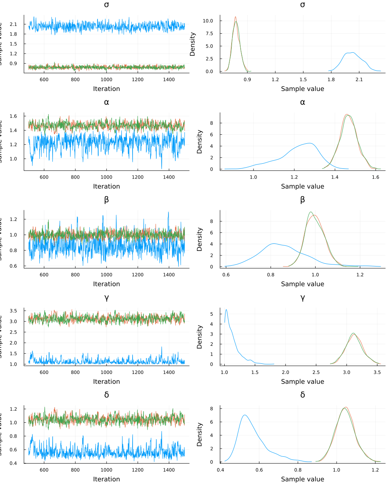
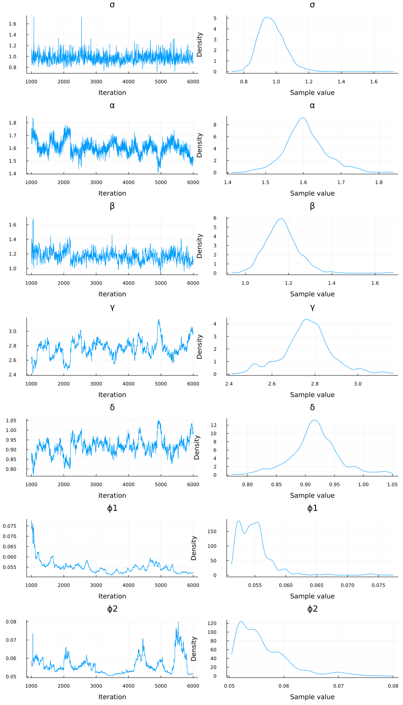

Most of the scientific community deals with the basic problem of trying to mathematically model the reality around them and this often involves dynamical systems. The general trend to model these complex dynamical systems is through the use of differential equations. Differential equation models often have non-measurable parameters. The popular “forward-problem” of simulation consists of solving the differential equations for a given set of parameters, the “inverse problem” to simulation, known as parameter estimation, is the process of utilizing data to determine these model parameters. Bayesian inference provides a robust approach to parameter estimation with quantified uncertainty.

```julia
using Turing, Distributions, DifferentialEquations

# Import MCMCChain, Plots, and StatsPlots for visualizations and diagnostics.
using MCMCChains, Plots, StatsPlots

# Set a seed for reproducibility.
using Random
Random.seed!(14);
```


## The Lotka-Volterra Model

The Lotka–Volterra equations, also known as the predator–prey equations, are a pair of first-order nonlinear differential equations, frequently used to describe the dynamics of biological systems in which two species interact, one as a predator and the other as prey. The populations change through time according to the pair of equations:

$$\frac{dx}{dt} = (\alpha - \beta y)x$$

$$\frac{dy}{dt} = (\delta x - \gamma)y$$

```julia
function lotka_volterra(du, u, p, t)
    x, y = u
    α, β, γ, δ = p
    du[1] = (α - β * y)x # dx =
    return du[2] = (δ * x - γ)y # dy =
end
p = [1.5, 1.0, 3.0, 1.0]
u0 = [1.0, 1.0]
prob1 = ODEProblem(lotka_volterra, u0, (0.0, 10.0), p)
sol = solve(prob1, Tsit5())
plot(sol)
```


We'll generate the data to use for the parameter estimation from simulation.
With the `saveat` [argument](https://docs.sciml.ai/latest/basics/common_solver_opts/) we specify that the solution is stored only at `0.1` time units. To make the data look more realistic, we add random noise using the function `randn`.

```julia
sol1 = solve(prob1, Tsit5(); saveat=0.1)
odedata = Array(sol1) + 0.8 * randn(size(Array(sol1)))
plot(sol1; alpha=0.3, legend=false);
scatter!(sol1.t, odedata');
```


## Direct Handling of Bayesian Estimation with Turing

Previously, functions in Turing and DifferentialEquations were not inter-composable, so Bayesian inference of differential equations needed to be handled by another package called [DiffEqBayes.jl](https://github.com/SciML/DiffEqBayes.jl) (note that DiffEqBayes works also with CmdStan.jl, Turing.jl, DynamicHMC.jl and ApproxBayes.jl - see the [DiffEqBayes docs](https://docs.sciml.ai/latest/analysis/parameter_estimation/#Bayesian-Methods-1) for more info).

From now on however, Turing and DifferentialEquations are completely composable and we can write of the differential equation inside a Turing `@model` and it will just work. Therefore, we can rewrite the Lotka Volterra parameter estimation problem with a Turing `@model` interface as below:

```julia
Turing.setadbackend(:forwarddiff)

@model function fitlv(data, prob1)
    σ ~ InverseGamma(2, 3) # ~ is the tilde character
    α ~ truncated(Normal(1.5, 0.5), 0.5, 2.5)
    β ~ truncated(Normal(1.2, 0.5), 0, 2)
    γ ~ truncated(Normal(3.0, 0.5), 1, 4)
    δ ~ truncated(Normal(1.0, 0.5), 0, 2)

    p = [α, β, γ, δ]
    prob = remake(prob1; p=p)
    predicted = solve(prob, Tsit5(); saveat=0.1)

    for i in 1:length(predicted)
        data[:, i] ~ MvNormal(predicted[i], σ)
    end
end

model = fitlv(odedata, prob1)

# This next command runs 3 independent chains without using multithreading.
chain = mapreduce(c -> sample(model, NUTS(0.65), 1000), chainscat, 1:3)
```

```
Chains MCMC chain (1000×17×3 Array{Float64, 3}):

Iterations        = 501:1:1500
Number of chains  = 3
Samples per chain = 1000
Wall duration     = 16.64 seconds
Compute duration  = 16.28 seconds
parameters        = α, γ, σ, δ, β
internals         = lp, n_steps, is_accept, acceptance_rate, log_density, h
amiltonian_energy, hamiltonian_energy_error, max_hamiltonian_energy_error, 
tree_depth, numerical_error, step_size, nom_step_size

Summary Statistics
  parameters      mean       std   naive_se      mcse       ess      rhat  
 es ⋯
      Symbol   Float64   Float64    Float64   Float64   Float64   Float64  
    ⋯

           σ    1.2278    0.5884     0.0107    0.1085    6.0868    9.2797  
    ⋯
           α    1.4516    0.1694     0.0031    0.0283    7.3209    2.4303  
    ⋯
           β    1.0208    0.1329     0.0024    0.0198    9.0444    1.7633  
    ⋯
           γ    2.2875    0.8410     0.0154    0.1540    6.1682    6.4426  
    ⋯
           δ    0.8072    0.1924     0.0035    0.0340    6.5937    3.4511  
    ⋯
                                                                1 column om
itted

Quantiles
  parameters      2.5%     25.0%     50.0%     75.0%     97.5%
      Symbol   Float64   Float64   Float64   Float64   Float64

           σ    0.7477    0.8002    0.8401    1.9839    2.2145
           α    1.0618    1.3083    1.5196    1.5758    1.6614
           β    0.7211    0.9347    1.0624    1.1129    1.2058
           γ    1.0073    1.1518    2.7706    2.9213    3.1346
           δ    0.4710    0.5785    0.9002    0.9521    1.0309
```


The estimated parameters are close to the desired parameter values. We can also check that the chains have converged in the plot.

```julia
plot(chain)
```




### Data retrodiction

In Bayesian analysis it is often useful to retrodict the data, i.e. generate simulated data using samples from the posterior distribution, and compare to the original data (see for instance section 3.3.2 - model checking of McElreath's book "Statistical Rethinking"). Here, we solve again the ODE using the output in `chain`, for 300 randomly picked posterior samples. We plot this ensemble of solutions to check if the solution resembles the data.

```julia
pl = scatter(sol1.t, odedata');
```


```julia
chain_array = Array(chain)
for k in 1:300
    resol = solve(remake(prob1; p=chain_array[rand(1:1500), 1:4]), Tsit5(); saveat=0.1)
    plot!(resol; alpha=0.1, color="#BBBBBB", legend=false)
end
# display(pl)
plot!(sol1; w=1, legend=false)
```


In the plot above, the 300 retrodicted time courses from the posterior are plotted in gray, and the original data are the blue and red dots, and the solution that was used to generate the data are the green and purple lines. We can see that, even though we added quite a bit of noise to the data (see dot plot above), the posterior distribution reproduces quite accurately the "true" ODE solution.

## Lokta Volterra with missing predator data

Thanks to the known structure of the problem, encoded by the Lokta-Volterra ODEs, one can also fit a model with incomplete data - even without any data for one of the two variables. For instance, let's suppose you have observations for the prey only, but none for the predator. We test this case by fitting the model only to the $$y$$ variable of the system, without providing any data for $$x$$:

```julia
@model function fitlv2(data, prob1) # data should be a Vector
    σ ~ InverseGamma(2, 3) # ~ is the tilde character
    α ~ truncated(Normal(1.5, 0.5), 0.5, 2.5)
    β ~ truncated(Normal(1.2, 0.5), 0, 2)
    γ ~ truncated(Normal(3.0, 0.5), 1, 4)
    δ ~ truncated(Normal(1.0, 0.5), 0, 2)

    p = [α, β, γ, δ]
    prob = remake(prob1; p=p)
    predicted = solve(prob, Tsit5(); saveat=0.1)

    for i in 1:length(predicted)
        data[i] ~ Normal(predicted[i][2], σ) # predicted[i][2] is the data for y - a scalar, so we use Normal instead of MvNormal
    end
end

model2 = fitlv2(odedata[2, :], prob1)
```

```
DynamicPPL.Model{Main.##WeaveSandBox#3142.var"#5#6", (:data, :prob1), (), (
), Tuple{Vector{Float64}, SciMLBase.ODEProblem{Vector{Float64}, Tuple{Float
64, Float64}, true, Vector{Float64}, SciMLBase.ODEFunction{true, typeof(Mai
n.##WeaveSandBox#3142.lotka_volterra), LinearAlgebra.UniformScaling{Bool}, 
Nothing, Nothing, Nothing, Nothing, Nothing, Nothing, Nothing, Nothing, Not
hing, Nothing, Nothing, Nothing, typeof(SciMLBase.DEFAULT_OBSERVED), Nothin
g}, Base.Iterators.Pairs{Union{}, Union{}, Tuple{}, NamedTuple{(), Tuple{}}
}, SciMLBase.StandardODEProblem}}, Tuple{}}(:fitlv2, Main.##WeaveSandBox#31
42.var"#5#6"(), (data = [2.200730590544725, 0.8584002186440604, 0.313080389
23384407, 0.8065538543184619, -0.3471952437965851, 0.2827563462601048, 0.46
337329091344126, 0.9388139946097066, -0.029638888419957654, -0.107665707964
47789  …  4.4844669073068015, 2.2766378547092803, 3.034635398109275, 1.6534
146147281994, 2.3126757947633196, 3.4304192393009023, 1.481768351221499, 1.
7989355388635422, 1.3438819631213252, 0.25843622408034894], prob1 = SciMLBa
se.ODEProblem{Vector{Float64}, Tuple{Float64, Float64}, true, Vector{Float6
4}, SciMLBase.ODEFunction{true, typeof(Main.##WeaveSandBox#3142.lotka_volte
rra), LinearAlgebra.UniformScaling{Bool}, Nothing, Nothing, Nothing, Nothin
g, Nothing, Nothing, Nothing, Nothing, Nothing, Nothing, Nothing, Nothing, 
typeof(SciMLBase.DEFAULT_OBSERVED), Nothing}, Base.Iterators.Pairs{Union{},
 Union{}, Tuple{}, NamedTuple{(), Tuple{}}}, SciMLBase.StandardODEProblem}(
SciMLBase.ODEFunction{true, typeof(Main.##WeaveSandBox#3142.lotka_volterra)
, LinearAlgebra.UniformScaling{Bool}, Nothing, Nothing, Nothing, Nothing, N
othing, Nothing, Nothing, Nothing, Nothing, Nothing, Nothing, Nothing, type
of(SciMLBase.DEFAULT_OBSERVED), Nothing}(Main.##WeaveSandBox#3142.lotka_vol
terra, LinearAlgebra.UniformScaling{Bool}(true), nothing, nothing, nothing,
 nothing, nothing, nothing, nothing, nothing, nothing, nothing, nothing, no
thing, SciMLBase.DEFAULT_OBSERVED, nothing), [1.0, 1.0], (0.0, 10.0), [1.5,
 1.0, 3.0, 1.0], Base.Iterators.Pairs{Union{}, Union{}, Tuple{}, NamedTuple
{(), Tuple{}}}(), SciMLBase.StandardODEProblem())), NamedTuple())
```


Here we use the multithreading functionality [available](https://turing.ml/dev/docs/using-turing/guide#multithreaded-sampling) in Turing.jl to sample 3 independent chains

```julia
Threads.nthreads()
```

```
1
```


```julia
# This next command runs 3 independent chains with multithreading.
chain2 = sample(model2, NUTS(0.45), MCMCThreads(), 5000, 3; progress=false)
```

```
Chains MCMC chain (5000×17×3 Array{Float64, 3}):

Iterations        = 1001:1:6000
Number of chains  = 3
Samples per chain = 5000
Wall duration     = 40.34 seconds
Compute duration  = 39.82 seconds
parameters        = α, γ, σ, δ, β
internals         = lp, n_steps, is_accept, acceptance_rate, log_density, h
amiltonian_energy, hamiltonian_energy_error, max_hamiltonian_energy_error, 
tree_depth, numerical_error, step_size, nom_step_size

Summary Statistics
  parameters      mean       std   naive_se      mcse       ess      rhat  
 es ⋯
      Symbol   Float64   Float64    Float64   Float64   Float64   Float64  
    ⋯

           σ    0.8249    0.0541     0.0004    0.0036   77.3462    1.0400  
    ⋯
           α    1.5095    0.1758     0.0014    0.0114   82.0133    1.0630  
    ⋯
           β    1.0834    0.1380     0.0011    0.0088   86.2483    1.0623  
    ⋯
           γ    3.0582    0.3266     0.0027    0.0219   77.2112    1.0694  
    ⋯
           δ    1.0192    0.2569     0.0021    0.0172   74.8634    1.0779  
    ⋯
                                                                1 column om
itted

Quantiles
  parameters      2.5%     25.0%     50.0%     75.0%     97.5%
      Symbol   Float64   Float64   Float64   Float64   Float64

           σ    0.7321    0.7860    0.8224    0.8599    0.9390
           α    1.1673    1.3915    1.5021    1.6164    1.8788
           β    0.8295    0.9834    1.0786    1.1679    1.3876
           γ    2.4829    2.8391    3.0392    3.2498    3.8591
           δ    0.5815    0.8427    0.9928    1.1724    1.6283
```


```julia
pl = scatter(sol1.t, odedata');
chain_array2 = Array(chain2)
for k in 1:300
    resol = solve(remake(prob1; p=chain_array2[rand(1:12000), 1:4]), Tsit5(); saveat=0.1)
    # Note that due to a bug in AxisArray, the variables from the chain will be returned always in
    # the order it is stored in the array, not by the specified order in the call - :α, :β, :γ, :δ
    plot!(resol; alpha=0.1, color="#BBBBBB", legend=false)
end
#display(pl)
plot!(sol1; w=1, legend=false)
```


Note that here, the data values of $$x$$ (blue dots) were not given to the model! Yet, the model could predict the values of $$x$$ relatively accurately, albeit with a wider distribution of solutions, reflecting the greater uncertainty in the prediction of the $$x$$ values.

## Inference of Delay Differential Equations

Here we show an example of inference with another type of differential equation: a Delay Differential Equation (DDE). A DDE is an DE system where derivatives are function of values at an earlier point in time. This is useful to model a delayed effect, like incubation time of a virus for instance.

For this, we will define a [`DDEProblem`](https://diffeq.sciml.ai/stable/tutorials/dde_example/), from the package DifferentialEquations.jl.

Here is a delayed version of the lokta voltera system:

$$\frac{dx}{dt} = \alpha x(t-\tau) - \beta y(t) x(t)$$

$$\frac{dy}{dt} = - \gamma y(t) + \delta x(t) y(t) $$

Where $$x(t-\tau)$$ is the variable $$x$$ at an earlier time point. We specify the delayed variable with a function `h(p, t)`, as described in the [DDE example](https://diffeq.sciml.ai/stable/tutorials/dde_example/).

```julia
function delay_lotka_volterra(du, u, h, p, t)
    x, y = u
    α, β, γ, δ = p
    du[1] = α * h(p, t - 1; idxs=1) - β * x * y
    du[2] = -γ * y + δ * x * y
    return nothing
end

p = (1.5, 1.0, 3.0, 1.0)
u0 = [1.0; 1.0]
tspan = (0.0, 10.0)
h(p, t; idxs::Int) = 1.0
prob1 = DDEProblem(delay_lotka_volterra, u0, h, tspan, p)
```

```
DDEProblem with uType Vector{Float64} and tType Float64. In-place: true
timespan: (0.0, 10.0)
u0: 2-element Vector{Float64}:
 1.0
 1.0
```


```julia
sol = solve(prob1; saveat=0.1)
ddedata = Array(sol)
ddedata = ddedata + 0.5 * randn(size(ddedata))
```

```
2×101 Matrix{Float64}:
 0.926478  1.34871   0.321739  1.7702    …  2.24132  1.94575    2.44402
 1.18266   0.209478  0.457125  0.638527     2.35038  0.0620367  1.49038
```


Plot the data:

```julia
scatter(sol.t, ddedata');
plot!(sol);
```


Now we define and run the Turing model.

```julia
Turing.setadbackend(:forwarddiff)
@model function fitlv(data, prob1)
    σ ~ InverseGamma(2, 3)
    α ~ Truncated(Normal(1.5, 0.5), 0.5, 2.5)
    β ~ Truncated(Normal(1.2, 0.5), 0, 2)
    γ ~ Truncated(Normal(3.0, 0.5), 1, 4)
    δ ~ Truncated(Normal(1.0, 0.5), 0, 2)

    p = [α, β, γ, δ]

    #prob = DDEProblem(delay_lotka_volterra,u0,_h,tspan,p)
    prob = remake(prob1; p=p)
    predicted = solve(prob; saveat=0.1)
    for i in 1:length(predicted)
        data[:, i] ~ MvNormal(predicted[i], σ)
    end
end;
model = fitlv(ddedata, prob1)
```

```
DynamicPPL.Model{Main.##WeaveSandBox#3142.var"#8#9", (:data, :prob1), (), (
), Tuple{Matrix{Float64}, SciMLBase.DDEProblem{Vector{Float64}, Tuple{Float
64, Float64}, Tuple{}, Tuple{}, true, NTuple{4, Float64}, SciMLBase.DDEFunc
tion{true, typeof(Main.##WeaveSandBox#3142.delay_lotka_volterra), LinearAlg
ebra.UniformScaling{Bool}, Nothing, Nothing, Nothing, Nothing, Nothing, Not
hing, Nothing, Nothing, Nothing, Nothing, Nothing, Nothing}, typeof(Main.##
WeaveSandBox#3142.h), Base.Iterators.Pairs{Union{}, Union{}, Tuple{}, Named
Tuple{(), Tuple{}}}, SciMLBase.StandardDDEProblem}}, Tuple{}}(:fitlv, Main.
##WeaveSandBox#3142.var"#8#9"(), (data = [0.926478234642463 1.3487076805150
848 … 1.9457477738549516 2.444016715415613; 1.1826588411513022 0.2094782612
474808 … 0.06203674167353701 1.4903756100149281], prob1 = SciMLBase.DDEProb
lem{Vector{Float64}, Tuple{Float64, Float64}, Tuple{}, Tuple{}, true, NTupl
e{4, Float64}, SciMLBase.DDEFunction{true, typeof(Main.##WeaveSandBox#3142.
delay_lotka_volterra), LinearAlgebra.UniformScaling{Bool}, Nothing, Nothing
, Nothing, Nothing, Nothing, Nothing, Nothing, Nothing, Nothing, Nothing, N
othing, Nothing}, typeof(Main.##WeaveSandBox#3142.h), Base.Iterators.Pairs{
Union{}, Union{}, Tuple{}, NamedTuple{(), Tuple{}}}, SciMLBase.StandardDDEP
roblem}(SciMLBase.DDEFunction{true, typeof(Main.##WeaveSandBox#3142.delay_l
otka_volterra), LinearAlgebra.UniformScaling{Bool}, Nothing, Nothing, Nothi
ng, Nothing, Nothing, Nothing, Nothing, Nothing, Nothing, Nothing, Nothing,
 Nothing}(Main.##WeaveSandBox#3142.delay_lotka_volterra, LinearAlgebra.Unif
ormScaling{Bool}(true), nothing, nothing, nothing, nothing, nothing, nothin
g, nothing, nothing, nothing, nothing, nothing, nothing), [1.0, 1.0], Main.
##WeaveSandBox#3142.h, (0.0, 10.0), (1.5, 1.0, 3.0, 1.0), (), (), Base.Iter
ators.Pairs{Union{}, Union{}, Tuple{}, NamedTuple{(), Tuple{}}}(), false, 0
, SciMLBase.StandardDDEProblem())), NamedTuple())
```


Then we draw samples using multithreading; this time, we draw 3 independent chains in parallel using `MCMCThreads`.

```julia
chain = sample(model, NUTS(0.65), MCMCThreads(), 300, 3; progress=true)
plot(chain)
```


Finally, we select a 100 sets of parameters from the first chain and plot solutions.

```julia
chain
```

```
Chains MCMC chain (300×17×3 Array{Float64, 3}):

Iterations        = 151:1:450
Number of chains  = 3
Samples per chain = 300
Wall duration     = 34.31 seconds
Compute duration  = 33.89 seconds
parameters        = α, γ, σ, δ, β
internals         = lp, n_steps, is_accept, acceptance_rate, log_density, h
amiltonian_energy, hamiltonian_energy_error, max_hamiltonian_energy_error, 
tree_depth, numerical_error, step_size, nom_step_size

Summary Statistics
  parameters      mean       std   naive_se      mcse        ess      rhat 
  e ⋯
      Symbol   Float64   Float64    Float64   Float64    Float64   Float64 
    ⋯

           σ    0.4952    0.0250     0.0008    0.0009   730.9884    1.0007 
    ⋯
           α    1.5413    0.0753     0.0025    0.0047   205.1638    1.0043 
    ⋯
           β    1.0445    0.0587     0.0020    0.0038   237.7460    1.0028 
    ⋯
           γ    2.9623    0.1528     0.0051    0.0088   208.4059    1.0043 
    ⋯
           δ    0.9922    0.0541     0.0018    0.0031   203.8318    1.0022 
    ⋯
                                                                1 column om
itted

Quantiles
  parameters      2.5%     25.0%     50.0%     75.0%     97.5%
      Symbol   Float64   Float64   Float64   Float64   Float64

           σ    0.4476    0.4779    0.4950    0.5109    0.5479
           α    1.4085    1.4914    1.5331    1.5822    1.7257
           β    0.9426    1.0028    1.0415    1.0781    1.1759
           γ    2.6525    2.8642    2.9622    3.0669    3.2404
           δ    0.8801    0.9584    0.9915    1.0279    1.0968
```


```julia
pl = scatter(sol.t, ddedata')
chain_array = Array(chain)
for k in 1:100
    resol = solve(remake(prob1; p=chain_array[rand(1:450), 1:4]), Tsit5(); saveat=0.1)
    # Note that due to a bug in AxisArray, the variables from the chain will be returned always in
    # the order it is stored in the array, not by the specified order in the call - :α, :β, :γ, :δ

    plot!(resol; alpha=0.1, color="#BBBBBB", legend=false)
end
#display(pl)
plot!(sol)
```


Here again, the dots is the data fed to the model, the continuous colored line is the "true" solution, and the gray lines are solutions from the posterior. The fit is pretty good even though the data was quite noisy to start.

## Scaling to Large Models: Adjoint Sensitivities

DifferentialEquations.jl's efficiency for large stiff models has been shown in multiple [benchmarks](https://github.com/SciML/DiffEqBenchmarks.jl). To learn more about how to optimize solving performance for stiff problems you can take a look at the [docs](https://docs.sciml.ai/latest/tutorials/advanced_ode_example/).

[Sensitivity analysis](https://docs.sciml.ai/latest/analysis/sensitivity/), or automatic differentiation (AD) of the solver, is provided by the DiffEq suite. The model sensitivities are the derivatives of the solution $$u(t)$$ with respect to the parameters. Specifically, the local sensitivity of the solution to a parameter is defined by how much the solution would change by changes in the parameter. Sensitivity analysis provides a cheap way to calculate the gradient of the solution which can be used in parameter estimation and other optimization tasks.

The AD ecosystem in Julia allows you to switch between forward mode, reverse mode, source to source and other choices of AD and have it work with any Julia code. For a user to make use of this within [SciML](https://sciml.ai), [high level interactions in `solve`](https://docs.sciml.ai/latest/analysis/sensitivity/#High-Level-Interface:-sensealg-1) automatically plug into those AD systems to allow for choosing advanced sensitivity analysis (derivative calculation) [methods](https://docs.sciml.ai/latest/analysis/sensitivity/#Sensitivity-Algorithms-1).

More theoretical details on these methods can be found at: https://docs.sciml.ai/latest/extras/sensitivity_math/.

While these sensitivity analysis methods may seem complicated (and they are!), using them is dead simple. Here is a version of the Lotka-Volterra model with adjoints enabled.

All we had to do is switch the AD backend to one of the adjoint-compatible backends (ReverseDiff, Tracker, or Zygote) and boom the system takes over and we're using adjoint methods! Notice that on this model adjoints are slower. This is because adjoints have a higher overhead on small parameter models and we suggest only using these methods for models with around 100 parameters or more. For more details, see https://arxiv.org/abs/1812.01892.

```julia
using Zygote, DiffEqSensitivity
Turing.setadbackend(:zygote)
prob1 = ODEProblem(lotka_volterra, u0, (0.0, 10.0), p)
```

```
Error: ArgumentError: Package Zygote not found in current path:
- Run `import Pkg; Pkg.add("Zygote")` to install the Zygote package.
```


```julia
@model function fitlv(data, prob)
    σ ~ InverseGamma(2, 3)
    α ~ truncated(Normal(1.5, 0.5), 0.5, 2.5)
    β ~ truncated(Normal(1.2, 0.5), 0, 2)
    γ ~ truncated(Normal(3.0, 0.5), 1, 4)
    δ ~ truncated(Normal(1.0, 0.5), 0, 2)
    p = [α, β, γ, δ]
    prob = remake(prob; p=p)

    predicted = solve(prob; saveat=0.1)
    for i in 1:length(predicted)
        data[:, i] ~ MvNormal(predicted[i], σ)
    end
end;
model = fitlv(odedata, prob1)
chain = sample(model, NUTS(0.65), 1000)
```

```
Chains MCMC chain (1000×17×1 Array{Float64, 3}):

Iterations        = 501:1:1500
Number of chains  = 1
Samples per chain = 1000
Wall duration     = 25.11 seconds
Compute duration  = 25.11 seconds
parameters        = α, γ, σ, δ, β
internals         = lp, n_steps, is_accept, acceptance_rate, log_density, h
amiltonian_energy, hamiltonian_energy_error, max_hamiltonian_energy_error, 
tree_depth, numerical_error, step_size, nom_step_size

Summary Statistics
  parameters      mean       std   naive_se      mcse        ess      rhat 
  e ⋯
      Symbol   Float64   Float64    Float64   Float64    Float64   Float64 
    ⋯

           σ    1.8179    0.0927     0.0029    0.0038   596.1266    1.0009 
    ⋯
           α    2.4237    0.0698     0.0022    0.0019   628.7358    0.9990 
    ⋯
           β    1.4466    0.1439     0.0046    0.0058   537.5775    1.0002 
    ⋯
           γ    3.8903    0.0958     0.0030    0.0033   513.5857    0.9991 
    ⋯
           δ    1.4596    0.0753     0.0024    0.0038   424.9986    0.9993 
    ⋯
                                                                1 column om
itted

Quantiles
  parameters      2.5%     25.0%     50.0%     75.0%     97.5%
      Symbol   Float64   Float64   Float64   Float64   Float64

           σ    1.6340    1.7572    1.8113    1.8745    2.0188
           α    2.2475    2.3946    2.4437    2.4750    2.4974
           β    1.1783    1.3493    1.4350    1.5383    1.7536
           γ    3.6288    3.8422    3.9169    3.9623    3.9967
           δ    1.3194    1.4099    1.4531    1.5073    1.6062
```


Now we can exercise control of the sensitivity analysis method that is used by using the `sensealg` keyword argument. Let's choose the `InterpolatingAdjoint` from the available AD [methods](https://docs.sciml.ai/latest/analysis/sensitivity/#Sensitivity-Algorithms-1) and enable a compiled ReverseDiff vector-Jacobian product:

```julia
@model function fitlv(data, prob)
    σ ~ InverseGamma(2, 3)
    α ~ truncated(Normal(1.5, 0.5), 0.5, 2.5)
    β ~ truncated(Normal(1.2, 0.5), 0, 2)
    γ ~ truncated(Normal(3.0, 0.5), 1, 4)
    δ ~ truncated(Normal(1.0, 0.5), 0, 2)
    p = [α, β, γ, δ]
    prob = remake(prob; p=p)
    predicted = solve(
        prob; saveat=0.1, sensealg=InterpolatingAdjoint(; autojacvec=ReverseDiffVJP(true))
    )
    for i in 1:length(predicted)
        data[:, i] ~ MvNormal(predicted[i], σ)
    end
end;
model = fitlv(odedata, prob1)
@time chain = sample(model, NUTS(0.65), 1000)
```

```
Error: UndefVarError: ReverseDiffVJP not defined
```


For more examples of adjoint usage on large parameter models, consult the [DiffEqFlux documentation](https://diffeqflux.sciml.ai/dev/).

## Inference of a Stochastic Differential Equation

A Stochastic Differential Equation ([SDE](https://diffeq.sciml.ai/stable/tutorials/sde_example/)) is a differential equation that has a stochastic (noise) term in the expression of the derivatives. Here we fit a Stochastic version of the Lokta-Volterra system.

We use a quasi-likelihood approach in which all trajectories of a solution are compared instead of a reduction such as mean, this increases the robustness of fitting and makes the likelihood more identifiable. We use SOSRI to solve the equation. The NUTS sampler is a bit sensitive to the stochastic optimization since the gradient is then changing with every calculation, so we use NUTS with a target acceptance rate of `0.25`.

```julia
u0 = [1.0, 1.0]
tspan = (0.0, 10.0)
function multiplicative_noise!(du, u, p, t)
    x, y = u
    du[1] = p[5] * x
    return du[2] = p[6] * y
end
p = [1.5, 1.0, 3.0, 1.0, 0.1, 0.1]

function lotka_volterra!(du, u, p, t)
    x, y = u
    α, β, γ, δ = p
    du[1] = dx = α * x - β * x * y
    return du[2] = dy = δ * x * y - γ * y
end

prob_sde = SDEProblem(lotka_volterra!, multiplicative_noise!, u0, tspan, p)

ensembleprob = EnsembleProblem(prob_sde)
@time data = solve(ensembleprob, SOSRI(); saveat=0.1, trajectories=1000)
plot(EnsembleSummary(data))
```

```
6.842191 seconds (5.98 M allocations: 312.402 MiB, 0.98% gc time, 59.08% 
compilation time)
```


```julia
Turing.setadbackend(:forwarddiff)
@model function fitlv(data, prob)
    σ ~ InverseGamma(2, 3)
    α ~ truncated(Normal(1.3, 0.5), 0.5, 2.5)
    β ~ truncated(Normal(1.2, 0.25), 0.5, 2)
    γ ~ truncated(Normal(3.2, 0.25), 2.2, 4.0)
    δ ~ truncated(Normal(1.2, 0.25), 0.5, 2.0)
    ϕ1 ~ truncated(Normal(0.12, 0.3), 0.05, 0.25)
    ϕ2 ~ truncated(Normal(0.12, 0.3), 0.05, 0.25)
    p = [α, β, γ, δ, ϕ1, ϕ2]
    prob = remake(prob; p=p)
    predicted = solve(prob, SOSRI(); saveat=0.1)

    if predicted.retcode != :Success
        Turing.acclogp!(_varinfo, -Inf)
    end

    for i in 1:length(predicted)
        data[:, i] ~ MvNormal(predicted[i], σ)
    end
end;
```


We use NUTS sampler with a low acceptance ratio and initial parameters since estimating the parameters of SDE with HMC poses a challenge. Probabilistic nature of the SDE solution makes the likelihood function noisy which poses a challenge for NUTS since the gradient is then changing with every calculation. SGHMC might be better suited to be used here.

```julia
model = fitlv(odedata, prob_sde)
chain = sample(model, NUTS(0.25), 5000; init_theta=[1.5, 1.3, 1.2, 2.7, 1.2, 0.12, 0.12])
plot(chain)
```




## Appendix

These tutorials are a part of the TuringTutorials repository, found at: [https://github.com/TuringLang/TuringTutorials](https://github.com/TuringLang/TuringTutorials).

To locally run this tutorial, do the following commands:

```
using TuringTutorials
TuringTutorials.weave("10-bayesian-differential-equations", "10_bayesian-differential-equations.jmd")
```

Computer Information:

```
Julia Version 1.6.5
Commit 9058264a69 (2021-12-19 12:30 UTC)
Platform Info:
  OS: Linux (x86_64-pc-linux-gnu)
  CPU: AMD EPYC 7502 32-Core Processor
  WORD_SIZE: 64
  LIBM: libopenlibm
  LLVM: libLLVM-11.0.1 (ORCJIT, znver2)
Environment:
  JULIA_CPU_THREADS = 16
  BUILDKITE_PLUGIN_JULIA_CACHE_DIR = /cache/julia-buildkite-plugin
  JULIA_DEPOT_PATH = /cache/julia-buildkite-plugin/depots/7aa0085e-79a4-45f3-a5bd-9743c91cf3da

```

Package Information:

```
      Status `/cache/build/default-amdci4-1/julialang/turingtutorials/tutorials/10-bayesian-differential-equations/Project.toml`
  [a93c6f00] DataFrames v1.3.2
  [2b5f629d] DiffEqBase v6.81.4
  [ebbdde9d] DiffEqBayes v2.26.0
  [41bf760c] DiffEqSensitivity v6.69.1
  [0c46a032] DifferentialEquations v7.1.0
  [31c24e10] Distributions v0.25.14
  [ced4e74d] DistributionsAD v0.6.29
  [c7f686f2] MCMCChains v4.14.1
  [91a5bcdd] Plots v1.25.5
  [f3b207a7] StatsPlots v0.14.30
  [fce5fe82] Turing v0.16.6
  [9a3f8284] Random
```

And the full manifest:

```
      Status `/cache/build/default-amdci4-1/julialang/turingtutorials/tutorials/10-bayesian-differential-equations/Manifest.toml`
  [a4c015fc] ANSIColoredPrinters v0.0.1
  [621f4979] AbstractFFTs v1.0.1
  [80f14c24] AbstractMCMC v3.2.1
  [7a57a42e] AbstractPPL v0.1.4
  [1520ce14] AbstractTrees v0.3.4
  [79e6a3ab] Adapt v3.3.3
  [0bf59076] AdvancedHMC v0.3.3
  [5b7e9947] AdvancedMH v0.6.6
  [576499cb] AdvancedPS v0.2.4
  [b5ca4192] AdvancedVI v0.1.3
  [dce04be8] ArgCheck v2.3.0
  [ec485272] ArnoldiMethod v0.1.0
  [7d9fca2a] Arpack v0.4.0
  [4fba245c] ArrayInterface v3.2.2
  [4c555306] ArrayLayouts v0.7.5
  [13072b0f] AxisAlgorithms v1.0.1
  [39de3d68] AxisArrays v0.4.4
  [94b1ba4f] AxisKeys v0.1.21
  [aae01518] BandedMatrices v0.16.11
  [198e06fe] BangBang v0.3.35
  [9718e550] Baselet v0.1.1
  [6e4b80f9] BenchmarkTools v0.7.0
  [76274a88] Bijectors v0.9.7
  [62783981] BitTwiddlingConvenienceFunctions v0.1.2
  [8e7c35d0] BlockArrays v0.16.11
  [ffab5731] BlockBandedMatrices v0.10.9
  [764a87c0] BoundaryValueDiffEq v2.7.1
  [fa961155] CEnum v0.4.1
  [2a0fbf3d] CPUSummary v0.1.8
  [00ebfdb7] CSTParser v3.3.1
  [336ed68f] CSV v0.8.5
  [7057c7e9] Cassette v0.3.9
  [082447d4] ChainRules v0.8.25
  [d360d2e6] ChainRulesCore v0.10.13
  [fb6a15b2] CloseOpenIntervals v0.1.5
  [aaaa29a8] Clustering v0.14.2
  [35d6a980] ColorSchemes v3.17.1
  [3da002f7] ColorTypes v0.11.0
  [5ae59095] Colors v0.12.8
  [861a8166] Combinatorics v1.0.2
  [a80b9123] CommonMark v0.8.6
  [38540f10] CommonSolve v0.2.0
  [bbf7d656] CommonSubexpressions v0.3.0
  [34da2185] Compat v3.41.0
  [b152e2b5] CompositeTypes v0.1.2
  [a33af91c] CompositionsBase v0.1.1
  [88cd18e8] ConsoleProgressMonitor v0.1.2
  [187b0558] ConstructionBase v1.3.0
  [d38c429a] Contour v0.5.7
  [587fd27a] CovarianceEstimation v0.2.7
  [a8cc5b0e] Crayons v4.1.1
  [754358af] DEDataArrays v0.2.0
  [9a962f9c] DataAPI v1.9.0
  [a93c6f00] DataFrames v1.3.2
  [864edb3b] DataStructures v0.18.11
  [e2d170a0] DataValueInterfaces v1.0.0
  [e7dc6d0d] DataValues v0.4.13
  [244e2a9f] DefineSingletons v0.1.2
  [bcd4f6db] DelayDiffEq v5.34.0
  [2b5f629d] DiffEqBase v6.81.4
  [ebbdde9d] DiffEqBayes v2.26.0
  [459566f4] DiffEqCallbacks v2.20.1
  [c894b116] DiffEqJump v7.3.1
  [77a26b50] DiffEqNoiseProcess v5.9.0
  [9fdde737] DiffEqOperators v4.40.0
  [41bf760c] DiffEqSensitivity v6.69.1
  [163ba53b] DiffResults v1.0.3
  [b552c78f] DiffRules v1.5.0
  [0c46a032] DifferentialEquations v7.1.0
  [b4f34e82] Distances v0.10.7
  [31c24e10] Distributions v0.25.14
  [ced4e74d] DistributionsAD v0.6.29
  [ffbed154] DocStringExtensions v0.8.6
  [e30172f5] Documenter v0.27.12
  [5b8099bc] DomainSets v0.5.9
  [bbc10e6e] DynamicHMC v3.1.1
  [366bfd00] DynamicPPL v0.12.4
  [7c1d4256] DynamicPolynomials v0.3.21
  [da5c29d0] EllipsisNotation v1.3.0
  [cad2338a] EllipticalSliceSampling v0.4.6
  [7da242da] Enzyme v0.8.5
  [d4d017d3] ExponentialUtilities v1.11.0
  [e2ba6199] ExprTools v0.1.8
  [c87230d0] FFMPEG v0.4.1
  [7a1cc6ca] FFTW v1.4.5
  [7034ab61] FastBroadcast v0.1.12
  [9aa1b823] FastClosures v0.3.2
  [1a297f60] FillArrays v0.11.9
  [6a86dc24] FiniteDiff v2.10.1
  [53c48c17] FixedPointNumbers v0.8.4
  [59287772] Formatting v0.4.2
  [f6369f11] ForwardDiff v0.10.25
  [069b7b12] FunctionWrappers v1.1.2
  [d9f16b24] Functors v0.2.8
  [61eb1bfa] GPUCompiler v0.13.13
  [28b8d3ca] GR v0.63.1
  [5c1252a2] GeometryBasics v0.3.12
  [af5da776] GlobalSensitivity v1.3.1
  [86223c79] Graphs v1.6.0
  [42e2da0e] Grisu v1.0.2
  [cd3eb016] HTTP v0.9.17
  [3e5b6fbb] HostCPUFeatures v0.1.6
  [0e44f5e4] Hwloc v2.0.0
  [b5f81e59] IOCapture v0.2.2
  [7869d1d1] IRTools v0.4.5
  [615f187c] IfElse v0.1.1
  [d25df0c9] Inflate v0.1.2
  [83e8ac13] IniFile v0.5.0
  [22cec73e] InitialValues v0.3.1
  [505f98c9] InplaceOps v0.3.0
  [a98d9a8b] Interpolations v0.13.5
  [8197267c] IntervalSets v0.5.3
  [41ab1584] InvertedIndices v1.1.0
  [92d709cd] IrrationalConstants v0.1.1
  [c8e1da08] IterTools v1.4.0
  [42fd0dbc] IterativeSolvers v0.9.2
  [82899510] IteratorInterfaceExtensions v1.0.0
  [692b3bcd] JLLWrappers v1.4.1
  [682c06a0] JSON v0.21.3
  [98e50ef6] JuliaFormatter v0.15.11
  [ef3ab10e] KLU v0.3.0
  [5ab0869b] KernelDensity v0.6.3
  [ba0b0d4f] Krylov v0.7.12
  [0b1a1467] KrylovKit v0.5.3
  [929cbde3] LLVM v4.7.1
  [b964fa9f] LaTeXStrings v1.3.0
  [2ee39098] LabelledArrays v1.6.6
  [23fbe1c1] Latexify v0.15.11
  [a5e1c1ea] LatinHypercubeSampling v1.8.0
  [73f95e8e] LatticeRules v0.0.1
  [10f19ff3] LayoutPointers v0.1.5
  [5078a376] LazyArrays v0.21.20
  [d7e5e226] LazyBandedMatrices v0.6.7
  [1fad7336] LazyStack v0.0.7
  [1d6d02ad] LeftChildRightSiblingTrees v0.1.3
  [6f1fad26] Libtask v0.5.3
  [093fc24a] LightGraphs v1.3.5
  [d3d80556] LineSearches v7.1.1
  [7ed4a6bd] LinearSolve v1.11.3
  [6fdf6af0] LogDensityProblems v0.10.6
  [2ab3a3ac] LogExpFunctions v0.3.0
  [e6f89c97] LoggingExtras v0.4.7
  [bdcacae8] LoopVectorization v0.12.99
  [c7f686f2] MCMCChains v4.14.1
  [e80e1ace] MLJModelInterface v1.3.6
  [1914dd2f] MacroTools v0.5.9
  [d125e4d3] ManualMemory v0.1.8
  [dbb5928d] MappedArrays v0.4.1
  [a3b82374] MatrixFactorizations v0.8.5
  [739be429] MbedTLS v1.0.3
  [442fdcdd] Measures v0.3.1
  [128add7d] MicroCollections v0.1.2
  [e1d29d7a] Missings v1.0.2
  [961ee093] ModelingToolkit v5.26.0
  [0987c9cc] MonteCarloMeasurements v0.10.4
  [46d2c3a1] MuladdMacro v0.2.2
  [102ac46a] MultivariatePolynomials v0.3.18
  [6f286f6a] MultivariateStats v0.8.0
  [d8a4904e] MutableArithmetics v0.2.22
  [d41bc354] NLSolversBase v7.8.2
  [2774e3e8] NLsolve v4.5.1
  [872c559c] NNlib v0.7.34
  [77ba4419] NaNMath v0.3.7
  [86f7a689] NamedArrays v0.9.6
  [356022a1] NamedDims v0.2.37
  [c020b1a1] NaturalSort v1.0.0
  [b8a86587] NearestNeighbors v0.4.9
  [8913a72c] NonlinearSolve v0.3.14
  [d8793406] ObjectFile v0.3.7
  [510215fc] Observables v0.4.0
  [6fe1bfb0] OffsetArrays v1.10.8
  [429524aa] Optim v1.6.1
  [bac558e1] OrderedCollections v1.4.1
  [1dea7af3] OrdinaryDiffEq v6.6.6
  [90014a1f] PDMats v0.11.5
  [d96e819e] Parameters v0.12.3
  [69de0a69] Parsers v1.1.2
  [ccf2f8ad] PlotThemes v2.0.1
  [995b91a9] PlotUtils v1.1.3
  [91a5bcdd] Plots v1.25.5
  [e409e4f3] PoissonRandom v0.4.0
  [f517fe37] Polyester v0.6.4
  [1d0040c9] PolyesterWeave v0.1.4
  [2dfb63ee] PooledArrays v1.4.0
  [85a6dd25] PositiveFactorizations v0.2.4
  [d236fae5] PreallocationTools v0.2.3
  [21216c6a] Preferences v1.2.3
  [08abe8d2] PrettyTables v1.3.1
  [33c8b6b6] ProgressLogging v0.1.4
  [92933f4c] ProgressMeter v1.7.1
  [1fd47b50] QuadGK v2.4.2
  [8a4e6c94] QuasiMonteCarlo v0.2.4
  [74087812] Random123 v1.4.2
  [e6cf234a] RandomNumbers v1.5.3
  [b3c3ace0] RangeArrays v0.3.2
  [c84ed2f1] Ratios v0.4.2
  [3cdcf5f2] RecipesBase v1.2.1
  [01d81517] RecipesPipeline v0.4.1
  [731186ca] RecursiveArrayTools v2.24.2
  [f2c3362d] RecursiveFactorization v0.2.9
  [189a3867] Reexport v1.2.2
  [05181044] RelocatableFolders v0.1.3
  [ae029012] Requires v1.3.0
  [ae5879a3] ResettableStacks v1.1.1
  [37e2e3b7] ReverseDiff v1.9.0
  [79098fc4] Rmath v0.7.0
  [7e49a35a] RuntimeGeneratedFunctions v0.5.3
  [3cdde19b] SIMDDualNumbers v0.1.0
  [94e857df] SIMDTypes v0.1.0
  [476501e8] SLEEFPirates v0.6.29
  [1bc83da4] SafeTestsets v0.0.1
  [0bca4576] SciMLBase v1.26.1
  [30f210dd] ScientificTypesBase v3.0.0
  [6c6a2e73] Scratch v1.1.0
  [91c51154] SentinelArrays v1.3.12
  [efcf1570] Setfield v0.7.1
  [992d4aef] Showoff v1.0.3
  [699a6c99] SimpleTraits v0.9.4
  [ed01d8cd] Sobol v1.5.0
  [a2af1166] SortingAlgorithms v1.0.1
  [47a9eef4] SparseDiffTools v1.20.2
  [276daf66] SpecialFunctions v1.8.3
  [171d559e] SplittablesBase v0.1.14
  [860ef19b] StableRNGs v1.0.0
  [d0ee94f6] StanBase v2.4.1
  [9713c8f3] StanDump v0.2.0
  [c1514b29] StanSample v3.2.0
  [aedffcd0] Static v0.4.1
  [90137ffa] StaticArrays v1.3.5
  [64bff920] StatisticalTraits v3.0.0
  [82ae8749] StatsAPI v1.2.1
  [2913bbd2] StatsBase v0.33.16
  [4c63d2b9] StatsFuns v0.9.9
  [f3b207a7] StatsPlots v0.14.30
  [9672c7b4] SteadyStateDiffEq v1.6.6
  [789caeaf] StochasticDiffEq v6.44.0
  [7792a7ef] StrideArraysCore v0.2.11
  [09ab397b] StructArrays v0.5.1
  [53d494c1] StructIO v0.3.0
  [c3572dad] Sundials v4.9.2
  [d1185830] SymbolicUtils v0.13.2
  [0c5d862f] Symbolics v1.4.2
  [ab02a1b2] TableOperations v1.2.0
  [3783bdb8] TableTraits v1.0.1
  [bd369af6] Tables v1.6.1
  [5d786b92] TerminalLoggers v0.1.5
  [8290d209] ThreadingUtilities v0.4.7
  [a759f4b9] TimerOutputs v0.5.15
  [0796e94c] Tokenize v0.5.21
  [9f7883ad] Tracker v0.2.19
  [28d57a85] Transducers v0.4.72
  [84d833dd] TransformVariables v0.4.1
  [592b5752] Trapz v2.0.3
  [a2a6695c] TreeViews v0.3.0
  [d5829a12] TriangularSolve v0.1.9
  [fce5fe82] Turing v0.16.6
  [5c2747f8] URIs v1.3.0
  [3a884ed6] UnPack v1.0.2
  [1cfade01] UnicodeFun v0.4.1
  [1986cc42] Unitful v1.11.0
  [41fe7b60] Unzip v0.1.2
  [3d5dd08c] VectorizationBase v0.21.24
  [19fa3120] VertexSafeGraphs v0.2.0
  [cc8bc4a8] Widgets v0.6.5
  [efce3f68] WoodburyMatrices v0.5.5
  [e88e6eb3] Zygote v0.6.17
  [700de1a5] ZygoteRules v0.2.2
  [68821587] Arpack_jll v3.5.0+3
  [6e34b625] Bzip2_jll v1.0.8+0
  [83423d85] Cairo_jll v1.16.1+1
  [5ae413db] EarCut_jll v2.2.3+0
  [7cc45869] Enzyme_jll v0.0.25+0
  [2e619515] Expat_jll v2.4.4+0
  [b22a6f82] FFMPEG_jll v4.4.0+0
  [f5851436] FFTW_jll v3.3.10+0
  [a3f928ae] Fontconfig_jll v2.13.93+0
  [d7e528f0] FreeType2_jll v2.10.4+0
  [559328eb] FriBidi_jll v1.0.10+0
  [0656b61e] GLFW_jll v3.3.6+0
  [d2c73de3] GR_jll v0.64.0+0
  [78b55507] Gettext_jll v0.21.0+0
  [7746bdde] Glib_jll v2.68.3+2
  [3b182d85] Graphite2_jll v1.3.14+0
  [2e76f6c2] HarfBuzz_jll v2.8.1+1
  [e33a78d0] Hwloc_jll v2.7.0+0
  [1d5cc7b8] IntelOpenMP_jll v2018.0.3+2
  [aacddb02] JpegTurbo_jll v2.1.2+0
  [c1c5ebd0] LAME_jll v3.100.1+0
  [dad2f222] LLVMExtra_jll v0.0.13+2
  [dd4b983a] LZO_jll v2.10.1+0
  [e9f186c6] Libffi_jll v3.2.2+1
  [d4300ac3] Libgcrypt_jll v1.8.7+0
  [7e76a0d4] Libglvnd_jll v1.3.0+3
  [7add5ba3] Libgpg_error_jll v1.42.0+0
  [94ce4f54] Libiconv_jll v1.16.1+1
  [4b2f31a3] Libmount_jll v2.35.0+0
  [3ae2931a] Libtask_jll v0.4.3+0
  [89763e89] Libtiff_jll v4.3.0+0
  [38a345b3] Libuuid_jll v2.36.0+0
  [856f044c] MKL_jll v2021.1.1+2
  [e7412a2a] Ogg_jll v1.3.5+1
  [458c3c95] OpenSSL_jll v1.1.13+0
  [efe28fd5] OpenSpecFun_jll v0.5.5+0
  [91d4177d] Opus_jll v1.3.2+0
  [2f80f16e] PCRE_jll v8.44.0+0
  [30392449] Pixman_jll v0.40.1+0
  [ea2cea3b] Qt5Base_jll v5.15.3+0
  [f50d1b31] Rmath_jll v0.3.0+0
  [fb77eaff] Sundials_jll v5.2.0+1
  [a2964d1f] Wayland_jll v1.19.0+0
  [2381bf8a] Wayland_protocols_jll v1.23.0+0
  [02c8fc9c] XML2_jll v2.9.12+0
  [aed1982a] XSLT_jll v1.1.34+0
  [4f6342f7] Xorg_libX11_jll v1.6.9+4
  [0c0b7dd1] Xorg_libXau_jll v1.0.9+4
  [935fb764] Xorg_libXcursor_jll v1.2.0+4
  [a3789734] Xorg_libXdmcp_jll v1.1.3+4
  [1082639a] Xorg_libXext_jll v1.3.4+4
  [d091e8ba] Xorg_libXfixes_jll v5.0.3+4
  [a51aa0fd] Xorg_libXi_jll v1.7.10+4
  [d1454406] Xorg_libXinerama_jll v1.1.4+4
  [ec84b674] Xorg_libXrandr_jll v1.5.2+4
  [ea2f1a96] Xorg_libXrender_jll v0.9.10+4
  [14d82f49] Xorg_libpthread_stubs_jll v0.1.0+3
  [c7cfdc94] Xorg_libxcb_jll v1.13.0+3
  [cc61e674] Xorg_libxkbfile_jll v1.1.0+4
  [12413925] Xorg_xcb_util_image_jll v0.4.0+1
  [2def613f] Xorg_xcb_util_jll v0.4.0+1
  [975044d2] Xorg_xcb_util_keysyms_jll v0.4.0+1
  [0d47668e] Xorg_xcb_util_renderutil_jll v0.3.9+1
  [c22f9ab0] Xorg_xcb_util_wm_jll v0.4.1+1
  [35661453] Xorg_xkbcomp_jll v1.4.2+4
  [33bec58e] Xorg_xkeyboard_config_jll v2.27.0+4
  [c5fb5394] Xorg_xtrans_jll v1.4.0+3
  [3161d3a3] Zstd_jll v1.5.2+0
  [0ac62f75] libass_jll v0.15.1+0
  [f638f0a6] libfdk_aac_jll v2.0.2+0
  [b53b4c65] libpng_jll v1.6.38+0
  [f27f6e37] libvorbis_jll v1.3.7+1
  [1270edf5] x264_jll v2021.5.5+0
  [dfaa095f] x265_jll v3.5.0+0
  [d8fb68d0] xkbcommon_jll v0.9.1+5
  [0dad84c5] ArgTools
  [56f22d72] Artifacts
  [2a0f44e3] Base64
  [ade2ca70] Dates
  [8bb1440f] DelimitedFiles
  [8ba89e20] Distributed
  [f43a241f] Downloads
  [9fa8497b] Future
  [b77e0a4c] InteractiveUtils
  [4af54fe1] LazyArtifacts
  [b27032c2] LibCURL
  [76f85450] LibGit2
  [8f399da3] Libdl
  [37e2e46d] LinearAlgebra
  [56ddb016] Logging
  [d6f4376e] Markdown
  [a63ad114] Mmap
  [ca575930] NetworkOptions
  [44cfe95a] Pkg
  [de0858da] Printf
  [3fa0cd96] REPL
  [9a3f8284] Random
  [ea8e919c] SHA
  [9e88b42a] Serialization
  [1a1011a3] SharedArrays
  [6462fe0b] Sockets
  [2f01184e] SparseArrays
  [10745b16] Statistics
  [4607b0f0] SuiteSparse
  [fa267f1f] TOML
  [a4e569a6] Tar
  [8dfed614] Test
  [cf7118a7] UUIDs
  [4ec0a83e] Unicode
  [e66e0078] CompilerSupportLibraries_jll
  [deac9b47] LibCURL_jll
  [29816b5a] LibSSH2_jll
  [c8ffd9c3] MbedTLS_jll
  [14a3606d] MozillaCACerts_jll
  [4536629a] OpenBLAS_jll
  [05823500] OpenLibm_jll
  [bea87d4a] SuiteSparse_jll
  [83775a58] Zlib_jll
  [8e850ede] nghttp2_jll
  [3f19e933] p7zip_jll
```

