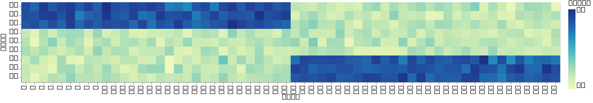
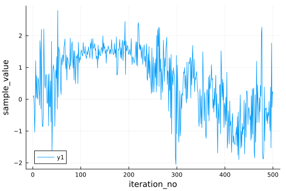
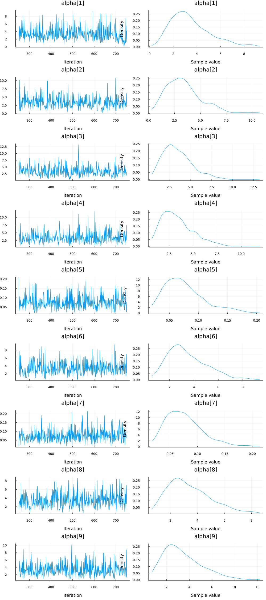
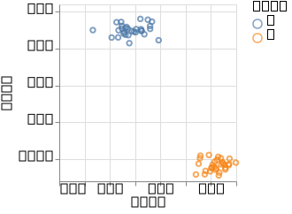
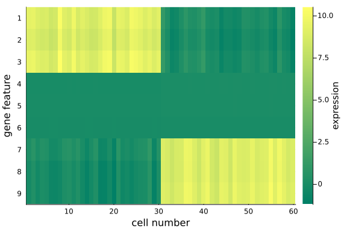
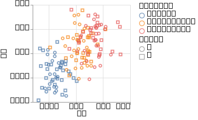
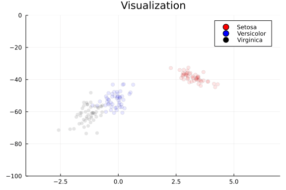

Principal component analysis is a fundamental technique to analyse and visualise data.
You may have come across it in many forms and names.
Here, we give a probabilistic perspective on PCA with some biologically motivated examples.
For more details and a mathematical derivation, we recommend Bishop's textbook (Christopher M. Bishop, Pattern Recognition and Machine Learning, 2006).

The idea of PCA is to find a latent variable $z$ that can be used to describe hidden structure in our dataset.
We use a simple Gaussian prior for
$$
P(z) = \mathcal{N}(z | 0, I)
$$
and similarly, the conditional distribution
$$
P(x | z) = \mathcal{N}(x | W z + \mu, \sigma^2 I)
$$
is modeled via a Gaussian distribution.

### A biologically motivated example

We'll generate synthetic data to explore the models. The simulation is inspired by biological measurement of
expression of genes in cells, and so you can think of the two variables as cells and genes.
While the human genome is (mostly) identical between all the cells in your body, there exist interesting differences in gene expression in different human tissues and disease conditions.
Similarly, one way to investigate certain diseases is to look at differences in gene expression in cells from patients and healthy controls (usually from the same tissue).

Usually, we can assume that the changes in gene expression only affect a subset of all genes (and these can be linked to diseases in some way).
One of the challenges of this kind of data is to see the underlying structure, e.g. to make the connection between a certain state (healthy/disease) and gene expression.
The problem is that the space we are investigating is very large (Up to 20000 genes across 1000s of cells). So in order to find structure in this data, we usually need to project the data into a lower dimensional space.

If you are not that interested in the biology, the more abstract problem formulation is to project a high-dimensional space onto a different space - in the case of PCA - a space where most of the variation is concentrated in the first few dimensions. So you will use PCA to explore underlying structure in your data that is not necessarily obvious from looking at the raw data itself.

First we define our dependencies.

```julia
using Turing
using LinearAlgebra

# Packages for visualization
using VegaLite, DataFrames, StatsPlots

# Import Fisher's iris example data set
using RDatasets

# Set a seed for reproducibility.
using Random
Random.seed!(1789);
```


Here, we simulate the biological problem described earlier. Admittedly, this is a very simplistic example with far fewer cells and genes and a very straighforward relationship. We try to capture the essence of the problem, but then, unfortunately, real life problems tend to be much more messy.

```julia
n_cells = 60
n_genes = 9
mu_1 = 10.0 * ones(n_genes ÷ 3)
mu_0 = zeros(n_genes ÷ 3)
S = I(n_genes ÷ 3)
mvn_0 = MvNormal(mu_0, S)
mvn_1 = MvNormal(mu_1, S)

# create a diagonal block like expression matrix, with some non-informative genes;
# not all features/genes are informative, some might just not differ very much between cells)
expression_matrix = transpose(
    vcat(
        hcat(rand(mvn_1, n_cells ÷ 2), rand(mvn_0, n_cells ÷ 2)),
        hcat(rand(mvn_0, n_cells ÷ 2), rand(mvn_0, n_cells ÷ 2)),
        hcat(rand(mvn_0, n_cells ÷ 2), rand(mvn_1, n_cells ÷ 2)),
    ),
)

df_exp = DataFrame(expression_matrix, :auto)
df_exp[!, :cell] = 1:n_cells

@vlplot(
    :rect,
    x = "cell:o",
    color = :value,
    encoding = {
        y = {field = "variable", type = "nominal", sort = "-x", axis = {title = "gene"}}
    }
)(
    DataFrames.stack(df_exp, 1:n_genes)
)
```




Here, you see the simulated data. You can see two groups of cells that differ in the expression of genes. While the difference between the two groups of cells here is fairly obvious from looking at the raw data, in practice and with large enough data sets, it is often impossible to spot the differences from the raw data alone. If you have some patience and compute resources you can increase the size of the dataset, or play around with the noise levels to make the problem increasingly harder.

### pPCA model

```julia
@model function pPCA(x, ::Type{TV}=Array{Float64}) where {TV}
    # Dimensionality of the problem.
    N, D = size(x)

    # latent variable z
    z ~ filldist(Normal(), D, N)

    # side note for the curious
    # we use the more concise filldist syntax partly for compactness, but also for compatibility with other AD
    # backends, see the [Turing Performance Tipps](https://turing.ml/dev/docs/using-turing/performancetips)
    # w = TV{2}(undef, D, D)
    # for d in 1:D
    #  w[d, :] ~ MvNormal(ones(D))
    # end

    # weights/loadings W
    w ~ filldist(Normal(), D, D)

    # mean offset
    m ~ MvNormal(ones(D))
    mu = (w * z .+ m)'
    for d in 1:D
        x[:, d] ~ MvNormal(mu[:, d], ones(N))
    end
end;
```


### pPCA inference

Here, we run the inference with the NUTS sampler. Feel free to try [different samplers](https://turing.ml/stable/docs/library/#samplers).

```julia
ppca = pPCA(expression_matrix)
chain_ppca = sample(ppca, NUTS(), 500);
```


### pPCA control

A quick sanity check. We reconstruct the input data from our parameter estimates, using the posterior mean as parameter estimates.

```julia
# Extract parameter estimates for plotting - mean of posterior
w = reshape(mean(group(chain_ppca, :w))[:, 2], (n_genes, n_genes))
z = permutedims(reshape(mean(group(chain_ppca, :z))[:, 2], (n_genes, n_cells)))'
mu = mean(group(chain_ppca, :m))[:, 2]

X = w * z

df_rec = DataFrame(X', :auto)
df_rec[!, :cell] = 1:n_cells

@vlplot(
    :rect,
    x = "cell:o",
    color = :value,
    encoding = {
        y = {field = "variable", type = "nominal", sort = "-x", axis = {title = "gene"}}
    }
)(
    DataFrames.stack(df_rec, 1:n_genes)
)
```


We can see the same pattern that we saw in the input data.
This is what we expect, as PCA is essentially a lossless transformation, i.e. the new space contains the same information as the input space as long as we keep all the dimensions.

And finally, we plot the data in a lower dimensional space. The interesting insight here is that we can project the information from the input space into a two-dimensional representation, without lossing the essential information about the two groups of cells in the input data.


```julia
df_pca = DataFrame(z', :auto)
rename!(df_pca, Symbol.(["z" * string(i) for i in collect(1:n_genes)]))
df_pca[!, :cell] = 1:n_cells

@vlplot(:rect, "cell:o", "variable:o", color = :value)(DataFrames.stack(df_pca, 1:n_genes))

df_pca[!, :type] = repeat([1, 2]; inner=n_cells ÷ 2)
@vlplot(:point, x = :z1, y = :z2, color = "type:n")(df_pca)
```




We can see the two groups are well separated in this 2-D space. Another way to put it, 2 dimensions is enough to display the main structure of the data.

## Number of components

A direct question arises from this is: How many dimensions do we want to keep in order to represent the latent structure in the data?
This is a very central question for all latent factor models, i.e. how many dimensions are needed to represent that data in the latent space.
In the case of PCA, there exist a lot of heuristics to make that choice.
By using the pPCA model, this can be accomplished very elegantly, with a technique called *Automatic Relevance Determination*(ARD).
Essentially, we are using a specific prior over the factor loadings W that allows us to prune away dimensions in the
latent space. The prior is determined by a precision hyperparameter $\alpha$. Here, smaller values of $\alpha$ correspond to more important components.
You can find more details about this in the Bishop book mentioned in the introduction.

```julia
@model function pPCA_ARD(x, ::Type{TV}=Array{Float64}) where {TV}
    # Dimensionality of the problem.
    N, D = size(x)

    # latent variable z
    z ~ filldist(Normal(), D, N)

    # weights/loadings w with Automatic Relevance Determination part
    alpha ~ filldist(Gamma(1.0, 1.0), D)
    w ~ filldist(MvNormal(zeros(D), 1.0 ./ sqrt.(alpha)), D)

    mu = (w' * z)'

    tau ~ Gamma(1.0, 1.0)
    for d in 1:D
        x[:, d] ~ MvNormal(mu[:, d], 1.0 / sqrt(tau))
    end
end;
```


```julia
ppca_ARD = pPCA_ARD(expression_matrix)
chain_pccaARD = sample(ppca_ARD, NUTS(), 500)

StatsPlots.plot(group(chain_pccaARD, :alpha))
```




Here we look at the convergence of the chains for the $\alpha$ parameter. This parameter determines the relevance of individual components. We can see that the chains have converged and the posterior of the alpha parameters is centered around much smaller values in two instances. Below, we will use the mean of the small values to select the *relevant* dimensions - we can clearly see based on the values of $\alpha$ that there should be two dimensions in this example.

```julia
# Extract parameter estimates for plotting - mean of posterior
w = permutedims(reshape(mean(group(chain_pccaARD, :w))[:, 2], (n_genes, n_genes)))
z = permutedims(reshape(mean(group(chain_pccaARD, :z))[:, 2], (n_genes, n_cells)))'
α = mean(group(chain_pccaARD, :alpha))[:, 2]
α
```

```
9-element Vector{Float64}:
 0.07644560784252166
 0.07598082383199926
 3.5048712041270975
 3.3786519059536384
 3.489567215521377
 3.4766110264554304
 3.547881871985896
 3.5250771071171623
 3.580285620733203
```


We can inspect alpha to see which elements are small, i.e. have a high relevance.

```julia
alpha_indices = sortperm(α)[1:2]
X = w[alpha_indices, alpha_indices] * z[alpha_indices, :]

df_rec = DataFrame(X', :auto)
df_rec[!, :cell] = 1:n_cells
@vlplot(:rect, "cell:o", "variable:o", color = :value)(DataFrames.stack(df_rec, 1:2))

df_pre = DataFrame(z', :auto)
rename!(df_pre, Symbol.(["z" * string(i) for i in collect(1:n_genes)]))
df_pre[!, :cell] = 1:n_cells

@vlplot(:rect, "cell:o", "variable:o", color = :value)(DataFrames.stack(df_pre, 1:n_genes))

df_pre[!, :type] = repeat([1, 2]; inner=n_cells ÷ 2)
df_pre[!, :ard1] = df_pre[:, alpha_indices[1]]
df_pre[!, :ard2] = df_pre[:, alpha_indices[2]]
@vlplot(:point, x = :ard1, y = :ard2, color = "type:n")(df_pre)
```




This plot is very similar to the low-dimensional plot above, but choosing the *relevant* dimensions based on the values of $\alpha$. When you are in doubt about the number of dimensions to project onto, ARD might provide an answer to that question.

## Batch effects

A second, common aspect apart from the dimensionality of the PCA space, is the issue of confounding factors or [batch effects](https://en.wikipedia.org/wiki/Batch_effect).
A batch effect occurs when non-biological factors in an experiment cause changes in the data produced by the experiment.
As an example, we will look at Fisher's famous Iris data set.

The data set consists of 50 samples each from three species of Iris (Iris setosa, Iris virginica and Iris versicolor).
Four features were measured from each sample: the length and the width of the sepals and petals, in centimeters. [RDatasets.jl](https://github.com/JuliaStats/RDatasets.jl) contains the Iris dataset.

An example for a batch effect in this case might be different scientists using a different measurement method to determine the length and width of the flowers. This can lead to a systematic bias in the measurement unrelated to the actual experimental variable - the species in this case.

```julia
# Example data set - generate synthetic gene expression data

# dataset available in RDatasets
data = dataset("datasets", "iris")
species = data[!, "Species"]

# we extract the four measured quantities
d = 4
dat = data[!, 1:d]
# and the number of measurements
n = size(dat)[1];
```


First, let's look at the original data using the pPCA model.

```julia
ppca = pPCA(dat)

# Here we use a different sampler, we don't always have to use NUTS:
# Hamiltonian Monte Carlo (HMC) sampler parameters
ϵ = 0.05
τ = 10
chain_ppca2 = sample(ppca, HMC(ϵ, τ), 1000)

# Extract parameter estimates for plotting - mean of posterior
w = permutedims(reshape(mean(group(chain_ppca2, :w))[:, 2], (d, d)))
z = permutedims(reshape(mean(group(chain_ppca2, :z))[:, 2], (d, n)))'
mu = mean(group(chain_ppca2, :m))[:, 2]

X = w * z
# X = w * z .+ mu

df_rec = DataFrame(X', :auto)
df_rec[!, :species] = species
@vlplot(:rect, "species:o", "variable:o", color = :value)(DataFrames.stack(df_rec, 1:d))

df_iris = DataFrame(z', :auto)
rename!(df_iris, Symbol.(["z" * string(i) for i in collect(1:d)]))
df_iris[!, :sample] = 1:n
df_iris[!, :species] = species

@vlplot(:point, x = :z1, y = :z2, color = "species:n")(df_iris)
```


We can see that the setosa species is more clearly separated from the other two species, which overlap
considerably.

We now simulate a batch effect; imagine the person taking the measurement uses two different rulers and they are slightly off.
Again, in practice there are many different reasons for why batch effects occur and it is not always clear what is really at the basis of them,
nor can they always be tackled via the experimental setup. So we need methods to deal with them.

```julia
## Introduce batch effect
batch = rand(Binomial(1, 0.5), 150)
effect = rand(Normal(2.4, 0.6), 150)
batch_dat = dat .+ batch .* effect

ppca_batch = pPCA(batch_dat)
chain_ppcaBatch = sample(ppca_batch, HMC(ϵ, τ), 1000)
describe(chain_ppcaBatch)[1]

z = permutedims(reshape(mean(group(chain_ppcaBatch, :z))[:, 2], (d, n)))'
df_pre = DataFrame(z', :auto)
rename!(df_pre, Symbol.(["z" * string(i) for i in collect(1:d)]))
df_pre[!, :sample] = 1:n
df_pre[!, :species] = species
df_pre[!, :batch] = batch

@vlplot(:point, x = :z1, y = :z2, color = "species:n", shape = :batch)(df_pre)
```




The batch effect makes it much harder to distinguish the species. And importantly, if we are not aware of the
batches, this might lead us to make wrong conclusions about the data.

In order to correct for the batch effect, we need to know about the assignment of measurement to batch.
In our example, this means knowing which ruler was used for which measurement, here encoded via the batch variable.

```julia
@model function pPCA_residual(x, batch, ::Type{TV}=Array{Float64}) where {TV}

    # Dimensionality of the problem.
    N, D = size(x)

    # latent variable z
    z ~ filldist(Normal(), D, N)

    # weights/loadings w
    w ~ filldist(Normal(), D, D)

    # covariate vector
    w_batch = TV{1}(undef, D)
    w_batch ~ MvNormal(ones(D))

    # mean offset
    m = TV{1}(undef, D)
    m ~ MvNormal(ones(D))
    mu = m .+ w * z + w_batch .* batch'

    for d in 1:D
        x[:, d] ~ MvNormal(mu'[:, d], ones(N))
    end
end;

ppca_residual = pPCA_residual(batch_dat, convert(Vector{Float64}, batch))
chain_ppcaResidual = sample(ppca_residual, HMC(ϵ, τ), 1000);
```


This model is described in considerably more detail [here](https://arxiv.org/abs/1106.4333).

```julia
z = permutedims(reshape(mean(group(chain_ppcaResidual, :z))[:, 2], (d, n)))'
df_post = DataFrame(z', :auto)
rename!(df_post, Symbol.(["z" * string(i) for i in collect(1:d)]))
df_post[!, :sample] = 1:n
df_post[!, :species] = species
df_post[!, :batch] = batch

@vlplot(:point, x = :z1, y = :z2, color = "species:n", shape = :batch)(df_post)
```




We can now see, that the data are better separated in the latent space by accounting for the batch effect. It is not perfect, but definitely an improvement over the previous plot.

## Rotation Invariant Householder Parameterization for Bayesian PCA

While PCA is a very old technique, nevertheless, it is still object of current research. Here, we
demonstrate this by implementing a recent publication that removes the rotational symmetry from the posterior,
thus speeding up inference. For more details, please read the
[original publication](http://proceedings.mlr.press/v97/nirwan19a.html)

```julia
## helper functions for Householder transform
function V_low_tri_plus_diag(Q::Int, V)
    for q in 1:Q
        V[:, q] = V[:, q] ./ sqrt(sum(V[:, q] .^ 2))
    end
    return (V)
end

function Householder(k::Int, V)
    v = V[:, k]
    sgn = sign(v[k])

    v[k] += sgn
    H = LinearAlgebra.I - (2.0 / dot(v, v) * (v * v'))
    H[k:end, k:end] = -1.0 * sgn .* H[k:end, k:end]

    return (H)
end

function H_prod_right(V)
    D, Q = size(V)

    H_prod = zeros(Real, D, D, Q + 1)
    H_prod[:, :, 1] = Diagonal(repeat([1.0], D))

    for q in 1:Q
        H_prod[:, :, q + 1] = Householder(Q - q + 1, V) * H_prod[:, :, q]
    end

    return (H_prod)
end

function orthogonal_matrix(D::Int64, Q::Int64, V)
    V = V_low_tri_plus_diag(Q, V)
    H_prod = H_prod_right(V)

    return (H_prod[:, 1:Q, Q + 1])
end

@model function pPCA_householder(x, K::Int, ::Type{T}=Float64) where {T}

    # Dimensionality of the problem.
    D, N = size(x)
    @assert K <= D

    # parameters
    sigma_noise ~ LogNormal(0.0, 0.5)
    v ~ filldist(Normal(0.0, 1.0), Int(D * K - K * (K - 1) / 2))
    sigma ~ Bijectors.ordered(MvLogNormal(MvNormal(ones(K))))

    v_mat = zeros(T, D, K)
    v_mat[tril!(trues(size(v_mat)))] .= v
    U = orthogonal_matrix(D, Q, v_mat)

    W = zeros(T, D, K)
    W += U * Diagonal(sigma)

    Kmat = zeros(T, D, D)
    Kmat += W * W'
    for d in 1:D
        Kmat[d, d] = Kmat[d, d] + sigma_noise^2 + 1e-12
    end
    L = LinearAlgebra.cholesky(Kmat).L

    for q in 1:Q
        r = sqrt.(sum(dot(v_mat[:, q], v_mat[:, q])))
        Turing.@addlogprob! (-log(r) * (D - q))
    end

    Turing.@addlogprob! -0.5 * sum(sigma .^ 2) + (D - Q - 1) * sum(log.(sigma))
    for qi in 1:Q
        for qj in (qi + 1):Q
            Turing.@addlogprob! log(sigma[Q - qi + 1]^2) - sigma[Q - qj + 1]^2
        end
    end
    Turing.@addlogprob! sum(log.(2.0 * sigma))

    L_full = zeros(T, D, D)
    L_full += L * transpose(L)
    # fix numerical instability (non-posdef matrix)
    for d in 1:D
        for k in (d + 1):D
            L_full[d, k] = L_full[k, d]
        end
    end

    return x ~ filldist(MvNormal(L_full), N)
end;

# Dimensionality of latent space
Random.seed!(1789);
Q = 2
n_samples = 700
ppca_householder = pPCA_householder(Matrix(dat)', Q)
chain_ppcaHouseholder = sample(ppca_householder, NUTS(), n_samples);

# Extract mean of v from chain
N, D = size(dat)
vv = mean(group(chain_ppcaHouseholder, :v))[:, 2]
v_mat = zeros(Real, D, Q)
v_mat[tril!(trues(size(v_mat)))] .= vv
sigma = mean(group(chain_ppcaHouseholder, :sigma))[:, 2]
U_n = orthogonal_matrix(D, Q, v_mat)
W_n = U_n * (LinearAlgebra.I(Q) .* sigma)

# Create array with projected values
z = W_n' * transpose(Matrix(dat))
df_post = DataFrame(convert(Array{Float64}, z)', :auto)
rename!(df_post, Symbol.(["z" * string(i) for i in collect(1:Q)]))
df_post[!, :sample] = 1:n
df_post[!, :species] = species

@vlplot(:point, x = :z1, y = :z2, color = "species:n")(df_post)
```


We observe a speedup in inference, and similar results to the previous implementations. Finally, we will look at the uncertainity that is associated with the samples. We will do this by sampling from the posterior projections. This is possible in the case of the rotation invariant version. If you are curious, you can try to plot the same thing in the case of classical pPCA.

```julia
## Create data projections for each step of chain
vv = collect(get(chain_ppcaHouseholder, [:v]).v)
v_mat = zeros(Real, D, Q)
vv_mat = zeros(Float64, n_samples, D, Q)
for i in 1:n_samples
    index = BitArray(zeros(n_samples, D, Q))
    index[i, :, :] = tril!(trues(size(v_mat)))
    tmp = zeros(size(vv)[1])
    for j in 1:(size(vv)[1])
        tmp[j] = vv[j][i]
    end
    vv_mat[index] .= tmp
end

ss = collect(get(chain_ppcaHouseholder, [:sigma]).sigma)
sigma = zeros(Q, n_samples)
for d in 1:Q
    sigma[d, :] = Array(ss[d])
end

samples_raw = Array{Float64}(undef, Q, N, n_samples)
for i in 1:n_samples
    U_ni = orthogonal_matrix(D, Q, vv_mat[i, :, :])
    W_ni = U_ni * (LinearAlgebra.I(Q) .* sigma[:, i])
    z_n = W_ni' * transpose(Matrix(dat))
    samples_raw[:, :, i] = z_n
end

# initialize a 3D plot with 1 empty series
plt = plot(
    [100, 200, 300];
    xlim=(-4.00, 7.00),
    ylim=(-100.00, 0.00),
    group=["Setosa", "Versicolor", "Virginica"],
    markercolor=["red", "blue", "black"],
    title="Visualization",
    seriestype=:scatter,
)

anim = @animate for i in 1:n_samples
    scatter!(
        plt,
        samples_raw[1, 1:50, i],
        samples_raw[2, 1:50, i];
        color="red",
        seriesalpha=0.1,
        label="",
    )
    scatter!(
        plt,
        samples_raw[1, 51:100, i],
        samples_raw[2, 51:100, i];
        color="blue",
        seriesalpha=0.1,
        label="",
    )
    scatter!(
        plt,
        samples_raw[1, 101:150, i],
        samples_raw[2, 101:150, i];
        color="black",
        seriesalpha=0.1,
        label="",
    )
end
gif(anim, "anim_fps.gif"; fps=5)
```




Here we see the density of the projections from the chain to illustrate the uncertainty in the
projections. We can see quite clearly that it is possible to separate Setosa from Versicolor and
Virginica species, but that the latter two cannot be clearly separated based on the pPCA projection. This can be
shown even more clearly by using a kernel density estimate and plotting the contours of that estimate.


```julia
# kernel density estimate
using KernelDensity
dens = kde((vec(samples_raw[1, :, :]), vec(samples_raw[2, :, :])))
StatsPlots.plot(dens)
```


## Appendix

These tutorials are a part of the TuringTutorials repository, found at: [https://github.com/TuringLang/TuringTutorials](https://github.com/TuringLang/TuringTutorials).

To locally run this tutorial, do the following commands:

```
using TuringTutorials
TuringTutorials.weave("11-probabilistic-pca", "11_probabilistic-pca.jmd")
```

Computer Information:

```
Julia Version 1.6.5
Commit 9058264a69 (2021-12-19 12:30 UTC)
Platform Info:
  OS: Linux (x86_64-pc-linux-gnu)
  CPU: AMD EPYC 7502 32-Core Processor
  WORD_SIZE: 64
  LIBM: libopenlibm
  LLVM: libLLVM-11.0.1 (ORCJIT, znver2)
Environment:
  JULIA_CPU_THREADS = 16
  BUILDKITE_PLUGIN_JULIA_CACHE_DIR = /cache/julia-buildkite-plugin
  JULIA_DEPOT_PATH = /cache/julia-buildkite-plugin/depots/7aa0085e-79a4-45f3-a5bd-9743c91cf3da

```

Package Information:

```
      Status `/cache/build/default-amdci4-1/julialang/turingtutorials/tutorials/11-probabilistic-pca/Project.toml`
  [a93c6f00] DataFrames v1.3.2
  [5ab0869b] KernelDensity v0.6.3
  [ce6b1742] RDatasets v0.7.7
  [f3b207a7] StatsPlots v0.14.33
  [fce5fe82] Turing v0.20.4
  [112f6efa] VegaLite v2.6.0
  [37e2e46d] LinearAlgebra
  [9a3f8284] Random
```

And the full manifest:

```
      Status `/cache/build/default-amdci4-1/julialang/turingtutorials/tutorials/11-probabilistic-pca/Manifest.toml`
  [621f4979] AbstractFFTs v1.1.0
  [80f14c24] AbstractMCMC v3.3.1
  [7a57a42e] AbstractPPL v0.5.1
  [1520ce14] AbstractTrees v0.3.4
  [79e6a3ab] Adapt v3.3.3
  [0bf59076] AdvancedHMC v0.3.3
  [5b7e9947] AdvancedMH v0.6.6
  [576499cb] AdvancedPS v0.3.5
  [b5ca4192] AdvancedVI v0.1.3
  [dce04be8] ArgCheck v2.3.0
  [7d9fca2a] Arpack v0.5.3
  [4fba245c] ArrayInterface v5.0.1
  [13072b0f] AxisAlgorithms v1.0.1
  [39de3d68] AxisArrays v0.4.4
  [198e06fe] BangBang v0.3.36
  [9718e550] Baselet v0.1.1
  [76274a88] Bijectors v0.9.11
  [336ed68f] CSV v0.10.2
  [49dc2e85] Calculus v0.5.1
  [324d7699] CategoricalArrays v0.10.3
  [082447d4] ChainRules v1.27.0
  [d360d2e6] ChainRulesCore v1.13.0
  [9e997f8a] ChangesOfVariables v0.1.2
  [aaaa29a8] Clustering v0.14.2
  [944b1d66] CodecZlib v0.7.0
  [35d6a980] ColorSchemes v3.17.1
  [3da002f7] ColorTypes v0.11.0
  [5ae59095] Colors v0.12.8
  [861a8166] Combinatorics v1.0.2
  [38540f10] CommonSolve v0.2.0
  [bbf7d656] CommonSubexpressions v0.3.0
  [34da2185] Compat v3.41.0
  [a33af91c] CompositionsBase v0.1.1
  [88cd18e8] ConsoleProgressMonitor v0.1.2
  [187b0558] ConstructionBase v1.3.0
  [d38c429a] Contour v0.5.7
  [a8cc5b0e] Crayons v4.1.1
  [9a962f9c] DataAPI v1.9.0
  [a93c6f00] DataFrames v1.3.2
  [864edb3b] DataStructures v0.18.11
  [e2d170a0] DataValueInterfaces v1.0.0
  [e7dc6d0d] DataValues v0.4.13
  [244e2a9f] DefineSingletons v0.1.2
  [b429d917] DensityInterface v0.4.0
  [163ba53b] DiffResults v1.0.3
  [b552c78f] DiffRules v1.10.0
  [b4f34e82] Distances v0.10.7
  [31c24e10] Distributions v0.25.49
  [ced4e74d] DistributionsAD v0.6.38
  [ffbed154] DocStringExtensions v0.8.6
  [fa6b7ba4] DualNumbers v0.6.6
  [366bfd00] DynamicPPL v0.17.8
  [da5c29d0] EllipsisNotation v1.0.0
  [cad2338a] EllipticalSliceSampling v0.4.7
  [e2ba6199] ExprTools v0.1.8
  [c87230d0] FFMPEG v0.4.1
  [7a1cc6ca] FFTW v1.4.6
  [5789e2e9] FileIO v1.13.0
  [8fc22ac5] FilePaths v0.8.3
  [48062228] FilePathsBase v0.9.17
  [1a297f60] FillArrays v0.13.0
  [53c48c17] FixedPointNumbers v0.8.4
  [59287772] Formatting v0.4.2
  [f6369f11] ForwardDiff v0.10.25
  [d9f16b24] Functors v0.2.8
  [28b8d3ca] GR v0.64.0
  [5c1252a2] GeometryBasics v0.4.2
  [42e2da0e] Grisu v1.0.2
  [cd3eb016] HTTP v0.9.17
  [34004b35] HypergeometricFunctions v0.3.8
  [7869d1d1] IRTools v0.4.5
  [615f187c] IfElse v0.1.1
  [83e8ac13] IniFile v0.5.1
  [22cec73e] InitialValues v0.3.1
  [842dd82b] InlineStrings v1.1.2
  [505f98c9] InplaceOps v0.3.0
  [a98d9a8b] Interpolations v0.13.5
  [8197267c] IntervalSets v0.5.3
  [3587e190] InverseFunctions v0.1.2
  [41ab1584] InvertedIndices v1.1.0
  [92d709cd] IrrationalConstants v0.1.1
  [c8e1da08] IterTools v1.4.0
  [82899510] IteratorInterfaceExtensions v1.0.0
  [692b3bcd] JLLWrappers v1.4.1
  [682c06a0] JSON v0.21.3
  [7d188eb4] JSONSchema v0.3.4
  [5ab0869b] KernelDensity v0.6.3
  [8ac3fa9e] LRUCache v1.3.0
  [b964fa9f] LaTeXStrings v1.3.0
  [23fbe1c1] Latexify v0.15.12
  [1d6d02ad] LeftChildRightSiblingTrees v0.1.3
  [6f1fad26] Libtask v0.6.10
  [2ab3a3ac] LogExpFunctions v0.3.6
  [e6f89c97] LoggingExtras v0.4.7
  [c7f686f2] MCMCChains v5.0.4
  [be115224] MCMCDiagnosticTools v0.1.3
  [e80e1ace] MLJModelInterface v1.4.1
  [1914dd2f] MacroTools v0.5.9
  [dbb5928d] MappedArrays v0.4.1
  [739be429] MbedTLS v1.0.3
  [442fdcdd] Measures v0.3.1
  [128add7d] MicroCollections v0.1.2
  [e1d29d7a] Missings v1.0.2
  [78c3b35d] Mocking v0.7.3
  [6f286f6a] MultivariateStats v0.9.1
  [872c559c] NNlib v0.8.3
  [77ba4419] NaNMath v0.3.7
  [86f7a689] NamedArrays v0.9.6
  [c020b1a1] NaturalSort v1.0.0
  [b8a86587] NearestNeighbors v0.4.9
  [2bd173c7] NodeJS v1.3.0
  [510215fc] Observables v0.4.0
  [6fe1bfb0] OffsetArrays v1.10.8
  [bac558e1] OrderedCollections v1.4.1
  [90014a1f] PDMats v0.11.6
  [69de0a69] Parsers v2.2.2
  [ccf2f8ad] PlotThemes v2.0.1
  [995b91a9] PlotUtils v1.1.3
  [91a5bcdd] Plots v1.26.0
  [2dfb63ee] PooledArrays v1.4.0
  [21216c6a] Preferences v1.2.4
  [08abe8d2] PrettyTables v1.3.1
  [33c8b6b6] ProgressLogging v0.1.4
  [92933f4c] ProgressMeter v1.7.1
  [1fd47b50] QuadGK v2.4.2
  [df47a6cb] RData v0.8.3
  [ce6b1742] RDatasets v0.7.7
  [b3c3ace0] RangeArrays v0.3.2
  [c84ed2f1] Ratios v0.4.3
  [c1ae055f] RealDot v0.1.0
  [3cdcf5f2] RecipesBase v1.2.1
  [01d81517] RecipesPipeline v0.5.1
  [731186ca] RecursiveArrayTools v2.25.0
  [189a3867] Reexport v1.2.2
  [05181044] RelocatableFolders v0.1.3
  [ae029012] Requires v1.3.0
  [79098fc4] Rmath v0.7.0
  [f2b01f46] Roots v1.3.14
  [0bca4576] SciMLBase v1.28.0
  [30f210dd] ScientificTypesBase v3.0.0
  [6c6a2e73] Scratch v1.1.0
  [91c51154] SentinelArrays v1.3.12
  [efcf1570] Setfield v0.7.1
  [992d4aef] Showoff v1.0.3
  [a2af1166] SortingAlgorithms v1.0.1
  [276daf66] SpecialFunctions v2.1.4
  [171d559e] SplittablesBase v0.1.14
  [aedffcd0] Static v0.6.0
  [90137ffa] StaticArrays v1.4.1
  [64bff920] StatisticalTraits v3.0.0
  [82ae8749] StatsAPI v1.2.1
  [2913bbd2] StatsBase v0.33.16
  [4c63d2b9] StatsFuns v0.9.16
  [f3b207a7] StatsPlots v0.14.33
  [09ab397b] StructArrays v0.6.5
  [ab02a1b2] TableOperations v1.2.0
  [3783bdb8] TableTraits v1.0.1
  [382cd787] TableTraitsUtils v1.0.2
  [bd369af6] Tables v1.6.1
  [5d786b92] TerminalLoggers v0.1.5
  [f269a46b] TimeZones v1.7.2
  [9f7883ad] Tracker v0.2.20
  [3bb67fe8] TranscodingStreams v0.9.6
  [28d57a85] Transducers v0.4.73
  [a2a6695c] TreeViews v0.3.0
  [fce5fe82] Turing v0.20.4
  [30578b45] URIParser v0.4.1
  [5c2747f8] URIs v1.3.0
  [3a884ed6] UnPack v1.0.2
  [1cfade01] UnicodeFun v0.4.1
  [41fe7b60] Unzip v0.1.2
  [239c3e63] Vega v2.3.0
  [112f6efa] VegaLite v2.6.0
  [ea10d353] WeakRefStrings v1.4.1
  [cc8bc4a8] Widgets v0.6.5
  [efce3f68] WoodburyMatrices v0.5.5
  [700de1a5] ZygoteRules v0.2.2
  [68821587] Arpack_jll v3.5.0+3
  [6e34b625] Bzip2_jll v1.0.8+0
  [83423d85] Cairo_jll v1.16.1+1
  [5ae413db] EarCut_jll v2.2.3+0
  [2e619515] Expat_jll v2.4.4+0
  [b22a6f82] FFMPEG_jll v4.4.0+0
  [f5851436] FFTW_jll v3.3.10+0
  [a3f928ae] Fontconfig_jll v2.13.93+0
  [d7e528f0] FreeType2_jll v2.10.4+0
  [559328eb] FriBidi_jll v1.0.10+0
  [0656b61e] GLFW_jll v3.3.6+0
  [d2c73de3] GR_jll v0.64.0+0
  [78b55507] Gettext_jll v0.21.0+0
  [7746bdde] Glib_jll v2.68.3+2
  [3b182d85] Graphite2_jll v1.3.14+0
  [2e76f6c2] HarfBuzz_jll v2.8.1+1
  [1d5cc7b8] IntelOpenMP_jll v2018.0.3+2
  [aacddb02] JpegTurbo_jll v2.1.2+0
  [c1c5ebd0] LAME_jll v3.100.1+0
  [88015f11] LERC_jll v3.0.0+1
  [dd4b983a] LZO_jll v2.10.1+0
  [e9f186c6] Libffi_jll v3.2.2+1
  [d4300ac3] Libgcrypt_jll v1.8.7+0
  [7e76a0d4] Libglvnd_jll v1.3.0+3
  [7add5ba3] Libgpg_error_jll v1.42.0+0
  [94ce4f54] Libiconv_jll v1.16.1+1
  [4b2f31a3] Libmount_jll v2.35.0+0
  [89763e89] Libtiff_jll v4.3.0+1
  [38a345b3] Libuuid_jll v2.36.0+0
  [856f044c] MKL_jll v2022.0.0+0
  [e7412a2a] Ogg_jll v1.3.5+1
  [458c3c95] OpenSSL_jll v1.1.13+0
  [efe28fd5] OpenSpecFun_jll v0.5.5+0
  [91d4177d] Opus_jll v1.3.2+0
  [2f80f16e] PCRE_jll v8.44.0+0
  [30392449] Pixman_jll v0.40.1+0
  [ea2cea3b] Qt5Base_jll v5.15.3+0
  [f50d1b31] Rmath_jll v0.3.0+0
  [a2964d1f] Wayland_jll v1.19.0+0
  [2381bf8a] Wayland_protocols_jll v1.25.0+0
  [02c8fc9c] XML2_jll v2.9.12+0
  [aed1982a] XSLT_jll v1.1.34+0
  [4f6342f7] Xorg_libX11_jll v1.6.9+4
  [0c0b7dd1] Xorg_libXau_jll v1.0.9+4
  [935fb764] Xorg_libXcursor_jll v1.2.0+4
  [a3789734] Xorg_libXdmcp_jll v1.1.3+4
  [1082639a] Xorg_libXext_jll v1.3.4+4
  [d091e8ba] Xorg_libXfixes_jll v5.0.3+4
  [a51aa0fd] Xorg_libXi_jll v1.7.10+4
  [d1454406] Xorg_libXinerama_jll v1.1.4+4
  [ec84b674] Xorg_libXrandr_jll v1.5.2+4
  [ea2f1a96] Xorg_libXrender_jll v0.9.10+4
  [14d82f49] Xorg_libpthread_stubs_jll v0.1.0+3
  [c7cfdc94] Xorg_libxcb_jll v1.13.0+3
  [cc61e674] Xorg_libxkbfile_jll v1.1.0+4
  [12413925] Xorg_xcb_util_image_jll v0.4.0+1
  [2def613f] Xorg_xcb_util_jll v0.4.0+1
  [975044d2] Xorg_xcb_util_keysyms_jll v0.4.0+1
  [0d47668e] Xorg_xcb_util_renderutil_jll v0.3.9+1
  [c22f9ab0] Xorg_xcb_util_wm_jll v0.4.1+1
  [35661453] Xorg_xkbcomp_jll v1.4.2+4
  [33bec58e] Xorg_xkeyboard_config_jll v2.27.0+4
  [c5fb5394] Xorg_xtrans_jll v1.4.0+3
  [3161d3a3] Zstd_jll v1.5.2+0
  [0ac62f75] libass_jll v0.15.1+0
  [f638f0a6] libfdk_aac_jll v2.0.2+0
  [b53b4c65] libpng_jll v1.6.38+0
  [f27f6e37] libvorbis_jll v1.3.7+1
  [1270edf5] x264_jll v2021.5.5+0
  [dfaa095f] x265_jll v3.5.0+0
  [d8fb68d0] xkbcommon_jll v0.9.1+5
  [0dad84c5] ArgTools
  [56f22d72] Artifacts
  [2a0f44e3] Base64
  [ade2ca70] Dates
  [8bb1440f] DelimitedFiles
  [8ba89e20] Distributed
  [f43a241f] Downloads
  [9fa8497b] Future
  [b77e0a4c] InteractiveUtils
  [4af54fe1] LazyArtifacts
  [b27032c2] LibCURL
  [76f85450] LibGit2
  [8f399da3] Libdl
  [37e2e46d] LinearAlgebra
  [56ddb016] Logging
  [d6f4376e] Markdown
  [a63ad114] Mmap
  [ca575930] NetworkOptions
  [44cfe95a] Pkg
  [de0858da] Printf
  [3fa0cd96] REPL
  [9a3f8284] Random
  [ea8e919c] SHA
  [9e88b42a] Serialization
  [1a1011a3] SharedArrays
  [6462fe0b] Sockets
  [2f01184e] SparseArrays
  [10745b16] Statistics
  [4607b0f0] SuiteSparse
  [fa267f1f] TOML
  [a4e569a6] Tar
  [8dfed614] Test
  [cf7118a7] UUIDs
  [4ec0a83e] Unicode
  [e66e0078] CompilerSupportLibraries_jll
  [deac9b47] LibCURL_jll
  [29816b5a] LibSSH2_jll
  [c8ffd9c3] MbedTLS_jll
  [14a3606d] MozillaCACerts_jll
  [4536629a] OpenBLAS_jll
  [05823500] OpenLibm_jll
  [83775a58] Zlib_jll
  [8e850ede] nghttp2_jll
  [3f19e933] p7zip_jll
```

