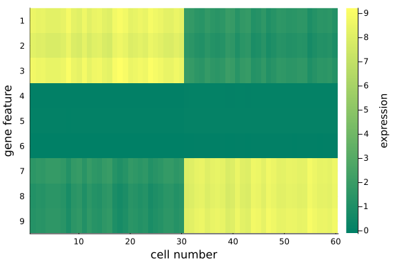
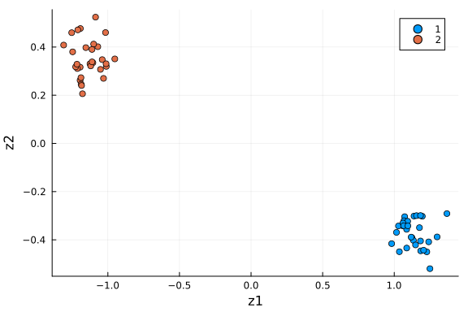
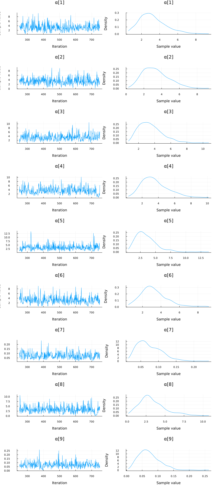
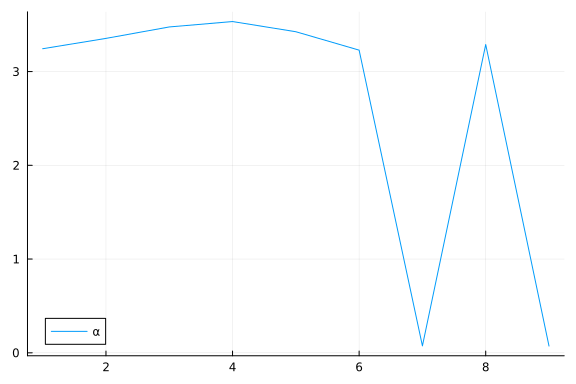
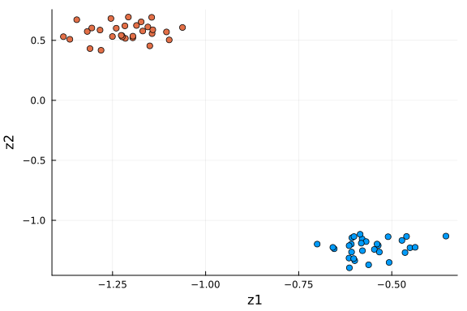

## Overview of PCA

Principal component analysis (PCA) is a fundamental technique to analyse and visualise data.
It is an unsupervised learning method mainly used for dimensionality reduction.

For example, we have a data matrix $\mathbf{X} \in \mathbb{R}^{N \times D}$, and we would like to extract $k \ll D$ principal components which captures most of the information from the original matrix.
The goal is to understand $\mathbf{X}$ through a lower dimensional subspace (e.g. two-dimensional subspace for visualisation convenience) spanned by the principal components.

In order to project the original data matrix into low dimensions, we need to find the principal directions where most of the variations of $\mathbf{X}$ lie in.
Traditionally, this is implemented via [singular value decomposition (SVD)](https://en.wikipedia.org/wiki/Singular_value_decomposition) which provides a robust and accurate computational framework for decomposing matrix into products of rotation-scaling-rotation matrices, particularly for large datasets(see an illustration [here](https://intoli.com/blog/pca-and-svd/)):

$$
\mathbf{X}_{N \times D} =  \mathbf{U}_{N \times r} \times \boldsymbol{\Sigma}_{r \times r}  \times  \mathbf{V}^T_{r \times D}
$$

where $\Sigma_{r \times r}$ contains only $r := \operatorname{rank} \mathbf{X} \leq \min\{N,D\}$ non-zero singular values of $\mathbf{X}$.
If we pad $\Sigma$ with zeros and add arbitrary orthonormal columns to $\mathbf{U}$ and $\mathbf{V}$, we obtain the more compact form:[^1]

$$
\mathbf{X}_{N \times D} = \mathbf{U}_{N \times N} \mathbf{\Sigma}_{N \times D} \mathbf{V}_{D \times D}^T
$$

where $\mathbf{U}$ and $\mathbf{V}$ are unitary matrices (i.e. with orthonormal columns).
Such a decomposition always exists for any matrix.
Columns of $\mathbf{V}$ are the principal directions/axes.
The percentage of variations explained can be calculated using the ratios of singular values.[^3]

Here we take a probabilistic perspective.
For more details and a mathematical derivation, we recommend Bishop's textbook (Christopher M. Bishop, Pattern Recognition and Machine Learning, 2006).
The idea of proabilistic PCA is to find a latent variable $z$ that can be used to describe the hidden structure in a dataset.[^2]
Consider a data set $\mathbf{X}_{D \times N}=\{x_i\}$ with $i=1,2,...,N$ data points, where each data point $x_i$ is $D$-dimensional (i.e. $x_i \in \mathcal{R}^D$).
Note that, here we use the flipped version of the data matrix. We aim to represent the original $n$ dimensional vector using a lower dimensional a latent variable $z_i \in \mathcal{R}^k$.

We first assume that each latent variable $z_i$ is normally distributed:

$$
z_i \sim \mathcal{N}(0, I)
$$

and the corresponding data point is generated via projection:

$$
x_i | z_i \sim \mathcal{N}(\mathbf{W} z_i + \boldsymbol{μ}, \sigma^2 \mathbf{I})
$$

where the projection matrix $\mathbf{W}_{D \times k}$ accommodates the principal axes.
The above formula expresses $x_i$ as a linear combination of the basis columns in the projection matrix `W`, where the combination coefficients sit in `z_i` (they are the coordinats of `x_i` in the new $k$-dimensional space.).
We can also express the above formula in matrix form: $\mathbf{X}_{D \times N} \approx \mathbf{W}_{D \times k} \mathbf{Z}_{k \times N}$.
We are interested in inferring $\mathbf{W}$, $μ$ and $\sigma$.

Classical PCA is the specific case of probabilistic PCA when the covariance of the noise becomes infinitesimally small, i.e. $\sigma^2 \to 0$.
Probabilistic PCA generalizes classical PCA, this can be seen by marginalizing out the the latent variable.[^2]

## The gene expression example

In the first example, we illustrate:

  - how to specify the probabilistic model and
  - how to perform inference on $\mathbf{W}$, $\boldsymbol{\mu}$ and $\sigma$ using MCMC.

We use simulated gemnome data to demonstrate these.
The simulation is inspired by biological measurement of expression of genes in cells, and each cell is characterized by different gene features.
While the human genome is (mostly) identical between all the cells in the body, there exist interesting differences in gene expression in different human tissues and disease conditions.
One way to investigate certain diseases is to look at differences in gene expression in cells from patients and healthy controls (usually from the same tissue).

Usually, we can assume that the changes in gene expression only affect a subset of all genes (and these can be linked to diseases in some way).
One of the challenges for this kind of data is to explore the underlying structure, e.g. to make the connection between a certain state (healthy/disease) and gene expression.
This becomes difficult when the dimensions is very large (up to 20000 genes across 1000s of cells). So in order to find structure in this data, it is useful to project the data into a lower dimensional space.

Regardless of the biological background, the more abstract problem formulation is to project the data living in high-dimensional space onto a representation in lower-dimensional space where most of the variation is concentrated in the first few dimensions.
We use PCA to explore underlying structure or pattern which may not necessarily be obvious from looking at the raw data itself.

#### Step 1: configuration of dependencies

First, we load the dependencies used.

```julia

using Turing
using ReverseDiff
Turing.setadbackend(:reversediff)
using LinearAlgebra, FillArrays

# Packages for visualization
using DataFrames, StatsPlots, Measures

# Set a seed for reproducibility.
using Random
Random.seed!(1789);
```


All packages used in this tutorial are listed here.
You can install them via `using Pkg; Pkg.add("package_name")`.

Package usages:

> We use `DataFrames` for instantiating matrices, `LinearAlgebra` and `FillArrays` to perform matrix operations;
> `Turing` for model specification and MCMC sampling, `ReverseDiff` for setting the automatic differentiation backend when sampling.
> `StatsPlots` for visualising the resutls. `, Measures` for setting plot margin units.
> As all examples involve sampling, for reproducibility we set a fixed seed using the `Random` standard library.

#### Step 2: Data generation

Here, we simulate the biological gene expression problem described earlier.
We simulate 60 cells, each cell has 9 gene features.
This is a simplified problem with only a few cells and genes for demonstration purpose, which is not comparable to the complexity in real-life (e.g. thousands of features for each individual).
Even so, spotting the structures or patterns in a 9-feature space would be a challenging task; it would be nice to reduce the dimentionality using p-PCA.

By design, we mannually divide the 60 cells into two groups. the first 3 gene features of the first 30 cells have mean 10, while those of the last 30 cells have mean 10.
These two groups of cells differ in the expression of genes.

```julia
n_genes = 9 # D
n_cells = 60 # N

# create a diagonal block like expression matrix, with some non-informative genes;
# not all features/genes are informative, some might just not differ very much between cells)
mat_exp = randn(n_genes, n_cells)
mat_exp[1:(n_genes ÷ 3), 1:(n_cells ÷ 2)] .+= 10
mat_exp[(2 * (n_genes ÷ 3) + 1):end, (n_cells ÷ 2 + 1):end] .+= 10
```

```
3×30 view(::Matrix{Float64}, 7:9, 31:60) with eltype Float64:
  9.30754  10.884    8.83626   7.93455  …  10.1664    8.77093  11.1011
 11.1299    9.09894  8.6218   10.1907      11.7588   10.752     9.67702
  9.23512   9.04261  9.66833  10.8084       8.63145   8.81334   8.91409
```


To visualize the $(D=9) \times (N=60)$ data matrix `mat_exp`, we use the `heatmap` plot.

```julia
heatmap(
    mat_exp;
    c=:summer,
    colors=:value,
    xlabel="cell number",
    yflip=true,
    ylabel="gene feature",
    yticks=1:9,
    colorbar_title="expression",
)
```


Note that:

 1. We have made distinct feature differences between these two groups of cells (it is fairly obvious from looking at the raw data), in practice and with large enough data sets, it is often impossible to spot the differences from the raw data alone.
 2. If you have some patience and compute resources you can increase the size of the dataset, or play around with the noise levels to make the problem increasingly harder.

#### Step 3: Create the pPCA model

Here we construct the probabilistic model `pPCA()`.
As per the p-PCA formula, we think of each row (i.e. each gene feature) following a $N=60$ dimensional multivariate normal distribution centered around the corresponding row of $\mathbf{W}_{D \times k} \times \mathbf{Z}_{k \times N} + \boldsymbol{\mu}_{D \times N}$.

```julia
@model function pPCA(X::AbstractMatrix{<:Real}, k::Int)
    # retrieve the dimension of input matrix X.
    N, D = size(X)

    # weights/loadings W
    W ~ filldist(Normal(), D, k)

    # latent variable z
    Z ~ filldist(Normal(), k, N)

    # mean offset
    μ ~ MvNormal(Eye(D))
    genes_mean = W * Z .+ reshape(μ, n_genes, 1)
    return X ~ arraydist([MvNormal(m, Eye(N)) for m in eachcol(genes_mean')])
end;
```


The function `pPCA()` accepts:

 1. an data array $\mathbf{X}$ (with no. of instances x dimension no. of features, NB: it is a transpose of the original data matrix);
 2. an integer $k$ which indicates the dimension of the latent space (the space the original feature matrix is projected onto).

Specifically:

 1. it first extracts the dimension $D$ and number of instances $N$ of the input matrix;
 2. draw samples of each entries of the projection matrix $\mathbf{W}$ from a standard normal;
 3. draw samples of the latent variable $\mathbf{Z}_{k \times N}$ from an MND;
 4. draw samples of the offset $\boldsymbol{\mu}$ from an MND, assuming uniform offset for all instances;
 5. Finally, we iterate through each gene dimension in $\mathbf{X}$, and define an MND for the sampling distribution (i.e. likelihood).

#### Step 4: Sampling-based inference of the pPCA model

Here we aim to perform MCMC sampling to infer the projection matrix $\mathbf{W}_{D \times k}$, the latent variable matrix $\mathbf{Z}_{k \times N}$, and the offsets $\boldsymbol{\mu}_{N \times 1}$.

We run the inference using the NUTS sampler, of which the chain length is set to be 500, target accept ratio 0.65 and initial stepsize 0.1. By default, the NUTS sampler samples 1 chain.
You are free to try [different samplers](https://turinglang.org/stable/docs/library/#samplers).

```julia
k = 2 # k is the dimension of the projected space, i.e. the number of principal components/axes of choice
ppca = pPCA(mat_exp', k) # instantiate the probabilistic model
chain_ppca = sample(ppca, NUTS(), 500);
```


The samples are saved in the Chains struct `chain_ppca`, whose shape can be checked:

```julia
size(chain_ppca) # (no. of iterations, no. of vars, no. of chains) = (500, 159, 1)
```

```
(500, 159, 1)
```


The Chains struct `chain_ppca` also contains the sampling info such as r-hat, ess, mean estimates, etc.
You can print it to check these quantities.

#### Step 5: posterior predictive checks

We try to reconstruct the input data using the posterior mean as parameter estimates.
We first retrieve the samples for the projection matrix `W` from `chain_ppca`. This can be done using the Julia `group(chain, parameter_name)` function.
Then we calculate the mean value for each element in $W$, averaging over the whole chain of samples.

```julia
# Extract parameter estimates for predicting x - mean of posterior
W = reshape(mean(group(chain_ppca, :W))[:, 2], (n_genes, k))
Z = reshape(mean(group(chain_ppca, :Z))[:, 2], (k, n_cells))
μ = mean(group(chain_ppca, :μ))[:, 2]

mat_rec = W * Z .+ repeat(μ; inner=(1, n_cells))
```

```
9×60 Matrix{Float64}:
  8.52113    8.35278     8.41356    …   1.40479     1.51001     1.16121
  8.16888    7.9987      8.0606         1.12802     1.23674     0.893492
  8.7293     8.55137     8.61637        1.46247     1.57758     1.22448
 -0.055875  -0.0545151  -0.0549083      0.0343166   0.0339672   0.0387815
 -0.017839  -0.0200144  -0.0187204      0.0603241   0.0642874   0.0701667
 -0.109883  -0.111738   -0.11069    …  -0.0615442  -0.0584449  -0.0545496
  1.49987    1.66757     1.60643        8.38888     8.281       8.61624
  1.13024    1.30646     1.24201        8.30089     8.18648     8.53458
  1.22252    1.40166     1.33614        8.51216     8.39586     8.74974
```


```julia
heatmap(
    mat_rec;
    c=:summer,
    colors=:value,
    xlabel="cell number",
    yflip=true,
    ylabel="gene feature",
    yticks=1:9,
    colorbar_title="expression",
)
```




We can quantitatively check the absolute magnitudes of the column average of the gap between `mat_exp` and `mat_rec`:


We observe that, using posterior mean, the recovered data matrix `mat_rec` has values align with the original data matrix - particularly the same pattern in the first and last 3 gene features are captured, which implies the inference and p-PCA decomposition are successful.
This is satisfying as we have just projected the original 9-dimensional space onto a 2-dimensional space - some info has been cut off in the projection process, but we haven't lost any important info, e.g. the key differences between the two groups.
The is the desirable property of PCA: it picks up the principal axes along which most of the (original) data variations cluster, and remove those less relevant.
If we choose the reduced space dimension $k$ to be exactly $D$ (the original data dimension), we would recover exactly the same original data matrix `mat_exp`, i.e. all information will be preserved.

Now we have represented the original high-dimensional data in two dimensions, without lossing the key information about the two groups of cells in the input data.
Finally, the benefits of performing PCA is to analyse and visualise the dimension-reduced data in the projected, low-dimensional space.
we save the dimension-reduced matrix $\mathbf{Z}$ as a `DataFrame`, rename the columns and visualise the first two dimensions.

```julia
df_pca = DataFrame(Z', :auto)
rename!(df_pca, Symbol.(["z" * string(i) for i in collect(1:k)]))
df_pca[!, :type] = repeat([1, 2]; inner=n_cells ÷ 2)

scatter(df_pca[:, :z1], df_pca[:, :z2]; xlabel="z1", ylabel="z2", group=df_pca[:, :type])
```




We see the two groups are well separated in this 2-D space.
As an unsupervised learning method, performing PCA on this dataset gives membership for each cell instance.
Another way to put it: 2 dimensions is enough to capture the main structure of the data.

#### Further extension: automatic choice of the number of principal components with ARD

A direct question arises from above practice is: how many principal components do we want to keep, in order to sufficiently represent the latent structure in the data?
This is a very central question for all latent factor models, i.e. how many dimensions are needed to represent that data in the latent space.
In the case of PCA, there exist a lot of heuristics to make that choice.
For example, We can tune the number of principal components using empirical methods such as cross-validation based some criteria such as MSE between the posterior predicted (e.g. mean predictions) data matrix and the original data matrix or the percentage of variation explained [3].

For p-PCA, this can be done in an elegant and principled way, using a technique called *Automatic Relevance Determination* (ARD).
ARD can help pick the correct number of principal directions by regularizing the solution space using a parameterized, data-dependent prior distribution that effectively prunes away redundant or superfluous features [4].
Essentially, we are using a specific prior over the factor loadings $\mathbf{W}$ that allows us to prune away dimensions in the latent space. The prior is determined by a precision hyperparameter $\alpha$. Here, smaller values of $\alpha$ correspond to more important components.
You can find more details about this in e.g. [5].

```julia
@model function pPCA_ARD(X)
    # Dimensionality of the problem.
    N, D = size(X)

    # latent variable Z
    Z ~ filldist(Normal(), D, N)

    # weights/loadings w with Automatic Relevance Determination part
    α ~ filldist(Gamma(1.0, 1.0), D)
    W ~ filldist(MvNormal(zeros(D), 1.0 ./ sqrt.(α)), D)

    mu = (W' * Z)'

    tau ~ Gamma(1.0, 1.0)
    return X ~ arraydist([MvNormal(m, 1.0 / sqrt(tau)) for m in eachcol(mu)])
end;
```


Instead of drawing samples of each entry in $\mathbf{W}$ from a standard normal, this time we repeatedly draw $D$ samples from the $D$-dimensional MND, forming a $D \times D$ matrix $\mathbf{W}$.
This matrix is a function of $\alpha$ as the samples are drawn from the MND parameterized by $\alpha$.
We also introduce a hyper-parameter $\tau$ which is the precision in the sampling distribution.
We also re-paramterise the sampling distribution, i.e. each dimension across all instances is a 60-dimensional multivariate normal distribution. Re-parameterisation can sometimes accelrate the sampling process.

We instantiate the model and ask Turing to sample from it using NUTS sampler. The sample trajectories of $\alpha$ is plotted using the `plot` function from the package `StatsPlots`.

```julia
ppca_ARD = pPCA_ARD(mat_exp') # instantiate the probabilistic model
chain_ppcaARD = sample(ppca_ARD, NUTS(), 500) # sampling
plot(group(chain_ppcaARD, :α); margin=6.0mm)
```




Again, we do some inference diagnostics.
Here we look at the convergence of the chains for the $α$ parameter.
This parameter determines the relevance of individual components.
We see that the chains have converged and the posterior of the $\alpha$ parameters is centered around much smaller values in two instances.
In the following, we will use the mean of the small values to select the *relevant* dimensions (remember that, smaller values of $\alpha$ correspond to more important components.).
We can clearly see from the values of $\alpha$ that there should be two dimensions (corresponding to $\bar{\alpha}_3=\bar{\alpha}_5≈0.05$) for this dataset.

```julia
# Extract parameter mean estimates of the posterior
W = permutedims(reshape(mean(group(chain_ppcaARD, :W))[:, 2], (n_genes, n_genes)))
Z = permutedims(reshape(mean(group(chain_ppcaARD, :Z))[:, 2], (n_genes, n_cells)))'
α = mean(group(chain_ppcaARD, :α))[:, 2]
plot(α; label="α")
```




We can inspect `α` to see which elements are small (i.e. high relevance).
To do this, we first sort `α` using `sortperm()` (in ascending order by default), and record the indices of the first two smallest values (among the $D=9$ $\alpha$ values).
After picking the desired principal directions, we extract the corresponding subset loading vectors from $\mathbf{W}$, and the corresponding dimensions of $\mathbf{Z}$.
We obtain a posterior predicted matrix $\mathbf{X} \in \mathbb{R}^{2 \times 60}$ as the product of the two sub-matrices, and compare the recovered info with the original matrix.

```julia
α_indices = sortperm(α)[1:2]
k = size(α_indices)[1]
X_rec = W[:, α_indices] * Z[α_indices, :]

df_rec = DataFrame(X_rec', :auto)
heatmap(
    X_rec;
    c=:summer,
    colors=:value,
    xlabel="cell number",
    yflip=true,
    ylabel="gene feature",
    yticks=1:9,
    colorbar_title="expression",
)
```


We observe that, the data in the original space is recovered with key information, the distinct feature values in the first and last three genes for the two cell groups, are preserved.
We can also examine the data in the dimension-reduced space, i.e. the selected components (rows) in $\mathbf{Z}$.

```julia
df_pro = DataFrame(Z[α_indices, :]', :auto)
rename!(df_pro, Symbol.(["z" * string(i) for i in collect(1:k)]))
df_pro[!, :type] = repeat([1, 2]; inner=n_cells ÷ 2)
scatter(
    df_pro[:, 1], df_pro[:, 2]; xlabel="z1", ylabel="z2", color=df_pro[:, "type"], label=""
)
```




This plot is very similar to the low-dimensional plot above, with the *relevant* dimensions chosen based on the values of $α$ via ARD.
When you are in doubt about the number of dimensions to project onto, ARD might provide an answer to that question.

## Final comments.

p-PCA is a linear map which linearly transforms the data between the original and projected spaces.
It can also thought as a matrix factorisation method, in which $\mathbf{X}=(\mathbf{W} \times \mathbf{Z})^T$. The projection matrix can be understood as a new basis in the projected space, and $\mathbf{Z}$ are the new coordinates.

## References:

[^1]: Gilbert Strang, *Introduction to Linear Algebra*, 5th Ed., Wellesley-Cambridge Press, 2016.
[^2]: Probabilistic PCA by TensorFlow, "https://www.tensorflow.org/probability/examples/Probabilistic_PCA".
[^3]: Gareth M. James, Daniela Witten, Trevor Hastie, Robert Tibshirani, *An Introduction to Statistical Learning*, Springer, 2013.
[^4]: David Wipf, Srikantan Nagarajan, *A New View of Automatic Relevance Determination*, NIPS 2007.
[^5]: Christopher Bishop, *Pattern Recognition and Machine Learning*, Springer, 2006.

## Appendix

These tutorials are a part of the TuringTutorials repository, found at: [https://github.com/TuringLang/TuringTutorials](https://github.com/TuringLang/TuringTutorials).

To locally run this tutorial, do the following commands:

```
using TuringTutorials
TuringTutorials.weave("11-probabilistic-pca", "11_probabilistic-pca.jmd")
```

Computer Information:

```
Julia Version 1.9.2
Commit e4ee485e909 (2023-07-05 09:39 UTC)
Platform Info:
  OS: Linux (x86_64-linux-gnu)
  CPU: 128 × AMD EPYC 7502 32-Core Processor
  WORD_SIZE: 64
  LIBM: libopenlibm
  LLVM: libLLVM-14.0.6 (ORCJIT, znver2)
  Threads: 1 on 16 virtual cores
Environment:
  JULIA_CPU_THREADS = 16
  JULIA_DEPOT_PATH = /cache/julia-buildkite-plugin/depots/7aa0085e-79a4-45f3-a5bd-9743c91cf3da

```

Package Information:

```
Status `/cache/build/default-amdci4-5/julialang/turingtutorials/tutorials/11-probabilistic-pca/Project.toml`
⌃ [a93c6f00] DataFrames v1.5.0
⌅ [1a297f60] FillArrays v1.0.0
  [442fdcdd] Measures v0.3.2
  [37e2e3b7] ReverseDiff v1.14.6
⌃ [f3b207a7] StatsPlots v0.15.5
⌃ [fce5fe82] Turing v0.26.2
  [37e2e46d] LinearAlgebra
  [9a3f8284] Random
Info Packages marked with ⌃ and ⌅ have new versions available, but those with ⌅ are restricted by compatibility constraints from upgrading. To see why use `status --outdated`
Warning The project dependencies or compat requirements have changed since the manifest was last resolved. It is recommended to `Pkg.resolve()` or consider `Pkg.update()` if necessary.
```

And the full manifest:

```
Status `/cache/build/default-amdci4-5/julialang/turingtutorials/tutorials/11-probabilistic-pca/Manifest.toml`
  [47edcb42] ADTypes v0.1.5
  [621f4979] AbstractFFTs v1.4.0
  [80f14c24] AbstractMCMC v4.4.2
⌅ [7a57a42e] AbstractPPL v0.5.4
  [1520ce14] AbstractTrees v0.4.4
  [79e6a3ab] Adapt v3.6.2
  [0bf59076] AdvancedHMC v0.4.6
⌃ [5b7e9947] AdvancedMH v0.7.4
  [576499cb] AdvancedPS v0.4.3
  [b5ca4192] AdvancedVI v0.2.4
  [dce04be8] ArgCheck v2.3.0
  [7d9fca2a] Arpack v0.5.4
  [4fba245c] ArrayInterface v7.4.11
  [a9b6321e] Atomix v0.1.0
  [13072b0f] AxisAlgorithms v1.0.1
  [39de3d68] AxisArrays v0.4.6
  [198e06fe] BangBang v0.3.39
  [9718e550] Baselet v0.1.1
⌅ [76274a88] Bijectors v0.12.8
  [d1d4a3ce] BitFlags v0.1.7
  [fa961155] CEnum v0.4.2
  [49dc2e85] Calculus v0.5.1
⌃ [082447d4] ChainRules v1.52.0
  [d360d2e6] ChainRulesCore v1.16.0
  [9e997f8a] ChangesOfVariables v0.1.8
  [aaaa29a8] Clustering v0.15.3
⌃ [944b1d66] CodecZlib v0.7.1
  [35d6a980] ColorSchemes v3.21.0
  [3da002f7] ColorTypes v0.11.4
  [c3611d14] ColorVectorSpace v0.9.10
  [5ae59095] Colors v0.12.10
  [861a8166] Combinatorics v1.0.2
  [38540f10] CommonSolve v0.2.4
  [bbf7d656] CommonSubexpressions v0.3.0
  [34da2185] Compat v4.7.0
  [a33af91c] CompositionsBase v0.1.2
⌃ [f0e56b4a] ConcurrentUtilities v2.2.0
  [88cd18e8] ConsoleProgressMonitor v0.1.2
⌃ [187b0558] ConstructionBase v1.5.2
  [d38c429a] Contour v0.6.2
  [a8cc5b0e] Crayons v4.1.1
  [9a962f9c] DataAPI v1.15.0
⌃ [a93c6f00] DataFrames v1.5.0
  [864edb3b] DataStructures v0.18.14
  [e2d170a0] DataValueInterfaces v1.0.0
  [244e2a9f] DefineSingletons v0.1.2
  [8bb1440f] DelimitedFiles v1.9.1
  [b429d917] DensityInterface v0.4.0
  [163ba53b] DiffResults v1.1.0
  [b552c78f] DiffRules v1.15.1
  [b4f34e82] Distances v0.10.8
  [31c24e10] Distributions v0.25.98
⌃ [ced4e74d] DistributionsAD v0.6.49
  [ffbed154] DocStringExtensions v0.9.3
  [fa6b7ba4] DualNumbers v0.6.8
⌃ [366bfd00] DynamicPPL v0.23.0
  [cad2338a] EllipticalSliceSampling v1.1.0
  [4e289a0a] EnumX v1.0.4
  [460bff9d] ExceptionUnwrapping v0.1.9
  [e2ba6199] ExprTools v0.1.9
  [c87230d0] FFMPEG v0.4.1
  [7a1cc6ca] FFTW v1.7.1
⌅ [1a297f60] FillArrays v1.0.0
  [53c48c17] FixedPointNumbers v0.8.4
  [59287772] Formatting v0.4.2
  [f6369f11] ForwardDiff v0.10.35
  [069b7b12] FunctionWrappers v1.1.3
  [77dc65aa] FunctionWrappersWrappers v0.1.3
⌃ [d9f16b24] Functors v0.4.4
  [46192b85] GPUArraysCore v0.1.5
⌃ [28b8d3ca] GR v0.72.7
  [42e2da0e] Grisu v1.0.2
⌃ [cd3eb016] HTTP v1.9.8
⌃ [34004b35] HypergeometricFunctions v0.3.18
  [22cec73e] InitialValues v0.3.1
  [842dd82b] InlineStrings v1.4.0
  [505f98c9] InplaceOps v0.3.0
  [a98d9a8b] Interpolations v0.14.7
  [8197267c] IntervalSets v0.7.4
⌃ [3587e190] InverseFunctions v0.1.10
  [41ab1584] InvertedIndices v1.3.0
  [92d709cd] IrrationalConstants v0.2.2
  [c8e1da08] IterTools v1.8.0
  [82899510] IteratorInterfaceExtensions v1.0.0
  [1019f520] JLFzf v0.1.5
  [692b3bcd] JLLWrappers v1.4.1
  [682c06a0] JSON v0.21.4
⌃ [63c18a36] KernelAbstractions v0.9.6
  [5ab0869b] KernelDensity v0.6.7
  [929cbde3] LLVM v6.1.0
  [8ac3fa9e] LRUCache v1.4.1
  [b964fa9f] LaTeXStrings v1.3.0
  [23fbe1c1] Latexify v0.16.1
  [50d2b5c4] Lazy v0.15.1
  [1d6d02ad] LeftChildRightSiblingTrees v0.2.0
  [6f1fad26] Libtask v0.8.6
  [6fdf6af0] LogDensityProblems v2.1.1
  [996a588d] LogDensityProblemsAD v1.5.0
  [2ab3a3ac] LogExpFunctions v0.3.24
  [e6f89c97] LoggingExtras v1.0.0
  [c7f686f2] MCMCChains v6.0.3
  [be115224] MCMCDiagnosticTools v0.3.4
  [e80e1ace] MLJModelInterface v1.8.0
  [1914dd2f] MacroTools v0.5.10
  [dbb5928d] MappedArrays v0.4.2
  [739be429] MbedTLS v1.1.7
  [442fdcdd] Measures v0.3.2
  [128add7d] MicroCollections v0.1.4
  [e1d29d7a] Missings v1.1.0
  [6f286f6a] MultivariateStats v0.10.2
⌃ [872c559c] NNlib v0.9.2
  [77ba4419] NaNMath v1.0.2
  [86f7a689] NamedArrays v0.9.8
  [c020b1a1] NaturalSort v1.0.0
  [b8a86587] NearestNeighbors v0.4.13
  [510215fc] Observables v0.5.4
  [6fe1bfb0] OffsetArrays v1.12.10
  [4d8831e6] OpenSSL v1.4.1
  [3bd65402] Optimisers v0.2.18
  [bac558e1] OrderedCollections v1.6.0
  [90014a1f] PDMats v0.11.17
  [69de0a69] Parsers v2.7.1
  [b98c9c47] Pipe v1.3.0
  [ccf2f8ad] PlotThemes v3.1.0
  [995b91a9] PlotUtils v1.3.5
  [91a5bcdd] Plots v1.38.16
  [2dfb63ee] PooledArrays v1.4.2
  [aea7be01] PrecompileTools v1.1.2
  [21216c6a] Preferences v1.4.0
⌃ [08abe8d2] PrettyTables v2.2.4
  [33c8b6b6] ProgressLogging v0.1.4
  [92933f4c] ProgressMeter v1.7.2
  [1fd47b50] QuadGK v2.8.2
  [74087812] Random123 v1.6.1
  [e6cf234a] RandomNumbers v1.5.3
  [b3c3ace0] RangeArrays v0.3.2
  [c84ed2f1] Ratios v0.4.5
  [c1ae055f] RealDot v0.1.0
  [3cdcf5f2] RecipesBase v1.3.4
  [01d81517] RecipesPipeline v0.6.12
⌃ [731186ca] RecursiveArrayTools v2.38.5
  [189a3867] Reexport v1.2.2
  [05181044] RelocatableFolders v1.0.0
  [ae029012] Requires v1.3.0
  [37e2e3b7] ReverseDiff v1.14.6
  [79098fc4] Rmath v0.7.1
  [f2b01f46] Roots v2.0.17
  [7e49a35a] RuntimeGeneratedFunctions v0.5.11
⌃ [0bca4576] SciMLBase v1.93.0
  [c0aeaf25] SciMLOperators v0.3.3
  [30f210dd] ScientificTypesBase v3.0.0
  [6c6a2e73] Scratch v1.2.0
  [91c51154] SentinelArrays v1.4.0
  [efcf1570] Setfield v1.1.1
  [992d4aef] Showoff v1.0.3
  [777ac1f9] SimpleBufferStream v1.1.0
  [ce78b400] SimpleUnPack v1.1.0
  [66db9d55] SnoopPrecompile v1.0.3
  [a2af1166] SortingAlgorithms v1.1.1
  [276daf66] SpecialFunctions v2.3.0
  [171d559e] SplittablesBase v0.1.15
⌃ [90137ffa] StaticArrays v1.6.0
⌃ [1e83bf80] StaticArraysCore v1.4.0
  [64bff920] StatisticalTraits v3.2.0
  [82ae8749] StatsAPI v1.6.0
  [2913bbd2] StatsBase v0.34.0
  [4c63d2b9] StatsFuns v1.3.0
⌃ [f3b207a7] StatsPlots v0.15.5
  [892a3eda] StringManipulation v0.3.0
  [09ab397b] StructArrays v0.6.15
  [2efcf032] SymbolicIndexingInterface v0.2.2
  [ab02a1b2] TableOperations v1.2.0
  [3783bdb8] TableTraits v1.0.1
  [bd369af6] Tables v1.10.1
  [62fd8b95] TensorCore v0.1.1
  [5d786b92] TerminalLoggers v0.1.7
  [9f7883ad] Tracker v0.2.26
  [3bb67fe8] TranscodingStreams v0.9.13
  [28d57a85] Transducers v0.4.77
  [410a4b4d] Tricks v0.1.7
  [781d530d] TruncatedStacktraces v1.4.0
⌃ [fce5fe82] Turing v0.26.2
  [5c2747f8] URIs v1.4.2
  [1cfade01] UnicodeFun v0.4.1
  [1986cc42] Unitful v1.15.0
  [45397f5d] UnitfulLatexify v1.6.3
  [013be700] UnsafeAtomics v0.2.1
  [d80eeb9a] UnsafeAtomicsLLVM v0.1.3
  [41fe7b60] Unzip v0.2.0
  [cc8bc4a8] Widgets v0.6.6
  [efce3f68] WoodburyMatrices v0.5.5
  [700de1a5] ZygoteRules v0.2.3
⌅ [68821587] Arpack_jll v3.5.1+1
  [6e34b625] Bzip2_jll v1.0.8+0
  [83423d85] Cairo_jll v1.16.1+1
  [2e619515] Expat_jll v2.5.0+0
  [b22a6f82] FFMPEG_jll v4.4.2+2
  [f5851436] FFTW_jll v3.3.10+0
  [a3f928ae] Fontconfig_jll v2.13.93+0
  [d7e528f0] FreeType2_jll v2.13.1+0
  [559328eb] FriBidi_jll v1.0.10+0
  [0656b61e] GLFW_jll v3.3.8+0
⌅ [d2c73de3] GR_jll v0.72.7+0
  [78b55507] Gettext_jll v0.21.0+0
  [7746bdde] Glib_jll v2.74.0+2
  [3b182d85] Graphite2_jll v1.3.14+0
  [2e76f6c2] HarfBuzz_jll v2.8.1+1
  [1d5cc7b8] IntelOpenMP_jll v2023.1.0+0
  [aacddb02] JpegTurbo_jll v2.1.91+0
  [c1c5ebd0] LAME_jll v3.100.1+0
  [88015f11] LERC_jll v3.0.0+1
  [dad2f222] LLVMExtra_jll v0.0.23+0
  [1d63c593] LLVMOpenMP_jll v15.0.4+0
  [dd4b983a] LZO_jll v2.10.1+0
⌅ [e9f186c6] Libffi_jll v3.2.2+1
  [d4300ac3] Libgcrypt_jll v1.8.7+0
  [7e76a0d4] Libglvnd_jll v1.6.0+0
  [7add5ba3] Libgpg_error_jll v1.42.0+0
  [94ce4f54] Libiconv_jll v1.16.1+2
  [4b2f31a3] Libmount_jll v2.35.0+0
⌅ [89763e89] Libtiff_jll v4.4.0+0
  [38a345b3] Libuuid_jll v2.36.0+0
  [856f044c] MKL_jll v2023.1.0+0
  [e7412a2a] Ogg_jll v1.3.5+1
⌅ [458c3c95] OpenSSL_jll v1.1.21+0
  [efe28fd5] OpenSpecFun_jll v0.5.5+0
  [91d4177d] Opus_jll v1.3.2+0
  [30392449] Pixman_jll v0.42.2+0
  [ea2cea3b] Qt5Base_jll v5.15.3+2
  [f50d1b31] Rmath_jll v0.4.0+0
  [a2964d1f] Wayland_jll v1.21.0+0
  [2381bf8a] Wayland_protocols_jll v1.25.0+0
  [02c8fc9c] XML2_jll v2.10.3+0
  [aed1982a] XSLT_jll v1.1.34+0
  [4f6342f7] Xorg_libX11_jll v1.8.6+0
  [0c0b7dd1] Xorg_libXau_jll v1.0.11+0
  [935fb764] Xorg_libXcursor_jll v1.2.0+4
  [a3789734] Xorg_libXdmcp_jll v1.1.4+0
  [1082639a] Xorg_libXext_jll v1.3.4+4
  [d091e8ba] Xorg_libXfixes_jll v5.0.3+4
  [a51aa0fd] Xorg_libXi_jll v1.7.10+4
  [d1454406] Xorg_libXinerama_jll v1.1.4+4
  [ec84b674] Xorg_libXrandr_jll v1.5.2+4
  [ea2f1a96] Xorg_libXrender_jll v0.9.10+4
  [14d82f49] Xorg_libpthread_stubs_jll v0.1.1+0
  [c7cfdc94] Xorg_libxcb_jll v1.15.0+0
  [cc61e674] Xorg_libxkbfile_jll v1.1.2+0
  [12413925] Xorg_xcb_util_image_jll v0.4.0+1
  [2def613f] Xorg_xcb_util_jll v0.4.0+1
  [975044d2] Xorg_xcb_util_keysyms_jll v0.4.0+1
  [0d47668e] Xorg_xcb_util_renderutil_jll v0.3.9+1
  [c22f9ab0] Xorg_xcb_util_wm_jll v0.4.1+1
  [35661453] Xorg_xkbcomp_jll v1.4.6+0
  [33bec58e] Xorg_xkeyboard_config_jll v2.39.0+0
  [c5fb5394] Xorg_xtrans_jll v1.5.0+0
  [3161d3a3] Zstd_jll v1.5.5+0
⌅ [214eeab7] fzf_jll v0.29.0+0
  [a4ae2306] libaom_jll v3.4.0+0
  [0ac62f75] libass_jll v0.15.1+0
  [f638f0a6] libfdk_aac_jll v2.0.2+0
  [b53b4c65] libpng_jll v1.6.38+0
  [f27f6e37] libvorbis_jll v1.3.7+1
  [1270edf5] x264_jll v2021.5.5+0
  [dfaa095f] x265_jll v3.5.0+0
  [d8fb68d0] xkbcommon_jll v1.4.1+0
  [0dad84c5] ArgTools v1.1.1
  [56f22d72] Artifacts
  [2a0f44e3] Base64
  [ade2ca70] Dates
  [8ba89e20] Distributed
  [f43a241f] Downloads v1.6.0
  [7b1f6079] FileWatching
  [9fa8497b] Future
  [b77e0a4c] InteractiveUtils
  [4af54fe1] LazyArtifacts
  [b27032c2] LibCURL v0.6.3
  [76f85450] LibGit2
  [8f399da3] Libdl
  [37e2e46d] LinearAlgebra
  [56ddb016] Logging
  [d6f4376e] Markdown
  [a63ad114] Mmap
  [ca575930] NetworkOptions v1.2.0
  [44cfe95a] Pkg v1.9.2
  [de0858da] Printf
  [3fa0cd96] REPL
  [9a3f8284] Random
  [ea8e919c] SHA v0.7.0
  [9e88b42a] Serialization
  [1a1011a3] SharedArrays
  [6462fe0b] Sockets
  [2f01184e] SparseArrays
  [10745b16] Statistics v1.9.0
  [4607b0f0] SuiteSparse
  [fa267f1f] TOML v1.0.3
  [a4e569a6] Tar v1.10.0
  [8dfed614] Test
  [cf7118a7] UUIDs
  [4ec0a83e] Unicode
  [e66e0078] CompilerSupportLibraries_jll v1.0.5+0
  [deac9b47] LibCURL_jll v7.84.0+0
  [29816b5a] LibSSH2_jll v1.10.2+0
  [c8ffd9c3] MbedTLS_jll v2.28.2+0
  [14a3606d] MozillaCACerts_jll v2022.10.11
  [4536629a] OpenBLAS_jll v0.3.21+4
  [05823500] OpenLibm_jll v0.8.1+0
  [efcefdf7] PCRE2_jll v10.42.0+0
  [bea87d4a] SuiteSparse_jll v5.10.1+6
  [83775a58] Zlib_jll v1.2.13+0
  [8e850b90] libblastrampoline_jll v5.8.0+0
  [8e850ede] nghttp2_jll v1.48.0+0
  [3f19e933] p7zip_jll v17.4.0+0
Info Packages marked with ⌃ and ⌅ have new versions available, but those with ⌅ are restricted by compatibility constraints from upgrading. To see why use `status --outdated -m`
Warning The project dependencies or compat requirements have changed since the manifest was last resolved. It is recommended to `Pkg.resolve()` or consider `Pkg.update()` if necessary.
```

