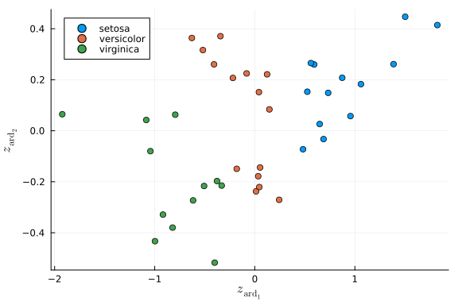

# Gaussian Process Latent Variable Model

In a previous tutorial, we have discussed latent variable models, in particular probabilistic principal component analysis (pPCA).
Here, we show how we can extend the mapping provided by pPCA to non-linear mappings between input and output.
For more details about the Gaussian Process Latent Variable Model (GPLVM),
we refer the reader to the [original publication](https://jmlr.org/papers/v6/lawrence05a.html) and a [further extension](http://proceedings.mlr.press/v9/titsias10a/titsias10a.pdf).

In short, the GPVLM is a dimensionality reduction technique that allows us to embed a high-dimensional dataset in a lower-dimensional embedding.
Importantly, it provides the advantage that the linear mappings from the embedded space can be non-linearised through the use of Gaussian Processes.

Let's start by loading some dependencies.

```julia
using Turing
using AbstractGPs
using FillArrays
using LaTeXStrings
using Plots
using RDatasets
using ReverseDiff
using StatsBase

using LinearAlgebra
using Random

Random.seed!(1789);
```


We demonstrate the GPLVM with a very small dataset: [Fisher's Iris data set](https://en.wikipedia.org/wiki/Iris_flower_data_set).
This is mostly for reasons of run time, so the tutorial can be run quickly.
As you will see, one of the major drawbacks of using GPs is their speed,
although this is an active area of research.
We will briefly touch on some ways to speed things up at the end of this tutorial.
We transform the original data with non-linear operations in order to demonstrate the power of GPs to work on non-linear relationships, while keeping the problem reasonably small.

```julia
data = dataset("datasets", "iris")
species = data[!, "Species"]
index = shuffle(1:150)
# we extract the four measured quantities,
# so the dimension of the data is only d=4 for this toy example
dat = Matrix(data[index, 1:4])
labels = data[index, "Species"]

# non-linearize data to demonstrate ability of GPs to deal with non-linearity
dat[:, 1] = 0.5 * dat[:, 1] .^ 2 + 0.1 * dat[:, 1] .^ 3
dat[:, 2] = dat[:, 2] .^ 3 + 0.2 * dat[:, 2] .^ 4
dat[:, 3] = 0.1 * exp.(dat[:, 3]) - 0.2 * dat[:, 3] .^ 2
dat[:, 4] = 0.5 * log.(dat[:, 4]) .^ 2 + 0.01 * dat[:, 3] .^ 5

# normalize data
dt = fit(ZScoreTransform, dat; dims=1);
StatsBase.transform!(dt, dat);
```


We will start out by demonstrating the basic similarity between pPCA (see the tutorial on this topic) and the GPLVM model.
Indeed, pPCA is basically equivalent to running the GPLVM model with an automatic relevance determination (ARD) linear kernel.

First, we re-introduce the pPCA model (see the tutorial on pPCA for details)

```julia
@model function pPCA(x)
    # Dimensionality of the problem.
    N, D = size(x)
    # latent variable z
    z ~ filldist(Normal(), D, N)
    # weights/loadings W
    w ~ filldist(Normal(), D, D)
    mu = (w * z)'
    for d in 1:D
        x[:, d] ~ MvNormal(mu[:, d], I)
    end
    return nothing
end;
```


We define two different kernels, a simple linear kernel with an Automatic Relevance Determination transform and a
squared exponential kernel.

```julia
linear_kernel(α) = LinearKernel() ∘ ARDTransform(α)
sekernel(α, σ) = σ * SqExponentialKernel() ∘ ARDTransform(α);
```


And here is the GPLVM model.
We create separate models for the two types of kernel.

```julia
@model function GPLVM_linear(Y, K)
    # Dimensionality of the problem.
    N, D = size(Y)
    # K is the dimension of the latent space
    @assert K <= D
    noise = 1e-3

    # Priors
    α ~ MvLogNormal(MvNormal(Zeros(K), I))
    Z ~ filldist(Normal(), K, N)
    mu ~ filldist(Normal(), N)

    gp = GP(linear_kernel(α))
    gpz = gp(ColVecs(Z), noise)
    Y ~ filldist(MvNormal(mu, cov(gpz)), D)

    return nothing
end;

@model function GPLVM(Y, K)
    # Dimensionality of the problem.
    N, D = size(Y)
    # K is the dimension of the latent space
    @assert K <= D
    noise = 1e-3

    # Priors
    α ~ MvLogNormal(MvNormal(Zeros(K), I))
    σ ~ LogNormal(0.0, 1.0)
    Z ~ filldist(Normal(), K, N)
    mu ~ filldist(Normal(), N)

    gp = GP(sekernel(α, σ))
    gpz = gp(ColVecs(Z), noise)
    Y ~ filldist(MvNormal(mu, cov(gpz)), D)

    return nothing
end;
```


```julia
# Standard GPs don't scale very well in n, so we use a small subsample for the purpose of this tutorial
n_data = 40
# number of features to use from dataset
n_features = 4
# latent dimension for GP case
ndim = 4;
```


```julia
ppca = pPCA(dat[1:n_data, 1:n_features])
chain_ppca = sample(ppca, NUTS{Turing.ReverseDiffAD{true}}(), 1000);
```


```julia
# we extract the posterior mean estimates of the parameters from the chain
z_mean = reshape(mean(group(chain_ppca, :z))[:, 2], (n_features, n_data))
scatter(z_mean[1, :], z_mean[2, :]; group=labels[1:n_data], xlabel=L"z_1", ylabel=L"z_2")
```


We can see that the pPCA fails to distinguish the groups.
In particular, the `setosa` species is not clearly separated from `versicolor` and `virginica`.
This is due to the non-linearities that we introduced, as without them the two groups can be clearly distinguished
using pPCA (see the pPCA tutorial).

Let's try the same with our linear kernel GPLVM model.

```julia
gplvm_linear = GPLVM_linear(dat[1:n_data, 1:n_features], ndim)
chain_linear = sample(gplvm_linear, NUTS{Turing.ReverseDiffAD{true}}(), 500);
```


```julia
# we extract the posterior mean estimates of the parameters from the chain
z_mean = reshape(mean(group(chain_linear, :Z))[:, 2], (n_features, n_data))
alpha_mean = mean(group(chain_linear, :α))[:, 2]

alpha1, alpha2 = partialsortperm(alpha_mean, 1:2; rev=true)
scatter(
    z_mean[alpha1, :],
    z_mean[alpha2, :];
    group=labels[1:n_data],
    xlabel=L"z_{\mathrm{ard}_1}",
    ylabel=L"z_{\mathrm{ard}_2}",
)
```


We can see that similar to the pPCA case, the linear kernel GPLVM fails to distinguish between the two groups
(`setosa` on the one hand, and `virginica` and `verticolor` on the other).

Finally, we demonstrate that by changing the kernel to a non-linear function, we are able to separate the data again.

```julia
gplvm = GPLVM(dat[1:n_data, 1:n_features], ndim)
chain_gplvm = sample(gplvm, NUTS{Turing.ReverseDiffAD{true}}(), 500);
```


```julia
# we extract the posterior mean estimates of the parameters from the chain
z_mean = reshape(mean(group(chain_gplvm, :Z))[:, 2], (ndim, n_data))
alpha_mean = mean(group(chain_gplvm, :α))[:, 2]

alpha1, alpha2 = partialsortperm(alpha_mean, 1:2; rev=true)
scatter(
    z_mean[alpha1, :],
    z_mean[alpha2, :];
    group=labels[1:n_data],
    xlabel=L"z_{\mathrm{ard}_1}",
    ylabel=L"z_{\mathrm{ard}_2}",
)
```




Now, the split between the two groups is visible again.


## Appendix

These tutorials are a part of the TuringTutorials repository, found at: [https://github.com/TuringLang/TuringTutorials](https://github.com/TuringLang/TuringTutorials).

To locally run this tutorial, do the following commands:

```
using TuringTutorials
TuringTutorials.weave("12-gaussian-process", "12_gaussian-process.jmd")
```

Computer Information:

```
Julia Version 1.6.7
Commit 3b76b25b64 (2022-07-19 15:11 UTC)
Platform Info:
  OS: Linux (x86_64-pc-linux-gnu)
  CPU: AMD EPYC 7502 32-Core Processor
  WORD_SIZE: 64
  LIBM: libopenlibm
  LLVM: libLLVM-11.0.1 (ORCJIT, znver2)
Environment:
  JULIA_CPU_THREADS = 16
  BUILDKITE_PLUGIN_JULIA_CACHE_DIR = /cache/julia-buildkite-plugin
  JULIA_DEPOT_PATH = /cache/julia-buildkite-plugin/depots/7aa0085e-79a4-45f3-a5bd-9743c91cf3da

```

Package Information:

```
      Status `/cache/build/default-amdci4-6/julialang/turingtutorials/tutorials/12-gaussian-process/Project.toml`
  [99985d1d] AbstractGPs v0.5.13
  [1a297f60] FillArrays v0.13.7
  [b964fa9f] LaTeXStrings v1.3.0
  [91a5bcdd] Plots v1.38.3
  [ce6b1742] RDatasets v0.7.7
  [37e2e3b7] ReverseDiff v1.14.4
  [2913bbd2] StatsBase v0.33.21
  [fce5fe82] Turing v0.22.0
  [37e2e46d] LinearAlgebra
  [9a3f8284] Random
```

And the full manifest:

```
      Status `/cache/build/default-amdci4-6/julialang/turingtutorials/tutorials/12-gaussian-process/Manifest.toml`
  [621f4979] AbstractFFTs v1.2.1
  [99985d1d] AbstractGPs v0.5.13
  [80f14c24] AbstractMCMC v4.2.0
  [7a57a42e] AbstractPPL v0.5.3
  [1520ce14] AbstractTrees v0.4.4
  [79e6a3ab] Adapt v3.5.0
  [0bf59076] AdvancedHMC v0.3.6
  [5b7e9947] AdvancedMH v0.6.8
  [576499cb] AdvancedPS v0.3.8
  [b5ca4192] AdvancedVI v0.1.6
  [dce04be8] ArgCheck v2.3.0
  [30b0a656] ArrayInterfaceCore v0.1.29
  [dd5226c6] ArrayInterfaceStaticArraysCore v0.1.3
  [13072b0f] AxisAlgorithms v1.0.1
  [39de3d68] AxisArrays v0.4.6
  [198e06fe] BangBang v0.3.37
  [9718e550] Baselet v0.1.1
  [76274a88] Bijectors v0.10.6
  [336ed68f] CSV v0.10.9
  [49dc2e85] Calculus v0.5.1
  [324d7699] CategoricalArrays v0.10.7
  [082447d4] ChainRules v1.46.1
  [d360d2e6] ChainRulesCore v1.15.7
  [9e997f8a] ChangesOfVariables v0.1.5
  [944b1d66] CodecZlib v0.7.1
  [35d6a980] ColorSchemes v3.20.0
  [3da002f7] ColorTypes v0.11.4
  [c3611d14] ColorVectorSpace v0.9.10
  [5ae59095] Colors v0.12.10
  [861a8166] Combinatorics v1.0.2
  [38540f10] CommonSolve v0.2.3
  [bbf7d656] CommonSubexpressions v0.3.0
  [34da2185] Compat v4.5.0
  [a33af91c] CompositionsBase v0.1.1
  [88cd18e8] ConsoleProgressMonitor v0.1.2
  [187b0558] ConstructionBase v1.4.1
  [d38c429a] Contour v0.6.2
  [a8cc5b0e] Crayons v4.1.1
  [9a962f9c] DataAPI v1.14.0
  [a93c6f00] DataFrames v1.4.4
  [864edb3b] DataStructures v0.18.13
  [e2d170a0] DataValueInterfaces v1.0.0
  [244e2a9f] DefineSingletons v0.1.2
  [b429d917] DensityInterface v0.4.0
  [163ba53b] DiffResults v1.1.0
  [b552c78f] DiffRules v1.12.2
  [b4f34e82] Distances v0.10.7
  [31c24e10] Distributions v0.25.80
  [ced4e74d] DistributionsAD v0.6.43
  [ffbed154] DocStringExtensions v0.9.3
  [fa6b7ba4] DualNumbers v0.6.8
  [366bfd00] DynamicPPL v0.21.4
  [cad2338a] EllipticalSliceSampling v1.0.0
  [4e289a0a] EnumX v1.0.4
  [e2ba6199] ExprTools v0.1.8
  [c87230d0] FFMPEG v0.4.1
  [7a1cc6ca] FFTW v1.5.0
  [5789e2e9] FileIO v1.16.0
  [48062228] FilePathsBase v0.9.20
  [1a297f60] FillArrays v0.13.7
  [53c48c17] FixedPointNumbers v0.8.4
  [59287772] Formatting v0.4.2
  [f6369f11] ForwardDiff v0.10.34
  [069b7b12] FunctionWrappers v1.1.3
  [77dc65aa] FunctionWrappersWrappers v0.1.1
  [d9f16b24] Functors v0.3.0
  [46192b85] GPUArraysCore v0.1.3
  [28b8d3ca] GR v0.71.5
  [42e2da0e] Grisu v1.0.2
  [cd3eb016] HTTP v0.8.19
  [34004b35] HypergeometricFunctions v0.3.11
  [7869d1d1] IRTools v0.4.7
  [83e8ac13] IniFile v0.5.1
  [22cec73e] InitialValues v0.3.1
  [842dd82b] InlineStrings v1.4.0
  [505f98c9] InplaceOps v0.3.0
  [a98d9a8b] Interpolations v0.14.7
  [8197267c] IntervalSets v0.7.4
  [3587e190] InverseFunctions v0.1.8
  [41ab1584] InvertedIndices v1.2.0
  [92d709cd] IrrationalConstants v0.1.1
  [c8e1da08] IterTools v1.4.0
  [82899510] IteratorInterfaceExtensions v1.0.0
  [1019f520] JLFzf v0.1.5
  [692b3bcd] JLLWrappers v1.4.1
  [682c06a0] JSON v0.21.3
  [5ab0869b] KernelDensity v0.6.5
  [ec8451be] KernelFunctions v0.10.51
  [8ac3fa9e] LRUCache v1.4.0
  [b964fa9f] LaTeXStrings v1.3.0
  [23fbe1c1] Latexify v0.15.18
  [1d6d02ad] LeftChildRightSiblingTrees v0.2.0
  [6f1fad26] Libtask v0.7.0
  [6fdf6af0] LogDensityProblems v1.0.3
  [2ab3a3ac] LogExpFunctions v0.3.20
  [e6f89c97] LoggingExtras v0.4.9
  [c7f686f2] MCMCChains v5.6.1
  [be115224] MCMCDiagnosticTools v0.2.6
  [e80e1ace] MLJModelInterface v1.8.0
  [1914dd2f] MacroTools v0.5.10
  [dbb5928d] MappedArrays v0.4.1
  [739be429] MbedTLS v1.1.7
  [442fdcdd] Measures v0.3.2
  [128add7d] MicroCollections v0.1.3
  [e1d29d7a] Missings v1.1.0
  [78c3b35d] Mocking v0.7.5
  [872c559c] NNlib v0.8.16
  [77ba4419] NaNMath v1.0.1
  [86f7a689] NamedArrays v0.9.6
  [c020b1a1] NaturalSort v1.0.0
  [6fe1bfb0] OffsetArrays v1.12.8
  [3bd65402] Optimisers v0.2.14
  [bac558e1] OrderedCollections v1.4.1
  [90014a1f] PDMats v0.11.16
  [69de0a69] Parsers v2.5.3
  [b98c9c47] Pipe v1.3.0
  [ccf2f8ad] PlotThemes v3.1.0
  [995b91a9] PlotUtils v1.3.4
  [91a5bcdd] Plots v1.38.3
  [2dfb63ee] PooledArrays v1.4.2
  [21216c6a] Preferences v1.3.0
  [08abe8d2] PrettyTables v2.2.2
  [33c8b6b6] ProgressLogging v0.1.4
  [92933f4c] ProgressMeter v1.7.2
  [1fd47b50] QuadGK v2.7.0
  [df47a6cb] RData v0.8.3
  [ce6b1742] RDatasets v0.7.7
  [b3c3ace0] RangeArrays v0.3.2
  [c84ed2f1] Ratios v0.4.3
  [c1ae055f] RealDot v0.1.0
  [3cdcf5f2] RecipesBase v1.3.3
  [01d81517] RecipesPipeline v0.6.11
  [731186ca] RecursiveArrayTools v2.36.0
  [189a3867] Reexport v1.2.2
  [05181044] RelocatableFolders v1.0.0
  [ae029012] Requires v1.3.0
  [37e2e3b7] ReverseDiff v1.14.4
  [79098fc4] Rmath v0.7.1
  [f2b01f46] Roots v2.0.8
  [7e49a35a] RuntimeGeneratedFunctions v0.5.5
  [0bca4576] SciMLBase v1.81.1
  [30f210dd] ScientificTypesBase v3.0.0
  [6c6a2e73] Scratch v1.1.1
  [91c51154] SentinelArrays v1.3.17
  [efcf1570] Setfield v1.1.1
  [992d4aef] Showoff v1.0.3
  [66db9d55] SnoopPrecompile v1.0.3
  [a2af1166] SortingAlgorithms v1.1.0
  [276daf66] SpecialFunctions v2.1.7
  [171d559e] SplittablesBase v0.1.15
  [90137ffa] StaticArrays v1.5.12
  [1e83bf80] StaticArraysCore v1.4.0
  [64bff920] StatisticalTraits v3.2.0
  [82ae8749] StatsAPI v1.5.0
  [2913bbd2] StatsBase v0.33.21
  [4c63d2b9] StatsFuns v1.1.1
  [892a3eda] StringManipulation v0.3.0
  [09ab397b] StructArrays v0.6.14
  [2efcf032] SymbolicIndexingInterface v0.2.1
  [3783bdb8] TableTraits v1.0.1
  [bd369af6] Tables v1.10.0
  [62fd8b95] TensorCore v0.1.1
  [5d786b92] TerminalLoggers v0.1.6
  [f269a46b] TimeZones v1.9.1
  [9f7883ad] Tracker v0.2.23
  [3bb67fe8] TranscodingStreams v0.9.11
  [28d57a85] Transducers v0.4.75
  [fce5fe82] Turing v0.22.0
  [3a884ed6] UnPack v1.0.2
  [1cfade01] UnicodeFun v0.4.1
  [41fe7b60] Unzip v0.1.2
  [ea10d353] WeakRefStrings v1.4.2
  [efce3f68] WoodburyMatrices v0.5.5
  [76eceee3] WorkerUtilities v1.6.1
  [700de1a5] ZygoteRules v0.2.2
  [6e34b625] Bzip2_jll v1.0.8+0
  [83423d85] Cairo_jll v1.16.1+1
  [2e619515] Expat_jll v2.4.8+0
  [b22a6f82] FFMPEG_jll v4.4.2+2
  [f5851436] FFTW_jll v3.3.10+0
  [a3f928ae] Fontconfig_jll v2.13.93+0
  [d7e528f0] FreeType2_jll v2.10.4+0
  [559328eb] FriBidi_jll v1.0.10+0
  [0656b61e] GLFW_jll v3.3.8+0
  [d2c73de3] GR_jll v0.71.5+0
  [78b55507] Gettext_jll v0.21.0+0
  [7746bdde] Glib_jll v2.74.0+2
  [3b182d85] Graphite2_jll v1.3.14+0
  [2e76f6c2] HarfBuzz_jll v2.8.1+1
  [1d5cc7b8] IntelOpenMP_jll v2018.0.3+2
  [aacddb02] JpegTurbo_jll v2.1.2+0
  [c1c5ebd0] LAME_jll v3.100.1+0
  [88015f11] LERC_jll v3.0.0+1
  [dd4b983a] LZO_jll v2.10.1+0
  [e9f186c6] Libffi_jll v3.2.2+1
  [d4300ac3] Libgcrypt_jll v1.8.7+0
  [7e76a0d4] Libglvnd_jll v1.6.0+0
  [7add5ba3] Libgpg_error_jll v1.42.0+0
  [94ce4f54] Libiconv_jll v1.16.1+2
  [4b2f31a3] Libmount_jll v2.35.0+0
  [89763e89] Libtiff_jll v4.4.0+0
  [38a345b3] Libuuid_jll v2.36.0+0
  [856f044c] MKL_jll v2022.2.0+0
  [e7412a2a] Ogg_jll v1.3.5+1
  [458c3c95] OpenSSL_jll v1.1.19+0
  [efe28fd5] OpenSpecFun_jll v0.5.5+0
  [91d4177d] Opus_jll v1.3.2+0
  [30392449] Pixman_jll v0.40.1+0
  [ea2cea3b] Qt5Base_jll v5.15.3+2
  [f50d1b31] Rmath_jll v0.4.0+0
  [a2964d1f] Wayland_jll v1.21.0+0
  [2381bf8a] Wayland_protocols_jll v1.25.0+0
  [02c8fc9c] XML2_jll v2.10.3+0
  [aed1982a] XSLT_jll v1.1.34+0
  [4f6342f7] Xorg_libX11_jll v1.6.9+4
  [0c0b7dd1] Xorg_libXau_jll v1.0.9+4
  [935fb764] Xorg_libXcursor_jll v1.2.0+4
  [a3789734] Xorg_libXdmcp_jll v1.1.3+4
  [1082639a] Xorg_libXext_jll v1.3.4+4
  [d091e8ba] Xorg_libXfixes_jll v5.0.3+4
  [a51aa0fd] Xorg_libXi_jll v1.7.10+4
  [d1454406] Xorg_libXinerama_jll v1.1.4+4
  [ec84b674] Xorg_libXrandr_jll v1.5.2+4
  [ea2f1a96] Xorg_libXrender_jll v0.9.10+4
  [14d82f49] Xorg_libpthread_stubs_jll v0.1.0+3
  [c7cfdc94] Xorg_libxcb_jll v1.13.0+3
  [cc61e674] Xorg_libxkbfile_jll v1.1.0+4
  [12413925] Xorg_xcb_util_image_jll v0.4.0+1
  [2def613f] Xorg_xcb_util_jll v0.4.0+1
  [975044d2] Xorg_xcb_util_keysyms_jll v0.4.0+1
  [0d47668e] Xorg_xcb_util_renderutil_jll v0.3.9+1
  [c22f9ab0] Xorg_xcb_util_wm_jll v0.4.1+1
  [35661453] Xorg_xkbcomp_jll v1.4.2+4
  [33bec58e] Xorg_xkeyboard_config_jll v2.27.0+4
  [c5fb5394] Xorg_xtrans_jll v1.4.0+3
  [3161d3a3] Zstd_jll v1.5.2+0
  [214eeab7] fzf_jll v0.29.0+0
  [a4ae2306] libaom_jll v3.4.0+0
  [0ac62f75] libass_jll v0.15.1+0
  [f638f0a6] libfdk_aac_jll v2.0.2+0
  [b53b4c65] libpng_jll v1.6.38+0
  [f27f6e37] libvorbis_jll v1.3.7+1
  [1270edf5] x264_jll v2021.5.5+0
  [dfaa095f] x265_jll v3.5.0+0
  [d8fb68d0] xkbcommon_jll v1.4.1+0
  [0dad84c5] ArgTools
  [56f22d72] Artifacts
  [2a0f44e3] Base64
  [ade2ca70] Dates
  [8bb1440f] DelimitedFiles
  [8ba89e20] Distributed
  [f43a241f] Downloads
  [9fa8497b] Future
  [b77e0a4c] InteractiveUtils
  [4af54fe1] LazyArtifacts
  [b27032c2] LibCURL
  [76f85450] LibGit2
  [8f399da3] Libdl
  [37e2e46d] LinearAlgebra
  [56ddb016] Logging
  [d6f4376e] Markdown
  [a63ad114] Mmap
  [ca575930] NetworkOptions
  [44cfe95a] Pkg
  [de0858da] Printf
  [3fa0cd96] REPL
  [9a3f8284] Random
  [ea8e919c] SHA
  [9e88b42a] Serialization
  [1a1011a3] SharedArrays
  [6462fe0b] Sockets
  [2f01184e] SparseArrays
  [10745b16] Statistics
  [4607b0f0] SuiteSparse
  [fa267f1f] TOML
  [a4e569a6] Tar
  [8dfed614] Test
  [cf7118a7] UUIDs
  [4ec0a83e] Unicode
  [e66e0078] CompilerSupportLibraries_jll
  [deac9b47] LibCURL_jll
  [29816b5a] LibSSH2_jll
  [c8ffd9c3] MbedTLS_jll
  [14a3606d] MozillaCACerts_jll
  [05823500] OpenLibm_jll
  [efcefdf7] PCRE2_jll
  [83775a58] Zlib_jll
  [8e850ede] nghttp2_jll
  [3f19e933] p7zip_jll
```

