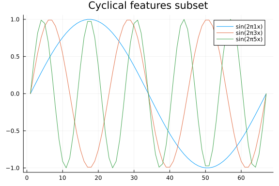
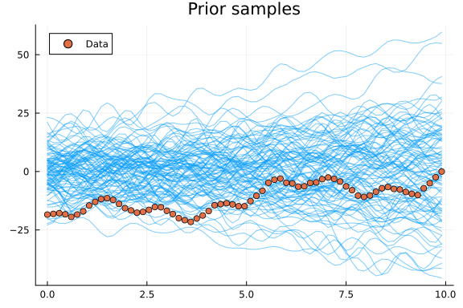
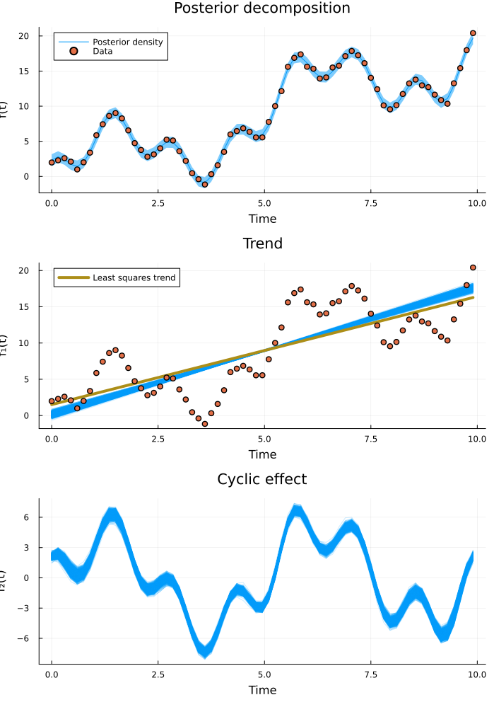
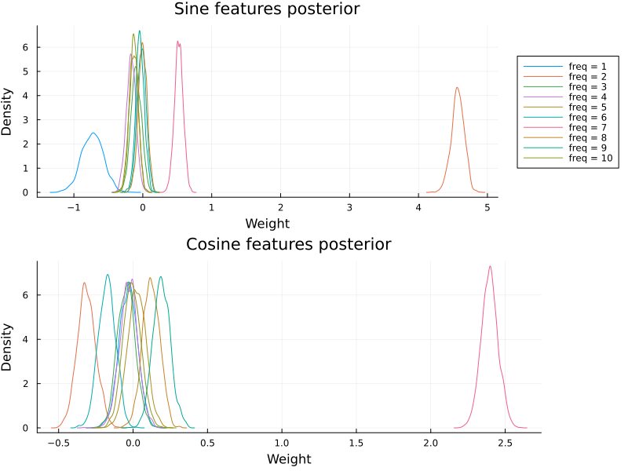
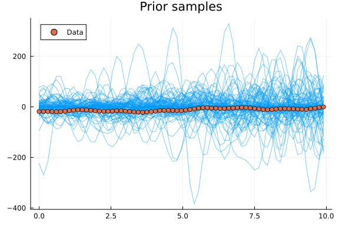
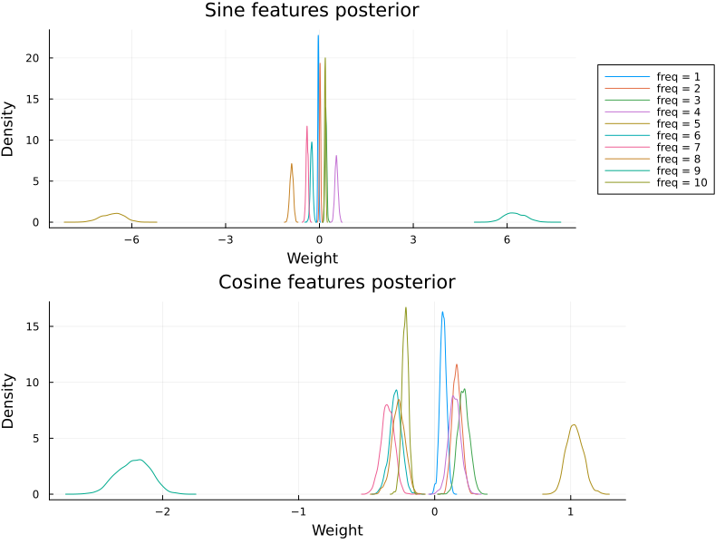

In time series analysis we are often interested in understanding how various real-life circumstances impact our quantity of interest.
These can be, for instance, season, day of week, or time of day.
To analyse this it is useful to decompose time series into simpler components (corresponding to relevant circumstances)
and infer their relevance.
In this tutorial we are going to use Turing for time series analysis and learn about useful ways to decompose time series.

# Modelling time series

Before we start coding, let us talk about what exactly we mean with time series decomposition.
In a nutshell, it is a divide-and-conquer approach where we express a time series as a sum or a product of simpler series.
For instance, the time series $f(t)$ can be decomposed into a sum of $n$ components

$$f(t) = \sum_{i=1}^n f_i(t),$$

or we can decompose $g(t)$ into a product of $m$ components

$$g(t) = \prod_{i=1}^m g_i(t).$$

We refer to this as *additive* or *multiplicative* decomposition respectively.
This type of decomposition is great since it lets us reason about individual components, which makes encoding prior information and interpreting model predictions very easy.
Two common components are *trends*, which represent the overall change of the time series (often assumed to be linear),
and *cyclic effects* which contribute oscillating effects around the trend.
Let us simulate some data with an additive linear trend and oscillating effects.

```julia
using Turing
using FillArrays
using StatsPlots

using LinearAlgebra
using Random
using Statistics

Random.seed!(12345)

true_sin_freq = 2
true_sin_amp = 5
true_cos_freq = 7
true_cos_amp = 2.5
tmax = 10
β_true = 2
α_true = -1
tt = 0:0.05:tmax
f₁(t) = α_true + β_true * t
f₂(t) = true_sin_amp * sinpi(2 * t * true_sin_freq / tmax)
f₃(t) = true_cos_amp * cospi(2 * t * true_cos_freq / tmax)
f(t) = f₁(t) + f₂(t) + f₃(t)

plot(f, tt; label="f(t)", title="Observed time series", legend=:topleft, linewidth=3)
plot!(
    [f₁, f₂, f₃],
    tt;
    label=["f₁(t)" "f₂(t)" "f₃(t)"],
    style=[:dot :dash :dashdot],
    linewidth=1,
)
```


Even though we use simple components, combining them can give rise to fairly complex time series.
In this time series, cyclic effects are just added on top of the trend.
If we instead multiply the components the cyclic effects cause the series to oscillate
between larger and larger values, since they get scaled by the trend.

```julia
g(t) = f₁(t) * f₂(t) * f₃(t)

plot(g, tt; label="f(t)", title="Observed time series", legend=:topleft, linewidth=3)
plot!([f₁, f₂, f₃], tt; label=["f₁(t)" "f₂(t)" "f₃(t)"], linewidth=1)
```


Unlike $f$, $g$ oscillates around $0$ since it is being multiplied with sines and cosines.
To let a multiplicative decomposition oscillate around the trend we could define it as
$\tilde{g}(t) = f₁(t) * (1 + f₂(t)) * (1 + f₃(t)),$
but for convenience we will leave it as is.
The inference machinery is the same for both cases.

# Model fitting

Having discussed time series decomposition, let us fit a model to the time series above and recover the true parameters.
Before building our model, we standardise the time axis to $[0, 1]$ and subtract the max of the time series.
This helps convergence while maintaining interpretability and the correct scales for the cyclic components.

```julia
σ_true = 0.35
t = collect(tt[begin:3:end])
t_min, t_max = extrema(t)
x = (t .- t_min) ./ (t_max - t_min)
yf = f.(t) .+ σ_true .* randn(size(t))
yf_max = maximum(yf)
yf = yf .- yf_max

scatter(x, yf; title="Standardised data", legend=false)
```


Let us now build our model.
We want to assume a linear trend, and cyclic effects.
Encoding a linear trend is easy enough, but what about cyclical effects?
We will take a scattergun approach, and create multiple cyclical features using both sine and cosine functions and let our inference machinery figure out which to keep.
To do this, we define how long a one period should be, and create features in reference to said period.
How long a period should be is problem dependent, but as an example let us say it is $1$ year.
If we then find evidence for a cyclic effect with a frequency of 2, that would mean a biannual effect. A frequency of 4 would mean quarterly etc.
Since we are using synthetic data, we are simply going to let the period be 1, which is the entire length of the time series.

```julia
freqs = 1:10
num_freqs = length(freqs)
period = 1
cyclic_features = [sinpi.(2 .* freqs' .* x ./ period) cospi.(2 .* freqs' .* x ./ period)]

plot_freqs = [1, 3, 5]
freq_ptl = plot(
    cyclic_features[:, plot_freqs];
    label=permutedims(["sin(2π$(f)x)" for f in plot_freqs]),
    title="Cyclical features subset",
)
```




Having constructed the cyclical features, we can finally build our model. The model we will implement looks like this

$$
f(t) = \alpha + \beta_t t + \sum_{i=1}^F \beta_{\sin{},i} \sin{}(2\pi f_i t) + \sum_{i=1}^F \beta_{\cos{},i} \cos{}(2\pi f_i t),
$$

with a Gaussian likelihood $y \sim \mathcal{N}(f(t), \sigma^2)$.
For convenience we are treating the cyclical feature weights $\beta_{\sin{},i}$ and $\beta_{\cos{},i}$ the same in code and weight them with $\beta_c$.
And just because it is so easy, we parameterise our model with the operation with which to apply the cyclic effects.
This lets us use the exact same code for both additive and multiplicative models.
Finally, we plot prior predictive samples to make sure our priors make sense.

```julia
@model function decomp_model(t, c, op)
    α ~ Normal(0, 10)
    βt ~ Normal(0, 2)
    βc ~ MvNormal(Zeros(size(c, 2)), I)
    σ ~ truncated(Normal(0, 0.1); lower=0)

    cyclic = c * βc
    trend = α .+ βt .* t
    μ = op(trend, cyclic)
    y ~ MvNormal(μ, σ^2 * I)
    return (; trend, cyclic)
end

y_prior_samples = mapreduce(hcat, 1:100) do _
    rand(decomp_model(t, cyclic_features, +)).y
end
plot(t, y_prior_samples; linewidth=1, alpha=0.5, color=1, label="", title="Prior samples")
scatter!(t, yf; color=2, label="Data")
```




With the model specified and with a reasonable prior we can now let Turing decompose the time series for us!

```julia
function mean_ribbon(samples)
    qs = quantile(samples)
    low = qs[:, Symbol("2.5%")]
    up = qs[:, Symbol("97.5%")]
    m = mean(samples)[:, :mean]
    return m, (m - low, up - m)
end

function get_decomposition(model, x, cyclic_features, chain, op)
    chain_params = Turing.MCMCChains.get_sections(chain, :parameters)
    return generated_quantities(model(x, cyclic_features, op), chain_params)
end

function plot_fit(x, y, decomp, ymax)
    trend = mapreduce(x -> x.trend, hcat, decomp)
    cyclic = mapreduce(x -> x.cyclic, hcat, decomp)

    trend_plt = plot(
        x,
        trend .+ ymax;
        color=1,
        label=nothing,
        alpha=0.2,
        title="Trend",
        xlabel="Time",
        ylabel="f₁(t)",
    )
    ls = [ones(length(t)) t] \ y
    α̂, β̂ = ls[1], ls[2:end]
    plot!(
        trend_plt,
        t,
        α̂ .+ t .* β̂ .+ ymax;
        label="Least squares trend",
        color=5,
        linewidth=4,
    )

    scatter!(trend_plt, x, y .+ ymax; label=nothing, color=2, legend=:topleft)
    cyclic_plt = plot(
        x,
        cyclic;
        color=1,
        label=nothing,
        alpha=0.2,
        title="Cyclic effect",
        xlabel="Time",
        ylabel="f₂(t)",
    )
    return trend_plt, cyclic_plt
end

chain = sample(decomp_model(x, cyclic_features, +) | (; y=yf), NUTS(), 2000)
yf_samples = predict(decomp_model(x, cyclic_features, +), chain)
m, conf = mean_ribbon(yf_samples)
predictive_plt = plot(
    t,
    m .+ yf_max;
    ribbon=conf,
    label="Posterior density",
    title="Posterior decomposition",
    xlabel="Time",
    ylabel="f(t)",
)
scatter!(predictive_plt, t, yf .+ yf_max; color=2, label="Data", legend=:topleft)

decomp = get_decomposition(decomp_model, x, cyclic_features, chain, +)
decomposed_plt = plot_fit(t, yf, decomp, yf_max)
plot(predictive_plt, decomposed_plt...; layout=(3, 1), size=(700, 1000))
```




Inference is successful and the posterior beautifully captures the data.
We see that the least squares linear fit deviates somewhat from the posterior trend.
Since our model takes cyclic effects into account separately,
we get a better estimate of the true overall trend than if we would have just fitted a line.
But what frequency content did the model identify?

```julia
function plot_cyclic_features(βsin, βcos)
    labels = reshape(["freq = $i" for i in freqs], 1, :)
    colors = collect(freqs)'
    style = reshape([i <= 10 ? :solid : :dash for i in 1:length(labels)], 1, :)
    sin_features_plt = density(
        βsin[:, :, 1];
        title="Sine features posterior",
        label=labels,
        ylabel="Density",
        xlabel="Weight",
        color=colors,
        linestyle=style,
        legend=nothing,
    )
    cos_features_plt = density(
        βcos[:, :, 1];
        title="Cosine features posterior",
        ylabel="Density",
        xlabel="Weight",
        label=nothing,
        color=colors,
        linestyle=style,
    )

    return seasonal_features_plt = plot(
        sin_features_plt,
        cos_features_plt;
        layout=(2, 1),
        size=(800, 600),
        legend=:outerright,
    )
end

βc = Array(group(chain, :βc))
plot_cyclic_features(βc[:, begin:num_freqs, :], βc[:, (num_freqs + 1):end, :])
```




Plotting the posterior over the cyclic features reveals that the model managed to extract the true frequency content.

Since we wrote our model to accept a combining operator, we can easily run the same analysis for a multiplicative model.

```julia
yg = g.(t) .+ σ_true .* randn(size(t))

y_prior_samples = mapreduce(hcat, 1:100) do _
    rand(decomp_model(t, cyclic_features, .*)).y
end
plot(t, y_prior_samples; linewidth=1, alpha=0.5, color=1, label="", title="Prior samples")
scatter!(t, yf; color=2, label="Data")
```



```julia
chain = sample(decomp_model(x, cyclic_features, .*) | (; y=yg), NUTS(), 2000)
yg_samples = predict(decomp_model(x, cyclic_features, .*), chain)
m, conf = mean_ribbon(yg_samples)
predictive_plt = plot(
    t,
    m;
    ribbon=conf,
    label="Posterior density",
    title="Posterior decomposition",
    xlabel="Time",
    ylabel="g(t)",
)
scatter!(predictive_plt, t, yg; color=2, label="Data", legend=:topleft)

decomp = get_decomposition(decomp_model, x, cyclic_features, chain, .*)
decomposed_plt = plot_fit(t, yg, decomp, 0)
plot(predictive_plt, decomposed_plt...; layout=(3, 1), size=(700, 1000))
```


The model fits! What about the infered cyclic components?

```julia
βc = Array(group(chain, :βc))
plot_cyclic_features(βc[:, begin:num_freqs, :], βc[:, (num_freqs + 1):end, :])
```




While multiplicative model fits to the data, it does not recover the true parameters for this dataset.

# Wrapping up

In this tutorial we have seen how to implement and fit time series models using additive and multiplicative decomposition.
We also saw how to visualise the model fit, and how to interpret learned cyclical components.


## Appendix

These tutorials are a part of the TuringTutorials repository, found at: [https://github.com/TuringLang/TuringTutorials](https://github.com/TuringLang/TuringTutorials).

To locally run this tutorial, do the following commands:

```
using TuringTutorials
TuringTutorials.weave("13-seasonal-time-series", "13_seasonal_time_series.jmd")
```

Computer Information:

```
Julia Version 1.9.2
Commit e4ee485e909 (2023-07-05 09:39 UTC)
Platform Info:
  OS: Linux (x86_64-linux-gnu)
  CPU: 128 × AMD EPYC 7502 32-Core Processor
  WORD_SIZE: 64
  LIBM: libopenlibm
  LLVM: libLLVM-14.0.6 (ORCJIT, znver2)
  Threads: 1 on 16 virtual cores
Environment:
  JULIA_CPU_THREADS = 16
  JULIA_DEPOT_PATH = /cache/julia-buildkite-plugin/depots/7aa0085e-79a4-45f3-a5bd-9743c91cf3da
  JULIA_IMAGE_THREADS = 1

```

Package Information:

```
Status `/cache/build/default-amdci4-3/julialang/turingtutorials/tutorials/13-seasonal-time-series/Project.toml`
  [1a297f60] FillArrays v1.5.0
  [f3b207a7] StatsPlots v0.15.6
  [fce5fe82] Turing v0.28.1
  [37e2e46d] LinearAlgebra
```

And the full manifest:

```
Status `/cache/build/default-amdci4-3/julialang/turingtutorials/tutorials/13-seasonal-time-series/Manifest.toml`
  [47edcb42] ADTypes v0.1.6
  [621f4979] AbstractFFTs v1.5.0
  [80f14c24] AbstractMCMC v4.4.2
⌅ [7a57a42e] AbstractPPL v0.5.4
  [1520ce14] AbstractTrees v0.4.4
  [79e6a3ab] Adapt v3.6.2
  [0bf59076] AdvancedHMC v0.5.3
  [5b7e9947] AdvancedMH v0.7.5
  [576499cb] AdvancedPS v0.4.3
  [b5ca4192] AdvancedVI v0.2.4
  [dce04be8] ArgCheck v2.3.0
  [7d9fca2a] Arpack v0.5.4
  [4fba245c] ArrayInterface v7.4.11
  [a9b6321e] Atomix v0.1.0
  [13072b0f] AxisAlgorithms v1.0.1
  [39de3d68] AxisArrays v0.4.7
  [198e06fe] BangBang v0.3.39
  [9718e550] Baselet v0.1.1
⌅ [76274a88] Bijectors v0.12.8
  [d1d4a3ce] BitFlags v0.1.7
  [fa961155] CEnum v0.4.2
  [49dc2e85] Calculus v0.5.1
  [082447d4] ChainRules v1.53.0
  [d360d2e6] ChainRulesCore v1.16.0
  [9e997f8a] ChangesOfVariables v0.1.8
  [aaaa29a8] Clustering v0.15.4
  [944b1d66] CodecZlib v0.7.2
  [35d6a980] ColorSchemes v3.23.0
  [3da002f7] ColorTypes v0.11.4
  [c3611d14] ColorVectorSpace v0.10.0
  [5ae59095] Colors v0.12.10
  [861a8166] Combinatorics v1.0.2
  [38540f10] CommonSolve v0.2.4
  [bbf7d656] CommonSubexpressions v0.3.0
  [34da2185] Compat v4.9.0
  [a33af91c] CompositionsBase v0.1.2
  [f0e56b4a] ConcurrentUtilities v2.2.1
  [88cd18e8] ConsoleProgressMonitor v0.1.2
  [187b0558] ConstructionBase v1.5.3
  [d38c429a] Contour v0.6.2
  [a8cc5b0e] Crayons v4.1.1
  [9a962f9c] DataAPI v1.15.0
  [864edb3b] DataStructures v0.18.15
  [e2d170a0] DataValueInterfaces v1.0.0
  [244e2a9f] DefineSingletons v0.1.2
  [8bb1440f] DelimitedFiles v1.9.1
  [b429d917] DensityInterface v0.4.0
  [163ba53b] DiffResults v1.1.0
  [b552c78f] DiffRules v1.15.1
  [b4f34e82] Distances v0.10.9
  [31c24e10] Distributions v0.25.100
  [ced4e74d] DistributionsAD v0.6.52
  [ffbed154] DocStringExtensions v0.9.3
  [fa6b7ba4] DualNumbers v0.6.8
⌃ [366bfd00] DynamicPPL v0.23.0
  [cad2338a] EllipticalSliceSampling v1.1.0
  [4e289a0a] EnumX v1.0.4
  [460bff9d] ExceptionUnwrapping v0.1.9
  [e2ba6199] ExprTools v0.1.10
  [c87230d0] FFMPEG v0.4.1
  [7a1cc6ca] FFTW v1.7.1
  [1a297f60] FillArrays v1.5.0
  [53c48c17] FixedPointNumbers v0.8.4
  [59287772] Formatting v0.4.2
  [f6369f11] ForwardDiff v0.10.36
  [069b7b12] FunctionWrappers v1.1.3
  [77dc65aa] FunctionWrappersWrappers v0.1.3
  [d9f16b24] Functors v0.4.5
  [46192b85] GPUArraysCore v0.1.5
  [28b8d3ca] GR v0.72.9
  [42e2da0e] Grisu v1.0.2
  [cd3eb016] HTTP v1.9.14
  [34004b35] HypergeometricFunctions v0.3.23
  [22cec73e] InitialValues v0.3.1
  [505f98c9] InplaceOps v0.3.0
  [a98d9a8b] Interpolations v0.14.7
  [8197267c] IntervalSets v0.7.7
  [3587e190] InverseFunctions v0.1.12
  [41ab1584] InvertedIndices v1.3.0
  [92d709cd] IrrationalConstants v0.2.2
  [c8e1da08] IterTools v1.8.0
  [82899510] IteratorInterfaceExtensions v1.0.0
  [1019f520] JLFzf v0.1.5
  [692b3bcd] JLLWrappers v1.4.1
  [682c06a0] JSON v0.21.4
  [63c18a36] KernelAbstractions v0.9.8
  [5ab0869b] KernelDensity v0.6.7
  [929cbde3] LLVM v6.1.0
  [8ac3fa9e] LRUCache v1.4.1
  [b964fa9f] LaTeXStrings v1.3.0
  [23fbe1c1] Latexify v0.16.1
  [50d2b5c4] Lazy v0.15.1
  [1d6d02ad] LeftChildRightSiblingTrees v0.2.0
  [6f1fad26] Libtask v0.8.6
  [6fdf6af0] LogDensityProblems v2.1.1
  [996a588d] LogDensityProblemsAD v1.6.1
  [2ab3a3ac] LogExpFunctions v0.3.24
  [e6f89c97] LoggingExtras v1.0.0
  [c7f686f2] MCMCChains v6.0.3
  [be115224] MCMCDiagnosticTools v0.3.5
  [e80e1ace] MLJModelInterface v1.8.0
  [1914dd2f] MacroTools v0.5.10
  [dbb5928d] MappedArrays v0.4.2
  [739be429] MbedTLS v1.1.7
  [442fdcdd] Measures v0.3.2
  [128add7d] MicroCollections v0.1.4
  [e1d29d7a] Missings v1.1.0
  [6f286f6a] MultivariateStats v0.10.2
  [872c559c] NNlib v0.9.4
  [77ba4419] NaNMath v1.0.2
  [86f7a689] NamedArrays v0.9.8
  [c020b1a1] NaturalSort v1.0.0
  [b8a86587] NearestNeighbors v0.4.13
  [510215fc] Observables v0.5.4
  [6fe1bfb0] OffsetArrays v1.12.10
  [4d8831e6] OpenSSL v1.4.1
  [3bd65402] Optimisers v0.2.19
  [bac558e1] OrderedCollections v1.6.2
  [90014a1f] PDMats v0.11.17
  [69de0a69] Parsers v2.7.2
  [b98c9c47] Pipe v1.3.0
  [ccf2f8ad] PlotThemes v3.1.0
  [995b91a9] PlotUtils v1.3.5
  [91a5bcdd] Plots v1.38.17
  [aea7be01] PrecompileTools v1.1.2
  [21216c6a] Preferences v1.4.0
  [08abe8d2] PrettyTables v2.2.7
  [33c8b6b6] ProgressLogging v0.1.4
  [92933f4c] ProgressMeter v1.7.2
  [1fd47b50] QuadGK v2.8.2
  [74087812] Random123 v1.6.1
  [e6cf234a] RandomNumbers v1.5.3
  [b3c3ace0] RangeArrays v0.3.2
  [c84ed2f1] Ratios v0.4.5
  [c1ae055f] RealDot v0.1.0
  [3cdcf5f2] RecipesBase v1.3.4
  [01d81517] RecipesPipeline v0.6.12
  [731186ca] RecursiveArrayTools v2.38.7
  [189a3867] Reexport v1.2.2
  [05181044] RelocatableFolders v1.0.0
  [ae029012] Requires v1.3.0
  [79098fc4] Rmath v0.7.1
  [f2b01f46] Roots v2.0.17
  [7e49a35a] RuntimeGeneratedFunctions v0.5.12
  [0bca4576] SciMLBase v1.94.0
  [c0aeaf25] SciMLOperators v0.3.6
  [30f210dd] ScientificTypesBase v3.0.0
  [6c6a2e73] Scratch v1.2.0
  [91c51154] SentinelArrays v1.4.0
  [efcf1570] Setfield v1.1.1
  [992d4aef] Showoff v1.0.3
  [777ac1f9] SimpleBufferStream v1.1.0
  [ce78b400] SimpleUnPack v1.1.0
  [a2af1166] SortingAlgorithms v1.1.1
  [276daf66] SpecialFunctions v2.3.0
  [171d559e] SplittablesBase v0.1.15
  [90137ffa] StaticArrays v1.6.2
  [1e83bf80] StaticArraysCore v1.4.2
  [64bff920] StatisticalTraits v3.2.0
  [82ae8749] StatsAPI v1.6.0
  [2913bbd2] StatsBase v0.34.0
  [4c63d2b9] StatsFuns v1.3.0
  [f3b207a7] StatsPlots v0.15.6
  [892a3eda] StringManipulation v0.3.0
  [09ab397b] StructArrays v0.6.15
  [2efcf032] SymbolicIndexingInterface v0.2.2
  [ab02a1b2] TableOperations v1.2.0
  [3783bdb8] TableTraits v1.0.1
  [bd369af6] Tables v1.10.1
  [62fd8b95] TensorCore v0.1.1
  [5d786b92] TerminalLoggers v0.1.7
  [9f7883ad] Tracker v0.2.26
  [3bb67fe8] TranscodingStreams v0.9.13
  [28d57a85] Transducers v0.4.78
  [410a4b4d] Tricks v0.1.7
  [781d530d] TruncatedStacktraces v1.4.0
  [fce5fe82] Turing v0.28.1
  [5c2747f8] URIs v1.5.0
  [1cfade01] UnicodeFun v0.4.1
  [1986cc42] Unitful v1.16.2
  [45397f5d] UnitfulLatexify v1.6.3
  [013be700] UnsafeAtomics v0.2.1
  [d80eeb9a] UnsafeAtomicsLLVM v0.1.3
  [41fe7b60] Unzip v0.2.0
  [cc8bc4a8] Widgets v0.6.6
  [efce3f68] WoodburyMatrices v0.5.5
  [700de1a5] ZygoteRules v0.2.3
⌅ [68821587] Arpack_jll v3.5.1+1
  [6e34b625] Bzip2_jll v1.0.8+0
  [83423d85] Cairo_jll v1.16.1+1
  [2e619515] Expat_jll v2.5.0+0
⌃ [b22a6f82] FFMPEG_jll v4.4.2+2
  [f5851436] FFTW_jll v3.3.10+0
  [a3f928ae] Fontconfig_jll v2.13.93+0
  [d7e528f0] FreeType2_jll v2.13.1+0
  [559328eb] FriBidi_jll v1.0.10+0
  [0656b61e] GLFW_jll v3.3.8+0
  [d2c73de3] GR_jll v0.72.9+1
  [78b55507] Gettext_jll v0.21.0+0
  [7746bdde] Glib_jll v2.74.0+2
  [3b182d85] Graphite2_jll v1.3.14+0
  [2e76f6c2] HarfBuzz_jll v2.8.1+1
  [1d5cc7b8] IntelOpenMP_jll v2023.2.0+0
  [aacddb02] JpegTurbo_jll v2.1.91+0
  [c1c5ebd0] LAME_jll v3.100.1+0
  [88015f11] LERC_jll v3.0.0+1
  [dad2f222] LLVMExtra_jll v0.0.23+0
  [1d63c593] LLVMOpenMP_jll v15.0.4+0
  [dd4b983a] LZO_jll v2.10.1+0
⌅ [e9f186c6] Libffi_jll v3.2.2+1
  [d4300ac3] Libgcrypt_jll v1.8.7+0
  [7e76a0d4] Libglvnd_jll v1.6.0+0
  [7add5ba3] Libgpg_error_jll v1.42.0+0
  [94ce4f54] Libiconv_jll v1.16.1+2
  [4b2f31a3] Libmount_jll v2.35.0+0
  [89763e89] Libtiff_jll v4.5.1+1
  [38a345b3] Libuuid_jll v2.36.0+0
  [856f044c] MKL_jll v2023.2.0+0
  [e7412a2a] Ogg_jll v1.3.5+1
⌅ [458c3c95] OpenSSL_jll v1.1.22+0
  [efe28fd5] OpenSpecFun_jll v0.5.5+0
  [91d4177d] Opus_jll v1.3.2+0
  [30392449] Pixman_jll v0.42.2+0
  [c0090381] Qt6Base_jll v6.4.2+3
  [f50d1b31] Rmath_jll v0.4.0+0
  [a2964d1f] Wayland_jll v1.21.0+0
  [2381bf8a] Wayland_protocols_jll v1.25.0+0
  [02c8fc9c] XML2_jll v2.10.3+0
  [aed1982a] XSLT_jll v1.1.34+0
  [ffd25f8a] XZ_jll v5.4.4+0
  [4f6342f7] Xorg_libX11_jll v1.8.6+0
  [0c0b7dd1] Xorg_libXau_jll v1.0.11+0
  [935fb764] Xorg_libXcursor_jll v1.2.0+4
  [a3789734] Xorg_libXdmcp_jll v1.1.4+0
  [1082639a] Xorg_libXext_jll v1.3.4+4
  [d091e8ba] Xorg_libXfixes_jll v5.0.3+4
  [a51aa0fd] Xorg_libXi_jll v1.7.10+4
  [d1454406] Xorg_libXinerama_jll v1.1.4+4
  [ec84b674] Xorg_libXrandr_jll v1.5.2+4
  [ea2f1a96] Xorg_libXrender_jll v0.9.10+4
  [14d82f49] Xorg_libpthread_stubs_jll v0.1.1+0
  [c7cfdc94] Xorg_libxcb_jll v1.15.0+0
  [cc61e674] Xorg_libxkbfile_jll v1.1.2+0
  [12413925] Xorg_xcb_util_image_jll v0.4.0+1
  [2def613f] Xorg_xcb_util_jll v0.4.0+1
  [975044d2] Xorg_xcb_util_keysyms_jll v0.4.0+1
  [0d47668e] Xorg_xcb_util_renderutil_jll v0.3.9+1
  [c22f9ab0] Xorg_xcb_util_wm_jll v0.4.1+1
  [35661453] Xorg_xkbcomp_jll v1.4.6+0
  [33bec58e] Xorg_xkeyboard_config_jll v2.39.0+0
  [c5fb5394] Xorg_xtrans_jll v1.5.0+0
  [3161d3a3] Zstd_jll v1.5.5+0
⌅ [214eeab7] fzf_jll v0.29.0+0
  [a4ae2306] libaom_jll v3.4.0+0
  [0ac62f75] libass_jll v0.15.1+0
  [f638f0a6] libfdk_aac_jll v2.0.2+0
  [b53b4c65] libpng_jll v1.6.38+0
  [f27f6e37] libvorbis_jll v1.3.7+1
  [1270edf5] x264_jll v2021.5.5+0
  [dfaa095f] x265_jll v3.5.0+0
  [d8fb68d0] xkbcommon_jll v1.4.1+0
  [0dad84c5] ArgTools v1.1.1
  [56f22d72] Artifacts
  [2a0f44e3] Base64
  [ade2ca70] Dates
  [8ba89e20] Distributed
  [f43a241f] Downloads v1.6.0
  [7b1f6079] FileWatching
  [9fa8497b] Future
  [b77e0a4c] InteractiveUtils
  [4af54fe1] LazyArtifacts
  [b27032c2] LibCURL v0.6.3
  [76f85450] LibGit2
  [8f399da3] Libdl
  [37e2e46d] LinearAlgebra
  [56ddb016] Logging
  [d6f4376e] Markdown
  [a63ad114] Mmap
  [ca575930] NetworkOptions v1.2.0
  [44cfe95a] Pkg v1.9.2
  [de0858da] Printf
  [3fa0cd96] REPL
  [9a3f8284] Random
  [ea8e919c] SHA v0.7.0
  [9e88b42a] Serialization
  [1a1011a3] SharedArrays
  [6462fe0b] Sockets
  [2f01184e] SparseArrays
  [10745b16] Statistics v1.9.0
  [4607b0f0] SuiteSparse
  [fa267f1f] TOML v1.0.3
  [a4e569a6] Tar v1.10.0
  [8dfed614] Test
  [cf7118a7] UUIDs
  [4ec0a83e] Unicode
  [e66e0078] CompilerSupportLibraries_jll v1.0.5+0
  [deac9b47] LibCURL_jll v7.84.0+0
  [29816b5a] LibSSH2_jll v1.10.2+0
  [c8ffd9c3] MbedTLS_jll v2.28.2+0
  [14a3606d] MozillaCACerts_jll v2022.10.11
  [4536629a] OpenBLAS_jll v0.3.21+4
  [05823500] OpenLibm_jll v0.8.1+0
  [efcefdf7] PCRE2_jll v10.42.0+0
  [bea87d4a] SuiteSparse_jll v5.10.1+6
  [83775a58] Zlib_jll v1.2.13+0
  [8e850b90] libblastrampoline_jll v5.8.0+0
  [8e850ede] nghttp2_jll v1.48.0+0
  [3f19e933] p7zip_jll v17.4.0+0
Info Packages marked with ⌃ and ⌅ have new versions available, but those with ⌅ are restricted by compatibility constraints from upgrading. To see why use `status --outdated -m`
```

