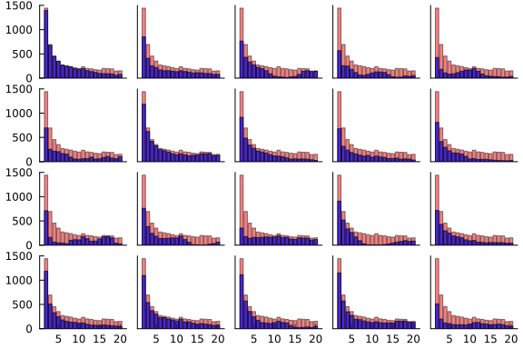
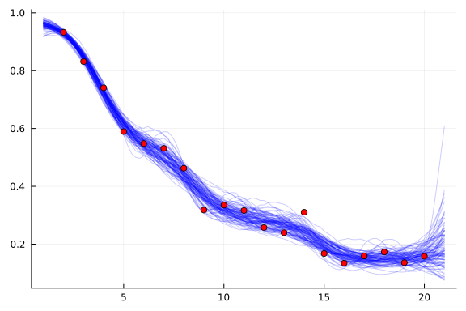

[JuliaGPs](https://github.com/JuliaGaussianProcesses/#welcome-to-juliagps) packages integrate well with Turing.jl because they implement the Distributions.jl
interface.
You should be able to understand what is going on in this tutorial if you know what a GP is.
For a more in-depth understanding of the
[JuliaGPs](https://github.com/JuliaGaussianProcesses/#welcome-to-juliagps) functionality
used here, please consult the
[JuliaGPs](https://github.com/JuliaGaussianProcesses/#welcome-to-juliagps) docs.

In this tutorial, we will model the putting dataset discussed in chapter 21 of
[Bayesian Data Analysis](http://www.stat.columbia.edu/%7Egelman/book/).
The dataset comprises the result of measuring how often a golfer successfully gets the ball
in the hole, depending on how far away from it they are.
The goal of inference is to estimate the probability of any given shot being successful at a
given distance.

Let's download the data and take a look at it:

```julia
using CSV, DataDeps, DataFrames

ENV["DATADEPS_ALWAYS_ACCEPT"] = true
register(
    DataDep(
        "putting",
        "Putting data from BDA",
        "http://www.stat.columbia.edu/~gelman/book/data/golf.dat",
        "fc28d83896af7094d765789714524d5a389532279b64902866574079c1a977cc",
    ),
)

fname = joinpath(datadep"putting", "golf.dat")
df = CSV.read(fname, DataFrame; delim=' ', ignorerepeated=true)
df[1:5, :]
```

```
5×3 DataFrame
 Row │ distance  n      y
     │ Int64     Int64  Int64
─────┼────────────────────────
   1 │        2   1443   1346
   2 │        3    694    577
   3 │        4    455    337
   4 │        5    353    208
   5 │        6    272    149
```


We've printed the first 5 rows of the dataset (which comprises only 19 rows in total).
Observe it has three columns:

 1. `distance` -- how far away from the hole. I'll refer to `distance` as `d` throughout the rest of this tutorial
 2. `n` -- how many shots were taken from a given distance
 3. `y` -- how many shots were successful from a given distance

We will use a Binomial model for the data, whose success probability is parametrised by a
transformation of a GP. Something along the lines of:
$$
f \sim \operatorname{GP}(0, k) \\
y_j \mid f(d_j) \sim \operatorname{Binomial}(n_j, g(f(d_j))) \\
g(x) := \frac{1}{1 + e^{-x}}
$$

To do this, let's define our Turing.jl model:

```julia
using AbstractGPs, LogExpFunctions, Turing

@model function putting_model(d, n; jitter=1e-4)
    v ~ Gamma(2, 1)
    l ~ Gamma(4, 1)
    f = GP(v * with_lengthscale(SEKernel(), l))
    f_latent ~ f(d, jitter)
    y ~ product_distribution(Binomial.(n, logistic.(f_latent)))
    return (fx=f(d, jitter), f_latent=f_latent, y=y)
end
```

```
putting_model (generic function with 2 methods)
```


We first define an `AbstractGPs.GP`, which represents a distribution over functions, and
is entirely separate from Turing.jl.
We place a prior over its variance `v` and length-scale `l`.
`f(d, jitter)` constructs the multivariate Gaussian comprising the random variables
in `f` whose indices are in `d` (+ a bit of independent Gaussian noise with variance
`jitter` -- see [the docs](https://juliagaussianprocesses.github.io/AbstractGPs.jl/dev/api/#FiniteGP-and-AbstractGP)
for more details).
`f(d, jitter) isa AbstractMvNormal`, and is the bit of AbstractGPs.jl that implements the
Distributions.jl interface, so it's legal to put it on the right hand side
of a `~`.
From this you should deduce that `f_latent` is distributed according to a multivariate
Gaussian.
The remaining lines comprise standard Turing.jl code that is encountered in other tutorials
and Turing documentation.

Before performing inference, we might want to inspect the prior that our model places over
the data, to see whether there is anything that is obviously wrong.
These kinds of prior predictive checks are straightforward to perform using Turing.jl, since
it is possible to sample from the prior easily by just calling the model:

```julia
m = putting_model(Float64.(df.distance), df.n)
m().y
```

```
19-element Vector{Int64}:
 147
 114
  69
  73
  61
  66
  76
 108
 132
 160
 125
 132
 110
 104
 131
 125
 132
  92
  89
```


We make use of this to see what kinds of datasets we simulate from the prior:

```julia
using Plots

function plot_data(d, n, y, xticks, yticks)
    ylims = (0, round(maximum(n), RoundUp; sigdigits=2))
    margin = -0.5 * Plots.mm
    plt = plot(; xticks=xticks, yticks=yticks, ylims=ylims, margin=margin, grid=false)
    bar!(plt, d, n; color=:red, label="", alpha=0.5)
    bar!(plt, d, y; label="", color=:blue, alpha=0.7)
    return plt
end

# Construct model and run some prior predictive checks.
m = putting_model(Float64.(df.distance), df.n)
hists = map(1:20) do j
    xticks = j > 15 ? :auto : nothing
    yticks = rem(j, 5) == 1 ? :auto : nothing
    return plot_data(df.distance, df.n, m().y, xticks, yticks)
end
plot(hists...; layout=(4, 5))
```




In this case, the only prior knowledge I have is that the proportion of successful shots
ought to decrease monotonically as the distance from the hole increases, which should show
up in the data as the blue lines generally going down as we move from left to right on each
graph.
Unfortunately, there is not a simple way to enforce monotonicity in the samples from a GP,
and we can see this in some of the plots above, so we must hope that we have enough data to
ensure that this relationship approximately holds under the posterior.
In any case, you can judge for yourself whether you think this is the most useful
visualisation that we can perform -- if you think there is something better to look at,
please let us know!

Moving on, we generate samples from the posterior using the default `NUTS` sampler.
We'll make use of [ReverseDiff.jl](https://github.com/JuliaDiff/ReverseDiff.jl), as it has
better performance than [ForwardDiff.jl](https://github.com/JuliaDiff/ForwardDiff.jl/) on
this example. See Turing.jl's docs on Automatic Differentiation for more info.

```julia
using Random, ReverseDiff

Turing.setadbackend(:reversediff)
Turing.setrdcache(true)

m_post = m | (y=df.y,)
chn = sample(Xoshiro(123456), m_post, NUTS(), 1_000)
```

```
Chains MCMC chain (1000×33×1 Array{Float64, 3}):

Iterations        = 501:1:1500
Number of chains  = 1
Samples per chain = 1000
Wall duration     = 21.96 seconds
Compute duration  = 21.96 seconds
parameters        = v, l, f_latent[1], f_latent[2], f_latent[3], f_latent[4
], f_latent[5], f_latent[6], f_latent[7], f_latent[8], f_latent[9], f_laten
t[10], f_latent[11], f_latent[12], f_latent[13], f_latent[14], f_latent[15]
, f_latent[16], f_latent[17], f_latent[18], f_latent[19]
internals         = lp, n_steps, is_accept, acceptance_rate, log_density, h
amiltonian_energy, hamiltonian_energy_error, max_hamiltonian_energy_error, 
tree_depth, numerical_error, step_size, nom_step_size

Summary Statistics
    parameters      mean       std      mcse    ess_bulk   ess_tail      rh
at  ⋯
        Symbol   Float64   Float64   Float64     Float64    Float64   Float
64  ⋯

             v    2.6942    1.2526    0.0429    779.7264   781.8050    1.00
03  ⋯
             l    3.2162    0.8215    0.0861     89.7512    93.5964    1.00
71  ⋯
   f_latent[1]    2.5581    0.0970    0.0025   1506.1880   828.2662    1.00
35  ⋯
   f_latent[2]    1.7058    0.0773    0.0022   1273.9920   718.6289    0.99
92  ⋯
   f_latent[3]    0.9608    0.0764    0.0040    378.8672   586.6254    0.99
90  ⋯
   f_latent[4]    0.4609    0.0706    0.0034    451.6856   666.1052    1.00
22  ⋯
   f_latent[5]    0.1953    0.0774    0.0027    825.1817   761.0063    0.99
95  ⋯
   f_latent[6]    0.0128    0.1035    0.0067    256.9223   391.1629    1.00
14  ⋯
   f_latent[7]   -0.2353    0.0902    0.0033    738.3853   604.9799    1.00
07  ⋯
   f_latent[8]   -0.5283    0.0968    0.0062    273.2570   196.1548    1.00
01  ⋯
   f_latent[9]   -0.7450    0.0971    0.0037    666.4667   598.9132    1.00
87  ⋯
  f_latent[10]   -0.8686    0.1038    0.0037    808.2160   413.0528    0.99
95  ⋯
  f_latent[11]   -0.9480    0.1050    0.0046    531.9095   482.4373    0.99
99  ⋯
  f_latent[12]   -1.0215    0.1087    0.0041    721.0712   477.6573    1.00
02  ⋯
  f_latent[13]   -1.1656    0.1199    0.0070    323.9584   244.9410    0.99
96  ⋯
  f_latent[14]   -1.4165    0.1209    0.0049    638.9560   490.7829    1.00
04  ⋯
  f_latent[15]   -1.6409    0.1400    0.0096    247.6825   269.8749    0.99
97  ⋯
       ⋮            ⋮         ⋮         ⋮          ⋮          ⋮          ⋮ 
    ⋱
                                                     1 column and 4 rows om
itted

Quantiles
    parameters      2.5%     25.0%     50.0%     75.0%     97.5%
        Symbol   Float64   Float64   Float64   Float64   Float64

             v    1.0320    1.8188    2.4075    3.2844    5.7619
             l    1.6936    2.7769    3.1631    3.6401    5.0279
   f_latent[1]    2.3688    2.4946    2.5552    2.6270    2.7406
   f_latent[2]    1.5457    1.6586    1.7066    1.7575    1.8547
   f_latent[3]    0.8071    0.9095    0.9629    1.0108    1.1116
   f_latent[4]    0.3223    0.4138    0.4643    0.5061    0.5914
   f_latent[5]    0.0463    0.1442    0.1935    0.2470    0.3461
   f_latent[6]   -0.1803   -0.0514    0.0060    0.0724    0.2321
   f_latent[7]   -0.4000   -0.2987   -0.2385   -0.1734   -0.0601
   f_latent[8]   -0.7436   -0.5853   -0.5235   -0.4651   -0.3521
   f_latent[9]   -0.9407   -0.8065   -0.7411   -0.6847   -0.5632
  f_latent[10]   -1.0771   -0.9378   -0.8678   -0.8019   -0.6546
  f_latent[11]   -1.1605   -1.0146   -0.9477   -0.8779   -0.7446
  f_latent[12]   -1.2344   -1.0949   -1.0193   -0.9496   -0.8070
  f_latent[13]   -1.3874   -1.2492   -1.1749   -1.0848   -0.9171
  f_latent[14]   -1.6727   -1.4951   -1.4134   -1.3351   -1.1920
  f_latent[15]   -1.9733   -1.7178   -1.6364   -1.5381   -1.4027
       ⋮            ⋮         ⋮         ⋮         ⋮         ⋮
                                                    4 rows omitted
```


We can use these samples and the `posterior` function from `AbstractGPs` to sample from the
posterior probability of success at any distance we choose:

```julia
d_pred = 1:0.2:21
samples = map(generated_quantities(m_post, chn)[1:10:end]) do x
    return logistic.(rand(posterior(x.fx, x.f_latent)(d_pred, 1e-4)))
end
p = plot()
plot!(d_pred, reduce(hcat, samples); label="", color=:blue, alpha=0.2)
scatter!(df.distance, df.y ./ df.n; label="", color=:red)
```




We can see that the general trend is indeed down as the distance from the hole increases,
and that if we move away from the data, the posterior uncertainty quickly inflates.
This suggests that the model is probably going to do a reasonable job of interpolating
between observed data, but less good a job at extrapolating to larger distances.
