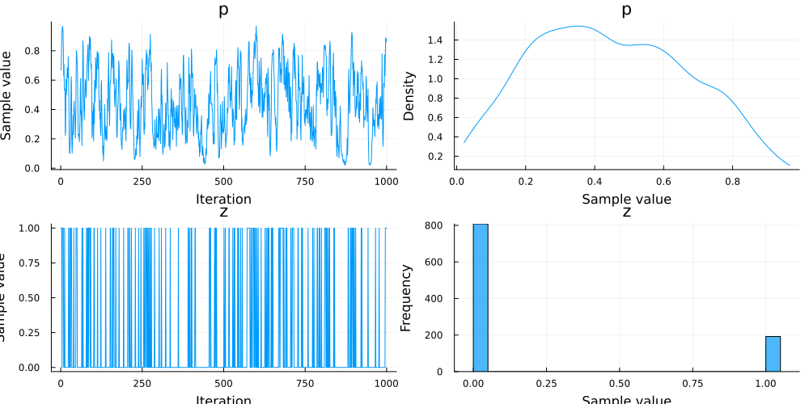

# Guide

## Basics

### Introduction

A probabilistic program is Julia code wrapped in a `@model` macro. It can use arbitrary Julia code, but to ensure correctness of inference it should not have external effects or modify global state. Stack-allocated variables are safe, but mutable heap-allocated objects may lead to subtle bugs when using task copying. By default Libtask deepcopies `Array` and `Dict` objects when copying task to avoid bugs with data stored in mutable structure in Turing models.

To specify distributions of random variables, Turing programs should use the `~` notation:

`x ~ distr` where `x` is a symbol and `distr` is a distribution. If `x` is undefined in the model function, inside the probabilistic program, this puts a random variable named `x`, distributed according to `distr`, in the current scope. `distr` can be a value of any type that implements `rand(distr)`, which samples a value from the distribution `distr`. If `x` is defined, this is used for conditioning in a style similar to [Anglican](https://probprog.github.io/anglican/index.html) (another PPL). In this case, `x` is an observed value, assumed to have been drawn from the distribution `distr`. The likelihood is computed using `logpdf(distr,y)`. The observe statements should be arranged so that every possible run traverses all of them in exactly the same order. This is equivalent to demanding that they are not placed inside stochastic control flow.

Available inference methods include Importance Sampling (IS), Sequential Monte Carlo (SMC), Particle Gibbs (PG), Hamiltonian Monte Carlo (HMC), Hamiltonian Monte Carlo with Dual Averaging (HMCDA) and The No-U-Turn Sampler (NUTS).

### Simple Gaussian Demo

Below is a simple Gaussian demo illustrate the basic usage of Turing.jl.

```julia
# Import packages.
using Turing
using StatsPlots

# Define a simple Normal model with unknown mean and variance.
@model function gdemo(x, y)
    s² ~ InverseGamma(2, 3)
    m ~ Normal(0, sqrt(s²))
    x ~ Normal(m, sqrt(s²))
    return y ~ Normal(m, sqrt(s²))
end
```

```
gdemo (generic function with 2 methods)
```


Note: As a sanity check, the prior expectation of `s²` is `mean(InverseGamma(2, 3)) = 3/(2 - 1) = 3` and the prior expectation of `m` is 0. This can be easily checked using `Prior`:

```julia
p1 = sample(gdemo(missing, missing), Prior(), 100000)
```

```
Chains MCMC chain (100000×5×1 Array{Float64, 3}):

Iterations        = 1:1:100000
Number of chains  = 1
Samples per chain = 100000
Wall duration     = 1.66 seconds
Compute duration  = 1.66 seconds
parameters        = s², m, x, y
internals         = lp

Summary Statistics
  parameters      mean       std   naive_se      mcse          ess      rha
t   ⋯
      Symbol   Float64   Float64    Float64   Float64      Float64   Float6
4   ⋯

          s²    3.0261    6.2888     0.0199    0.0195   99002.9374    1.000
0   ⋯
           m   -0.0018    1.7639     0.0056    0.0056   98721.9618    1.000
0   ⋯
           x   -0.0151    2.4731     0.0078    0.0077   99207.4590    1.000
0   ⋯
           y    0.0053    2.4907     0.0079    0.0086   99075.4978    1.000
0   ⋯
                                                                1 column om
itted

Quantiles
  parameters      2.5%     25.0%     50.0%     75.0%     97.5%
      Symbol   Float64   Float64   Float64   Float64   Float64

          s²    0.5379    1.1123    1.7891    3.1432   12.5743
           m   -3.4223   -0.9100   -0.0034    0.9090    3.4032
           x   -4.8675   -1.2918   -0.0083    1.2637    4.7786
           y   -4.8447   -1.2809    0.0006    1.2877    4.8690
```


We can perform inference by using the `sample` function, the first argument of which is our probabilistic program and the second of which is a sampler. More information on each sampler is located in the [API](%7B%7Bsite.baseurl%7D%7D/docs/library).

```julia
#  Run sampler, collect results.
c1 = sample(gdemo(1.5, 2), SMC(), 1000)
c2 = sample(gdemo(1.5, 2), PG(10), 1000)
c3 = sample(gdemo(1.5, 2), HMC(0.1, 5), 1000)
c4 = sample(gdemo(1.5, 2), Gibbs(PG(10, :m), HMC(0.1, 5, :s²)), 1000)
c5 = sample(gdemo(1.5, 2), HMCDA(0.15, 0.65), 1000)
c6 = sample(gdemo(1.5, 2), NUTS(0.65), 1000)
```

```
Chains MCMC chain (1000×14×1 Array{Float64, 3}):

Iterations        = 501:1:1500
Number of chains  = 1
Samples per chain = 1000
Wall duration     = 1.73 seconds
Compute duration  = 1.73 seconds
parameters        = s², m
internals         = lp, n_steps, is_accept, acceptance_rate, log_density, h
amiltonian_energy, hamiltonian_energy_error, max_hamiltonian_energy_error, 
tree_depth, numerical_error, step_size, nom_step_size

Summary Statistics
  parameters      mean       std   naive_se      mcse        ess      rhat 
  e ⋯
      Symbol   Float64   Float64    Float64   Float64    Float64   Float64 
    ⋯

          s²    2.1603    2.4839     0.0785    0.1300   290.0775    0.9990 
    ⋯
           m    1.1260    0.8596     0.0272    0.0374   481.1441    1.0021 
    ⋯
                                                                1 column om
itted

Quantiles
  parameters      2.5%     25.0%     50.0%     75.0%     97.5%
      Symbol   Float64   Float64   Float64   Float64   Float64

          s²    0.6173    1.0502    1.5500    2.3169    7.6331
           m   -0.8561    0.6701    1.1782    1.6306    2.6784
```


The `MCMCChains` module (which is re-exported by Turing) provides plotting tools for the `Chain` objects returned by a `sample` function. See the [MCMCChains](https://github.com/TuringLang/MCMCChains.jl) repository for more information on the suite of tools available for diagnosing MCMC chains.

```julia
# Summarise results
describe(c3)

# Plot results
plot(c3)
savefig("gdemo-plot.png")
```


The arguments for each sampler are:

  - SMC: number of particles.
  - PG: number of particles, number of iterations.
  - HMC: leapfrog step size, leapfrog step numbers.
  - Gibbs: component sampler 1, component sampler 2, ...
  - HMCDA: total leapfrog length, target accept ratio.
  - NUTS: number of adaptation steps (optional), target accept ratio.

For detailed information on the samplers, please review Turing.jl's [API](%7B%7Bsite.baseurl%7D%7D/docs/library) documentation.

### Modelling Syntax Explained

Using this syntax, a probabilistic model is defined in Turing. The model function generated by Turing can then be used to condition the model onto data. Subsequently, the sample function can be used to generate samples from the posterior distribution.

In the following example, the defined model is conditioned to the data (arg*1 = 1, arg*2 = 2) by passing (1, 2) to the model function.

```julia
@model function model_name(arg_1, arg_2)
    return ...
end
```


The conditioned model can then be passed onto the sample function to run posterior inference.

```julia
model_func = model_name(1, 2)
chn = sample(model_func, HMC(..)) # Perform inference by sampling using HMC.
```


The returned chain contains samples of the variables in the model.

```julia
var_1 = mean(chn[:var_1]) # Taking the mean of a variable named var_1.
```


The key (`:var_1`) can be a `Symbol` or a `String`. For example, to fetch `x[1]`, one can use `chn[Symbol("x[1]")]` or `chn["x[1]"]`.
If you want to retrieve all parameters associated with a specific symbol, you can use `group`. As an example, if you have the
parameters `"x[1]"`, `"x[2]"`, and `"x[3]"`, calling `group(chn, :x)` or `group(chn, "x")` will return a new chain with only `"x[1]"`, `"x[2]"`, and `"x[3]"`.

Turing does not have a declarative form. More generally, the order in which you place the lines of a `@model` macro matters. For example, the following example works:

```julia
# Define a simple Normal model with unknown mean and variance.
@model function model_function(y)
    s ~ Poisson(1)
    y ~ Normal(s, 1)
    return y
end

sample(model_function(10), SMC(), 100)
```

```
Chains MCMC chain (100×3×1 Array{Float64, 3}):

Log evidence      = -13.513060838734296
Iterations        = 1:1:100
Number of chains  = 1
Samples per chain = 100
Wall duration     = 1.94 seconds
Compute duration  = 1.94 seconds
parameters        = s
internals         = lp, weight

Summary Statistics
  parameters      mean       std   naive_se      mcse        ess      rhat 
  e ⋯
      Symbol   Float64   Float64    Float64   Float64    Float64   Float64 
    ⋯

           s    5.9900    0.1000     0.0100    0.0100   100.0801    1.0000 
    ⋯
                                                                1 column om
itted

Quantiles
  parameters      2.5%     25.0%     50.0%     75.0%     97.5%
      Symbol   Float64   Float64   Float64   Float64   Float64

           s    6.0000    6.0000    6.0000    6.0000    6.0000
```


But if we switch the `s ~ Poisson(1)` and `y ~ Normal(s, 1)` lines, the model will no longer sample correctly:

```julia
# Define a simple Normal model with unknown mean and variance.
@model function model_function(y)
    y ~ Normal(s, 1)
    s ~ Poisson(1)
    return y
end

sample(model_function(10), SMC(), 100)
```


### Sampling Multiple Chains

Turing supports distributed and threaded parallel sampling. To do so, call `sample(model, sampler, parallel_type, n, n_chains)`, where `parallel_type` can be either `MCMCThreads()` or `MCMCDistributed()` for thread and parallel sampling, respectively.

Having multiple chains in the same object is valuable for evaluating convergence. Some diagnostic functions like `gelmandiag` require multiple chains.

If you do not want parallelism or are on an older version Julia, you can sample multiple chains with the `mapreduce` function:

```julia
# Replace num_chains below with however many chains you wish to sample.
chains = mapreduce(c -> sample(model_fun, sampler, 1000), chainscat, 1:num_chains)
```


The `chains` variable now contains a `Chains` object which can be indexed by chain. To pull out the first chain from the `chains` object, use `chains[:,:,1]`. The method is the same if you use either of the below parallel sampling methods.

#### Multithreaded sampling

If you wish to perform multithreaded sampling and are running Julia 1.3 or greater, you can call `sample` with the following signature:

```julia
using Turing

@model function gdemo(x)
    s² ~ InverseGamma(2, 3)
    m ~ Normal(0, sqrt(s²))

    for i in eachindex(x)
        x[i] ~ Normal(m, sqrt(s²))
    end
end

model = gdemo([1.5, 2.0])

# Sample four chains using multiple threads, each with 1000 samples.
sample(model, NUTS(), MCMCThreads(), 1000, 4)
```


Be aware that Turing cannot add threads for you -- you must have started your Julia instance with multiple threads to experience any kind of parallelism. See the [Julia documentation](https://docs.julialang.org/en/v1/manual/parallel-computing/#man-multithreading-1) for details on how to achieve this.

#### Distributed sampling

To perform distributed sampling (using multiple processes), you must first import `Distributed`.

Process parallel sampling can be done like so:

```julia
# Load Distributed to add processes and the @everywhere macro.
using Distributed

# Load Turing.
using Turing

# Add four processes to use for sampling.
addprocs(4; exeflags="--project=$(Base.active_project())")

# Initialize everything on all the processes.
# Note: Make sure to do this after you've already loaded Turing,
#       so each process does not have to precompile.
#       Parallel sampling may fail silently if you do not do this.
@everywhere using Turing

# Define a model on all processes.
@everywhere @model function gdemo(x)
    s² ~ InverseGamma(2, 3)
    m ~ Normal(0, sqrt(s²))

    for i in eachindex(x)
        x[i] ~ Normal(m, sqrt(s²))
    end
end

# Declare the model instance everywhere.
@everywhere model = gdemo([1.5, 2.0])

# Sample four chains using multiple processes, each with 1000 samples.
sample(model, NUTS(), MCMCDistributed(), 1000, 4)
```


### Sampling from an Unconditional Distribution (The Prior)

Turing allows you to sample from a declared model's prior. If you wish to draw a chain from the prior to inspect your prior distributions, you can simply run

```julia
chain = sample(model, Prior(), n_samples)
```


You can also run your model (as if it were a function) from the prior distribution, by calling the model without specifying inputs or a sampler. In the below example, we specify a `gdemo` model which returns two variables, `x` and `y`. The model includes `x` and `y` as arguments, but calling the function without passing in `x` or `y` means that Turing's compiler will assume they are missing values to draw from the relevant distribution. The `return` statement is necessary to retrieve the sampled `x` and `y` values.
Assign the function with `missing` inputs to a variable, and Turing will produce a sample from the prior distribution.

```julia
@model function gdemo(x, y)
    s² ~ InverseGamma(2, 3)
    m ~ Normal(0, sqrt(s²))
    x ~ Normal(m, sqrt(s²))
    y ~ Normal(m, sqrt(s²))
    return x, y
end
```

```
gdemo (generic function with 2 methods)
```


Assign the function with `missing` inputs to a variable, and Turing will produce a sample from the prior distribution.

```julia
# Samples from p(x,y)
g_prior_sample = gdemo(missing, missing)
g_prior_sample()
```

```
(0.056822491268192776, -0.1320914410048931)
```


### Sampling from a Conditional Distribution (The Posterior)

#### Treating observations as random variables

Inputs to the model that have a value `missing` are treated as parameters, aka random variables, to be estimated/sampled. This can be useful if you want to simulate draws for that parameter, or if you are sampling from a conditional distribution. Turing supports the following syntax:

```julia
@model function gdemo(x, ::Type{T}=Float64) where {T}
    if x === missing
        # Initialize `x` if missing
        x = Vector{T}(undef, 2)
    end
    s² ~ InverseGamma(2, 3)
    m ~ Normal(0, sqrt(s²))
    for i in eachindex(x)
        x[i] ~ Normal(m, sqrt(s²))
    end
end

# Construct a model with x = missing
model = gdemo(missing)
c = sample(model, HMC(0.01, 5), 500)
```

```
Chains MCMC chain (500×13×1 Array{Float64, 3}):

Iterations        = 1:1:500
Number of chains  = 1
Samples per chain = 500
Wall duration     = 1.73 seconds
Compute duration  = 1.73 seconds
parameters        = s², m, x[1], x[2]
internals         = lp, n_steps, is_accept, acceptance_rate, log_density, h
amiltonian_energy, hamiltonian_energy_error, step_size, nom_step_size

Summary Statistics
  parameters      mean       std   naive_se      mcse       ess      rhat  
 es ⋯
      Symbol   Float64   Float64    Float64   Float64   Float64   Float64  
    ⋯

          s²    1.0363    0.4943     0.0221    0.1056    1.1527    3.0610  
    ⋯
           m   -0.2421    0.3372     0.0151    0.0713    2.0260    1.4927  
    ⋯
        x[1]    0.8023    0.4553     0.0204    0.0905    1.4740    1.8506  
    ⋯
        x[2]   -1.5542    0.2339     0.0105    0.0423    4.9708    1.1465  
    ⋯
                                                                1 column om
itted

Quantiles
  parameters      2.5%     25.0%     50.0%     75.0%     97.5%
      Symbol   Float64   Float64   Float64   Float64   Float64

          s²    0.3489    0.6092    0.8893    1.4929    1.8723
           m   -0.9782   -0.4754   -0.2418   -0.0047    0.3561
        x[1]    0.1204    0.4094    0.7760    1.0924    1.8124
        x[2]   -2.1047   -1.6893   -1.5718   -1.3940   -1.0970
```


Note the need to initialize `x` when missing since we are iterating over its elements later in the model. The generated values for `x` can be extracted from the `Chains` object using `c[:x]`.

Turing also supports mixed `missing` and non-`missing` values in `x`, where the missing ones will be treated as random variables to be sampled while the others get treated as observations. For example:

```julia
@model function gdemo(x)
    s² ~ InverseGamma(2, 3)
    m ~ Normal(0, sqrt(s²))
    for i in eachindex(x)
        x[i] ~ Normal(m, sqrt(s²))
    end
end

# x[1] is a parameter, but x[2] is an observation
model = gdemo([missing, 2.4])
c = sample(model, HMC(0.01, 5), 500)
```

```
Chains MCMC chain (500×12×1 Array{Float64, 3}):

Iterations        = 1:1:500
Number of chains  = 1
Samples per chain = 500
Wall duration     = 1.73 seconds
Compute duration  = 1.73 seconds
parameters        = s², m, x[1]
internals         = lp, n_steps, is_accept, acceptance_rate, log_density, h
amiltonian_energy, hamiltonian_energy_error, step_size, nom_step_size

Summary Statistics
  parameters      mean       std   naive_se      mcse       ess      rhat  
 es ⋯
      Symbol   Float64   Float64    Float64   Float64   Float64   Float64  
    ⋯

          s²    1.2533    0.6694     0.0299    0.1450    5.4073    1.0175  
    ⋯
           m    0.8676    0.3972     0.0178    0.0855    1.4497    1.8998  
    ⋯
        x[1]    0.2052    0.5516     0.0247    0.1178    1.2524    2.3306  
    ⋯
                                                                1 column om
itted

Quantiles
  parameters      2.5%     25.0%     50.0%     75.0%     97.5%
      Symbol   Float64   Float64   Float64   Float64   Float64

          s²    0.2602    0.7019    1.1472    1.8920    2.2969
           m   -0.1504    0.6559    0.9539    1.1910    1.3828
        x[1]   -0.6899   -0.3760    0.2731    0.6544    1.0961
```


#### Default Values

Arguments to Turing models can have default values much like how default values work in normal Julia functions. For instance, the following will assign `missing` to `x` and treat it as a random variable. If the default value is not `missing`, `x` will be assigned that value and will be treated as an observation instead.

```julia
using Turing

@model function generative(x=missing, ::Type{T}=Float64) where {T<:Real}
    if x === missing
        # Initialize x when missing
        x = Vector{T}(undef, 10)
    end
    s² ~ InverseGamma(2, 3)
    m ~ Normal(0, sqrt(s²))
    for i in 1:length(x)
        x[i] ~ Normal(m, sqrt(s²))
    end
    return s², m
end

m = generative()
chain = sample(m, HMC(0.01, 5), 1000)
```

```
Chains MCMC chain (1000×21×1 Array{Float64, 3}):

Iterations        = 1:1:1000
Number of chains  = 1
Samples per chain = 1000
Wall duration     = 3.35 seconds
Compute duration  = 3.35 seconds
parameters        = s², m, x[1], x[2], x[3], x[4], x[5], x[6], x[7], x[8], 
x[9], x[10]
internals         = lp, n_steps, is_accept, acceptance_rate, log_density, h
amiltonian_energy, hamiltonian_energy_error, step_size, nom_step_size

Summary Statistics
  parameters      mean       std   naive_se      mcse       ess      rhat  
 es ⋯
      Symbol   Float64   Float64    Float64   Float64   Float64   Float64  
    ⋯

          s²    1.7174    0.5911     0.0187    0.0983    4.8314    1.3538  
    ⋯
           m    0.6863    0.3736     0.0118    0.0644    4.6182    1.2768  
    ⋯
        x[1]    0.4000    0.7388     0.0234    0.1313    2.4383    2.2401  
    ⋯
        x[2]   -1.8459    0.6460     0.0204    0.1109    7.2387    1.0287  
    ⋯
        x[3]    1.9571    0.6107     0.0193    0.1083    6.1071    0.9990  
    ⋯
        x[4]    1.4804    0.5014     0.0159    0.0876    3.4088    1.5903  
    ⋯
        x[5]   -0.0873    0.7789     0.0246    0.1383    2.4048    2.2076  
    ⋯
        x[6]   -0.5023    0.4688     0.0148    0.0822    2.5204    1.9823  
    ⋯
        x[7]    2.3577    0.4511     0.0143    0.0762    2.9363    1.6033  
    ⋯
        x[8]    0.0868    0.6660     0.0211    0.1184    2.1726    3.5043  
    ⋯
        x[9]    1.0934    0.9337     0.0295    0.1636    2.6575    1.6923  
    ⋯
       x[10]    2.3220    0.3826     0.0121    0.0660    4.7649    1.3005  
    ⋯
                                                                1 column om
itted

Quantiles
  parameters      2.5%     25.0%     50.0%     75.0%     97.5%
      Symbol   Float64   Float64   Float64   Float64   Float64

          s²    0.9126    1.3118    1.5528    1.9967    3.1706
           m    0.0967    0.3372    0.7163    1.0075    1.3329
        x[1]   -1.0211   -0.2005    0.5783    1.0204    1.3624
        x[2]   -2.7472   -2.3430   -1.9736   -1.4943   -0.2586
        x[3]    0.6690    1.4915    1.9900    2.3747    3.0665
        x[4]    0.1824    1.3115    1.5481    1.8105    2.2641
        x[5]   -1.3000   -0.7204   -0.3552    0.7194    1.2121
        x[6]   -1.6800   -0.7626   -0.3935   -0.1553    0.1545
        x[7]    1.5318    1.9936    2.4281    2.6960    3.1333
        x[8]   -0.9294   -0.5658    0.1673    0.7233    1.0562
        x[9]   -0.9250    0.3214    1.5730    1.7580    2.1455
       x[10]    1.2188    2.1847    2.4036    2.5576    2.8593
```


#### Access Values inside Chain

You can access the values inside a chain several ways:

 1. Turn them into a `DataFrame` object
 2. Use their raw `AxisArray` form
 3. Create a three-dimensional `Array` object

For example, let `c` be a `Chain`:

 1. `DataFrame(c)` converts `c` to a `DataFrame`,
 2. `c.value` retrieves the values inside `c` as an `AxisArray`, and
 3. `c.value.data` retrieves the values inside `c` as a 3D `Array`.

#### Variable Types and Type Parameters

The element type of a vector (or matrix) of random variables should match the `eltype` of the its prior distribution, `<: Integer` for discrete distributions and `<: AbstractFloat` for continuous distributions. Moreover, if the continuous random variable is to be sampled using a Hamiltonian sampler, the vector's element type needs to either be:

 1. `Real` to enable auto-differentiation through the model which uses special number types that are sub-types of `Real`, or
 2. Some type parameter `T` defined in the model header using the type parameter syntax, e.g. `function gdemo(x, ::Type{T} = Float64) where {T}`.
    Similarly, when using a particle sampler, the Julia variable used should either be:
 3. An `Array`, or
 4. An instance of some type parameter `T` defined in the model header using the type parameter syntax, e.g. `function gdemo(x, ::Type{T} = Vector{Float64}) where {T}`.

### Querying Probabilities from Model or Chain

Consider first the following simplified `gdemo` model:

```julia
@model function gdemo0(x)
    s ~ InverseGamma(2, 3)
    m ~ Normal(0, sqrt(s))
    return x ~ Normal(m, sqrt(s))
end

# Instantiate three models, with different value of x
model1 = gdemo0(1)
model4 = gdemo0(4)
model10 = gdemo0(10)
```

```
DynamicPPL.Model{typeof(Main.##WeaveSandBox#514.gdemo0), (:x,), (), (), Tup
le{Int64}, Tuple{}, DynamicPPL.DefaultContext}(Main.##WeaveSandBox#514.gdem
o0, (x = 10,), NamedTuple(), DynamicPPL.DefaultContext())
```


Now, query the instantiated models: compute the likelihood of `x = 1.0` given the values of `s = 1.0` and `m = 1.0` for the parameters:

```julia
prob"x = 1.0 | model = model1, s = 1.0, m = 1.0"
```

```
0.39894228040143265
```


```julia
prob"x = 1.0 | model = model4, s = 1.0, m = 1.0"
```

```
0.39894228040143265
```


```julia
prob"x = 1.0 | model = model10, s = 1.0, m = 1.0"
```

```
0.39894228040143265
```


Notice that even if we use three models, instantiated with three different values of `x`, we should obtain the same likelihood. We can easily verify that value in this case:

```julia
pdf(Normal(1.0, 1.0), 1.0)
```

```
0.3989422804014327
```


Let us now consider the following `gdemo` model:

```julia
@model function gdemo(x, y)
    s² ~ InverseGamma(2, 3)
    m ~ Normal(0, sqrt(s²))
    x ~ Normal(m, sqrt(s²))
    return y ~ Normal(m, sqrt(s²))
end

# Instantiate the model.
model = gdemo(2.0, 4.0)
```

```
DynamicPPL.Model{typeof(Main.##WeaveSandBox#514.gdemo), (:x, :y), (), (), T
uple{Float64, Float64}, Tuple{}, DynamicPPL.DefaultContext}(Main.##WeaveSan
dBox#514.gdemo, (x = 2.0, y = 4.0), NamedTuple(), DynamicPPL.DefaultContext
())
```


The following are examples of valid queries of the `Turing` model or chain:

  - `prob"x = 1.0, y = 1.0 | model = model, s = 1.0, m = 1.0"` calculates the likelihood of `x = 1` and `y = 1` given `s = 1` and `m = 1`.

  - `prob"s² = 1.0, m = 1.0 | model = model, x = nothing, y = nothing"` calculates the joint probability of `s = 1` and `m = 1` ignoring `x` and `y`. `x` and `y` are ignored so they can be optionally dropped from the RHS of `|`, but it is recommended to define them.
  - `prob"s² = 1.0, m = 1.0, x = 1.0 | model = model, y = nothing"` calculates the joint probability of `s = 1`, `m = 1` and `x = 1` ignoring `y`.
  - `prob"s² = 1.0, m = 1.0, x = 1.0, y = 1.0 | model = model"` calculates the joint probability of all the variables.
  - After the MCMC sampling, given a `chain`, `prob"x = 1.0, y = 1.0 | chain = chain, model = model"` calculates the element-wise likelihood of `x = 1.0` and `y = 1.0` for each sample in `chain`.
  - If `save_state=true` was used during sampling (i.e., `sample(model, sampler, N; save_state=true)`), you can simply do `prob"x = 1.0, y = 1.0 | chain = chain"`.

In all the above cases, `logprob` can be used instead of `prob` to calculate the log probabilities instead.

### Maximum likelihood and maximum a posterior estimates

Turing provides support for two mode estimation techniques, [maximum likelihood estimation](https://en.wikipedia.org/wiki/Maximum_likelihood_estimation) (MLE) and [maximum a posterior](https://en.wikipedia.org/wiki/Maximum_a_posteriori_estimation) (MAP) estimation. Optimization is performed by the [Optim.jl](https://github.com/JuliaNLSolvers/Optim.jl) package. Mode estimation is currently a optional tool, and will not be available to you unless you have manually installed Optim and loaded the package with a `using` statement. To install Optim, run `import Pkg; Pkg.add("Optim")`.

Mode estimation only works when all model parameters are continuous -- discrete parameters cannot be estimated with MLE/MAP as of yet.

To understand how mode estimation works, let us first load Turing and Optim to enable mode estimation, and then declare a model:

```julia
# Note that loading Optim explicitly is required for mode estimation to function,
# as Turing does not load the opimization suite unless Optim is loaded as well.
using Turing
using Optim

@model function gdemo(x)
    s² ~ InverseGamma(2, 3)
    m ~ Normal(0, sqrt(s²))

    for i in eachindex(x)
        x[i] ~ Normal(m, sqrt(s²))
    end
end
```

```
gdemo (generic function with 6 methods)
```


Once the model is defined, we can construct a model instance as we normally would:

```julia
# Create some data to pass to the model.
data = [1.5, 2.0]

# Instantiate the gdemo model with our data.
model = gdemo(data)
```

```
DynamicPPL.Model{typeof(Main.##WeaveSandBox#514.gdemo), (:x,), (), (), Tupl
e{Vector{Float64}}, Tuple{}, DynamicPPL.DefaultContext}(Main.##WeaveSandBox
#514.gdemo, (x = [1.5, 2.0],), NamedTuple(), DynamicPPL.DefaultContext())
```


Mode estimation is typically quick and easy at this point. Turing extends the function `Optim.optimize` and accepts the structs `MLE()` or `MAP()`, which inform Turing whether to provide an MLE or MAP estimate, respectively. By default, the [LBFGS optimizer](https://julianlsolvers.github.io/Optim.jl/stable/#algo/lbfgs/) is used, though this can be changed. Basic usage is:

```julia
# Generate a MLE estimate.
mle_estimate = optimize(model, MLE())

# Generate a MAP estimate.
map_estimate = optimize(model, MAP())
```

```
ModeResult with maximized lp of -4.62
[0.907407407353463, 1.166666666637336]
```


If you wish to change to a different optimizer, such as `NelderMead`, simply place your optimizer in the third argument slot:

```julia
# Use NelderMead
mle_estimate = optimize(model, MLE(), NelderMead())

# Use SimulatedAnnealing
mle_estimate = optimize(model, MLE(), SimulatedAnnealing())

# Use ParticleSwarm
mle_estimate = optimize(model, MLE(), ParticleSwarm())

# Use Newton
mle_estimate = optimize(model, MLE(), Newton())

# Use AcceleratedGradientDescent
mle_estimate = optimize(model, MLE(), AcceleratedGradientDescent())
```


Some methods may have trouble calculating the mode because not enough iterations were allowed, or the target function moved upwards between function calls. Turing will warn you if Optim fails to converge by running `Optim.converge`. A typical solution to this might be to add more iterations, or allow the optimizer to increase between function iterations:

```julia
# Increase the iterations and allow function eval to increase between calls.
mle_estimate = optimize(
    model, MLE(), Newton(), Optim.Options(; iterations=10_000, allow_f_increases=true)
)
```


More options for Optim are available [here](https://julianlsolvers.github.io/Optim.jl/stable/#user/config/).

#### Analyzing your mode estimate

Turing extends several methods from `StatsBase` that can be used to analyze your mode estimation results. Methods implemented include `vcov`, `informationmatrix`, `coeftable`, `params`, and `coef`, among others.

For example, let's examine our ML estimate from above using `coeftable`:

```julia
# Import StatsBase to use it's statistical methods.
using StatsBase

# Print out the coefficient table.
coeftable(mle_estimate)
```


```
─────────────────────────────
   estimate  stderror   tstat
─────────────────────────────
s    0.0625  0.0625    1.0
m    1.75    0.176777  9.8995
─────────────────────────────
```

Standard errors are calculated from the Fisher information matrix (inverse Hessian of the log likelihood or log joint). t-statistics will be familiar to frequentist statisticians. Warning -- standard errors calculated in this way may not always be appropriate for MAP estimates, so please be cautious in interpreting them.

#### Sampling with the MAP/MLE as initial states

You can begin sampling your chain from an MLE/MAP estimate by extracting the vector of parameter values and providing it to the `sample` function with the keyword `init_params`. For example, here is how to sample from the full posterior using the MAP estimate as the starting point:

```julia
# Generate an MAP estimate.
map_estimate = optimize(model, MAP())

# Sample with the MAP estimate as the starting point.
chain = sample(model, NUTS(), 1_000; init_params=map_estimate.values.array)
```


## Beyond the Basics

### Compositional Sampling Using Gibbs

Turing.jl provides a Gibbs interface to combine different samplers. For example, one can combine an `HMC` sampler with a `PG` sampler to run inference for different parameters in a single model as below.

```julia
@model function simple_choice(xs)
    p ~ Beta(2, 2)
    z ~ Bernoulli(p)
    for i in 1:length(xs)
        if z == 1
            xs[i] ~ Normal(0, 1)
        else
            xs[i] ~ Normal(2, 1)
        end
    end
end

simple_choice_f = simple_choice([1.5, 2.0, 0.3])

chn = sample(simple_choice_f, Gibbs(HMC(0.2, 3, :p), PG(20, :z)), 1000)
```

```
Chains MCMC chain (1000×3×1 Array{Float64, 3}):

Iterations        = 1:1:1000
Number of chains  = 1
Samples per chain = 1000
Wall duration     = 22.4 seconds
Compute duration  = 22.4 seconds
parameters        = p, z
internals         = lp

Summary Statistics
  parameters      mean       std   naive_se      mcse        ess      rhat 
  e ⋯
      Symbol   Float64   Float64    Float64   Float64    Float64   Float64 
    ⋯

           p    0.4087    0.2095     0.0066    0.0208    28.8122    1.0588 
    ⋯
           z    0.1000    0.3002     0.0095    0.0129   787.1278    0.9997 
    ⋯
                                                                1 column om
itted

Quantiles
  parameters      2.5%     25.0%     50.0%     75.0%     97.5%
      Symbol   Float64   Float64   Float64   Float64   Float64

           p    0.0661    0.2347    0.4074    0.5647    0.8182
           z    0.0000    0.0000    0.0000    0.0000    1.0000
```


The `Gibbs` sampler can be used to specify unique automatic differentiation backends for different variable spaces. Please see the [Automatic Differentiation](%7B%7Bsite.baseurl%7D%7D/docs/using-turing/autodiff) article for more.

For more details of compositional sampling in Turing.jl, please check the corresponding [paper](http://proceedings.mlr.press/v84/ge18b.html).

### Working with filldist and arraydist

Turing provides `filldist(dist::Distribution, n::Int)` and `arraydist(dists::AbstractVector{<:Distribution})` as a simplified interface to construct product distributions, e.g., to model a set of variables that share the same structure but vary by group.

#### Constructing product distributions with filldist

The function `filldist` provides a general interface to construct product distributions over distributions of the same type and parameterisation.
Note that, in contrast to the product distribution interface provided by Distributions.jl (`Product`), `filldist` supports product distributions over univariate or multivariate distributions.

Example usage:

```julia
@model function demo(x, g)
    k = length(unique(g))
    a ~ filldist(Exponential(), k) # = Product(fill(Exponential(), k))
    mu = a[g]
    return x .~ Normal.(mu)
end
```

```
demo (generic function with 2 methods)
```


#### Constructing product distributions with arraydist

The function `arraydist` provides a general interface to construct product distributions over distributions of varying type and parameterisation.
Note that in contrast to the product distribution interface provided by Distributions.jl (`Product`), `arraydist` supports product distributions over univariate or multivariate distributions.

Example usage:

```julia
@model function demo(x, g)
    k = length(unique(g))
    a ~ arraydist([Exponential(i) for i in 1:k])
    mu = a[g]
    return x .~ Normal.(mu)
end
```

```
demo (generic function with 2 methods)
```


### Working with MCMCChains.jl

Turing.jl wraps its samples using `MCMCChains.Chain` so that all the functions working for `MCMCChains.Chain` can be re-used in Turing.jl. Two typical functions are `MCMCChains.describe` and `MCMCChains.plot`, which can be used as follows for an obtained chain `chn`. For more information on `MCMCChains`, please see the [GitHub repository](https://github.com/TuringLang/MCMCChains.jl).

```julia
describe(chn) # Lists statistics of the samples.
plot(chn) # Plots statistics of the samples.
```




There are numerous functions in addition to `describe` and `plot` in the `MCMCChains` package, such as those used in convergence diagnostics. For more information on the package, please see the [GitHub repository](https://github.com/TuringLang/MCMCChains.jl).

### Changing Default Settings

Some of Turing.jl's default settings can be changed for better usage.

#### AD Chunk Size

ForwardDiff (Turing's default AD backend) uses forward-mode chunk-wise AD. The chunk size can be set manually by `setchunksize(new_chunk_size)`.

#### AD Backend

Turing supports four packages of automatic differentiation (AD) in the back end during sampling. The default AD backend is [ForwardDiff](https://github.com/JuliaDiff/ForwardDiff.jl) for forward-mode AD. Three reverse-mode AD backends are also supported, namely [Tracker](https://github.com/FluxML/Tracker.jl), [Zygote](https://github.com/FluxML/Zygote.jl) and [ReverseDiff](https://github.com/JuliaDiff/ReverseDiff.jl). `Zygote` and `ReverseDiff` are supported optionally if explicitly loaded by the user with `using Zygote` or `using ReverseDiff` next to `using Turing`.

For more information on Turing's automatic differentiation backend, please see the [Automatic Differentiation](%7B%7Bsite.baseurl%7D%7D/docs/using-turing/autodiff) article.

#### Progress Logging

`Turing.jl` uses ProgressLogging.jl to log the progress of sampling. Progress
logging is enabled as default but might slow down inference. It can be turned on
or off by setting the keyword argument `progress` of `sample` to `true` or `false`, respectively. Moreover, you can enable or disable progress logging globally by calling `setprogress!(true)` or `setprogress!(false)`, respectively.

Turing uses heuristics to select an appropriate visualization backend. If you
use [Juno](https://junolab.org/), the progress is displayed with a
[progress bar in the Atom window](http://docs.junolab.org/latest/man/juno_frontend/#Progress-Meters-1).
For Jupyter notebooks the default backend is
[ConsoleProgressMonitor.jl](https://github.com/tkf/ConsoleProgressMonitor.jl).
In all other cases, progress logs are displayed with
[TerminalLoggers.jl](https://github.com/c42f/TerminalLoggers.jl). Alternatively,
if you provide a custom visualization backend, Turing uses it instead of the
default backend.
