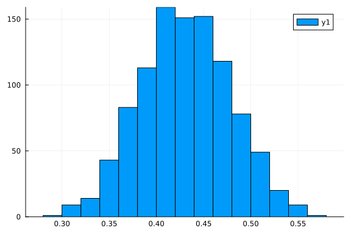

# Probabilistic Programming in Thirty Seconds

If you are already well-versed in probabilistic programming and want to take a quick look at how Turing's syntax works or otherwise just want a model to start with, we have provided a complete Bayesian coin-flipping model below.

This example can be run wherever you have Julia installed (see [Getting Started](%7B%7Bsite.baseurl%7D%7D/docs/using-turing/get-started)), but you will need to install the packages `Turing` and `StatsPlots` if you have not done so already.

This is an excerpt from a more formal example which can be found in [this Jupyter notebook](https://nbviewer.jupyter.org/github/TuringLang/TuringTutorials/blob/master/notebook/00-introduction/00_introduction.ipynb) or as part of the documentation website [here](%7B%7Bsite.baseurl%7D%7D/tutorials).

```julia
# Import libraries.
using Turing, StatsPlots, Random
```


```julia
# Set the true probability of heads in a coin.
p_true = 0.5

# Iterate from having seen 0 observations to 100 observations.
Ns = 0:100
```

```
0:100
```


```julia
# Draw data from a Bernoulli distribution, i.e. draw heads or tails.
Random.seed!(12)
data = rand(Bernoulli(p_true), last(Ns))
```

```
100-element Vector{Bool}:
 1
 0
 0
 0
 1
 1
 1
 0
 1
 0
 ⋮
 0
 1
 0
 0
 1
 0
 0
 0
 1
```


```julia
# Declare our Turing model.
@model function coinflip(y)
    # Our prior belief about the probability of heads in a coin.
    p ~ Beta(1, 1)

    # The number of observations.
    N = length(y)
    for n in 1:N
        # Heads or tails of a coin are drawn from a Bernoulli distribution.
        y[n] ~ Bernoulli(p)
    end
end
```

```
coinflip (generic function with 2 methods)
```


```julia
# Settings of the Hamiltonian Monte Carlo (HMC) sampler.
iterations = 1000
ϵ = 0.05
τ = 10

# Start sampling.
chain = sample(coinflip(data), HMC(ϵ, τ), iterations)
```

```
Chains MCMC chain (1000×11×1 Array{Float64, 3}):

Iterations        = 1:1:1000
Number of chains  = 1
Samples per chain = 1000
Wall duration     = 0.96 seconds
Compute duration  = 0.96 seconds
parameters        = p
internals         = lp, n_steps, is_accept, acceptance_rate, log_density, h
amiltonian_energy, hamiltonian_energy_error, numerical_error, step_size, no
m_step_size

Summary Statistics
  parameters      mean       std      mcse    ess_bulk   ess_tail      rhat
    ⋯
      Symbol   Float64   Float64   Float64     Float64    Float64   Float64
    ⋯

           p    0.4311    0.0475    0.0009   3000.0000   602.0565    1.0010
    ⋯
                                                                1 column om
itted

Quantiles
  parameters      2.5%     25.0%     50.0%     75.0%     97.5%
      Symbol   Float64   Float64   Float64   Float64   Float64

           p    0.3404    0.3977    0.4304    0.4633    0.5241
```


```julia
# Plot a summary of the sampling process for the parameter p, i.e. the probability of heads in a coin.
histogram(chain[:p])
```


